# AIRE Workflow — End-to-End Flows

## Index

1. [Greenfield End-to-End Flow — From Idea to Epic Release](#1-greenfield-end-to-end-flow--from-idea-to-epic-release)
2. [Brownfield End-to-End Flow — From Idea to Epic Release](#2-brownfield-end-to-end-flow--from-idea-to-epic-release)
3. [Bug End-to-End Flow — From Defect Ticket to Merged Fix](#3-bug-end-to-end-flow--from-defect-ticket-to-merged-fix)
4. [Enhancement End-to-End Flow — From Enhancement Ticket to Merged Change](#4-enhancement-end-to-end-flow--from-enhancement-ticket-to-merged-change)
5. [Unified Ticket Router — `ticket-implement` Routes to Bug or Enhancement](#5-unified-ticket-router--ticket-implement-routes-to-bug-or-enhancement)
6. [ve Bug Lifecycle — From the ve Raising the Bug to Ready for Testing](#6-ve-bug-lifecycle--from-the-ve-raising-the-bug-to-ready-for-testing)
7. [ve Toolkit — Which Skill to Use When](#7-ve-toolkit--which-skill-to-use-when)
8. [Reverse Engineering Docs Lifecycle — How the Docs Always Stay Fresh](#8-reverse-engineering-docs-lifecycle--how-the-docs-always-stay-fresh)
9. [Approval Model — the framework has NO numbered gates](#9-approval-model--the-framework-has-no-numbered-gates)
    - 9.1 [Epic flow — fully automatic from the story set onward](#91-epic-flow--fully-automatic-from-the-story-set-onward)
    - 9.2 [Bug flow — one yes/no, then fully automatic](#92-bug-flow--one-yesno-then-fully-automatic)
    - 9.3 [Enhancement flow — one yes/no, then fully automatic](#93-enhancement-flow--one-yesno-then-fully-automatic)
10. [Distribution & Governance](#10-distribution--governance)
11. [AI Defect Ratio Detection — Line-Level Provenance Flow](#11-ai-defect-ratio-detection--line-level-provenance-flow)
12. [How Code Gets Evaluated — End to End](#12-how-code-gets-evaluated--end-to-end)


---

# 1. Greenfield End-to-End Flow — From Idea to Epic Release

> Complete lifecycle:

```mermaid
flowchart TD
    %% ═══════════════════════════════════════════════════
    %% PHASE 0: IDEATION — Before AIRE Workflow
    %% ═══════════════════════════════════════════════════

    IDEA([" User has an idea"])
    IDEA --> INTAKE["<b>intent-intake skill (manual)</b><br/>Gather 6 baseline fields:<br/>Outcome, KPI, Success signal,<br/>Out-of-scope, Constraints, Confidence"]
    INTAKE -->|"tracker-dispatch createEpic"| JIRA_EPIC["Epic created in the configured tracker<br/>(baseline — thin)"]

    JIRA_EPIC --> REFINE["<b>intent-refinement skill (manual)</b><br/>Elaborate Epic to full detail:<br/>Measurable criteria, constraints,<br/>domain context, NFRs, risks"]
    REFINE -->|"tracker-dispatch updateEpic"| JIRA_EPIC_FINAL["Final Epic in the configured tracker<br/>(fully detailed, ready to build)"]

    %% Optional shortcut — Atlas via Helix MCP, bypasses intent-intake/intent-refinement
    ATLAS[("Atlas — existing-system truth<br/>(knowledge graph + deep dive doc)")]
    ATLAS -->|"Helix MCP<br/>(tracker-agnostic — works with JIRA/ADO/GITHUB/LOCAL)<br/>skips intent-intake / intent-refinement"| JIRA_EPIC_FINAL

    %% ═══════════════════════════════════════════════════
    %% PHASE 1: PLANNING — Planning & Architecture
    %% ═══════════════════════════════════════════════════

    JIRA_EPIC_FINAL --> TRIGGER(["User enters:<br/><b>using aire implement &lt;EPIC KEY/ID&gt;</b><br/>(JIRA key / ADO work-item ID / GitHub issue ref;<br/>LOCAL needs no ID — describe the epic inline)<br/>— or, for an Atlas-backed epic:<br/><b>using aire-helix implement the epic in my solution on Helix</b>"])

    TRIGGER --> WD["<b>Workspace Detection</b><br/>• Greenfield (empty workspace)<br/>• Fetch Epic content → epic-brief.md<br/>• Record ## Tracker in runtime-artifacts/aire-state.md"]
    WD --> BRANCH["<b>Create Epic Branch</b><br/>by the name of epic/epic-number-epic-title<br/>Record base branch + epic branch<br/>in runtime-artifacts/aire-state.md"]

    BRANCH --> RA["<b>Requirements Analysis</b><br/>• Read epic-brief.md (defines WHAT to build)<br/>• Determine depth (minimal/standard/comprehensive)<br/>• Generate clarifying questions .md<br/>• Include Extension opt-in prompts"]
    RA --> RA_GATE{"User answers<br/>all questions"}
    RA_GATE -->|"Ambiguity detected"| RA_FOLLOW["Follow-up questions<br/>(resolve before proceeding)"]
    RA_FOLLOW --> RA_GATE
    RA_GATE -->|"All clear"| RA_GEN["Generate requirements.md<br/>+ Security Mandatory + Record Extension Configuration"]
    RA_GEN --> RA_APPROVE{"User approves<br/>requirements"}
    RA_APPROVE -->|"Changes needed"| RA
    RA_APPROVE -->|"Approved "| RA_COMMIT["Commit planning artifacts<br/>on epic branch + push to GitHub<br/>(no Epic PR raised here —<br/>raised manually at cycle end via pr-generator)"]

    %% ═══════════════════════════════════════════════════
    %% USER STORIES
    %% ═══════════════════════════════════════════════════

    RA_COMMIT --> TEAM["<b>User Stories — Part 1</b><br/>team_size FIXED at 2 — never asked<br/>(drives story granularity: ≥ 2)"]
    TEAM --> MODE["Story creation mode FIXED:<br/><b>all at once</b> — never asked<br/>(no per-story approval loop)"]
    MODE --> US_GEN["<b>User Stories — Part 2: Generation</b><br/>Generate stories.md + personas.md<br/>Populate Story Tracker<br/>(Status:  Ready for Development)"]

    US_GEN --> GATE1{"<b>GATE 1 — Story Set Approval (MANDATORY)</b><br/>Story set announced, Requirements coverage check passes<br/>User: Request Changes / Approve &amp; Continue"}
    GATE1 -->|"Request Changes"| US_GEN
    GATE1 -->|"Approve & Continue"| PUSH_JIRA["<b>User Stories — Part 3: Push to Tracker</b><br/>• Confirm Project Key / Repo / Org<br/>• Create each story in the configured tracker<br/>• Transition to 'Ready for Development'<br/>• Link each story to Parent Epic (verify)<br/>• Write Tracker IDs back to stories.md"]
    PUSH_JIRA -->|"tracker-dispatch createStory × N + link"| JIRA_STORIES[("Configured tracker: N stories<br/>linked to Parent Epic")]

    %% ═══════════════════════════════════════════════════
    %% DEPENDENCY GRAPH + WORKFLOW PLANNING
    %% ═══════════════════════════════════════════════════

    PUSH_JIRA --> DG["<b>Dependency Graph</b><br/>• It tell how stories are dependent on each other<br/>• Write dependency-graph.yml<br/>• Add Mermaid graph to runtime-artifacts/aire-state.md<br/>• Show: M stories ready now "]
    DG --> DG_GATE["Graph announced — NO GATE<br/>(enforced later by the Doability Gate<br/>and the branch-cut merge check)"]
    DG_GATE --> WP["<b>Workflow Planning</b><br/>• Determine EXECUTE/SKIP per design stage<br/>• Generate executions.md<br/>• Mermaid visualization"]
    WP --> WP_GATE["Plan announced — NO GATE<br/>(each selected stage keeps its own approval)"]
    WP_GATE --> IMPLEMENTATION

    %% ═══════════════════════════════════════════════════
    %% IMPLEMENTATION PHASE — DESIGN (System-Level, Single Pass)
    %% ═══════════════════════════════════════════════════

    IMPLEMENTATION["<b>IMPLEMENTATION PHASE</b><br/>System-Level Design Stages<br/>(single pass, NO code generated here)"]
    IMPLEMENTATION --> FD["Functional Design<br/>(CONDITIONAL)"]
    FD --> NFR_R["NFR Requirements<br/>(CONDITIONAL)"]
    NFR_R --> NFR_D["NFR Design<br/>(CONDITIONAL)"]
    NFR_D --> INFRA["Infrastructure Design<br/>(CONDITIONAL)"]

    INFRA --> ARCHDOC["<b> architecture.md + RUBRIC + CI</b> (automatic, no gate)<br/>1. Consolidate the design stages → spec/plans/architecture.md<br/>&nbsp;&nbsp;&nbsp;incl. Section 10 Verifiable Constraints<br/>2. Derive tests/.evals/rubrics/architecture-rubric.json from Section 10<br/>&nbsp;&nbsp;&nbsp;(1:1, same weights) — this is the BLOCKING J1 gate<br/>&nbsp;&nbsp;&nbsp;+ create tests/.evals/rubrics/security-rubric.json (OWASP-based) — the J2 gate<br/>3. Generate .github/workflows/agentic-eval-pipeline.yml from a fixed,<br/>&nbsp;&nbsp;&nbsp;versioned manifest-driven runner (lib-manifest/read-manifest/<br/>&nbsp;&nbsp;&nbsp;ci-manifest-runner) — values read from THIS repo's stack +<br/>&nbsp;&nbsp;&nbsp;tests/.evals/config.json thresholds, never hand-typed into the YAML<br/>4. CI setup gate: present verbatim, HALT for proceed/skip"]
    ARCHDOC --> SMOKE["<b> Epic-level pre-handoff SMOKE TEST</b> (automatic)<br/>Zero-diff scratch PR (ci/epic-smoke-*) proves the CI<br/>environment is viable — NOT the delta-scoped gate logic<br/><i>Watch loop is UNBOUNDED — ends only when auto-fix-agent<br/>itself stops producing a new run (its own retryLimitForSelfRepair<br/>exhaustion, or a genuine fix)</i><br/>Pass → scratch PR auto-merged + deleted<br/>Fail (exhausted) → scratch PR left OPEN, <b>Handoff does NOT happen</b>"]
    SMOKE --> STOP[" <b>MANDATORY STOP — Development Handoff</b><br/>Design artifacts are <b>committed + pushed on the epic branch</b><br/>(automatic)<br/><br/> N stories created<br/> M stories ready to start<br/>Design stages: [ran/skipped]<br/><br/><b>DEV: pull the epic branch, then type dev-implement</b> (once per story)<br/><b>ve: pull the epic branch, then type /ve-implement &lt;story&gt;</b> (once per story)<br/><i>both run in parallel from here — ve never waits for dev code</i>"]

    %% ═══════════════════════════════════════════════════
    %% DEV-IMPLEMENT — Per-Story Code Generation
    %% ═══════════════════════════════════════════════════

    STOP -->|"User types: <b>dev-implement</b><br/>(once per story)"| SS

    SS["<b>Story Selection</b><br/>Show ready stories<br/>(every requires: Ready for Testing, or its PR merged)<br/>User picks by story ID or Tracker ID"]
    SS --> DOABLE{"<b>Doability Checkpoint</b><br/>prerequisite PR merged?<br/><i>never merges it itself, even if approved</i>"}
    DOABLE -->|"No — blocked (unmerged, whether<br/>unapproved / approved / conflicts / checks failing)"| BLOCK["List outstanding prerequisites<br/>+ their live PR status<br/>+ show which stories ARE ready"]
    BLOCK --> SS
    DOABLE -->|"Yes — doable"| INDEV["<b>Story → In Development</b><br/>Update Story Tracker + Start date<br/>Tracker Sync: auto-transition to In Development<br/>+ add <b>AIRE version label</b> on the tracker item (JIRA/ADO/GITHUB; LOCAL updates local tracker only)<br/>(version read from CLAUDE.md)"]

    INDEV --> SBG{"<b>Story Branch Checkpoint</b><br/>All prerequisite story PRs<br/>MERGED into epic branch?"}
    SBG -->|"No — prerequisite PR unmerged<br/> WARN + STOP<br/>Revert story to  Ready"| SS
    SBG -->|"Yes — all merged"| SBR["<b>Create Story Branch</b><br/>by the name of story/N.M-story-title<br/>(cut FROM epic branch, NEVER base)"]

    SBR --> BASE["<b>BASELINE Regression Run</b><br/>(automatic, on the story branch,<br/>before any code is written)<br/>• Run ENTIRE repo test suite<br/>• Record the current tests result<br/><br/>→ baseline-regression.log<br/>"]

    BASE --> PLAN["<b>Code Gen Part 1: PLAN</b><br/>• Analyze story + acceptance criteria<br/>• Create implementation steps<br/>• Structure, logic, API, tests, docs"]
    PLAN --> PLAN_GATE["Plan announced — NO GATE<br/>executed immediately"]
    PLAN_GATE --> SPECB["<b> BEHAVIOUR SPEC</b> — one file<br/>spec/behavior/<br/>story-N.M.feature<br/><i>One scenario per AC, @AC-n tagged.<br/>Written BEFORE the code — it is the contract.<br/>The story's ONLY spec file.</i>"]
    SPECB --> GEN["<b>Code Gen Part 2: GENERATE</b><br/>• Execute each plan step<br/>• All application code → <b>src/</b><br/>• Tests → tests/ · nothing into spec/<br/>• Mark [x] after each step"]

    GEN --> COV{"<b>Unit Test + Coverage</b><br/>• Generate tests, RUN them<br/>• Measure coverage on new/changed code<br/><b>Threshold: ≥ 90%</b><br/>• <b>Coverage proof</b>: RUN LOGS + machine-readable<br/>coverage report captured as evidence"}
    COV -->|"test fails, or coverage &lt; 90%"| COVFIX["<b>FIX THE CODE</b><br/>Diagnose the root cause, then fix the<br/><b>implementation</b>. Add tests only for paths<br/>that are genuinely untested.<br/><i>Never delete or weaken a test to go green.</i>"]
    COVFIX --> COVRUN["<b>RE-RUN THE UNIT TESTS</b><br/>Re-measure coverage on changed code"]
    COVRUN --> COV
    COV -->|"3 attempts spent"| HALTN

    COV -->|"green + ≥ 90%"| BEHV{"<b> BEHAVIOURAL TESTS (Gherkin)</b><br/>Run every scenario in this unit's .feature<br/>via tests/behavior/steps/<br/><b>All pass · every @AC tag executed</b>"}
    BEHV -->|"a scenario fails — fix the CODE<br/>(max 3 attempts)"| BEHV
    BEHV -->|"3 attempts spent"| HALTN

    BEHV -->|"all green"| REG["<b>New FULL Regression vs Prev BASELINE</b><br/>(automatic)<br/>• Re-run ENTIRE suite and compare against the baseline<br/>• NEW failure = broken BY this story<br/>→ fixed in the same run (max 3 attempts)<br/>→ then  Static Eval D1–D7 vs baseline"]
    REG -->|"3 attempts spent"| HALTN

    REG --> ACR["<b>AUTO Code Review</b><br/>(not asked — always runs)<br/>• Verify each acceptance criterion<br/>• Diff-scoped Security Baseline (16 rules)<br/>•  <b>BLOCKING judge gates</b>: J1 ≥ 0.85 (rubric from<br/>architecture.md Section 10) · J2 ≥ 0.80<br/>• Versioned report: story-N.M-code-review-vX.md"]
    ACR -->|"J1/J2 below minimum — fix the cited<br/>criteria (max 3 attempts)"| ACR
    ACR -->|"3 attempts spent"| HALTN

    ACR --> RDG{"<b>Verdict routing — AUTOMATIC</b><br/>clean, or findings?"}
    RDG -->|"Findings — no question asked"| REM["<b>AUTO-Remediate Loop</b><br/>• Every 🔴/🟠 finding in scope (no confirmation)<br/>• Fix each: fix → unit test → green<br/>• Re-run FULL regression vs baseline<br/>• Annotate report with resolution"]
    REM --> REM_DECIDE{"Re-review<br/>AUTOMATICALLY"}
    REM_DECIDE -->|"loop until verdict is clean<br/>(max 3 rounds)"| ACR
    REM_DECIDE -->|"3 rounds spent, or stall<br/>(no change + identical findings)"| HALTN

    RDG -->|"Clean — proceed automatically"| COMMIT["<b>Commit Story Branch</b><br/>git add + commit on story branch"]

    COMMIT --> PREFLIGHT{"<b>CI PREFLIGHT GATE — SH-LOOP-9</b><br/>Clean-room run of CI's OWN entrypoints<br/>(ci-manifest-runner install→build→coverage,<br/>run-static-evals) against the COMMITTED diff<br/>— zero missing tools, zero undeclared deps,<br/>zero Manifest defects, no N/A on a touched root"}
    PREFLIGHT -->|"Fail — fix the DECLARATION<br/>(this story's ci-manifest.d fragment,<br/>or the repo's own dep declaration;<br/>never the gate)<br/>(max 3 attempts)"| PREFLIGHT
    PREFLIGHT -->|"3 attempts spent"| HALTN
    PREFLIGHT -->|"Clean"| STORY_PR["<b>pr-generator</b> (invoked by workflow)<br/>Push story branch<br/>Open STORY PR → EPIC BRANCH<br/>Add 'ai-generated' label<br/>+ the <b>AIRE version label</b>"]
    STORY_PR --> GH_STORY[("GitHub:<br/>Story PR → epic branch")]

    STORY_PR --> PR_REV["<b>AUTO pr-review</b><br/>on the story PR<br/>"]

    PR_REV --> RFD["<b>Story STAYS  In Development</b><br/>after the PR is raised —<br/>End date + PR link recorded,<br/>tracker comment with PR link added<br/>"]

    %% ═══════════════════════════════════════════════════
    %% MERGE + NEXT STORY LOOP
    %% ═══════════════════════════════════════════════════

    RFD --> MERGE_STORY["<b>User merges Story PR</b><br/>into EPIC BRANCH<br/>(required before dependent stories<br/>can pass Story Branch checkpoint)"]

    MERGE_STORY -.-> SYNC
    MERGE_STORY --> MORE{"More stories<br/>to implement?"}
    MORE -->|"Yes — user types<br/>dev-implement again"| MCHK["<b>LIVE prerequisite check</b> (Doability checkpoint, per pick)<br/>Only for the prerequisites of the story being picked:<br/>is that prerequisite's PR MERGED into the epic branch?<br/>YES → proceed<br/>NOT merged (even if approved) → STOP with the reason<br/>gate never merges it itself<br/>"]
    MCHK --> SS
    MORE -->|"No — all stories done"| ALL_DONE

    %% ═══════════════════════════════════════════════════
    %% POST-DEVELOPMENT: EPIC CLOSE + RELEASE
    %% ═══════════════════════════════════════════════════


    %% ═══════════════════════════════════════════════════
    %% ve PARALLEL TRACK — starts as soon as stories exist,
    %% does NOT wait for dev. Not a Implementation stage.
    %% ═══════════════════════════════════════════════════

    STOP -.->|"ve works in PARALLEL —<br/>never waits for dev code"| veBT["<b>ve types /ve-implement &lt;story-TICKET-ID&gt;</b> on the epic branch<br/>A branch <b>ve/&lt;story-TICKET-ID&gt;-&lt;story-title&gt;</b> is cut<br/>from the LATEST epic branch — Run Test section of implementation phase per story<br/>Reads the story's ACCEPTANCE CRITERIA<br/>(tracker item + requirements + design)<br/><b>never reads application source code</b><br/>Writes MANUAL test steps →<br/>spec/test-plans/&lt;story-TICKET-ID&gt;-title/<br/>integration · e2e · api ·<br/>contract · security · performance<br/><i>Every AC covered, then committed and a PR raised<br/>to the epic branch; logged in runtime-artifacts/audit.md.<br/>Conflicts are avoided by .gitattributes (append merge)</i>"]
    veBT -.->|"repeat per story,<br/>"| veBT
    veBT -.-> SYNC

    ALL_DONE["All stories developed<br/>+ all story PRs merged into epic branch (manual merge)"]

    ALL_DONE --> SYNC["<b>/ve-list-work</b><br/>run MANUALLY by ve on the EPIC BRANCH and ve chooses option A<br/><br/>1. Pulls the latest epic branch<br/>2. Lists every story whose PR has MERGED,<br/>&nbsp;&nbsp;&nbsp;which is still In Development<br/>3. ve tests them by executing the manual test steps generated by /ve-implement skill<br/>&nbsp;&nbsp;&nbsp;(can be run in a separate terminal)<br/>The ve runs /ve-list-work again and chooses option B and takes one decision per story:<br/>&nbsp;&nbsp;&nbsp;<b>&lt;story&gt; approve</b> &nbsp;or&nbsp; <b>&lt;story&gt; reject</b><br/>&nbsp;&nbsp;&nbsp;e.g. Proj-102 approve, PROJ-103 reject<br/><br/><b>APPROVE</b> → tracker comment 've approved the story'<br/>+ <b>ve-approved</b> label + Transition to → <b>Ready for Testing</b><br/>(Story Tracker)<br/><b>REJECT</b> → tracker comment 've rejected the story'<br/>+ <b>ve-rejected</b> label<b> + Ticket stays In Development</b><br/>(ve manually log the defect with /raise-defect)<br/><br/>Both outcomes logged in runtime-artifacts/audit.md<i> Run it per story as soon as THAT story's PR merges —<br/></i><br/> When ALL stories are approved in an Epic → it offers to transition<br/><b>Parent Epic → Ready for Testing</b>"]

    SYNC --> EPIC_PR["<b>Manually run pr-generator</b> (on epic branch)<br/>when Epic branch is up-to-date with all stories<br/>Raise/update EPIC PR → BASE BRANCH"]
    EPIC_PR --> GH_EPIC_FINAL[("GitHub:<br/>Epic PR → base branch<br/>(all story code included)")]

    EPIC_PR --> ARCHIVE["<b>archive-epic (automatic) on epic branch </b><br/>1. Archive spec/ + reports/ + runtime-artifacts/ →<br/>   aire-archives/epics/EPIC-ID-name/<br/>   (no RE delta, no stitch)<br/>2. Commit + push on epic branch<br/>   (resides the open Epic PR)"]

    ARCHIVE --> MERGE_EPIC["<b>User merges Epic PR</b><br/>into BASE BRANCH<br/>(human decision)"]


    ARCHIVE --> DONE(["<b>EPIC COMPLETE</b>"])

    %% ═══════════════════════════════════════════════════
    %% STYLING
    %% ═══════════════════════════════════════════════════

    %% Ideation (lavender)
    style IDEA fill:#EDE7F6,stroke:#5E35B1,stroke-width:2px
    style INTAKE fill:#D1C4E9,stroke:#5E35B1,stroke-width:2px
    style JIRA_EPIC fill:#D1C4E9,stroke:#5E35B1
    style REFINE fill:#D1C4E9,stroke:#5E35B1,stroke-width:2px
    style JIRA_EPIC_FINAL fill:#B39DDB,stroke:#5E35B1,stroke-width:2px

    %% Atlas via Helix MCP (amber — external system, tracker-agnostic)
    style ATLAS fill:#FFCC80,stroke:#E65100,stroke-width:2px

    %% Trigger
    style TRIGGER fill:#CE93D8,stroke:#6A1B9A,stroke-width:3px

    %% Planning (blue)
    style WD fill:#BBDEFB,stroke:#1565C0,stroke-width:2px
    style BRANCH fill:#BBDEFB,stroke:#1565C0,stroke-width:2px
    style RA fill:#BBDEFB,stroke:#1565C0,stroke-width:2px
    style RA_GEN fill:#BBDEFB,stroke:#1565C0
    style RA_FOLLOW fill:#BBDEFB,stroke:#1565C0
    style RA_COMMIT fill:#90CAF9,stroke:#1565C0,stroke-width:2px
    style TEAM fill:#BBDEFB,stroke:#1565C0,stroke-width:2px
    style MODE fill:#BBDEFB,stroke:#1565C0
    style US_GEN fill:#BBDEFB,stroke:#1565C0,stroke-width:2px
    style PUSH_JIRA fill:#BBDEFB,stroke:#1565C0,stroke-width:2px
    style DG fill:#BBDEFB,stroke:#1565C0,stroke-width:2px
    style WP fill:#BBDEFB,stroke:#1565C0,stroke-width:2px

    %% Gates (amber)
    style GATE1 fill:#FFF9C4,stroke:#F57F17,stroke-width:3px
    style RA_GATE fill:#FFF9C4,stroke:#F57F17
    style RA_APPROVE fill:#FFF9C4,stroke:#F57F17
    style DG_GATE fill:#FFF9C4,stroke:#F57F17
    style WP_GATE fill:#FFF9C4,stroke:#F57F17
    style PLAN_GATE fill:#FFF9C4,stroke:#F57F17

    %% Implementation design (purple)
    style IMPLEMENTATION fill:#F3E5F5,stroke:#6A1B9A,stroke-width:2px
    style FD fill:#E1BEE7,stroke:#6A1B9A
    style NFR_R fill:#E1BEE7,stroke:#6A1B9A
    style NFR_D fill:#E1BEE7,stroke:#6A1B9A
    style INFRA fill:#E1BEE7,stroke:#6A1B9A

    %% STOP gate (red)
    style STOP fill:#FFCDD2,stroke:#C62828,stroke-width:3px

    %% dev-implement (green)
    style SS fill:#C8E6C9,stroke:#2E7D32,stroke-width:2px
    style BLOCK fill:#FFCDD2,stroke:#C62828
    style INDEV fill:#C8E6C9,stroke:#2E7D32,stroke-width:2px
    style SBR fill:#C8E6C9,stroke:#2E7D32,stroke-width:2px
    style PLAN fill:#C8E6C9,stroke:#2E7D32,stroke-width:2px
    style GEN fill:#A5D6A7,stroke:#2E7D32,stroke-width:2px
    style BASE fill:#A5D6A7,stroke:#2E7D32,stroke-width:2px
    HALTN(["<b> RETRY LIMIT REACHED — RUN HALTS</b><br/>3 of 3 attempts spent on a self-healing loop.<br/>No commit · no push · no PR · no tracker change.<br/>Retry-Limit Report → <i>&quot;3 retries ended.<br/>Please suggest next steps.&quot;</i>"])

    style COV fill:#BBDEFB,stroke:#1565C0,stroke-width:2px
    style COVFIX fill:#FFE082,stroke:#FF6F00,stroke-width:3px
    style COVRUN fill:#FFF9C4,stroke:#F57F17
    style BEHV fill:#C5E1A5,stroke:#33691E,stroke-width:3px
    style SPECB fill:#D1C4E9,stroke:#4527A0,stroke-width:3px
    style ARCHDOC fill:#B39DDB,stroke:#4527A0,stroke-width:3px
    style SMOKE fill:#FFAB91,stroke:#BF360C,stroke-width:3px
    style HALTN fill:#EF9A9A,stroke:#B71C1C,stroke-width:3px
    style REG fill:#A5D6A7,stroke:#2E7D32,stroke-width:2px

    %% Code Review (light blue)
    style ACR fill:#B3E5FC,stroke:#0277BD,stroke-width:2px
    style REM fill:#B3E5FC,stroke:#0277BD
    style PR_REV fill:#B3E5FC,stroke:#0277BD

    %% Decision gates in dev-implement
    style DOABLE fill:#FFF9C4,stroke:#F57F17,stroke-width:2px
    style SBG fill:#FFF9C4,stroke:#F57F17,stroke-width:2px
    style RDG fill:#FFF9C4,stroke:#F57F17,stroke-width:2px
    style REM_DECIDE fill:#FFF9C4,stroke:#F57F17

    %% PR + commit (cyan)
    style COMMIT fill:#E0F7FA,stroke:#00695C,stroke-width:2px
    style PREFLIGHT fill:#FFF9C4,stroke:#F57F17,stroke-width:3px
    style STORY_PR fill:#B2EBF2,stroke:#00695C,stroke-width:2px
    style RFD fill:#C8E6C9,stroke:#2E7D32,stroke-width:2px
    style MERGE_STORY fill:#B2EBF2,stroke:#00695C,stroke-width:2px

    %% Post-epic (orange/amber)
    style ALL_DONE fill:#FFF3E0,stroke:#E65100,stroke-width:2px
    style SYNC fill:#B2DFDB,stroke:#00695C,stroke-width:2px
    style EPIC_PR fill:#FFE0B2,stroke:#E65100,stroke-width:2px
    style ARCHIVE fill:#FFCC80,stroke:#E65100,stroke-width:2px
    style MERGE_EPIC fill:#FFE0B2,stroke:#E65100,stroke-width:2px
    style DONE fill:#A5D6A7,stroke:#2E7D32,stroke-width:3px

    %% External systems
    style GH_STORY fill:#FFF9C4,stroke:#F57F17
    style GH_EPIC_FINAL fill:#FFF9C4,stroke:#F57F17
    style JIRA_STORIES fill:#FFF9C4,stroke:#F57F17

    %% More decision
    style MORE fill:#FFF9C4,stroke:#F57F17,stroke-width:2px
    style MCHK fill:#C8E6C9,stroke:#2E7D32,stroke-width:2px
    style veBT fill:#B2DFDB,stroke:#00695C,stroke-width:2px
```
# 2. Brownfield End-to-End Flow — From Idea to Epic Release

> Complete lifecycle

```mermaid
flowchart TD
    %% ═══════════════════════════════════════════════════
    %% PHASE 0: IDEATION + REVERSE ENGINEERING (Independent)
    %% ═══════════════════════════════════════════════════

    IDEA([" User has an idea"])
    IDEA --> INTAKE["<b>intent-intake skill (manual)</b><br/>Gather 6 baseline fields:<br/>Outcome, KPI, Success signal,<br/>Out-of-scope, Constraints, Confidence"]
    INTAKE -->|"tracker-dispatch createEpic"| JIRA_EPIC["Epic created in the configured tracker<br/>(baseline — thin)"]

    JIRA_EPIC --> REFINE["<b>intent-refinement skill (manual)</b><br/>Elaborate Epic to full detail:<br/>Measurable criteria, constraints,<br/>domain context, NFRs, risks"]
    REFINE -->|"tracker-dispatch updateEpic"| JIRA_EPIC_FINAL["Final Epic in the configured tracker<br/>(fully detailed, ready to build)"]

    %% Optional shortcut — Atlas via Helix MCP, bypasses intent-intake/intent-refinement
    ATLAS[("Atlas — existing-system truth<br/>(knowledge graph + deep dive doc)")]
    ATLAS -->|"Helix MCP<br/>(tracker-agnostic — works with JIRA/ADO/GITHUB/LOCAL)<br/>skips intent-intake / intent-refinement"| JIRA_EPIC_FINAL

    %% Reverse Engineering — Independent, done ONCE for the repo
    RRE["<b>reverse-engineering-root</b><br/>(run ONCE Manually on base branch)<br/>Generates root RE artifacts for whole repo<br/>Reused by ALL future epics"]

    %% ═══════════════════════════════════════════════════
    %% PHASE 1: PLANNING — Planning & Architecture
    %% ═══════════════════════════════════════════════════

    JIRA_EPIC_FINAL --> TRIGGER(["User enters:<br/><b>using aire implement &lt;EPIC KEY/ID&gt;</b><br/>(JIRA key / ADO work-item ID / GitHub issue ref;<br/>LOCAL needs no ID — describe the epic inline)<br/>— or, for an Atlas-backed epic:<br/><b>using aire-helix implement the epic in my solution on Helix</b>"])

    TRIGGER --> WD["<b>Workspace Detection</b><br/>• Brownfield (existing code found)<br/>• Ensure spec/context-project/ (check first, create only if missing)<br/>• RE artifacts already exist → skip RE<br/>• Fetch Epic content → epic-brief.md<br/>• Record ## Tracker in runtime-artifacts/aire-state.md"]
    RRE -.->|"Artifacts already present<br/>in workspace (done once)"| WD
    WD --> CTX{"<b>Context Project artifacts?</b><br/>'Are there any context-project artifacts<br/>I should use for this task?'<br/>A) Yes — paste exact path<br/>B) No — continue<br/>(asked ONCE, recorded as ## Context Project in runtime-artifacts/aire-state.md)"}
    CTX -->|"A) Yes — path read as current-system context"| CREF
    CTX -->|"B) No"| CREF
    CREF{"<b>Context References?</b><br/>'Do you have any reference materials<br/>for this work? (UX wireframes, design mockups,<br/>API specs, etc. under spec/context-project/new-references/)'<br/>A) Yes — paste path(s)<br/>B) No — continue<br/>(asked ONCE, recorded as ## Context References in runtime-artifacts/aire-state.md)"}
    CREF -->|"A) Yes — paths read as new-work guidance"| BRANCH
    CREF -->|"B) No"| BRANCH
    BRANCH["<b>Create Epic Branch</b><br/>by the name of epic/epic-number-epic-title<br/>Record base branch + epic branch<br/>in runtime-artifacts/aire-state.md"]

    BRANCH --> RA["<b>Requirements Analysis</b><br/>• Read epic-brief.md (defines WHAT to build)<br/>• Determine depth (minimal/standard/comprehensive)<br/>• Generate clarifying questions .md<br/>• Include Extension opt-in prompts"]
    RA --> RA_GATE{"User answers<br/>all questions"}
    RA_GATE -->|"Ambiguity detected"| RA_FOLLOW["Follow-up questions<br/>(resolve before proceeding)"]
    RA_FOLLOW --> RA_GATE
    RA_GATE -->|"All clear"| RA_GEN["Generate requirements.md<br/>+ Security Mandatory + Record Extension Configuration"]
    RA_GEN --> RA_APPROVE{"User approves<br/>requirements"}
    RA_APPROVE -->|"Changes needed"| RA
    RA_APPROVE -->|"Approved "| RA_COMMIT["Commit planning artifacts<br/>on epic branch + push to GitHub<br/>(no Epic PR raised here —<br/>raised manually at cycle end via pr-generator)"]

    %% ═══════════════════════════════════════════════════
    %% USER STORIES
    %% ═══════════════════════════════════════════════════

    RA_COMMIT --> TEAM["<b>User Stories — Part 1</b><br/>team_size FIXED at 2 — never asked<br/>(drives story granularity: ≥ 2)"]
    TEAM --> MODE["Story creation mode FIXED:<br/><b>all at once</b> — never asked<br/>(no per-story approval loop)"]
    MODE --> US_GEN["<b>User Stories — Part 2: Generation</b><br/>Generate stories.md + personas.md<br/>Populate Story Tracker<br/>(Status:  Ready for Development)"]

    US_GEN --> GATE1{"<b>GATE 1 — Story Set Approval (MANDATORY)</b><br/>Story set announced, Requirements coverage check passes<br/>User: Request Changes / Approve &amp; Continue"}
    GATE1 -->|"Request Changes"| US_GEN
    GATE1 -->|"Approve & Continue"| PUSH_JIRA["<b>User Stories — Part 3: Push to Tracker</b><br/>• Confirm Project Key / Repo / Org<br/>• Create each story in the configured tracker<br/>• Transition to 'Ready for Development'<br/>• Link each story to Parent Epic (verify)<br/>• Write Tracker IDs back to stories.md"]
    PUSH_JIRA -->|"tracker-dispatch createStory × N + link"| JIRA_STORIES[("Configured tracker: N stories<br/>linked to Parent Epic")]

    %% ═══════════════════════════════════════════════════
    %% DEPENDENCY GRAPH + WORKFLOW PLANNING
    %% ═══════════════════════════════════════════════════

    PUSH_JIRA --> DG["<b>Dependency Graph</b><br/>• It tell how stories are dependent on each other<br/>• Write dependency-graph.yml<br/>• Add Mermaid graph to runtime-artifacts/aire-state.md<br/>• Show: M stories ready now "]
    DG --> DG_GATE["Graph announced — NO GATE<br/>(enforced later by the Doability Gate<br/>and the branch-cut merge check)"]
    DG_GATE --> WP["<b>Workflow Planning</b><br/>• Determine EXECUTE/SKIP per design stage<br/>• Generate executions.md<br/>• Mermaid visualization"]
    WP --> WP_GATE["Plan announced — NO GATE<br/>(each selected stage keeps its own approval)"]
    WP_GATE --> IMPLEMENTATION

    %% ═══════════════════════════════════════════════════
    %% IMPLEMENTATION PHASE — DESIGN (System-Level, Single Pass)
    %% ═══════════════════════════════════════════════════

    IMPLEMENTATION["<b>IMPLEMENTATION PHASE</b><br/>System-Level Design Stages<br/>(single pass, NO code generated here)"]
    IMPLEMENTATION --> FD["Functional Design<br/>(CONDITIONAL)"]
    FD --> NFR_R["NFR Requirements<br/>(CONDITIONAL)"]
    NFR_R --> NFR_D["NFR Design<br/>(CONDITIONAL)"]
    NFR_D --> INFRA["Infrastructure Design<br/>(CONDITIONAL)"]

    INFRA --> ARCHDOC["<b> architecture.md + RUBRIC + CI</b> (automatic, no gate)<br/>1. Consolidate the design stages → spec/plans/architecture.md<br/>&nbsp;&nbsp;&nbsp;incl. Section 10 Verifiable Constraints<br/>2. Derive tests/.evals/rubrics/architecture-rubric.json from Section 10<br/>&nbsp;&nbsp;&nbsp;(1:1, same weights) — this is the BLOCKING J1 gate<br/>&nbsp;&nbsp;&nbsp;+ create tests/.evals/rubrics/security-rubric.json (OWASP-based) — the J2 gate<br/>3. Generate .github/workflows/agentic-eval-pipeline.yml from a fixed,<br/>&nbsp;&nbsp;&nbsp;versioned manifest-driven runner (lib-manifest/read-manifest/<br/>&nbsp;&nbsp;&nbsp;ci-manifest-runner) — values read from THIS repo's stack +<br/>&nbsp;&nbsp;&nbsp;tests/.evals/config.json thresholds, never hand-typed into the YAML<br/>4. CI setup gate: present verbatim, HALT for proceed/skip"]
    ARCHDOC --> SMOKE["<b> Epic-level pre-handoff SMOKE TEST</b> (automatic)<br/>Zero-diff scratch PR (ci/epic-smoke-*) proves the CI<br/>environment is viable — NOT the delta-scoped gate logic<br/><i>Watch loop is UNBOUNDED — ends only when auto-fix-agent<br/>itself stops producing a new run (its own retryLimitForSelfRepair<br/>exhaustion, or a genuine fix)</i><br/>Pass → scratch PR auto-merged + deleted<br/>Fail (exhausted) → scratch PR left OPEN, <b>Handoff does NOT happen</b>"]
    SMOKE --> STOP[" <b>MANDATORY STOP — Development Handoff</b><br/>Design artifacts are <b>committed + pushed on the epic branch</b><br/>(automatic — this is what unblocks ve)<br/><br/> N stories created<br/> M stories ready to start<br/> Design stages: [ran/skipped]<br/><br/><b>DEV: pull the epic branch, then type dev-implement</b> (once per story)<br/><b>ve: pull the epic branch, then type /ve-implement &lt;story&gt;</b> (once per story)<br/><i>both run in parallel from here — ve never waits for dev code</i>"]

    %% ═══════════════════════════════════════════════════
    %% DEV-IMPLEMENT — Per-Story Code Generation
    %% ═══════════════════════════════════════════════════

    STOP -->|"User types: <b>dev-implement</b><br/>(once per story)"| SS

    SS["<b>Story Selection</b><br/>Show ready stories<br/>(every requires: Ready for Testing, or its PR merged)<br/>User picks by story ID or Tracker ID"]
    SS --> DOABLE{"<b>Doability Checkpoint</b>"}
    DOABLE -->|"No — blocked"| BLOCK["List outstanding prerequisites<br/>+ show which stories ARE ready"]
    BLOCK --> SS
    DOABLE -->|"Yes — doable"| INDEV["<b>Story →  In Development</b><br/>Update Story Tracker + Start date<br/>Tracker Sync: auto-transition<br/>+ add <b>AIRE version label</b> on the tracker item (JIRA/ADO/GITHUB; LOCAL updates local tracker only)<br/>(version read from CLAUDE.md)"]

    INDEV --> SBG{"<b>Story Branch checkpoint</b><br/>All prerequisite story PRs<br/>MERGED into epic branch?"}
    SBG -->|"No — prerequisite PR unmerged<br/> WARN + STOP<br/>Revert story to  Ready"| SS
    SBG -->|"Yes — all merged"| SBR["<b>Create Story Branch</b><br/>git fetch + checkout epic branch + pull --ff-only<br/>git checkout -b story/N.M-kebab-title<br/>(cut FROM epic branch, NEVER base)"]

    SBR --> BASE["<b>BASELINE Regression Run</b><br/>(automatic, on the story branch,<br/>before any code is written)<br/>• Run ENTIRE repo test suite<br/>• Record the current test results<br/><br/>→ baseline-regression.log<br/>"]

    BASE --> PLAN["<b>Code Gen Part 1: PLAN</b><br/>• Analyze story + acceptance criteria<br/>• Create implementation steps<br/>• Structure, logic, API, tests, docs"]
    PLAN --> PLAN_GATE["Plan announced — NO GATE<br/>executed immediately"]
    PLAN_GATE --> SPECB["<b> BEHAVIOUR SPEC</b> — one file<br/>spec/behavior/<br/>story-N.M.feature<br/><i>One scenario per AC, @AC-n tagged.<br/>Written BEFORE the code — it is the contract.<br/>The story's ONLY spec file.</i>"]
    SPECB --> GEN["<b>Code Gen Part 2: GENERATE</b><br/>• Execute each plan step<br/>• All application code → <b>src/</b><br/>• Tests → tests/ · nothing into spec/<br/>• Mark [x] after each step"]

    GEN --> COV{"<b>Unit Test + Coverage</b><br/>• Generate tests, RUN them<br/>• Measure coverage on new/changed code<br/><b>Threshold: ≥ 90%</b><br/>• <b>Coverage proof</b>: RUN LOGS + machine-readable<br/>coverage report captured as evidence"}
    COV -->|"test fails, or coverage &lt; 90%"| COVFIX["<b>FIX THE CODE</b><br/>Diagnose the root cause, then fix the<br/><b>implementation</b>. Add tests only for paths<br/>that are genuinely untested.<br/><i>Never delete or weaken a test to go green.</i>"]
    COVFIX --> COVRUN["<b>RE-RUN THE UNIT TESTS</b><br/>Re-measure coverage on changed code"]
    COVRUN --> COV
    COV -->|"3 attempts spent"| HALTN

    COV -->|"green + ≥ 90%"| BEHV{"<b> BEHAVIOURAL TESTS (Gherkin)</b><br/>Run every scenario in this unit's .feature<br/>via tests/behavior/steps/<br/><b>All pass · every @AC tag executed</b>"}
    BEHV -->|"a scenario fails — fix the CODE<br/>(max 3 attempts)"| BEHV
    BEHV -->|"3 attempts spent"| HALTN

    BEHV -->|"all green"| REG["<b>New FULL Regression vs Prev BASELINE</b><br/>(automatic)<br/>• Re-run ENTIRE suite and compare against the baseline<br/>• NEW failure = broken BY this story<br/>→ fixed in the same run (max 3 attempts)<br/>→ then  Static Eval D1–D7 vs baseline"]
    REG -->|"3 attempts spent"| HALTN

    REG --> ACR["<b>AUTO Code Review</b><br/>(not asked — always runs)<br/>• Verify each acceptance criterion<br/>• Diff-scoped Security Baseline (16 rules)<br/>•  <b>BLOCKING judge gates</b>: J1 ≥ 0.85 (rubric from<br/>architecture.md Section 10) · J2 ≥ 0.80<br/>• Versioned report: story-N.M-code-review-vX.md"]
    ACR -->|"J1/J2 below minimum — fix the cited<br/>criteria (max 3 attempts)"| ACR
    ACR -->|"3 attempts spent"| HALTN

    ACR --> RDG{"<b>Verdict routing — AUTOMATIC</b><br/>clean, or findings?"}
    RDG -->|"Findings — no question asked"| REM["<b>AUTO-Remediate Loop</b><br/>• Every 🔴/🟠 finding in scope (no confirmation)<br/>• Fix each: fix → unit test → green<br/>• Re-run FULL regression vs baseline<br/>• Annotate report with resolution"]
    REM --> REM_DECIDE{"Re-review<br/>AUTOMATICALLY"}
    REM_DECIDE -->|"loop until verdict is clean<br/>(max 3 rounds)"| ACR
    REM_DECIDE -->|"3 rounds spent, or stall<br/>(no change + identical findings)"| HALTN

    RDG -->|"Clean — proceed automatically"| COMMIT["<b>Commit Story Branch</b><br/>git add + commit on story branch"]

    COMMIT --> PREFLIGHT{"<b>CI PREFLIGHT GATE — SH-LOOP-9</b><br/>Clean-room run of CI's OWN entrypoints<br/>(ci-manifest-runner install→build→coverage,<br/>run-static-evals) against the COMMITTED diff<br/>— zero missing tools, zero undeclared deps,<br/>zero Manifest defects, no N/A on a touched root"}
    PREFLIGHT -->|"Fail — fix the DECLARATION<br/>(this story's ci-manifest.d fragment,<br/>or the repo's own dep declaration;<br/>never the gate)<br/>(max 3 attempts)"| PREFLIGHT
    PREFLIGHT -->|"3 attempts spent"| HALTN
    PREFLIGHT -->|"Clean"| STORY_PR["<b>pr-generator</b> (invoked by workflow)<br/>Push story branch<br/>Open STORY PR → EPIC BRANCH<br/>Add 'ai-generated' label<br/>+ the same <b>AIRE version label</b>"]
    STORY_PR --> GH_STORY[("GitHub:<br/>Story PR → epic branch")]

    STORY_PR --> PR_REV["<b>AUTO pr-review</b><br/>on the story PR<br/>"]

    PR_REV --> RFD["<b>Story STAYS  In Development</b><br/>after the PR is raised —<br/>End date + PR link recorded,<br/>tracker comment with PR link added<br/>"]

    %% ═══════════════════════════════════════════════════
    %% MERGE + NEXT STORY LOOP
    %% ═══════════════════════════════════════════════════

    RFD --> MERGE_STORY["<b>User merges Story PR</b><br/>into EPIC BRANCH<br/>(required before dependent stories<br/>can pass Story Branch checkpoint)"]


    MERGE_STORY -.-> SYNC
    MERGE_STORY --> MORE{"More stories<br/>to implement?"}
    MORE -->|"Yes — user types<br/>dev-implement again"| MCHK["<b>LIVE prerequisite check</b> (Doability checkpoint, per pick)<br/>Only for the prerequisites of the story being picked:<br/>is that prerequisite's PR MERGED into the epic branch?<br/>YES → proceed<br/>NOT merged (even if approved) →  STOP with the reason<br/>gate never merges it itself<br/>"]
    MCHK --> SS
    MORE -->|"No — all stories done "| ALL_DONE

    %% ═══════════════════════════════════════════════════
    %% POST-DEVELOPMENT: EPIC CLOSE + RELEASE
    %% ═══════════════════════════════════════════════════


    %% ═══════════════════════════════════════════════════
    %% ve PARALLEL TRACK — starts as soon as stories exist,
    %% does NOT wait for dev. Not a Implementation stage.
    %% ═══════════════════════════════════════════════════

    STOP -.->|"ve works in PARALLEL —<br/> never waits for dev code"| veBT["<b>ve types /ve-implement &lt;story-TICKET-ID&gt;</b> on the epic branch<br/>A branch <b>ve/&lt;story-TICKET-ID&gt;-&lt;story-title&gt;</b> is cut<br/>from the LATEST epic branch —  Run Test section of implementation phase per story <br/>Reads the story's ACCEPTANCE CRITERIA<br/>(tracker item + requirements + design)<br/><b>never reads application source code</b><br/>Writes MANUAL test steps →<br/>spec/test-plans/&lt;story-TICKET-ID&gt;-title/<br/>integration · e2e · api ·<br/>contract · security · performance<br/><i>Every AC covered, then committed and a PR raised<br/>to the epic branch; logged in runtime-artifacts/audit.md.<br/>Conflicts are avoided by .gitattributes (append merge)</i>"]
    veBT -.->|"repeat per story"| veBT
    veBT -.-> SYNC

    ALL_DONE["All stories completed <br/>+ all story PRs merged into epic branch (human decision)"]

    ALL_DONE --> SYNC["<b>/ve-list-work</b><br/>run MANUALLY by ve on the EPIC BRANCH and ve chooses option A<br/><br/>1. Pulls the latest epic branch<br/>2. Lists every story whose PR has MERGED,<br/>&nbsp;&nbsp;&nbsp;which is still In Development<br/>3. ve tests them by executing the manual test steps generated by /ve-implement skill<br/>&nbsp;&nbsp;&nbsp;(can be run in a separate terminal)<br/>The ve runs /ve-list-work again and chooses option B and takes one decision per story:<br/>&nbsp;&nbsp;&nbsp;<b>&lt;story&gt; approve</b> &nbsp;or&nbsp; <b>&lt;story&gt; reject</b><br/>&nbsp;&nbsp;&nbsp;e.g. Proj-102 approve, PROJ-103 reject<br/><br/><b>APPROVE</b> → tracker comment 've approved the story'<br/>+ <b>ve-approved</b> label + Transition to → <b>Ready for Testing</b><br/>(Story Tracker)<br/><b>REJECT</b> → tracker comment 've rejected the story'<br/>+ <b>ve-rejected</b> label<b> + Ticket stays In Development</b><br/>(ve manually log the defect with /raise-defect)<br/><br/>Both outcomes logged in runtime-artifacts/audit.md<i> Run it per story as soon as THAT story's PR merges —<br/></i><br/> When ALL stories are approved in an Epic → it offers to transition<br/><b>Parent Epic → Ready for Testing</b>"]

    SYNC --> EPIC_PR["<b>Manually run pr-generator</b> (on epic branch)<br/>when Epic branch is up-to-date with all stories<br/>Raise/update EPIC PR → BASE BRANCH"]
    EPIC_PR --> GH_EPIC_FINAL[("GitHub:<br/>Epic PR → base branch<br/>(all story code included)")]

    EPIC_PR --> ARCHIVE["<b>automatic archive-epic</b><br/>1. Archive spec/ + reports/ + runtime-artifacts/ →<br/>   aire-archives/epics/EPIC-ID-name/<br/>   (no RE delta, no stitch)<br/>2. Commit + push on epic branch<br/>   (resides the open Epic PR)"]

    ARCHIVE --> MERGE_EPIC["<b>User merges Epic PR</b><br/>into BASE BRANCH<br/>(human decision)"]

    MERGE_EPIC --> DONE(["<b>RELEASE COMPLETE</b><br/>Next cycle pulls fresh current-system truth<br/>from Atlas via the Helix MCP"])

    %% ═══════════════════════════════════════════════════
    %% STYLING
    %% ═══════════════════════════════════════════════════

    %% Ideation (lavender)
    style IDEA fill:#EDE7F6,stroke:#5E35B1,stroke-width:2px
    style INTAKE fill:#D1C4E9,stroke:#5E35B1,stroke-width:2px
    style JIRA_EPIC fill:#D1C4E9,stroke:#5E35B1
    style REFINE fill:#D1C4E9,stroke:#5E35B1,stroke-width:2px
    style JIRA_EPIC_FINAL fill:#B39DDB,stroke:#5E35B1,stroke-width:2px

    %% Atlas via Helix MCP (amber — external system, tracker-agnostic)
    style ATLAS fill:#FFCC80,stroke:#E65100,stroke-width:2px

    %% Reverse Engineering Root (amber/orange — independent)
    style RRE fill:#FFCC80,stroke:#E65100,stroke-width:2px

    %% Trigger
    style TRIGGER fill:#CE93D8,stroke:#6A1B9A,stroke-width:3px

    %% Planning (blue)
    style WD fill:#BBDEFB,stroke:#1565C0,stroke-width:2px
    style BRANCH fill:#BBDEFB,stroke:#1565C0,stroke-width:2px
    style RA fill:#BBDEFB,stroke:#1565C0,stroke-width:2px
    style RA_GEN fill:#BBDEFB,stroke:#1565C0
    style RA_FOLLOW fill:#BBDEFB,stroke:#1565C0
    style RA_COMMIT fill:#90CAF9,stroke:#1565C0,stroke-width:2px
    style TEAM fill:#BBDEFB,stroke:#1565C0,stroke-width:2px
    style MODE fill:#BBDEFB,stroke:#1565C0
    style US_GEN fill:#BBDEFB,stroke:#1565C0,stroke-width:2px
    style PUSH_JIRA fill:#BBDEFB,stroke:#1565C0,stroke-width:2px
    style DG fill:#BBDEFB,stroke:#1565C0,stroke-width:2px
    style WP fill:#BBDEFB,stroke:#1565C0,stroke-width:2px

    %% Gates (amber)
    style GATE1 fill:#FFF9C4,stroke:#F57F17,stroke-width:3px
    style RA_GATE fill:#FFF9C4,stroke:#F57F17
    style RA_APPROVE fill:#FFF9C4,stroke:#F57F17
    style DG_GATE fill:#FFF9C4,stroke:#F57F17
    style WP_GATE fill:#FFF9C4,stroke:#F57F17
    style PLAN_GATE fill:#FFF9C4,stroke:#F57F17

    %% Implementation design (purple)
    style IMPLEMENTATION fill:#F3E5F5,stroke:#6A1B9A,stroke-width:2px
    style FD fill:#E1BEE7,stroke:#6A1B9A
    style NFR_R fill:#E1BEE7,stroke:#6A1B9A
    style NFR_D fill:#E1BEE7,stroke:#6A1B9A
    style INFRA fill:#E1BEE7,stroke:#6A1B9A

    %% STOP gate (red)
    style STOP fill:#FFCDD2,stroke:#C62828,stroke-width:3px

    %% dev-implement (green)
    style SS fill:#C8E6C9,stroke:#2E7D32,stroke-width:2px
    style BLOCK fill:#FFCDD2,stroke:#C62828
    style INDEV fill:#C8E6C9,stroke:#2E7D32,stroke-width:2px
    style SBR fill:#C8E6C9,stroke:#2E7D32,stroke-width:2px
    style PLAN fill:#C8E6C9,stroke:#2E7D32,stroke-width:2px
    style GEN fill:#A5D6A7,stroke:#2E7D32,stroke-width:2px
    style BASE fill:#A5D6A7,stroke:#2E7D32,stroke-width:2px
    HALTN(["<b> RETRY LIMIT REACHED — RUN HALTS</b><br/>3 of 3 attempts spent on a self-healing loop.<br/>No commit · no push · no PR · no tracker change.<br/>Retry-Limit Report → <i>&quot;3 retries ended.<br/>Please suggest next steps.&quot;</i>"])

    style COV fill:#BBDEFB,stroke:#1565C0,stroke-width:2px
    style COVFIX fill:#FFE082,stroke:#FF6F00,stroke-width:3px
    style COVRUN fill:#FFF9C4,stroke:#F57F17
    style BEHV fill:#C5E1A5,stroke:#33691E,stroke-width:3px
    style SPECB fill:#D1C4E9,stroke:#4527A0,stroke-width:3px
    style ARCHDOC fill:#B39DDB,stroke:#4527A0,stroke-width:3px
    style SMOKE fill:#FFAB91,stroke:#BF360C,stroke-width:3px
    style HALTN fill:#EF9A9A,stroke:#B71C1C,stroke-width:3px
    style REG fill:#A5D6A7,stroke:#2E7D32,stroke-width:2px

    %% Code Review (light blue)
    style ACR fill:#B3E5FC,stroke:#0277BD,stroke-width:2px
    style REM fill:#B3E5FC,stroke:#0277BD
    style PR_REV fill:#B3E5FC,stroke:#0277BD

    %% Decision gates in dev-implement
    style DOABLE fill:#FFF9C4,stroke:#F57F17,stroke-width:2px
    style SBG fill:#FFF9C4,stroke:#F57F17,stroke-width:2px
    style RDG fill:#FFF9C4,stroke:#F57F17,stroke-width:2px
    style REM_DECIDE fill:#FFF9C4,stroke:#F57F17

    %% PR + commit (cyan)
    style COMMIT fill:#E0F7FA,stroke:#00695C,stroke-width:2px
    style PREFLIGHT fill:#FFF9C4,stroke:#F57F17,stroke-width:3px
    style STORY_PR fill:#B2EBF2,stroke:#00695C,stroke-width:2px
    style RFD fill:#C8E6C9,stroke:#2E7D32,stroke-width:2px
    style MERGE_STORY fill:#B2EBF2,stroke:#00695C,stroke-width:2px

    %% Post-epic (orange/amber)
    style ALL_DONE fill:#FFF3E0,stroke:#E65100,stroke-width:2px
    style SYNC fill:#B2DFDB,stroke:#00695C,stroke-width:2px
    style EPIC_PR fill:#FFE0B2,stroke:#E65100,stroke-width:2px
    style ARCHIVE fill:#FFCC80,stroke:#E65100,stroke-width:2px
    style MERGE_EPIC fill:#FFE0B2,stroke:#E65100,stroke-width:2px
    style DONE fill:#A5D6A7,stroke:#2E7D32,stroke-width:3px

    %% External systems
    style GH_STORY fill:#FFF9C4,stroke:#F57F17
    style GH_EPIC_FINAL fill:#FFF9C4,stroke:#F57F17
    style JIRA_STORIES fill:#FFF9C4,stroke:#F57F17

    %% More decision
    style MORE fill:#FFF9C4,stroke:#F57F17,stroke-width:2px
    style MCHK fill:#C8E6C9,stroke:#2E7D32,stroke-width:2px
    style veBT fill:#B2DFDB,stroke:#00695C,stroke-width:2px
```


# 3. Bug End-to-End Flow — From Defect Ticket to Merged Fix

> Complete lifecycle. Entered via **`ticket-implement &lt;TICKET-ID&gt;`** (the unified router, Section 5): the router asks what the ticket is about, and on answer **A) Bug fix** it runs this flow exactly as written.


```mermaid
flowchart TD
    %% ═══════════════════════════════════════════════════
    %% PHASE 0: DEFECT EXISTS IN THE CONFIGURED TRACKER
    %% ═══════════════════════════════════════════════════

    TRIGGER(["User enters:<br/><b>ticket-implement &lt;TICKET-ID&gt;</b><br/>Router asks: what is this ticket about?<br/>→ <b>User selects option A) Bug fix</b><br/>runs this flow as-is"])

    %% ═══════════════════════════════════════════════════
    %% PLANNING (TRIMMED)
    %% ═══════════════════════════════════════════════════

    TRIGGER --> TICKET["<b>Ticket Capture</b><br/>• Ensure spec/context-project/ + spec/context-project/new-references/<br/>• Fetch ticket → bug-brief.md<br/>"]
    TICKET --> CTX{"<b>Context Project artifacts?</b><br/>'Are there any context-project artifacts<br/>I should use for this task?'<br/>A) Yes — paste exact path<br/>B) No — continue<br/>(asked ONCE, recorded as ## Context Project in runtime-artifacts/aire-state.md)"}
    CTX -->|"A) Yes"| CREF
    CTX -->|"B) No"| CREF
    CREF{"<b>Context References?</b><br/>'Do you have any reference materials<br/>for this work? (wireframes, specs, etc.)'<br/>A) Yes — paste path(s)<br/>B) No — continue"}
    CREF -->|"A) Yes"| BRANCH
    CREF -->|"B) No"| BRANCH
    BRANCH["<b>Create BUG Branch</b><br/>bug/PROJ-123-ticket-title<br/>cut from BASE branch<br/>"]

    BRANCH --> RE_CHECK{"RE artifacts<br/>exist?"}
    RE_CHECK -->|"No"| RE["<b>AUtomatic Reverse Engineering</b><br/>"]
    RE_CHECK -->|"Yes — reuse"| RA
    RE --> RA

    RA["<b>Requirements Analysis</b><br/>bug-brief.md is primary input<br/>"]
    RA --> RA_GATE{"User approves<br/>requirements<br/><i>(stage approval)</i>"}
    RA_GATE -->|"Changes"| RA
    RA_GATE -->|"Approved "| IMPACT

    %% ═══════════════════════════════════════════════════
    %% IMPACT ANALYSIS + AI-ORIGIN DETECTION (NEW)
    %% ═══════════════════════════════════════════════════

    IMPACT["<b>Impact Analysis</b><br/>• Find affected files + root cause<br/>with file:line evidence<br/>→ impact-analysis.md<br/>(drives the fix plan)"]
    IMPACT --> ORIGIN["<b>Line-Level AI-Origin Detection</b><br/><i>Defect Provenance Analyst Agent</i><br/>• Traces defective lines via git blame<br/>• Maps introducing commit to its PR<br/>• Flags as AI-generated if:<br/>&nbsp;&nbsp;- PR carries <b>'ai-generated'</b> label (pr-generator applies it to every PR it raises)<br/>&nbsp;&nbsp;- Commit contains a <b>Co-Authored-By: Claude<br/>&nbsp;&nbsp;- Commit carries an <b>AIRE-Version</b>(stamped on every framework story commit)<br/>• Also links the story/stories that caused the issue to the bug ticket in the configured tracker "]
    ORIGIN --> ORIGIN_Q{"Any defective line<br/>AI-generated?"}
    ORIGIN_Q -->|"Yes — confirm-first"| LABEL["Add label <b>ai-generated-defect</b><br/>to the Bug tracker item <br/>+ evidence logged in runtime-artifacts/audit.md"]
    ORIGIN_Q -->|"No / undetermined<br/>(no label — log only)"| STORY1
    LABEL --> STORY1

    STORY1["<b>Single Story</b><br/>local mapping from the ticket itself<br/>"]
    STORY1 --> WP["<b>Workflow Planning</b><br/>EXECUTE/SKIP per design stage"]
    WP --> DESIGN["Conditional design stages<br/>(Functional / NFR Req / NFR Design / Infra)<br/>"]

    DESIGN --> BOOTSTRAP["<b> STOP CHECKPOINT — Step 8.5</b> (automatic, no gate)<br/>1. Write/reuse spec/plans/architecture.md + behavior.feature<br/>2. Derive architecture-rubric.json + security-rubric.json<br/>3. Generate .github/workflows/agentic-eval-pipeline.yml<br/>&nbsp;&nbsp;&nbsp;(CI setup gate: present verbatim, HALT proceed/skip)<br/>4. Commit + push all of the above on the bug branch<br/>5.  Pre-handoff SMOKE TEST (zero-diff scratch PR)<br/><i>Every artifact create-if-missing, reused AS-IS if present</i>"]
    BOOTSTRAP --> STOP["<b>Step 9 — ve Handoff BREAK</b><br/>1. Analysis + design + STOP CHECKPOINT artifacts<br/>&nbsp;&nbsp;&nbsp;already <b>committed and PUSHED</b> on <b>bug/PROJ-123-…</b><br/>&nbsp;&nbsp;&nbsp;(automatic — no [BUG] PR yet)<br/>2. <b> ve can now pull bug/PROJ-123-… and type /ve-implement PROJ-123</b><br/>&nbsp;&nbsp;&nbsp;<i>starts NOW, in parallel with the Developer</i><br/>3. <b> DEV: Continue to bug fix implementation? (yes / no)</b><br/><i>flow control, deliberately unnumbered — the LAST question<br/>of the entire bug cycle; bug-fix-implement has no gates</i>"]

    %% ═══════════════════════════════════════════════════
    %% BUG-FIX-IMPLEMENT — Code Fix on the Same Branch
    %% ═══════════════════════════════════════════════════

    STOP -->|"<b>no</b> — halt,<br/>state saved: resume with<br/>ticket-implement &lt;TICKET-ID&gt;"| HALT(["Paused after analysis<br/>(ve work continues regardless)"])

    STOP -->|"<b>yes</b> — same session,<br/>no second keyword"| INDEV

    INDEV["<b>Ticket → In Development</b><br/>(automatic) + The ticket is assigned to the user automatically.<br/>Works ON the bug branch<br/>"]

    INDEV --> BASELINE["<b>BASELINE Regression Run</b><br/>Run ENTIRE repo test suite BEFORE any change<br/>Record pre-existing failures<br/>→ bug-PROJ-123-summary.md"]

    BASELINE --> PLAN["<b>Bug Fix Plan</b>"]
    PLAN --> PLAN_GATE["<b>Fix plan announced — NO GATE</b><br/>executed immediately"]
    PLAN_GATE --> SPECB_BUG["<b> Behaviour Spec — Step 4.5</b> (MANDATORY, before any code)<br/>spec/behavior/bug-PROJ-123.feature<br/><i>The ONLY spec file this work unit gets.<br/>Written BEFORE the fix — it is the contract.</i>"]
    SPECB_BUG --> FIX["<b>Generate the Fix</b><br/>+ Add unit tests to validate fix<br/>+ Ensure ≥ 90% coverage on modified code by these unit tests"]

    FIX --> APIGATE{"<b>API & Contract Testing Gate — Step 6.5</b><br/>MANDATORY WHEN the fix touches an API endpoint<br/>(N/A otherwise, plan-derived, never asked)<br/>every applicable checklist item passes"}
    APIGATE -->|"fails — fix<br/>(max 3 attempts, SH-LOOP-2)"| APIGATE
    APIGATE -->|"3 attempts spent"| HALTN
    APIGATE -->|"pass / N/A"| REGRESSION["<br/>Re-run ENTIRE suite, compare new tests vs existing baseline<br/> NEW failures block — fix them<br/>Pre-existing failures: listed, not blocking<br/>Full output logged"]

    REGRESSION --> STATICGATE{"<b>Static Eval Gate D1–D7 — Step 7.5</b><br/>diff vs the Step 3 baseline<br/>only NEW findings on changed files count"}
    STATICGATE -->|"NEW findings — fix<br/>(max 3 attempts, SH-LOOP-4)"| STATICGATE
    STATICGATE -->|"3 attempts spent"| HALTN
    STATICGATE -->|"clean"| ACR["<b>AUTO Code Review</b> + <b>BLOCKING</b> J1/J2 judge gates<br/>bug-PROJ-123-code-review-vX.md<br/>(J1 = N/A is normal — most design stages skipped)"]
    ACR --> RDG{"<b>Verdict routing — AUTOMATIC</b><br/>clean, or findings?"}
    RDG -->|"Findings — no question asked"| REM["<b>AUTO-Remediate Loop</b><br/>fix → test → green<br/>(full suite re-run if code touched)<br/>every 🔴/🟠 in scope, nothing deferred"]
    REM --> REM_DECIDE{"Re-review<br/>AUTOMATICALLY"}
    REM_DECIDE -->|"loop until verdict is clean<br/>(max 3 rounds)"| ACR
    REM_DECIDE -->|"3 rounds spent, or stall<br/>(no change + identical findings)"| HALTN
    RDG -->|"Clean — proceed automatically"| MANIFEST

    MANIFEST["<b> Manifest Reconciliation — Step 8.5</b><br/>Write tests/.evals/ci-manifest.d/bug-PROJ-123.json<br/>from what Steps 6/6.5/7.5 actually established/proved<br/>Re-validate the pipeline before committing"]
    MANIFEST --> COMMIT["<b>Commit on bug branch</b><br/>with AIRE-Version trailer<br/>+ the Step 8.5 manifest fragment<br/>"]
    COMMIT --> PREFLIGHT{"<b>CI PREFLIGHT GATE — Step 9 Item 1.5</b><br/>Clean-room run of CI's OWN entrypoints<br/>against the COMMITTED fix<br/>— zero missing tools, zero undeclared deps,<br/>zero Manifest defects, no N/A on a touched root"}
    PREFLIGHT -->|"Fail — fix the DECLARATION<br/>(never the gate)<br/>(max 3 attempts)"| PREFLIGHT
    PREFLIGHT -->|"3 attempts spent"| HALTN
    PREFLIGHT -->|"Clean"| BUG_PR["<b> Automatic pr-generator</b><br/>[BUG] PR → BASE branch<br/>'ai-generated' + 'aire-v[N]' label"]
    BUG_PR --> GH_BUG[("GitHub:<br/>[BUG] PR → base branch")]

    BUG_PR --> CIATT{"<b>CI Attestation Gate — Step 10.5</b><br/>watch the PR's own CI run to conclusion,<br/>cross-check its gates block vs local results<br/><i>scope: CI CONFIG only — a Code-class failure<br/>(real finding/failing test) is left to CI self-repair,<br/>never fixed here, never charged to this gate</i>"}
    CIATT -->|"Manifest/provisioning mismatch<br/>(gate absent/N/A/errored in CI)"| MANIFEST
    CIATT -->|"Clean match, or Code-class<br/>(recorded, left to self-repair)"| STAYS["<b>Ticket STAYS In Development</b><br/>"]

    STAYS --> PR_REV["<b>AUTO pr-review</b><br/>"]

    STOP -.->|"ve works in PARALLEL —<br/>triggered by the Mandatory Stop above"| veBT["<b>ve types /ve-implement PROJ-123</b> on the bug branch<br/>A branch <b>ve/PROJ-123-&lt;ticket-title&gt;</b> is cut<br/>from the LATEST <b>bug/PROJ-123-…</b> branch —  Run Test section of implementation phase for this story<br/>Reads the ticket's ACCEPTANCE CRITERIA<br/>(tracker item + requirements + design artifacts)<br/><b>never reads application source code</b><br/><i>Runs the moment the design stages finish<br/></i><br/>Writes MANUAL test steps →<br/>spec/test-plans/PROJ-123-title/<br/>integration · e2e · api ·<br/>contract · security · performance<br/><i>Every AC covered, then committed and a PR raised<br/>back to the <b>bug/PROJ-123-…</b> branch, so it resides the<br/>[BUG] PR into base; logged in runtime-artifacts/audit.md.<br/>Conflicts are avoided by .gitattributes (append merge)</i>"]
    veBT -.->|"ve test-plan PR merges<br/>into the bug branch"| veLAND

    PR_REV --> veLAND["<b>Wait until all ve work via /ve-implement has landed on the bug branch.</b>"]
    veLAND --> SYNC
    SYNC --> ARCHIVE["<b>MANUAL archive-epic (bug mode)</b><br/><i>User manually types <b>/archive-epic</b><br/>1. Archive spec/ + reports/ + runtime-artifacts/ →<br/><b>aire-archives/bugs/PROJ-123-slug/</b><br/>(no RE delta, no stitch)<br/>2. Commit + push on bug branch<br/>(archive resides the open [BUG] PR)<br/>MUST run BEFORE the [BUG] PR merges"]

    ARCHIVE --> MERGE["<b>User merges [BUG] PR</b><br/>into BASE branch (manual)"]
    MERGE --> DONE
    SYNC["<b>/ve-list-work</b><br/>run MANUALLY by ve <b>on the BUG BRANCH</b><br/><i>Runs BEFORE archive-epic and while the [BUG] PR is still OPEN,<br/>so the ve sign-off + any test-plan edits are captured in the archive</i><br/><br/>1. Pulls the latest <b>bug branch</b><br/>2. Confirms the fix commits + the ve test-plan are on it<br/><br/>3. ve tests it by executing the manual test steps generated by /ve-implement<br/>&nbsp;&nbsp;&nbsp;(can be run in a separate terminal)<br/>The ve runs /ve-list-work and chooses option B and takes one decision for the ticket:<br/>&nbsp;&nbsp;&nbsp;<b>&lt;Tracker ID&gt; approve</b> &nbsp;or&nbsp; <b>&lt;Tracker ID&gt; reject</b><br/><br/><b>APPROVE</b> → tracker comment 've approved the story'<br/>+ <b>ve-approved</b> label + Ticket → <b>Ready for Testing</b><br/>(Story Tracker)<br/><b>REJECT</b> → tracker comment 've rejected the story'<br/>+ <b>ve-rejected</b> label + <b> Ticket stays In Development</b><br/>(ve manually log the defect with /raise-defect)<br/><br/>Both outcomes logged in runtime-artifacts/audit.md<br/>"]
    DONE(["<b>BUG FIX COMPLETE</b><br/>Next cycle pulls fresh current-system truth<br/>from Atlas via the Helix MCP"])

    %% ═══════════════════════════════════════════════════
    %% STYLING
    %% ═══════════════════════════════════════════════════

   
    style TRIGGER fill:#CE93D8,stroke:#6A1B9A,stroke-width:3px

    %% Planning (blue)
    style TICKET fill:#BBDEFB,stroke:#1565C0,stroke-width:2px
    style veBT fill:#B2DFDB,stroke:#00695C,stroke-width:2px
    style veLAND fill:#FFF59D,stroke:#F57F17,stroke-width:3px
   
    style BRANCH fill:#BBDEFB,stroke:#1565C0,stroke-width:2px
    style RE fill:#FFCC80,stroke:#E65100,stroke-width:2px
    style RA fill:#BBDEFB,stroke:#1565C0,stroke-width:2px
    style STORY1 fill:#BBDEFB,stroke:#1565C0,stroke-width:2px
    style WP fill:#BBDEFB,stroke:#1565C0,stroke-width:2px
    style DESIGN fill:#E1BEE7,stroke:#6A1B9A

    %% Impact + AI origin (teal)
    style IMPACT fill:#B2DFDB,stroke:#00695C,stroke-width:2px
    style ORIGIN fill:#B2DFDB,stroke:#00695C,stroke-width:2px
    style LABEL fill:#B2DFDB,stroke:#00695C,stroke-width:2px

    %% Gates (amber)
    style RE_CHECK fill:#FFF9C4,stroke:#F57F17
    style RA_GATE fill:#FFF9C4,stroke:#F57F17
    style ORIGIN_Q fill:#FFF9C4,stroke:#F57F17
    style PLAN_GATE fill:#FFF9C4,stroke:#F57F17,stroke-width:3px
    style RDG fill:#FFF9C4,stroke:#F57F17,stroke-width:3px
    style REM_DECIDE fill:#FFF9C4,stroke:#F57F17,stroke-width:2px

    %% STOP CHECKPOINT bootstrap (purple)
    style BOOTSTRAP fill:#B39DDB,stroke:#4527A0,stroke-width:3px

    %% Analysis→ve-handoff BREAK, then the yes/no into the fix (red = break)
    style STOP fill:#FFCDD2,stroke:#C62828,stroke-width:3px
    style HALT fill:#FFE0B2,stroke:#E65100,stroke-width:2px

    %% bug-fix-implement (green)
    style INDEV fill:#C8E6C9,stroke:#2E7D32,stroke-width:2px
    style BASELINE fill:#A5D6A7,stroke:#2E7D32,stroke-width:2px
    style PLAN fill:#C8E6C9,stroke:#2E7D32,stroke-width:2px
    style SPECB_BUG fill:#D1C4E9,stroke:#4527A0,stroke-width:3px
    style FIX fill:#A5D6A7,stroke:#2E7D32,stroke-width:2px
    style REGRESSION fill:#A5D6A7,stroke:#2E7D32,stroke-width:2px
    style APIGATE fill:#FFF9C4,stroke:#F57F17,stroke-width:2px
    style STATICGATE fill:#FFF9C4,stroke:#F57F17,stroke-width:2px
    style MANIFEST fill:#FFCC80,stroke:#E65100,stroke-width:2px
    style PREFLIGHT fill:#FFF9C4,stroke:#F57F17,stroke-width:3px
    style CIATT fill:#FFF9C4,stroke:#F57F17,stroke-width:2px

    %% Review (light blue)
    HALTN(["<b> RETRY LIMIT REACHED — RUN HALTS</b><br/>3 of 3 attempts spent on a self-healing loop.<br/>No commit · no push · no PR · no tracker change.<br/>Retry-Limit Report → <i>&quot;3 retries ended.<br/>Please suggest next steps.&quot;</i>"])
    style HALTN fill:#EF9A9A,stroke:#B71C1C,stroke-width:3px
    style ACR fill:#B3E5FC,stroke:#0277BD,stroke-width:2px
    style REM fill:#B3E5FC,stroke:#0277BD
    style PR_REV fill:#B3E5FC,stroke:#0277BD

    %% PR + close (cyan/orange)
    style COMMIT fill:#E0F7FA,stroke:#00695C,stroke-width:2px
    style BUG_PR fill:#B2EBF2,stroke:#00695C,stroke-width:2px
    style STAYS fill:#C8E6C9,stroke:#2E7D32,stroke-width:2px
    style GH_BUG fill:#FFF9C4,stroke:#F57F17
    style ARCHIVE fill:#FFCC80,stroke:#E65100,stroke-width:2px
    style MERGE fill:#FFE0B2,stroke:#E65100,stroke-width:2px
    style SYNC fill:#B2DFDB,stroke:#00695C,stroke-width:2px
    style DONE fill:#A5D6A7,stroke:#2E7D32,stroke-width:3px
```

# 4. Enhancement End-to-End Flow — From Enhancement Ticket to Merged Change

> Complete lifecycle. Entered via **`ticket-implement &lt;TICKET-ID&gt;`** (the unified router, Section 5): the router asks what the ticket is about, and on answer **B) Enhancement** it runs this flow exactly as written.


```mermaid
flowchart TD

    %% ============================================
    %% PHASE A — ANALYSIS (trimmed Planning)
    %% ============================================
    TRIGGER(["User enters:<br/><b>ticket-implement PROJ-456</b><br/>Router asks: what is this ticket about?<br/>→ User selects option <b> B) Enhancement</b><br/>runs this flow as-is"])

    TRIGGER --> TICKET["<b>Ticket Capture</b><br/>Story<br/>• Ensure spec/context-project/ + spec/context-project/new-references/<br/>• Fetch ticket → enhancement-brief.md"]
    TICKET --> CTX{"<b>Context Project artifacts?</b><br/>'Are there any context-project artifacts<br/>I should use for this task?'<br/>A) Yes — paste exact path<br/>B) No — continue<br/>(asked ONCE, recorded as ## Context Project in runtime-artifacts/aire-state.md)"}
    CTX -->|"A) Yes"| CREF
    CTX -->|"B) No"| CREF
    CREF{"<b>Context References?</b><br/>'Do you have any reference materials<br/>for this work? (wireframes, specs, etc.)'<br/>A) Yes — paste path(s)<br/>B) No — continue"}
    CREF -->|"A) Yes"| BRANCH
    CREF -->|"B) No"| BRANCH
    BRANCH["<b>Create ENHANCEMENT Branch FIRST</b><br/>enhancement/PROJ-456-ticket-title<br/>cut from BASE branch<br/>(before requirements)"]
    BRANCH --> RE["<b>Reverse Engineering</b><br/>(reuse artifacts if found, else run automatically)"]
    RE --> RA["<b>Requirements Analysis</b><br/>enhancement-brief.md is primary input<br/>"]
    RA --> IMPACT["<b>Impact Analysis</b><br/>Affected files<br/>with file:line evidence<br/>"]
    IMPACT --> STORY["<b>Single Story 1.1</b><br/>from the ticket<br/>(local mapping)"]
    STORY --> PLANNING["<b>Workflow Planning</b>"]
    PLANNING --> DESIGN["<b>Conditional Design Stages</b><br/>of Implementation Stage"]
    DESIGN --> BOOTSTRAP["<b> STOP CHECKPOINT — Step 8.5</b> (automatic, no gate)<br/>1. Write/reuse spec/plans/architecture.md + behavior.feature<br/>2. Derive architecture-rubric.json + security-rubric.json<br/>3. Generate .github/workflows/agentic-eval-pipeline.yml<br/>&nbsp;&nbsp;&nbsp;(CI setup gate: present verbatim, HALT proceed/skip)<br/>4. Commit + push all of the above on the enhancement branch<br/>5.  Pre-handoff SMOKE TEST (zero-diff scratch PR)<br/><i>Every artifact create-if-missing, reused AS-IS if present</i>"]
    BOOTSTRAP --> GATE{"<b>Implementation Checkpoint </b><br/>1. Analysis + design + STOP CHECKPOINT artifacts<br/>already <b>committed and PUSHED</b><br/>on <b>enhancement/PROJ-456-…</b> (automatic — no [ENH] PR yet)<br/><i>this is what unblocks ve</i><br/>2. <b> ve can now pull enhancement/PROJ-456-… and type /ve-implement PROJ-456</b><br/><i>starts NOW, in parallel with the Developer</i><br/>3. <b>DEV: Ready to implement? (yes / no — same flow,<br/>no second keyword)</b><br/><i>flow control, deliberately unnumbered — the LAST question<br/>of the entire enhancement cycle</i>"}

    GATE -->|"If Dev chooses no: state saved<br/>(ve work continues regardless)"| HALT(["Resume later by typing:<br/><b>ticket-implement PROJ-456</b><br/>(router resumes this flow<br/>from the saved stage)"])

    %% ============================================
    %% PHASE B — IMPLEMENTATION (same flow, after yes)
    %% ============================================
    GATE -->|"<b>yes</b>"| INDEV

    INDEV["<b>Ticket → In Development</b><br/>(automatic) with assignee (automatic)<br/>+ aire-v[N] label on the Enhancement tracker item (JIRA/ADO/GITHUB; LOCAL updates local tracker only)<br/>Works ON the enhancement branch"]
    INDEV --> BASELINE["<b>BASELINE Regression Run</b><br/>Run ENTIRE repo test suite BEFORE any change<br/>Record pre-existing failures<br/>→ enhancement-PROJ-456-summary.md"]
    BASELINE --> PLAN["<b>Implementation Plan</b>"]
    PLAN --> PLAN_GATE["<b>Implementation plan announced — NO GATE</b><br/>executed immediately"]
    PLAN_GATE --> SPECB_ENH["<b> Behaviour Spec — Step 11.5</b> (MANDATORY, before any code)<br/>spec/behavior/enhancement-PROJ-456.feature<br/><i>The ONLY spec file this work unit gets.<br/>Written BEFORE the code — it is the contract.</i>"]
    SPECB_ENH --> CODE["<b>Implement the enhancement with unit tests achieving >=90% coverage</b><br/>(Step 13 Unit Test + Coverage Gate)"]
    CODE --> BEHVGATE{"<b>Behavioural Test Gate — Step 13.2</b><br/>Gherkin, three tiers (B1/B2/B3)<br/>All pass · every @AC tag executed"}
    BEHVGATE -->|"a scenario fails — fix the CODE<br/>(max 3 attempts)"| BEHVGATE
    BEHVGATE -->|"3 attempts spent"| HALTN
    BEHVGATE -->|"all green"| APIGATE{"<b>API & Contract Testing Gate — Step 13.5</b><br/>MANDATORY WHEN the change touches an API endpoint<br/>(N/A otherwise, plan-derived, never asked)"}
    APIGATE -->|"fails — fix<br/>(max 3 attempts)"| APIGATE
    APIGATE -->|"3 attempts spent"| HALTN
    APIGATE -->|"pass / N/A"| REGRESSION["<br/>Re-run ENTIRE suite, compare new tests vs existing baseline<br/> NEW failures block — fix them<br/>Pre-existing failures: listed, not blocking<br/>Full output logged<br/>(Step 14 FULL Regression Gate)"]
    REGRESSION --> STATICGATE{"<b>Static Eval Gate D1–D7 — Step 14.5</b><br/>diff vs the Step 10 baseline<br/>only NEW findings on changed files count"}
    STATICGATE -->|"NEW findings — fix<br/>(max 3 attempts)"| STATICGATE
    STATICGATE -->|"3 attempts spent"| HALTN
    STATICGATE -->|"clean"| ACR["<b>AUTO Code Review</b> + <b>BLOCKING</b> J1/J2 judge gates<br/>enhancement-PROJ-456-code-review-vX.md"]
    ACR --> DECIDE{"<b>Verdict routing — AUTOMATIC</b><br/>clean, or findings?"}
    DECIDE -->|"Findings — no question asked"| REM["<b>AUTO-Remediate</b><br/>fix → test → green<br/>every 🔴/🟠 in scope, nothing deferred"]
    REM --> REM_DECIDE{"Re-review<br/>AUTOMATICALLY"}
    REM_DECIDE -->|"loop until verdict is clean<br/>(max 3 rounds)"| ACR
    REM_DECIDE -->|"3 rounds spent, or stall<br/>(no change + identical findings)"| HALTN
    DECIDE -->|"Clean — proceed automatically"| MANIFEST

    MANIFEST["<b> Manifest Reconciliation — Step 15.5</b><br/>Write tests/.evals/ci-manifest.d/enhancement-PROJ-456.json<br/>from what Steps 13/13.5/14.5 actually established/proved<br/>Re-validate the pipeline before committing"]
    MANIFEST --> COMMIT["<b>Commit on enhancement branch</b><br/>with AIRE-Version trailer + the Step 15.5 manifest fragment<br/><i>(no Build &amp; Test here — that is ve's<br/>parallel /ve-implement track, not a dev step)</i>"]
    COMMIT --> PREFLIGHT{"<b>CI PREFLIGHT GATE — Step 16 Item 1.5</b><br/>Clean-room run of CI's OWN entrypoints<br/>against the COMMITTED change<br/>— zero missing tools, zero undeclared deps,<br/>zero Manifest defects, no N/A on a touched root"}
    PREFLIGHT -->|"Fail — fix the DECLARATION<br/>(never the gate)<br/>(max 3 attempts)"| PREFLIGHT
    PREFLIGHT -->|"3 attempts spent"| HALTN
    PREFLIGHT -->|"Clean"| ENH_PR["<b>Automatic pr-generator</b><br/>[ENH] PR → BASE branch<br/> with 'ai-generated' + aire-v[N] labels"]
    ENH_PR --> GH_ENH[("GitHub:<br/>[ENH] PR → base branch")]
    ENH_PR --> CIATT{"<b>CI Attestation Gate — Step 17.5</b><br/>watch the PR's own CI run to conclusion,<br/>cross-check its gates block vs local results<br/><i>scope: CI CONFIG only — a Code-class failure<br/>(real finding/failing test) is left to CI self-repair,<br/>never fixed here, never charged to this gate</i>"}
    CIATT -->|"Manifest/provisioning mismatch<br/>(gate absent/N/A/errored in CI)"| MANIFEST
    CIATT -->|"Clean match, or Code-class<br/>(recorded, left to self-repair)"| STAYS["<b>Ticket STAYS In Development</b>"]
    STAYS --> PR_REV["<b>AUTO pr-review</b><br/>comment-only review"]

    GATE -.->|"ve works in PARALLEL —<br/>triggered by the Mandatory Stop above"| veBT["<b>ve types /ve-implement PROJ-456</b> on the enhancement branch<br/>A branch <b>ve/PROJ-456-&lt;ticket-title&gt;</b> is cut<br/>from the LATEST <b>enhancement/PROJ-456-…</b> branch —  Run Test section of implementation phase for this story<br/>Reads the ticket's ACCEPTANCE CRITERIA<br/>(tracker item + requirements + design artifacts)<br/><b>never reads application source code</b><br/><i>Runs the moment the design stages finish<br/></i><br/>Writes MANUAL test steps →<br/>spec/test-plans/PROJ-456-title/<br/>integration · e2e · api ·<br/>contract · security · performance<br/><i>Every AC covered, then committed and a PR raised<br/>back to the <b>enhancement/PROJ-456-…</b> branch, so it resides the<br/>[ENH] PR into base; logged in runtime-artifacts/audit.md.<br/>Conflicts are avoided by .gitattributes (append merge)</i>"]
    veBT -.->|"ve test-plan PR merges<br/>into the enhancement branch"| veLAND

    PR_REV --> veLAND["<b>Wait until all ve work via /ve-implement has landed on the enhancement branch</b>"]
    veLAND --> SYNC
    SYNC --> ARCHIVE["<b>MANUAL archive-epic (enhancement cycle)</b><br/><i>User manually types <b>/archive-epic</b></i><br/>1. Archive spec/ + reports/ + runtime-artifacts/ →<br/><b>aire-archives/enhancements/PROJ-456-slug/</b><br/>(no RE delta, no stitch)<br/>2. Commit + push on enhancement branch<br/>(archive resides in the open [ENH] PR)<br/>MUST run BEFORE the [ENH] PR merges"]

    ARCHIVE --> MERGE["<b>User manually merges [ENH] PR</b><br/>into BASE branch"]
    MERGE --> DONE
    SYNC["<b>/ve-list-work</b><br/>run MANUALLY by ve <b>on the ENHANCEMENT BRANCH</b><br/><i>Runs BEFORE archive-epic and while the [ENH] PR is still OPEN,<br/>so the ve sign-off + any test-plan edits are captured in the archive</i><br/><br/>1. Pulls the latest <b>enhancement branch</b><br/>2. Confirms the enhancement commits + the ve test-plans are on the enhancement branch<br/>3. ve tests it by executing the manual test steps generated by the /ve-implement <br/>&nbsp;&nbsp;&nbsp;(can be run in a separate terminal)<br/>The ve runs /ve-list-work and chooses option B and takes one decision for the ticket:<br/>&nbsp;&nbsp;&nbsp;<b>&lt;Tracker ID&gt; approve</b> &nbsp;or&nbsp; <b>&lt;Tracker ID&gt; reject</b><br/><br/><b>APPROVE</b> → tracker comment 've approved the story'<br/>+ <b>ve-approved</b> label + Ticket → <b>Ready for Testing</b><br/>(Story Tracker)<br/><b>REJECT</b> → tracker comment 've rejected the story'<br/>+ <b>ve-rejected</b> label + Ticket <b>stays In Development</b><br/>(ve manually log the defect with /raise-defect)<br/><br/>Both outcomes logged in runtime-artifacts/audit.md<br/>"]
    DONE(["<b>ENHANCEMENT COMPLETE</b><br/>Next cycle pulls fresh current-system truth<br/>from Atlas via the Helix MCP"])

    %% Phase A (blue)
    style TRIGGER fill:#E1F5FE,stroke:#0277BD,stroke-width:2px
    style TICKET fill:#BBDEFB,stroke:#1565C0,stroke-width:2px
    style veBT fill:#B2DFDB,stroke:#00695C,stroke-width:2px
    style veLAND fill:#FFF59D,stroke:#F57F17,stroke-width:3px
    style BRANCH fill:#BBDEFB,stroke:#1565C0,stroke-width:2px
    style RE fill:#BBDEFB,stroke:#1565C0
    style RA fill:#BBDEFB,stroke:#1565C0
    style IMPACT fill:#B3E5FC,stroke:#01579B,stroke-width:2px
    style STORY fill:#BBDEFB,stroke:#1565C0
    style PLANNING fill:#BBDEFB,stroke:#1565C0
    style DESIGN fill:#BBDEFB,stroke:#1565C0
    style BOOTSTRAP fill:#B39DDB,stroke:#4527A0,stroke-width:3px
    style GATE fill:#FFF59D,stroke:#F57F17,stroke-width:3px
    style HALT fill:#FFE0B2,stroke:#E65100

    %% Phase B (green)
    style INDEV fill:#C8E6C9,stroke:#2E7D32,stroke-width:2px
    style BASELINE fill:#C8E6C9,stroke:#2E7D32
    style PLAN fill:#C8E6C9,stroke:#2E7D32,stroke-width:2px
    style PLAN_GATE fill:#FFF59D,stroke:#F57F17,stroke-width:3px
    style SPECB_ENH fill:#D1C4E9,stroke:#4527A0,stroke-width:3px
    style CODE fill:#C8E6C9,stroke:#2E7D32
    style BEHVGATE fill:#C5E1A5,stroke:#33691E,stroke-width:3px
    style APIGATE fill:#FFF9C4,stroke:#F57F17,stroke-width:2px
    style STATICGATE fill:#FFF9C4,stroke:#F57F17,stroke-width:2px
    style MANIFEST fill:#FFCC80,stroke:#E65100,stroke-width:2px
    style PREFLIGHT fill:#FFF9C4,stroke:#F57F17,stroke-width:3px
    style CIATT fill:#FFF9C4,stroke:#F57F17,stroke-width:2px
    style REGRESSION fill:#C8E6C9,stroke:#2E7D32
    HALTN(["<b> RETRY LIMIT REACHED — RUN HALTS</b><br/>3 of 3 attempts spent on a self-healing loop.<br/>No commit · no push · no PR · no tracker change.<br/>Retry-Limit Report → <i>&quot;3 retries ended.<br/>Please suggest next steps.&quot;</i>"])
    style HALTN fill:#EF9A9A,stroke:#B71C1C,stroke-width:3px
    style ACR fill:#C8E6C9,stroke:#2E7D32
    style DECIDE fill:#FFF59D,stroke:#F57F17,stroke-width:3px
    style REM_DECIDE fill:#FFF59D,stroke:#F57F17,stroke-width:2px
    style REM fill:#FFCDD2,stroke:#C62828
    style COMMIT fill:#C8E6C9,stroke:#2E7D32
    style ENH_PR fill:#B2EBF2,stroke:#00695C,stroke-width:2px
    style STAYS fill:#C8E6C9,stroke:#2E7D32,stroke-width:2px
    style GH_ENH fill:#FFF9C4,stroke:#F57F17
    style PR_REV fill:#C8E6C9,stroke:#2E7D32
    style ARCHIVE fill:#FFCC80,stroke:#E65100,stroke-width:2px
    style MERGE fill:#FFE0B2,stroke:#E65100,stroke-width:2px
    style SYNC fill:#B2DFDB,stroke:#00695C,stroke-width:2px
    style DONE fill:#A5D6A7,stroke:#2E7D32,stroke-width:3px
```

# 5. Unified Ticket Router — `ticket-implement` Routes to Bug or Enhancement

> One front door for any existing ticket in the configured tracker: the router asks what the ticket is about, then runs the correct workflow

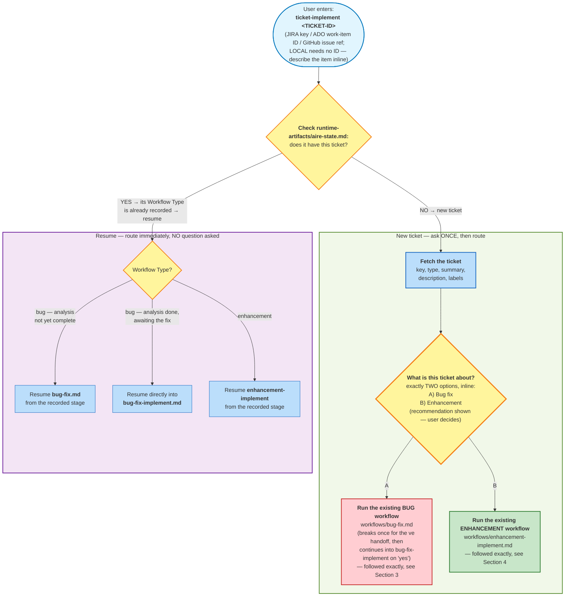

# 6. ve Bug Lifecycle — From the ve Raising the Bug to Ready for Testing

```mermaid
flowchart TD
    %% ═══════════════════════════════════════════════════
    %% PHASE 0: ve FINDS AND RAISES THE BUG
    %% ═══════════════════════════════════════════════════

    FOUND([" ve finds a bug<br/>during testing"])

    FOUND --> RD["<b>ve manually invoke raise-defect</b> skill<br/>Collect 5 fields:<br/>Title, Description,<br/>Severity (Low/Med/High/Critical),<br/>Environment Found, Discovery Activity<br/>"]

    RD --> RD_DRAFT["<b>Draft the ticket</b><br/>issueType Bug • labels/tags:<br/>bug, defect, ai-generated, aire, aire-v[N]<br/>"]

    RD_DRAFT --> RD_GATE{"ve approves<br/>the drafted ticket?<br/>(confirm-first)"}
    RD_GATE -->|"Edits needed"| RD
    RD_GATE -->|"Approved "| RD_CREATE["<b>tracker-dispatch createBug</b> (JIRA/ADO/GITHUB/LOCAL)<br/>Log in runtime-artifacts/audit.md with the tracker item link/ID"]

    RD_CREATE --> JIRA_BUG[("Configured tracker: Bug &lt;TICKET-ID&gt;<br/>")]

    %% ═══════════════════════════════════════════════════
    %% PHASE 1: DEV TEAM FIXES — EXISTING BUG FLOW
    %% ═══════════════════════════════════════════════════

    JIRA_BUG --> DEV_TRIGGER(["Dev enters:<br/><b>ticket-implement &lt;TICKET-ID&gt;</b><br/>Router asks, Dev selects → <b>A) Bug fix</b><br/>(Section 5)"])

    DEV_TRIGGER --> BREAKPT["<b>bug-fix — analysis + design</b> (Section 3)<br/>ticket capture → bug branch → RE reuse →<br/>requirements → impact analysis + AI-origin detection →<br/>single story → design stages<br/><br/><b>Mandatory Stop:</b><br/>docs committed + PUSHED on the bug branch,<br/>then: continue to the fix? (yes / no)"]

    BREAKPT --> BUGFLOW["<b>bug-fix-implement — the fix</b> (Section 3)<br/>ticket → In Development →<br/>baseline regression → fix plan (announced) → fix +<br/>unit tests ≥90% → full regression →<br/>auto code review, findings auto-remediated<br/>and re-reviewed until clean → commit →<br/>[BUG] PR → base + auto pr-review<br/>"]

    %% ═══════════════════════════════════════════════════
    %% PARALLEL ve TRACK — /ve-implement, from the BREAK
    %% ═══════════════════════════════════════════════════

    BREAKPT -.->|"ve IN PARALLEL from the Mandatory stop—<br/>"| veIMPL["<b>ve types /ve-implement PROJ-123</b><br/>on the pulled <b>bug/PROJ-123-…</b> branch<br/>Cuts <b>ve/PROJ-123-&lt;title&gt;</b> from it<br/>Reads the ACCEPTANCE CRITERIA only<br/>(tracker item + requirements + design)<br/><b>never application source code</b><br/>Writes MANUAL test steps →<br/>spec/test-plans/PROJ-123-&lt;title&gt;/<br/>PR back into bug/PROJ-123-… (ai-generated + aire-v[N])<br/><i>resides the [BUG] PR into base</i>"]

    BUGFLOW --> STAYS["<b>Ticket STAYS  In Development</b><br/>after the [BUG] PR is raised<br/><i>The [BUG] PR stays OPEN through everything below</i>"]

    veIMPL -.->|"ve's own test-plan PR merges<br/>into bug/PROJ-123-…"| veMERGED

    STAYS --> veMERGED["<b>ve test-plan PR MERGED into bug/PROJ-123-… branch</b>"]

    %% ═══════════════════════════════════════════════════
    %% PHASE 2: ve SIGN-OFF — ve-list-work, ON THE BUG BRANCH, BEFORE the merge
    %% ═══════════════════════════════════════════════════

    veMERGED --> QTB["<b>ve runs /ve-list-work</b> on the <b>bug/PROJ-123-… branch</b><br/>· the [BUG] PR is still OPEN <br/><i><b>Option A</b> → list the ticket with its live tracker status (LOCAL: local Story Tracker status)</i><br/><b>Option C</b> → amend a test plan (commit + push to the bug branch manually)<br/><b>Option B</b> → tests the work by executing the manual test steps generated by /ve-implement, then answers ONE<br/><b>&lt;Tracker ID&gt; approve</b> or <b>&lt;Tracker ID&gt; reject</b>"]

    QTB --> QTB_GATE{"ve decision<br/>(confirm-first)"}
    QTB_GATE -->|"APPROVE"| APPROVED["tracker comment 've approved the story' + <b>ve-approved</b> label<br/>Ticket → <b>Ready for Testing</b><br/>Story Tracker synced<br/>+ logged in runtime-artifacts/audit.md"]
    QTB_GATE -->|"REJECT"| REJECTED["tracker comment 've rejected the story' + <b>ve-rejected</b> label<br/>Ticket <b>stays In Development</b><br/>+ logged in runtime-artifacts/audit.md"]

    REJECTED --> LOGDEFECT["<b>ve manually invokes /raise-defect skill</b><br/>to log the finding as a tracked defect in the configured tracker"]
    LOGDEFECT -->|"the NEW defect starts its own cycle"| DEV_TRIGGER

    %% ═══════════════════════════════════════════════════
    %% PHASE 3: CYCLE CLOSE — runs on BOTH outcomes
    %% ═══════════════════════════════════════════════════

    APPROVED --> ARCHIVE
    REJECTED --> ARCHIVE["<b>User manually run /archive-epic on bug branch and archive-docs for this branch resides the [BUG] PR</b>"]

    ARCHIVE --> MERGE["<b>[BUG] PR merges into BASE branch</b><br/>(human decision)"]

    MERGE --> DONE(["<b>ve BUG LIFECYCLE COMPLETE</b><br/>Next cycle pulls fresh current-system truth<br/>from Atlas via the Helix MCP"])

    %% ═══════════════════════════════════════════════════
    %% STYLING
    %% ═══════════════════════════════════════════════════

    %% ve raise-defect (lavender)
    style FOUND fill:#EDE7F6,stroke:#5E35B1,stroke-width:2px
    style RD fill:#D1C4E9,stroke:#5E35B1,stroke-width:2px
    style RD_DRAFT fill:#D1C4E9,stroke:#5E35B1
    style RD_CREATE fill:#B39DDB,stroke:#5E35B1,stroke-width:2px

    %% Trigger
    style DEV_TRIGGER fill:#CE93D8,stroke:#6A1B9A,stroke-width:3px

    %% Dev bug-fix flow (green) + the break (red) + the parallel ve track (teal)
    style BREAKPT fill:#FFCDD2,stroke:#C62828,stroke-width:3px
    style BUGFLOW fill:#C8E6C9,stroke:#2E7D32,stroke-width:2px
    style veIMPL fill:#B2DFDB,stroke:#00695C,stroke-width:2px
    style STAYS fill:#C8E6C9,stroke:#2E7D32,stroke-width:2px

    %% Merge + cycle close (orange)
    style MERGE fill:#FFE0B2,stroke:#E65100,stroke-width:2px
    style ARCHIVE fill:#FFE0B2,stroke:#E65100,stroke-width:2px

    %% ve sign-off (teal)
    style veMERGED fill:#B2DFDB,stroke:#00695C,stroke-width:2px
    style QTB fill:#B2DFDB,stroke:#00695C,stroke-width:2px
    style APPROVED fill:#B2DFDB,stroke:#00695C,stroke-width:2px

    %% Gates (amber)
    style RD_GATE fill:#FFF9C4,stroke:#F57F17
    style QTB_GATE fill:#FFF9C4,stroke:#F57F17

    %% Rejected / re-raise (red)
    style REJECTED fill:#FFCDD2,stroke:#C62828,stroke-width:2px
    style LOGDEFECT fill:#FFCDD2,stroke:#C62828,stroke-width:2px

    %% External systems
    style JIRA_BUG fill:#FFF9C4,stroke:#F57F17

    %% Done
    style DONE fill:#A5D6A7,stroke:#2E7D32,stroke-width:3px
```


# 7. ve Toolkit — Which Skill to Use When

> The reference for which skill the ve uses, when to use it, and what it changes. The same skills serve all three cycle types: epic, bug, and enhancement.

## How the ve track fits the workflow

Test Plan belongs to the ve and runs as a parallel track alongside development, beginning as soon as the design stages from implementation phase finish.

Every flow supports this by pausing at design completion and pushing the requirements and design artifacts to the integration branch first. The epic flow does so at its mandatory stop, on the epic branch; the bug and enhancement flows do so at their mandatory stop, on the bug or enhancement branch, before the developer is asked whether to continue into implementation. The ve's first move is therefore always the same, and is independent of the developer's answer: pull the integration branch, then run `/ve-implement &lt;TICKET-ID&gt;`.

The ve owns the promotion to Ready for Testing, through `ve-list-work`. 

## Where the ve works

| Cycle type | Integration branch | Where the development pull requests merge |
|------------|--------------------|-------------------------------------------|
| Epic (greenfield or brownfield) | The epic branch, for example `epic/PROJ-50-checkout` | Each story's `[STORY]` pull request merges into the epic branch |
| Bug | The base branch, for example `QA-staging` | The single `[BUG]` pull request merges into the base branch |
| Enhancement | The base branch | The single `[ENH]` pull request merges into the base branch |

Each skill resolves the correct branch from the project state file and announces it before doing anything.

## The primary skills

### `/ve-implement &lt;TICKET-ID&gt;` — author the manual test plan

**When to use it.** At the design handoff, once per story on an epic cycle and once for the ticket on a bug or enhancement cycle. The developer's code does not need to exist, be built, or be merged.

**How to use it.** Get on the integration branch and take the latest (`git fetch origin`, `git checkout <integration-branch>`, `git pull --ff-only`), then type `/ve-implement PROJ-102`. A story number such as `/ve-implement 1.2` also works on an epic cycle; with no argument the skill asks which story you mean.

**What it does.** Cuts an `ve/<Story-TICKET-ID>-<title>` branch from the integration branch. Reads the story's acceptance criteria from the configured tracker, together with the requirements and the implementation design artifacts, and never application source code. Decides which test plans apply — integration, end-to-end, API, contract, security, performance, and accessibility — and writes them as numbered manual test steps into `spec/test-plans/<Story-TICKET-ID>-<title>/`, with every case traced to an acceptance criterion and every criterion covered. It confirms the applicable plans before writing, asks the ve to approve the finished plans, and asks permission before pushing.

**What it produces.** A pull request titled `[TEST][<Story-TICKET-ID>] Test Plan — <story title>`, raised from the `ve/…` branch back into the integration branch and labelled `ai-generated` and `aire-v[N]`. On bug and enhancement cycles the test documentation therefore travels into the base branch on the same `[BUG]` or `[ENH]` pull request as the code. Parallel ve runs never conflict, because `.gitattributes` merges these files by appending.


### `/ve-list-work` — execute the steps and sign the work off

**When to use it.** After the development pull request for that story has merged into the integration branch. On an epic, run it per story as each pull request merges.

**How to use it.** Get on the integration branch, type `/ve-list-work`, and choose one of three local actions. The skill performs exactly one tracker transition: In Development to Ready for Testing.

| Local action | What it does | What it writes |
|--------------|--------------|----------------|
| **A) List** | Lists the items whose development pull request has merged and which are still In Development, with status read live from the configured tracker rather than trusted from the local state file (LOCAL: read from the local Story Tracker). A status check only. | Nothing |
| **B) Approve or reject** | The sign-off decision, taken after the ve has built the system locally from the integration branch and executed the manual test steps. One prompt, one decision per story, in the form `1.1 approve, PROJ-103 reject`. **Approve** adds a tracker comment `ve approved the story`, applies the `ve-approved` label, and transitions the item to Ready for Testing in both the Story Tracker and the configured tracker, verified afterwards. **Reject** adds the comment `ve rejected the story`, applies the `ve-rejected` label, and deliberately leaves the item In Development for the developer. On an epic cycle, once every story is approved the skill offers, with confirmation, to move the parent epic to Ready for Testing. | The Story Tracker, the configured tracker, and `runtime-artifacts/audit.md` |
| **C) Request changes to a test plan** | Adds or adjusts a manual test case in a plan that `/ve-implement` generated, traced to an acceptance criterion, without touching code, branches, or status. The edit is left in the working tree — commit and push it manually. | The Manual test-plan files only |

### `/playwright-implement &lt;TICKET-ID&gt;` — turn the approved manual UI steps into automation

**When to use it.** Once a story's manual UI test steps exist and **both** of that story's pull requests have merged into the integration branch. This is a downstream, optional step — never a substitute for `/ve-implement`, and never run before those two merges.

**The sequence, in order:**

1. The dev's `[STORY]` pull request for that story merges into the epic branch (the bug/enhancement branch, for those cycles).
2. Your own `/ve-implement` test-documentation pull request (`[TEST]...`) for that same story also merges into the same branch.
3. You invoke `/playwright-implement <TICKET-ID or story number>`.

**How to use it.** The skill runs a **Prerequisite Gate** first — Playwright and its official Test Agents installed and scaffolded (`npx playwright init-agents --loop=claude`), the local frontend server up, fixture data/test accounts seeded, and the shared seed test covering this story's starting state. Any failed check stops the run and names exactly what is missing; nothing further runs until it is fixed.

Once every check passes, it orchestrates Playwright's **own** official Planner, Generator, and Healer agents — never a re-implementation of them — through: Planner drafts a plan from this story's UI-relevant manual test cases → **you approve it** (a mandatory hard stop) → Generator writes the executable specs, one scenario at a time → local headed execution → Healer fixes failures → a final **push gate** (your last confirm-first checkpoint) → pushed directly to the integration branch. There is no PR here — the push gate is the review checkpoint.

**What it produces.** `tests/e2e/<story-slug>/` (the generated Playwright specs), `tests/playwright-specs/<story-slug>.md` (the approved plan), and `spec/test-plans/<TICKET-ID>-<title>/automation-summary.md` recording AC coverage across the automated UI cases plus whatever remains manual-only (backend/API cases are always out of scope for this skill). A failure the Healer cannot resolve is marked `test.fixme()` and flagged as a candidate defect for `/raise-defect`. It never touches application code, the Story Tracker, or any tracker status — run it in its own terminal, alongside `/ve-list-work` working the Approve/Reject queue in another.

## The supporting skill

### `/raise-defect` — log a finding as a tracked bug in the configured tracker

Used the moment testing finds a bug. It collects five fixed fields — Title, Description, Severity, Environment Found, and Discovery Activity — then, after the ve approves the drafted ticket, creates a Bug in the configured tracker (JIRA/ADO/GITHUB/LOCAL) labelled `bug`, `defect`, `ai-generated`, `aire` and `aire-v[N]`. The developer picks that ticket up through `ticket-implement` (Sections 3), which starts the cycle again.

## Order of work for one story

1. The workflow reaches its design handoff and pushes the requirements and design artifacts to the integration branch.
2. Pull that branch and run `/ve-implement &lt;TICKET-ID&gt;`. Approve the generated plans, then allow the push and the pull request.
3. Merge the test-documentation pull request into the integration branch.
4. Repeat steps 2 and 3 for the next story while the developer continues to build.
5. The developer's pull request for the story merges into the integration branch.
6. Run `/ve-list-work` on the integration branch and pick **A** to confirm what has merged and is testable.
7. Build the system locally from the integration branch, and execute the manual test steps generated by `/ve-implement`.
8. Run `/ve-list-work` again and pick **B** to approve or reject. Approved items move to Ready for Testing; rejected items stay In Development, and the finding is logged with `/raise-defect`.
9. Optionally, once both this story's pull requests have merged, run `/playwright-implement &lt;TICKET-ID&gt;` to turn its UI-relevant manual cases into executable Playwright automation.

---

# 8. Reverse Engineering Docs Lifecycle — How the Docs Always Stay Fresh

> Current-system truth is the single source of truth about the codebase. It is refreshed **fresh from Atlas via the Helix MCP** at the start of every development cycle (`spec/plans/atlas-deep-dive.md` plus the flat RE docs under `spec/plans/`) — there is no per-cycle delta and no stitching. A cycle never diffs itself against a prior cycle: after the cycle's PR merges, the next cycle simply pulls the current truth from Atlas again.


## Scenarios

| # | Scenario | What happens |
|---|----------|--------------|
| 1 | **Root RE docs already exist** when an epic starts | Workspace Detection finds them and **reuses them as-is** — no regeneration. The whole cycle (requirements, stories, design, dev-implement) reads from them. |
| 2 | **No root RE docs exist** (first time, or after a full reset) | Run **`reverse-engineering-root`** to generate a fresh baseline before the cycle starts. |


### The RE freshness loop 

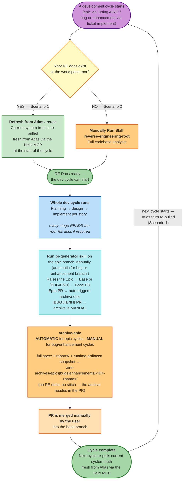


# 9. Approval Model — only GATE 1 remains; GATE 2 and GATE 3 have been removed

> **GATE 1 is MANDATORY and blocking: the generated story set requires explicit human approval
> before it is pushed to the configured tracker** (CLAUDE.md User Stories Part 2/GATE 1). **GATE 2 and
> GATE 3 have been removed** — every implementation workflow (`dev-implement`, `bug-fix-implement`,
> `enhancement-implement`) plans, codes, reviews itself, **fixes its own review findings**, and raises
> its PR without asking. What remains besides GATE 1 are **stage approvals in Planning** (reverse
> engineering, requirements, application design, and each system-level design stage), two
> **flow-control questions**, and the **machine checkpoints** that stop a run for a factual reason.

## What still asks the user

| # | Prompt | Where | Kind |
|---|--------|-------|------|
| 1 | Clarifying-question files (`[Answer]:` tags) | Requirements Analysis, story planning, each design stage | Input, not approval |
| 2 | Context-project opt-in | Workspace Detection / `ticket-implement` | Input, asked once |
| 2b | Context-references opt-in | Workspace Detection / `ticket-implement` | Input, asked once |
| 3 | Stage approvals — RE, `requirements.md`, application design, each design stage | Planning + Implementation design | Approval |
| 3.5 | **GATE 1 — Story Set Approval (MANDATORY)**: "Request Changes" or "Approve & Continue" | User Stories, after Part 2 Generation, before Part 3 Push | **Blocking approval** |
| 4 | "Which tracker story?" | `dev-implement` Story Selection | Input |
| 5 | "Continue to the fix / Ready to implement now? (yes/no)" | `bug-fix` Step 9 / `enhancement-implement` Implementation Checkpoint | Flow control (unnumbered) |
| 6 | ve's own prompts | `/ve-implement`, `ve-list-work`, `/raise-defect` | ve track |

## What stops a run WITHOUT asking (machine checkpoints, not approvals)

- **Doability Gate** — a prerequisite story's PR is not merged → the run STOPS and names it.
- **Story Branch dependency-merge check** — same condition at branch-cut time.
- **CI Preflight Gate (SH-LOOP-9)** — after the commit, before the push: a clean-room run of CI's own entrypoints against the committed diff must show zero missing tools, zero undeclared dependencies, zero Manifest defects — never the ambient dev environment's shortcuts.
- **Unit Test & Coverage gate (≥90%)**, **baseline/full regression diff** — the framework fixes and iterates on its own; it never hands a failure back.
- **Requirements coverage checks** — silent, blocking, self-fixed.

## 9.1 Epic flow — fully automatic from the story set onward

```mermaid
flowchart TD
    subgraph PLANNING["PLANNING — the last approvals live here"]
        REQ["<b>Requirements Analysis</b><br/>questions → requirements.md"]
        REQ --> REQ_A{"Stage approval:<br/>approve requirements.md"}
        REQ_A -->|"Changes"| REQ
        REQ_A -->|"Approved"| US["<b>User Stories</b><br/>team_size FIXED = 2 (never asked)<br/>all-at-once generation (never asked)<br/>coverage check passes"]
        US --> GATE1{"<b>GATE 1 — Story Set Approval</b><br/><i>MANDATORY, blocking</i><br/>Request Changes / Approve & Continue"}
        GATE1 -->|"Request Changes"| US
        GATE1 -->|"Approved"| US_AUTO["Push to the configured tracker,<br/>linked to the Parent Epic"]
        US_AUTO --> DG["Dependency Graph — announced, no gate"]
        DG --> WP["Workflow Planning — announced, no gate"]
        WP --> DES["System-level design stages<br/><i>(each keeps its own stage approval)</i>"]
    end

    DES --> HANDOFF["STOP — Development Handoff<br/>design artifacts committed + PUSHED on the epic branch<br/>DEV types <b>dev-implement</b> · ve types <b>/ve-implement</b>"]

    subgraph IMPLEMENTATION["IMPLEMENTATION — dev-implement (per story): ONE input, zero approvals"]
        PICK["<b>Which tracker story?</b><br/><i>the only thing this run asks</i>"]
        PICK --> MACHINE["Doability Gate → story branch<br/>→ BASELINE regression<br/><i>(machine checks — stop the run, never ask, never merge;<br/>merging a prerequisite PR is always the user's own action)</i>"]
        MACHINE --> PLAN["<b>Plan announced</b> — no approval<br/>(former GATE 2 removed)"]
        PLAN --> GEN["<b>GENERATE code</b><br/>+ unit tests to ≥90% coverage<br/>→ FULL regression vs baseline<br/>(NEW failures fixed in the same run)"]
        GEN --> ACR["<b>AUTO Code Review</b>"]
        ACR --> V{"Verdict<br/><i>routes automatically —<br/>no question (former GATE 3 removed)</i>"}
        V -->|"Findings 🔴/🟠"| REM["<b>AUTO-Remediate</b><br/>all findings in scope, nothing deferred<br/>fix → unit test → regression"]
        REM --> ACR
        V -->|"Clean"| SHIP["Commit → CI Preflight Gate (SH-LOOP-9,<br/>clean-room CI entrypoints, max 3 attempts)<br/>→ push → PR via pr-generator<br/>([STORY] → epic branch) → AUTO pr-review<br/>→ Section F handoff"]
        REM -.->|"stall guard: no code change +<br/>identical findings → PR anyway,<br/>findings reported loudly"| SHIP
    end

    HANDOFF -->|"user types <b>dev-implement</b>"| PICK

    style REQ fill:#BBDEFB,stroke:#1565C0,stroke-width:2px
    style US fill:#BBDEFB,stroke:#1565C0,stroke-width:2px
    style US_AUTO fill:#C8E6C9,stroke:#2E7D32,stroke-width:2px
    style DG fill:#C8E6C9,stroke:#2E7D32
    style WP fill:#C8E6C9,stroke:#2E7D32
    style DES fill:#E1BEE7,stroke:#6A1B9A,stroke-width:2px
    style HANDOFF fill:#FFCDD2,stroke:#C62828,stroke-width:2px
    style PICK fill:#FFF9C4,stroke:#F57F17,stroke-width:3px
    style MACHINE fill:#A5D6A7,stroke:#2E7D32,stroke-width:2px
    style PLAN fill:#C8E6C9,stroke:#2E7D32,stroke-width:2px
    style GEN fill:#A5D6A7,stroke:#2E7D32,stroke-width:2px
    style ACR fill:#B3E5FC,stroke:#0277BD,stroke-width:2px
    style REM fill:#B3E5FC,stroke:#0277BD,stroke-width:2px
    style SHIP fill:#B2EBF2,stroke:#00695C,stroke-width:2px
    style V fill:#C8E6C9,stroke:#2E7D32,stroke-width:2px
    style REQ_A fill:#FFF9C4,stroke:#F57F17,stroke-width:3px
    style GATE1 fill:#FFF9C4,stroke:#F57F17,stroke-width:3px
```

## 9.2 Bug flow — one yes/no, then fully automatic

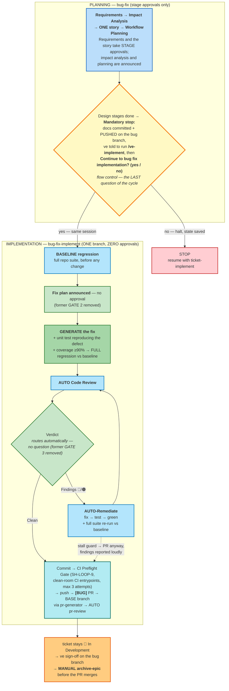

## 9.3 Enhancement flow — one yes/no, then fully automatic

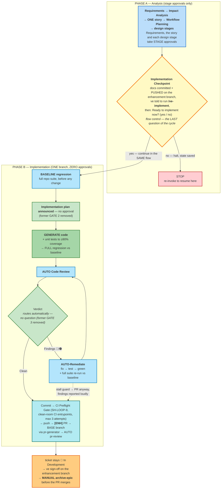


# 10. Distribution & Governance

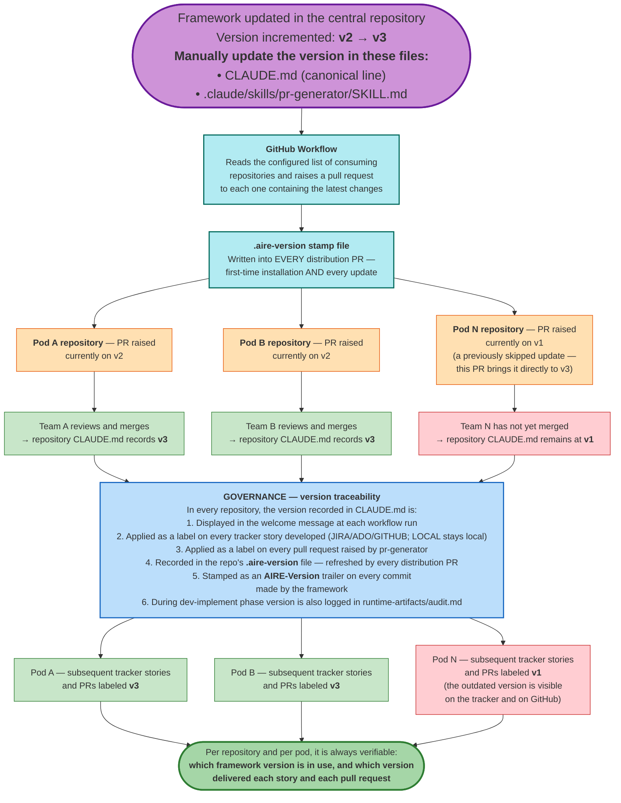


# 11. AI Defect Ratio Detection — Line-Level Provenance Flow

> **What it is**: When a bug is worked through the Bug flow (Section 3), the framework determines whether the code that CAUSED the defect was AI-generated — and, on positive evidence, labels the tracker ticket `ai-generated-defect`. The tracing is done by the **Defect Provenance Analyst** agent (`agents/defect-provenance-analyst.md`).
>
> **The core principle — attribution is per defective LINE, not per file**: a file's *last* change is the wrong attribution unit. The defect may live on a line written by a human long before an unrelated AI PR last touched the file — and vice versa. Every defective `file:line-range` from the Impact Analysis is traced **independently** to the commit that **introduced** its defective logic, producing one verdict row per range.

## How it works

Think of it as asking one question for every bug: **"Who really wrote the broken code — the AI or a human?"** — and answering it with git facts, never with guesswork.

1. **Find the broken lines.** The Impact Analysis step of the bug flow pins the defect down to exact lines in exact files (e.g. `src/api.ts:88-95`), not just "somewhere in this file".
2. **Ask git who wrote each broken line.** For every broken line, `git blame` finds the commit that last really changed it. If that commit only reformatted or moved code around, the defect-provenance-analyst agent keeps digging back through history (`git log -L`) until it finds the commit that actually **wrote the faulty logic**.
3. **Check that commit for AI fingerprints.** Every piece of code the framework generates is permanently stamped in three ways: the PR gets an **"ai-generated"** label, the commit gets a **`Co-Authored-By: Claude`** line, and an **`AIRE-Version:`** stamp. If the commit that introduced the broken line carries ANY of these stamps → the defect was caused by AI code. No stamp and a known human author → human-caused.
4. **Tag the ticket.** If even one broken line traces back to AI-generated code, the tracker bug ticket gets the **`ai-generated-defect`** label — with the proof (commit, PR, which stamp) recorded in the audit log.

```mermaid
flowchart TD
    %% ═══════════════════════════════════════════════════
    %% MAIN FLOW — runs inside bug-fix (Section 3)
    %% ═══════════════════════════════════════════════════


    IMPACT["<b>Stage 1 — Impact Analysis step in bug-fix</b><br/>Find WHERE the defect lives:<br/>every broken line is pinned to an exact<br/>file and line range (e.g. src/api.ts:88-95)<br/>→ written to impact-analysis.md"]

    IMPACT --> AGENT["<b>Stage 2 — Defect Provenance Analyst</b><br/>(agents/defect-provenance-analyst.md)<br/>For EACH broken line range, ask git who wrote it:<br/><i>git blame -w -M -C -L start,end -- file</i><br/>Every range is traced separately — lines committed<br/>at different times or in different files each<br/>get their own answer"]

    AGENT --> DIG["<b>Stage 3 — Find the TRUE author commit</b><br/>If the blamed commit only reformatted, renamed,<br/>or moved code, keep digging back in history<br/>(<i>git log -L</i>) until the commit that actually<br/>WROTE the faulty logic is found.<br/>"]

    DIG --> FP["<b>Stage 4 — Check that commit for AI fingerprints</b><br/>The framework stamps ALL code it generates:<br/> PR label <b>'ai-generated'</b> (found via<br/><i>gh api .../commits/&lt;sha&gt;/pulls</i> — works even<br/>after a squash merge strips commit trailers)<br/> commit trailer <b>Co-Authored-By: Claude</b><br/> commit trailer <b>AIRE-Version:</b>"]

    FP --> VERDICT{"Any fingerprint<br/>on the commit?"}
    VERDICT -->|"Yes — any ONE of "| AI["Verdict: <b>AI-generated</b><br/>(evidence recorded: commit SHA,<br/>PR number, which fingerprint)"]
    VERDICT -->|"No — human author,<br/>no fingerprint"| HUM["Verdict: <b>human</b>"]

    AI --> TABLE
    HUM --> TABLE

    TABLE["<b>Stage 5 — Provenance Verdict table</b><br/>One row per broken line range —<br/>mixed results (AI + human)<br/>are kept as-is, never merged into one verdict.<br/>Saved in impact-analysis.md + runtime-artifacts/audit.md"]

    TABLE --> ANY{"Is at least ONE<br/>line AI-generated?"}
    ANY -->|"Yes — confirm-first"| LABEL["<b>Stage 6 — Label the tracker ticket</b><br/>Add <b>ai-generated-defect</b> via tracker-dispatch editIssue (JIRA/ADO/GITHUB; LOCAL updates local Story Tracker),<br/>VERIFY it landed, log the full evidence<br/>in runtime-artifacts/audit.md"]
    ANY -->|"No"| NOLBL["No label —<br/>'human-origin'<br/>logged with evidence in runtime-artifacts/audit.md"]

    LABEL --> CONT
    NOLBL --> CONT

    CONT(["bug-fix continues<br/>(Single Story → design)"])

    %% ═══════════════════════════════════════════════════
    %% AFTER THE FLOW — RE-CHECK DURING bug-fix-implement
    %% ═══════════════════════════════════════════════════

    CONT --> BFI(["ve Handoff Break, then on 'yes'<br/>the flow continues into<br/><b>bug-fix-implement</b>"])

    BFI --> NEWF{"Does the fix plan touch<br/>files that were NOT in<br/>the Impact Analysis?"}
    NEWF -->|"Yes"| RERUN["<b>Re-check (same procedure)</b><br/>Add the new files to impact-analysis.md and run the<br/><b>Defect Provenance Analyst</b> again — ONLY on the<br/>newly implicated lines (Stages 2–6).<br/>If one is AI-generated and the ticket is not yet<br/>labeled, the label is offered then (confirm-first)"]
    NEWF -->|"No"| GO(["Fix proceeds<br/>(plan → fix → tests → PR)"])
    RERUN --> GO

    %% ═══════════════════════════════════════════════════
    %% STYLING
    %% ═══════════════════════════════════════════════════

   
    style IMPACT fill:#BBDEFB,stroke:#1565C0,stroke-width:2px

    %% Provenance tracing (teal — matches Section 3's AI-origin nodes)
    style AGENT fill:#B2DFDB,stroke:#00695C,stroke-width:3px
    style DIG fill:#B2DFDB,stroke:#00695C,stroke-width:2px
    style FP fill:#B2DFDB,stroke:#00695C,stroke-width:2px
    style TABLE fill:#B2DFDB,stroke:#00695C,stroke-width:2px

    %% Verdicts
    style AI fill:#FFE0B2,stroke:#E65100,stroke-width:2px
    style HUM fill:#C8E6C9,stroke:#2E7D32,stroke-width:2px
    

    %% Gates (amber)
    style VERDICT fill:#FFF9C4,stroke:#F57F17,stroke-width:2px
    style ANY fill:#FFF9C4,stroke:#F57F17,stroke-width:2px
    style NEWF fill:#FFF9C4,stroke:#F57F17,stroke-width:2px

    %% Outputs
    style LABEL fill:#B2EBF2,stroke:#00695C,stroke-width:2px
    style NOLBL fill:#ECEFF1,stroke:#546E7A

    style CONT fill:#A5D6A7,stroke:#2E7D32,stroke-width:2px
    style BFI fill:#CE93D8,stroke:#6A1B9A,stroke-width:2px
    style RERUN fill:#B2DFDB,stroke:#00695C,stroke-width:2px
    style GO fill:#A5D6A7,stroke:#2E7D32,stroke-width:3px
```


# 12. How Code Gets Evaluated — End to End

---


## The whole flow

```mermaid
flowchart TD
    START(["A developer starts a story via dev-implement<br/>(architecture.md, rubrics and the CI pipeline<br/>already exist — written ONCE at the epic's<br/>STOP CHECKPOINT, before any story branch)"])

    START --> SETUP["<b>1. EVAL TOOLING BOOTSTRAP</b> — Step 1.5 Item 4.6<br/>Detect configured tools + read tests/.evals/config.json.<br/>Missing config is CREATED here<br/><br/>Existing config used AS-IS, never overridden."]

    SETUP --> BEFORE["<b>2. BASELINE CAPTURE</b> — Step 1.5, before any code<br/>Run the full test suite + all 7 static evals<br/>on the untouched branch.<br/><i>Pre-existing findings are recorded here,<br/>then excluded from this story's result.</i>"]

    BEFORE --> SPEC["<b>3. BEHAVIOUR SPEC</b> — Step 4.5, one file per story<br/>spec/behavior/<br/>story-N.M.feature<br/><i>One scenario per acceptance criterion.<br/>Written BEFORE the code — the story's ONLY spec file.</i>"]

    SPEC --> WRITE["<b>4. CODE GENERATION</b> — Step 5<br/>Implements the plan. All application code → src/ folder<br/>"]

    WRITE --> TESTS{"<b>5. UNIT TESTS + COVERAGE</b> — Step 6<br/>Generate unit tests, RUN them, measure<br/>coverage on new/changed code.<br/><b>Threshold: 90% minimum</b>"}
    TESTS -->|"test fails, or coverage &lt; 90%"| FIXCODE["<b>FIX THE CODE (Self-heal)</b><br/>Diagnose the root cause first, then fix<br/>the implementation. Add tests only for<br/>genuinely uncovered paths.<br/>"]
    FIXCODE --> RERUN["<b>RE-RUN THE UNIT TESTS</b><br/>Re-measure coverage on changed code"]
    RERUN --> TESTS

    TESTS -->|"test passes + coverage ≥ 90%"| BEH{"<b>6. BEHAVIOURAL TESTS</b> — Step 6.1, in Podman<br/><b>B1</b> tests this story's .feature file<br/><b>B2</b> tests every other story feature file in the repo<br/><b>B3</b> tests whole epic + cross-story journeys<br/><i>(B3 runs only on the LAST story)</i><br/>"}
    BEH -->|"a scenario fails"| FIX2["<b>Fix the CODE (Self-heal)</b><br/> so the behaviour matches.<br/><b>3 attempts each — separate budgets</b><br/><b>for B1/B2 and B3.</b><br/><i>Never edit or skip a scenario to pass.</i>"]
    FIX2 --> BEH

    BEH -->|"all green"| API{"<b>7. API + CONTRACT TESTING</b> — Step 6.2<br/><i>Applies only if this story touches an API.</i><br/>Automated tests against the REAL endpoint,<br/>6 checks each: happy path, status codes,<br/>auth 401 vs 403, error-response shape,<br/>request validation, response schema."}
    API -->|"any check fails"| FIX3["<b>(Self-heal)</b><br/>Fix the endpoint or the test. Re-run.<br/><b>Max 3 attempts.</b>"]
    FIX3 --> API

    API -->|"6/6 pass, or N/A"| OLD{"<b>8. FULL Test-suite run</b> — Step 6.5<br/>Re-run the ENTIRE repo test suite<br/>and diff against the step-2 baseline."}
    OLD -->|"NEW failure<br/>(green at baseline, red now)"| FIX4["<b>(Self-heal)</b><br/>Fix what this story broke.<br/><b>Max 3 attempts.</b><br/><i>NEVER by deleting, skipping or<br/>weakening the failing test.</i>"]
    FIX4 --> OLD

    OLD -->|"0 new failures"| EVAL{"<b>9. STATIC EVAL</b> — Step 6.6, 7 checks<br/>lint · types · security scan<br/>· dependency vulnerabilities · licences<br/>· complexity · secrets<br/>Diffed against the step-2 baseline —<br/><b>only NEW findings on changed files count</b>"}
    EVAL -->|"new findings<br/>above threshold"| FIX5["<b>(Self-heal)</b><br/>Fix the code — never suppress.<br/><b>Max 3 attempts.</b>"]
    FIX5 --> EVAL

    EVAL -->|"diff clean"| REVIEW["<b>10. AUTOMATED CODE REVIEW</b> — Section A<br/>Read-only — never edits code.<br/>Report → reports/reviews/<br/>Produces three independent outputs"]

    REVIEW --> R1["<b>Acceptance Criteria</b><br/>Every criterion and requirement<br/>gets a verdict — Met / Partially Met / Not Met<br/>with the file:line that proves it."]
    REVIEW --> R2["<b>Security Baseline</b><br/>All 16 security rules, scoped to the diff"]
    REVIEW --> R3["<b>LLM-as-a-Judge</b><br/>J1 Architecture vs the rubric derived<br/>from architecture.md Section 10<br/>J2 Security (OWASP Top 10:2025)<br/><b>Both BLOCKING — N/A passes</b>"]

    R1 --> JUDGE{"<b>Verdict Routing</b> — Section B<br/>Any Blocker / High finding<br/>or J1/J2 below minimum?"}
    R2 --> JUDGE
    R3 --> JUDGE

    JUDGE -->|"yes"| REDO["<b>(Self-heal) — auto-remediate</b> — Section C<br/>Fix every finding, re-test, re-review.<br/><b>Max 3 rounds.</b>"]
    REDO --> REVIEW

    JUDGE -->|"clean verdict"| RESULT["<b>11. SCORECARD WRITTEN</b><br/>reports/eval-evidence/&lt;key&gt;/<br/>eval.json + eval-summary.md<br/>"]

    RESULT --> COMMIT["<b>12. COMMIT</b> — Section D Step 1<br/>git add + commit on story branch<br/>with an AIRE-Version trailer"]

    COMMIT --> MANIFEST["<b>13. MANIFEST RECONCILIATION</b> — Section D Step 1.5<br/>Write tests/.evals/ci-manifest.d/story-N.M.json<br/>from what Steps 6/6.2/6.6 actually established/proved<br/><i>Append-only — never edits another unit's fragment<br/>or the shared config.json</i>"]

    MANIFEST --> PREFLIGHT{"<b>14. CI PREFLIGHT GATE</b> — Section D Step 2.5<br/><b>SH-LOOP-9</b><br/>Clean-room run of CI's OWN entrypoints<br/>(ci-manifest-runner install→build→coverage,<br/>run-static-evals) against the COMMITTED diff<br/>— proves CI CAN run this, before the PR exists"}
    PREFLIGHT -->|"missing tool / undeclared dep /<br/>Manifest defect / N/A on a touched root —<br/>fix the DECLARATION, never the gate<br/>(max 3 attempts)"| PREFLIGHT
    PREFLIGHT -->|"clean"| HUMAN(["<b>15. PR RAISED</b><br/>The scorecard travels in the PR body."])

    HUMAN --> CI["<b>16. CI RE-VERIFIES</b><br/>.github/workflows/agentic-eval-pipeline.yml<br/><i>generated for this project from its tech stack</i><br/>Stage 1 deterministic eval → Stage 2 behavioural eval<br/>→ Stage 3 LLM as a judge → Stage 4 scorecard"]
    CI -->|"Code-class failure<br/>(real finding / failing test)"| SELFREPAIR["<b>CI SELF-REPAIR</b><br/>Claude Code<br/>reads the failure, fixes the code, pushes a commit, CI re-verifies again.<br/><b>Max retry limit for Self Repair is 3</b><br/><i>Never touches Manifest/CI config —<br/>that class belongs to Step 17 below</i>"]
    SELFREPAIR --> CI
    CI --> ATTEST{"<b>17. CI ATTESTATION GATE</b> — Section D Step 8<br/>Watch this PR's CI run to conclusion, cross-check<br/>its gates block vs the local results from Steps 5–9<br/><i>Scope: CI CONFIGURATION only</i>"}
    ATTEST -->|"Manifest/provisioning mismatch<br/>(gate absent/N/A/errored in CI<br/>that passed locally) — extend the<br/>fragment, re-run Step 14, re-verify<br/>(max 3 attempts)"| MANIFEST
    ATTEST -->|"clean match, or a Code-class<br/>failure (left to Self-Repair above)"| MERGE(["<b>18. HUMAN GATEKEEPER approves and merges the PR</b>"])

    style START fill:#CE93D8,stroke:#6A1B9A,stroke-width:2px
    style SETUP fill:#FFE0B2,stroke:#E65100,stroke-width:2px
    style BEFORE fill:#FFE0B2,stroke:#E65100,stroke-width:3px
    style SPEC fill:#D1C4E9,stroke:#4527A0,stroke-width:3px
    style WRITE fill:#ECEFF1,stroke:#546E7A
    style TESTS fill:#BBDEFB,stroke:#1565C0,stroke-width:2px
    style FIXCODE fill:#FFE082,stroke:#FF6F00,stroke-width:3px
    style RERUN fill:#FFF9C4,stroke:#F57F17
    style BEH fill:#C5E1A5,stroke:#33691E,stroke-width:3px
    style API fill:#BBDEFB,stroke:#1565C0,stroke-width:2px
    style OLD fill:#BBDEFB,stroke:#1565C0,stroke-width:2px
    style EVAL fill:#C8E6C9,stroke:#2E7D32,stroke-width:3px
    style FIX2 fill:#FFF9C4,stroke:#F57F17
    style FIX3 fill:#FFF9C4,stroke:#F57F17
    style FIX4 fill:#FFF9C4,stroke:#F57F17
    style FIX5 fill:#FFF9C4,stroke:#F57F17
    style REVIEW fill:#E1BEE7,stroke:#6A1B9A,stroke-width:2px
    style R1 fill:#E1BEE7,stroke:#6A1B9A
    style R2 fill:#FFCDD2,stroke:#C62828,stroke-width:2px
    style R3 fill:#F0F4C3,stroke:#9E9D24,stroke-width:2px
    style JUDGE fill:#FFF9C4,stroke:#F57F17,stroke-width:2px
    style REDO fill:#B2DFDB,stroke:#00695C,stroke-width:2px
    style RESULT fill:#B2EBF2,stroke:#00695C,stroke-width:2px
    style COMMIT fill:#E0F7FA,stroke:#00695C,stroke-width:2px
    style MANIFEST fill:#FFCC80,stroke:#E65100,stroke-width:2px
    style PREFLIGHT fill:#FFF9C4,stroke:#F57F17,stroke-width:3px
    style HUMAN fill:#A5D6A7,stroke:#2E7D32,stroke-width:2px
    style CI fill:#B3E5FC,stroke:#01579B,stroke-width:3px
    style SELFREPAIR fill:#FFE0B2,stroke:#E65100,stroke-width:2px
    style ATTEST fill:#FFF9C4,stroke:#F57F17,stroke-width:3px
    style MERGE fill:#A5D6A7,stroke:#2E7D32,stroke-width:3px
```

---

## Why steps 1 and 2 come first

This is the part that is easy to get wrong, and it is what makes the whole thing usable on a real
project.

Most existing codebases already have hundreds of small problems — messy old files, outdated
dependencies, functions nobody dares touch. If the checks simply reported *everything wrong with the
project*, every story would be blocked by decades of other people's mess, developers would
stop believing the results, and the checks would be switched off within a week.

So instead: **take a photograph before touching anything, then compare.**

- A problem that appears in **both** photographs was already there. It is recorded and ignored.
- A problem that appears **only after** the story, in a file the story touched, was introduced by
  this story. It must be fixed before continuing.

The rule ends up being the simplest possible one: **leave it no worse than you found it.**

This is also why the eval tools and config are set up in step 1 rather than later. If a tool were
configured *after* the "before" photograph, the two photographs would have been taken under different
rules — every problem the new tool noticed in old code would look like it was created today. The
comparison would be meaningless.

---

## Why steps 13–14 and 17 exist — the gap between "passes here" and "passes on CI"

Every gate from step 5 through 11 runs in this agent's own environment, where tools were already
installed and dependencies were already importable. CI starts from a bare runner and installs
**only** what a manifest tells it to. Without a bridge between the two, a story can pass every local
gate and still fail its own PR's CI run on `tool 'ruff' is not installed on this runner` — a
declaration gap, not a code problem, but one that burns a full CI run and a self-repair triage before
anyone notices it was never about the code.

- **Step 13 — Manifest Reconciliation** writes down, in one small append-only file per story
  (`tests/.evals/ci-manifest.d/story-N.M.json`), exactly what steps 5–9 already proved: which install
  commands ran, what the coverage command and report path are, which tools were used. It never edits
  the shared `config.json` — two stories building in parallel would conflict on the file that defines
  the gates themselves — so it always adds a new file instead.
- **Step 14 — CI Preflight** then proves that declaration is enough, in a clean room, before the PR
  ever exists: a fresh venv or an empty `node_modules`, never this agent's ambient shell. If CI's own
  install/build/coverage commands fail here, the fix is always to the **declaration** — the story's
  manifest fragment, or the repo's own dependency file — never to the gate itself.
- **Step 17 — CI Attestation** closes the loop after the PR is raised: it watches the real CI run and
  checks that CI actually saw and scored this story's code the same way the local gates did. It asks
  exactly one question — *did CI measure this, and agree?* — never *is the code correct?*, which steps
  5–11 already answered. A **Manifest** mismatch (a gate silently `N/A` in CI) loops back to Manifest
  Reconciliation; a **Code** failure (a real finding, a failing test) is left entirely to CI
  self-repair, which owns application code the moment the PR exists.

---

## The seven evals in step 9

These are ordinary, well-known developer tools. None of them involve AI, they all finish in seconds,
and they give the same answer every time they run.

| | Eval | The plain question | What it actually looks at |
|---|---|---|---|
| 1 | **Style and mistakes** *(linting)* | *"Is the code sloppy?"* | Reads the code's structure and applies a rulebook: leftover unused variables, code that can never run, empty error handlers, debug print statements left behind, a comparison written the wrong way. Individually trivial; at AI writing-speed they pile up fast. |
| 2 | **Type checking** | *"Do the pieces actually fit together?"* | Checks every place one part of the code calls another: is it passing text where a number is expected, reading something that doesn't exist, ignoring that a value might be empty? These are not opinions — the code provably cannot work. AI is very good at writing code that reads beautifully and cannot run. |
| 3 | **Security scanning** | *"Does this contain a known-dangerous pattern?"* | Matches the code against a catalogue of known vulnerability shapes: database queries glued together from user input, commands built from web requests, security verification switched off, outdated password scrambling. |
| 4 | **Dependency check** | *"Are the outside parts we used recalled?"* | Most software is largely other people's code. This lists every external package used — including the ones those packages pull in themselves — and looks each up in public databases of publicly-known security holes. |
| 5 | **Licence check** | *"Are we legally allowed to ship this?"* | Reads the legal terms attached to every external package. Some licences legally require you to publish your own source code if you use them — a serious problem discovered far too late if nobody checks. It also flags packages with **no stated licence at all**, which is legally worse: no licence means no permission to use it. |
| 6 | **Complexity** | *"Is this function too tangled to safely change later?"* | Counts how many different paths run through each new function — every branch, loop and condition adds one. A high count means a lot of behaviour crammed into one place, which is where bugs hide and where tests stop being able to cover everything. AI drifts this way naturally, because adding one more branch is the quickest way to satisfy a requirement. |
| 7 | **Secret scanning** | *"Did a password just get committed?"* | Scans only the new changes for things that look like credentials — access keys, tokens, private keys, or any random-looking string stored under a name like `password`. This one matters because a leaked credential cannot be taken back once shared. |

One rule applies to all seven: **a problem must be fixed, never silenced.** Every one of these tools
has a way to tell it *"ignore this line"*. Using that to get past a check is treated exactly like
deleting a failing test to pretend it passed — it is forbidden.

And if a project's technology genuinely has no tool for one of these, that is recorded as
"not applicable, here's why" and shown to the user. It is never quietly skipped.

---