# How Code Gets Evaluated — End to End

---

## The whole flow

```mermaid
flowchart TD
    START(["A developer starts a story via dev-implement<br/>(architecture.md, rubrics and the CI pipeline<br/>already exist — written ONCE at the epic's<br/>STOP CHECKPOINT, before any story branch)"])

    START --> SETUP["<b>1. EVAL TOOLING BOOTSTRAP</b> — Step 1.5 Item 4.6<br/>Detect configured tools + read tests/.evals/config.json.<br/>Missing config is CREATED here<br/><br/>Existing config used AS-IS, never overridden."]

    SETUP --> BEFORE["<b>2. BASELINE CAPTURE</b> — Step 1.5, before any code<br/>Run the full test suite + all 7 static evals<br/>on the untouched branch.<br/><i>Pre-existing findings are recorded here,<br/>then excluded from this story's result.</i>"]

    BEFORE --> SPEC["<b>3. BEHAVIOUR SPEC</b> — Step 4.5, one file per story<br/>spec/behavior/<br/>story-N.M.feature<br/><i>One scenario per acceptance criterion.<br/>Written BEFORE the code — the story's ONLY spec file.</i>"]

    SPEC --> WRITE["<b>4. CODE GENERATION</b> — Step 5<br/>Implements the plan. All application code → src/ folder<br/>"]

    WRITE --> TESTS{"<b>5. UNIT TESTS + COVERAGE</b> — Step 6<br/>Generate unit tests, RUN them, measure<br/>coverage on new/changed code.<br/><b>Threshold: 90% minimum</b>"}
    TESTS -->|"test fails, or coverage &lt; 90%"| FIXCODE["<b>FIX THE CODE (Self-heal)</b><br/>Diagnose the root cause first, then fix<br/>the implementation. Add tests only for<br/>genuinely uncovered paths.<br/>"]
    FIXCODE --> RERUN["<b>RE-RUN THE UNIT TESTS</b><br/>Re-measure coverage on changed code"]
    RERUN --> TESTS

    TESTS -->|"test passes + coverage ≥ 90%"| BEH{"<b>6. BEHAVIOURAL TESTS</b> — Step 6.1, in Podman<br/><b>B1</b> tests this story's .feature file<br/><b>B2</b> tests every other story feature file in the repo<br/><b>B3</b> tests whole epic + cross-story journeys<br/><i>(B3 runs only on the LAST story)</i><br/>"}
    BEH -->|"a scenario fails"| FIX2["<b>Fix the CODE (Self-heal)</b><br/> so the behaviour matches.<br/><b>3 attempts each — separate budgets</b><br/><b>for B1/B2 and B3.</b><br/><i>Never edit or skip a scenario to pass.</i>"]
    FIX2 --> BEH

    BEH -->|"all green"| API{"<b>7. API + CONTRACT TESTING</b> — Step 6.2<br/><i>Applies only if this story touches an API.</i><br/>Automated tests against the REAL endpoint,<br/>6 checks each: happy path, status codes,<br/>auth 401 vs 403, error-response shape,<br/>request validation, response schema."}
    API -->|"any check fails"| FIX3["<b>(Self-heal)</b><br/>Fix the endpoint or the test. Re-run.<br/><b>Max 3 attempts.</b>"]
    FIX3 --> API

    API -->|"6/6 pass, or N/A"| OLD{"<b>8. FULL Test-suite run</b> — Step 6.5<br/>Re-run the ENTIRE repo test suite<br/>and diff against the step-2 baseline."}
    OLD -->|"NEW failure<br/>(green at baseline, red now)"| FIX4["<b>(Self-heal)</b><br/>Fix what this story broke.<br/><b>Max 3 attempts.</b><br/><i>NEVER by deleting, skipping or<br/>weakening the failing test.</i>"]
    FIX4 --> OLD

    OLD -->|"0 new failures"| EVAL{"<b>9. STATIC EVAL</b> — Step 6.6, 7 checks<br/>lint · types · security scan<br/>· dependency vulnerabilities · licences<br/>· complexity · secrets<br/>Diffed against the step-2 baseline —<br/><b>only NEW findings on changed files count</b>"}
    EVAL -->|"new findings<br/>above threshold"| FIX5["<b>(Self-heal)</b><br/>Fix the code — never suppress.<br/><b>Max 3 attempts.</b>"]
    FIX5 --> EVAL

    EVAL -->|"diff clean"| REVIEW["<b>10. AUTOMATED CODE REVIEW</b> — Section A<br/>Read-only — never edits code.<br/>Report → reports/reviews/<br/>Produces three independent outputs"]

    REVIEW --> R1["<b>Acceptance Criteria</b><br/>Every criterion and requirement<br/>gets a verdict — Met / Partially Met / Not Met<br/>with the file:line that proves it."]
    REVIEW --> R2["<b>Security Baseline</b><br/>All 16 security rules, scoped to the diff"]
    REVIEW --> R3["<b>LLM-as-a-Judge</b><br/>J1 Architecture vs the rubric derived<br/>from architecture.md Section 10<br/>J2 Security (OWASP Top 10:2025)<br/><b>Both BLOCKING — N/A passes</b>"]

    R1 --> JUDGE{"<b>Verdict Routing</b> — Section B<br/>Any Blocker / High finding<br/>or J1/J2 below minimum?"}
    R2 --> JUDGE
    R3 --> JUDGE

    JUDGE -->|"yes"| REDO["<b>(Self-heal) — auto-remediate</b> — Section C<br/>Fix every finding, re-test, re-review.<br/><b>Max 3 rounds.</b>"]
    REDO --> REVIEW

    JUDGE -->|"clean verdict"| RESULT["<b>11. SCORECARD WRITTEN</b><br/>reports/eval-evidence/&lt;key&gt;/<br/>eval.json + eval-summary.md<br/>"]

    RESULT --> COMMIT["<b>12. COMMIT</b> — Section D Step 1<br/>git add + commit on story branch<br/>with an AIRE-Version trailer"]

    COMMIT --> MANIFEST["<b>13. MANIFEST RECONCILIATION</b> — Section D Step 1.5<br/>Write tests/.evals/ci-manifest.d/story-N.M.json<br/>from what Steps 6/6.2/6.6 actually established/proved<br/><i>Append-only — never edits another unit's fragment<br/>or the shared config.json</i>"]

    MANIFEST --> PREFLIGHT{"<b>14. CI PREFLIGHT GATE</b> — Section D Step 2.5<br/><b>SH-LOOP-9</b><br/>Clean-room run of CI's OWN entrypoints<br/>(ci-manifest-runner install→build→coverage,<br/>run-static-evals) against the COMMITTED diff<br/>— proves CI CAN run this, before the PR exists"}
    PREFLIGHT -->|"missing tool / undeclared dep /<br/>Manifest defect / N/A on a touched root —<br/>fix the DECLARATION, never the gate<br/>(max 3 attempts)"| PREFLIGHT
    PREFLIGHT -->|"clean"| HUMAN(["<b>15. PR RAISED</b><br/>The scorecard travels in the PR body."])

    HUMAN --> CI["<b>16. CI RE-VERIFIES</b><br/>.github/workflows/agentic-eval-pipeline.yml<br/><i>generated for this project from its tech stack</i><br/>Stage 1 deterministic eval → Stage 2 behavioural eval<br/>→ Stage 3 LLM as a judge → Stage 4 scorecard"]
    CI -->|"Code-class failure<br/>(real finding / failing test)"| SELFREPAIR["<b>CI SELF-REPAIR</b><br/>Claude Code<br/>reads the failure, fixes the code, pushes a commit, CI re-verifies again.<br/><b>Max retry limit for Self Repair is 3</b><br/><i>Never touches Manifest/CI config —<br/>that class belongs to Step 17 below</i>"]
    SELFREPAIR --> CI
    CI --> ATTEST{"<b>17. CI ATTESTATION GATE</b> — Section D Step 8<br/>Watch this PR's CI run to conclusion, cross-check<br/>its gates block vs the local results from Steps 5–9<br/><i>Scope: CI CONFIGURATION only</i>"}
    ATTEST -->|"Manifest/provisioning mismatch<br/>(gate absent/N/A/errored in CI<br/>that passed locally) — extend the<br/>fragment, re-run Step 14, re-verify<br/>(max 3 attempts)"| MANIFEST
    ATTEST -->|"clean match, or a Code-class<br/>failure (left to Self-Repair above)"| MERGE(["<b>18. HUMAN GATEKEEPER approves and merges the PR</b>"])

    style START fill:#CE93D8,stroke:#6A1B9A,stroke-width:2px
    style SETUP fill:#FFE0B2,stroke:#E65100,stroke-width:2px
    style BEFORE fill:#FFE0B2,stroke:#E65100,stroke-width:3px
    style SPEC fill:#D1C4E9,stroke:#4527A0,stroke-width:3px
    style WRITE fill:#ECEFF1,stroke:#546E7A
    style TESTS fill:#BBDEFB,stroke:#1565C0,stroke-width:2px
    style FIXCODE fill:#FFE082,stroke:#FF6F00,stroke-width:3px
    style RERUN fill:#FFF9C4,stroke:#F57F17
    style BEH fill:#C5E1A5,stroke:#33691E,stroke-width:3px
    style API fill:#BBDEFB,stroke:#1565C0,stroke-width:2px
    style OLD fill:#BBDEFB,stroke:#1565C0,stroke-width:2px
    style EVAL fill:#C8E6C9,stroke:#2E7D32,stroke-width:3px
    style FIX2 fill:#FFF9C4,stroke:#F57F17
    style FIX3 fill:#FFF9C4,stroke:#F57F17
    style FIX4 fill:#FFF9C4,stroke:#F57F17
    style FIX5 fill:#FFF9C4,stroke:#F57F17
    style REVIEW fill:#E1BEE7,stroke:#6A1B9A,stroke-width:2px
    style R1 fill:#E1BEE7,stroke:#6A1B9A
    style R2 fill:#FFCDD2,stroke:#C62828,stroke-width:2px
    style R3 fill:#F0F4C3,stroke:#9E9D24,stroke-width:2px
    style JUDGE fill:#FFF9C4,stroke:#F57F17,stroke-width:2px
    style REDO fill:#B2DFDB,stroke:#00695C,stroke-width:2px
    style RESULT fill:#B2EBF2,stroke:#00695C,stroke-width:2px
    style COMMIT fill:#E0F7FA,stroke:#00695C,stroke-width:2px
    style MANIFEST fill:#FFCC80,stroke:#E65100,stroke-width:2px
    style PREFLIGHT fill:#FFF9C4,stroke:#F57F17,stroke-width:3px
    style HUMAN fill:#A5D6A7,stroke:#2E7D32,stroke-width:2px
    style CI fill:#B3E5FC,stroke:#01579B,stroke-width:3px
    style SELFREPAIR fill:#FFE0B2,stroke:#E65100,stroke-width:2px
    style ATTEST fill:#FFF9C4,stroke:#F57F17,stroke-width:3px
    style MERGE fill:#A5D6A7,stroke:#2E7D32,stroke-width:3px
```

---

## Why steps 1 and 2 come first

This is the part that is easy to get wrong, and it is what makes the whole thing usable on a real
project.

Most existing codebases already have hundreds of small problems — messy old files, outdated
dependencies, functions nobody dares touch. If the checks simply reported *everything wrong with the
project*, every story would be blocked by decades of other people's mess, developers would
stop believing the results, and the checks would be switched off within a week.

So instead: **take a photograph before touching anything, then compare.**

- A problem that appears in **both** photographs was already there. It is recorded and ignored.
- A problem that appears **only after** the story, in a file the story touched, was introduced by
  this story. It must be fixed before continuing.

The rule ends up being the simplest possible one: **leave it no worse than you found it.**

This is also why the eval tools and config are set up in step 1 rather than later. If a tool were
configured *after* the "before" photograph, the two photographs would have been taken under different
rules — every problem the new tool noticed in old code would look like it was created today. The
comparison would be meaningless.

---

## Why steps 13–14 and 17 exist — the gap between "passes here" and "passes on CI"

Every gate from step 5 through 11 runs in this agent's own environment, where tools were already
installed and dependencies were already importable. CI starts from a bare runner and installs
**only** what a manifest tells it to. Without a bridge between the two, a story can pass every local
gate and still fail its own PR's CI run on `tool 'ruff' is not installed on this runner` — a
declaration gap, not a code problem, but one that burns a full CI run and a self-repair triage before
anyone notices it was never about the code.

- **Step 13 — Manifest Reconciliation** writes down, in one small append-only file per story
  (`tests/.evals/ci-manifest.d/story-N.M.json`), exactly what steps 5–9 already proved: which install
  commands ran, what the coverage command and report path are, which tools were used. It never edits
  the shared `config.json` — two stories building in parallel would conflict on the file that defines
  the gates themselves — so it always adds a new file instead.
- **Step 14 — CI Preflight** then proves that declaration is enough, in a clean room, before the PR
  ever exists: a fresh venv or an empty `node_modules`, never this agent's ambient shell. If CI's own
  install/build/coverage commands fail here, the fix is always to the **declaration** — the story's
  manifest fragment, or the repo's own dependency file — never to the gate itself.
- **Step 17 — CI Attestation** closes the loop after the PR is raised: it watches the real CI run and
  checks that CI actually saw and scored this story's code the same way the local gates did. It asks
  exactly one question — *did CI measure this, and agree?* — never *is the code correct?*, which steps
  5–11 already answered. A **Manifest** mismatch (a gate silently `N/A` in CI) loops back to Manifest
  Reconciliation; a **Code** failure (a real finding, a failing test) is left entirely to CI
  self-repair, which owns application code the moment the PR exists.

---

## The seven evals in step 9

These are ordinary, well-known developer tools. None of them involve AI, they all finish in seconds,
and they give the same answer every time they run.

| | Eval | The plain question | What it actually looks at |
|---|---|---|---|
| 1 | **Style and mistakes** *(linting)* | *"Is the code sloppy?"* | Reads the code's structure and applies a rulebook: leftover unused variables, code that can never run, empty error handlers, debug print statements left behind, a comparison written the wrong way. Individually trivial; at AI writing-speed they pile up fast. |
| 2 | **Type checking** | *"Do the pieces actually fit together?"* | Checks every place one part of the code calls another: is it passing text where a number is expected, reading something that doesn't exist, ignoring that a value might be empty? These are not opinions — the code provably cannot work. AI is very good at writing code that reads beautifully and cannot run. |
| 3 | **Security scanning** | *"Does this contain a known-dangerous pattern?"* | Matches the code against a catalogue of known vulnerability shapes: database queries glued together from user input, commands built from web requests, security verification switched off, outdated password scrambling. |
| 4 | **Dependency check** | *"Are the outside parts we used recalled?"* | Most software is largely other people's code. This lists every external package used — including the ones those packages pull in themselves — and looks each up in public databases of publicly-known security holes. |
| 5 | **Licence check** | *"Are we legally allowed to ship this?"* | Reads the legal terms attached to every external package. Some licences legally require you to publish your own source code if you use them — a serious problem discovered far too late if nobody checks. It also flags packages with **no stated licence at all**, which is legally worse: no licence means no permission to use it. |
| 6 | **Complexity** | *"Is this function too tangled to safely change later?"* | Counts how many different paths run through each new function — every branch, loop and condition adds one. A high count means a lot of behaviour crammed into one place, which is where bugs hide and where tests stop being able to cover everything. AI drifts this way naturally, because adding one more branch is the quickest way to satisfy a requirement. |
| 7 | **Secret scanning** | *"Did a password just get committed?"* | Scans only the new changes for things that look like credentials — access keys, tokens, private keys, or any random-looking string stored under a name like `password`. This one matters because a leaked credential cannot be taken back once shared. |

One rule applies to all seven: **a problem must be fixed, never silenced.** Every one of these tools
has a way to tell it *"ignore this line"*. Using that to get past a check is treated exactly like
deleting a failing test to pretend it passed — it is forbidden.

And if a project's technology genuinely has no tool for one of these, that is recorded as
"not applicable, here's why" and shown to the user. It is never quietly skipped.

---