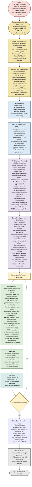

# Helix-AIRE Lifecycle

```mermaid
flowchart TD
    INTENT(["<b>Intent</b><br/>The <b>Intent Architect</b> creates a clear intent<br/>using the framework's <b>/intent-intake</b><br/>and <b>/intent-refinement</b> skills"])

    INTENT --> START(["Intent Architect starts <b>the Helix-AIRE<br/>framework</b> by typing:<br/>using <b>Helix AIRE</b> and <b>ATLAS</b><br/>implement epic X"])

    START --> INTAKE["- AIRE retrieves epic X through the <b>Helix MCP</b><br/>and records it in <b>epic-brief.md</b><br/>- For a brownfield system, current-system<br/>knowledge is gathered from <b>ATLAS</b> and<br/>recorded in <b>atlas-deep-dive.md</b>"]

    INTAKE --> CONTEXT["<b>Context and Clarification</b><br/>- AIRE requests any supporting documents,<br/>placed under <b>spec/context-project/</b><br/>(<b>existing-knowledge/</b>, <b>new-references/</b>)<br/>- When clarification is needed on the epic<br/>requirements, AIRE raises questions in<br/><b>requirement-verification-questions.md</b>"]

    CONTEXT --> REQUIREMENTS["<b>Requirements</b><br/>- AIRE produces <b>requirements.md</b><br/>- <b>Human reviewer approval required</b><br/>for requirements.md before proceeding"]

    REQUIREMENTS --> STORIES["<b>Stories and Personas</b><br/>- AIRE produces <b>stories.md</b> from the<br/>requirements, with acceptance criteria<br/>- AIRE produces <b>personas.md</b> for the people<br/>who will use or be affected by the solution<br/>- <b>Human reviewer approval required</b> on<br/>stories.md and personas.md"]

    STORIES --> DESIGN["<b>Architecture</b> (Architect)<br/>- AIRE decides which design stages this Epic<br/>needs, and only the selected stages run<br/>- AIRE produces <b>application-design.md</b>,<br/><b>functional-design.md</b>, <b>nfr.md</b>,<br/><b>infrastructure-design.md</b><br/>- <b>The Human reviewer approves</b> each<br/>design document<br/>- AIRE then produces <b>architecture.md</b><br/>- AIRE creates the Epic's end-to-end<br/>scenarios in <b>behavior.feature</b><br/>- AIRE generates <b>architecture-rubric.json</b><br/>and <b>security-rubric.json</b>, and builds the<br/><b>CI/CD evaluation pipeline</b>"]

    DESIGN --> SPECS["<b>Behaviour Specs and Test Plans</b><br/>(before any code)<br/>- For <b>every</b> story, AIRE writes the Gherkin<br/>contract <b>spec/behavior/story-N.M.feature</b><br/>from its acceptance criteria<br/>- For <b>every</b> story, AIRE writes the manual<br/>test plan in <b>spec/test-plans/</b><br/>- Every acceptance criterion must have at<br/>least one scenario and one test case<br/>- <b>The Human reviewer approves</b> the whole<br/>set in one pass<br/>- The Verification Engineer can review the<br/>test plans before a line of code exists"]

    SPECS --> HANDOFF["<b>Human gate before code generation</b>"]

    HANDOFF --> DELIVERY["<b>Story Delivery</b><br/>- Dev runs <b>dev-implement</b> and selects<br/>a story<br/>- Framework <b>reads</b> the already-approved<br/><b>spec/behavior/story-N.M.feature</b> and<br/><b>spec/test-plans/</b> - it never rewrites them<br/>- Then the code, the tests and the<br/><b>automated code review</b><br/>- Runs <b>unit tests</b>, <b>behavior tests</b>,<br/><b>API and contract tests</b>, regression and<br/>static evaluations<br/>- Runs Playwright tests (for UI stories,<br/>runs automatically)<br/>- AIRE scores the architecture and security<br/>against the rubric, and records the results<br/>in <b>eval.json</b> and <b>eval-summary.md</b><br/>- <b>Self-heals up to 3 times</b>"]

    DELIVERY --> STORY_PR["<b>Story PR</b><br/>- Automatic pull request raised with the<br/>code, <b>test plans</b>, Eval scorecard and<br/>tests evidence along with automatic PR review<br/>- CI runs evaluations"]

    STORY_PR --> PR_REVIEW["<b>Merging</b><br/>- The pull request is reviewed by the<br/><b>Dev</b> and the <b>Verification Engineer</b><br/>- <b>PR is merged manually</b>"]

    PR_REVIEW --> MORE{"All stories implemented?"}
    MORE -->|No| HANDOFF

    MORE -->|Yes| SIGNOFF["<b>Story Sign-off (ve-list-work)</b><br/>- The <b>Verification Engineer</b> runs each<br/>story's test plan against the merged code<br/>- If the <b>Verification Engineer</b> finds a<br/>bug, the story is rejected and they log the<br/>bug via <b>/raise-defect</b>"]

    SIGNOFF --> EPIC_PR["<b>Epic Release</b><br/>- Intent architect runs <b>/pr-generator</b><br/>- AIRE raises the final Epic pull request<br/>- AIRE creates a <b>release archive</b>"]

    EPIC_PR --> COMPLETE(["Epic PR is merged manually"])

    classDef intent fill:#FADCD9,stroke:#8A3C34,stroke-width:2px,color:#1F1F1F
    classDef source fill:#F4E7B2,stroke:#75620C,stroke-width:2px,color:#1F1F1F
    classDef planning fill:#DCEAF7,stroke:#315D7A,stroke-width:2px,color:#1F1F1F
    classDef design fill:#E8E0F0,stroke:#65527A,stroke-width:2px,color:#1F1F1F
    classDef delivery fill:#DDEEDB,stroke:#3F6B3A,stroke-width:2px,color:#1F1F1F
    classDef assurance fill:#D8ECEA,stroke:#356C68,stroke-width:2px,color:#1F1F1F
    classDef approval fill:#FFF3CD,stroke:#8A6D1D,stroke-width:2px,color:#1F1F1F
    classDef release fill:#E8E8E8,stroke:#4F4F4F,stroke-width:2px,color:#1F1F1F

    class INTENT intent
    class START,INTAKE,CONTEXT source
    class REQUIREMENTS,STORIES planning
    class DESIGN,SPECS design
    class HANDOFF approval
    class DELIVERY,STORY_PR delivery
    class PR_REVIEW assurance
    class MORE approval
    class EPIC_PR,COMPLETE release
```

