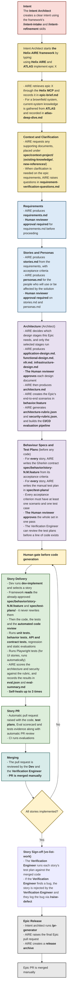

# Helix-AIRE Lifecycle

```mermaid
flowchart TD
    INTENT["<div style='text-align:left'><b>Intent</b><br/>The <b>Intent Architect</b> creates a clear intent using the framework's<br/><b>/intent-intake</b> and <b>/intent-refinement</b> skills</div>"]

    INTENT --> START["<div style='text-align:left'>Intent Architect starts <b>the Helix-AIRE framework</b> by typing:<br/>using <b>Helix AIRE</b> and <b>ATLAS</b> implement epic X</div>"]

    START --> INTAKE["<div style='text-align:left'>- AIRE retrieves epic X through the <b>Helix MCP</b> and records it in <b>epic-brief.md</b><br/>- For a brownfield system, current-system knowledge is gathered from <b>ATLAS</b> and recorded in <b>atlas-deep-dive.md</b></div>"]

    INTAKE --> CONTEXT["<div style='text-align:left'><b>Context and Clarification</b><br/>- AIRE requests any supporting documents, placed under <b>spec/context-project/</b> (<b>existing-knowledge/</b>, <b>new-references/</b>)<br/>- When clarification is needed on the epic requirements, AIRE raises questions in <b>requirement-verification-questions.md</b></div>"]

    CONTEXT --> REQUIREMENTS["<div style='text-align:left'><b>Requirements</b><br/>- AIRE produces <b>requirements.md</b><br/>- <b>Human reviewer approval required</b> for requirements.md before proceeding</div>"]

    REQUIREMENTS --> STORIES["<div style='text-align:left'><b>Stories and Personas</b><br/>- AIRE produces <b>stories.md</b> from the requirements, with acceptance criteria<br/>- AIRE produces <b>personas.md</b> for the people who will use or be affected by the solution<br/>- <b>Human reviewer approval required</b> on stories.md and personas.md</div>"]

    STORIES --> DESIGN["<div style='text-align:left'><b>Architecture</b> (Architect)<br/>- AIRE decides which design stages this Epic needs, and only the selected stages run<br/>- AIRE produces <b>application-design.md</b>, <b>functional-design.md</b>, <b>nfr.md</b>, <b>infrastructure-design.md</b><br/>- <b>The Human reviewer approves</b> each design document<br/>- AIRE then produces <b>architecture.md</b><br/>- AIRE creates the Epic's end-to-end scenarios in <b>behavior.feature</b><br/>- AIRE generates <b>architecture-rubric.json</b> and <b>security-rubric.json</b>, and builds the <b>CI/CD evaluation pipeline</b></div>"]

    DESIGN --> SPECS["<div style='text-align:left'><b>Behaviour Specs and Test Plans</b> (before any code)<br/>- For <b>every</b> story, AIRE writes the Gherkin contract <b>spec/behavior/story-N.M.feature</b> from its acceptance criteria<br/>- For <b>every</b> story, AIRE writes the manual test plan in <b>spec/test-plans/</b><br/>- Every acceptance criterion must have at least one scenario and one test case<br/>- <b>The Human reviewer approves</b> the whole set in one pass<br/>- The Verification Engineer can review the test plans before a line of code exists</div>"]

    SPECS --> HANDOFF["<div style='text-align:left'><b>Human gate before code generation</b></div>"]

    HANDOFF --> DELIVERY["<div style='text-align:left'><b>Story Delivery</b><br/>- Dev runs <b>dev-implement</b> and selects a story<br/>- Framework <b>reads</b> the already-approved <b>spec/behavior/story-N.M.feature</b> and <b>spec/test-plans/</b> - it never rewrites them<br/>- Then the code, the tests and the <b>automated code review</b><br/>- Runs <b>unit tests</b>, <b>behavior tests</b>, <b>API and contract tests</b>, regression and static evaluations<br/>- Runs Playwright tests (for UI stories, runs automatically)<br/>- AIRE scores the architecture and security against the rubric, and records the results in <b>eval.json</b> and <b>eval-summary.md</b><br/>- <b>Self-heals up to 3 times</b></div>"]

    DELIVERY --> STORY_PR["<div style='text-align:left'><b>Story PR</b><br/>- Automatic pull request raised with the code, <b>test plans</b>, Eval scorecard and tests evidence along with automatic PR review<br/>- CI runs evaluations</div>"]

    STORY_PR --> PR_REVIEW["<div style='text-align:left'><b>Merging</b><br/>- The pull request is reviewed by the <b>Dev</b> and the <b>Verification Engineer</b><br/>- <b>PR is merged manually</b></div>"]

    PR_REVIEW --> MORE{"All stories implemented?"}
    MORE -->|No| HANDOFF

    MORE -->|Yes| SIGNOFF["<div style='text-align:left'><b>Story Sign-off (ve-list-work)</b><br/>- The <b>Verification Engineer</b> runs each story's test plan against the merged code<br/>- If the <b>Verification Engineer</b> finds a bug, the story is rejected by the <b>Verification Engineer</b> and they log the bug via <b>/raise-defect</b></div>"]

    SIGNOFF --> EPIC_PR["<div style='text-align:left'><b>Epic Release</b><br/>- Intent architect runs <b>/pr-generator</b><br/>- AIRE raises the final Epic pull request<br/>- AIRE creates a <b>release archive</b></div>"]

    EPIC_PR --> COMPLETE["<div style='text-align:left'>Epic PR is merged manually</div>"]

    classDef intent fill:#FADCD9,stroke:#8A3C34,stroke-width:2px,color:#1F1F1F
    classDef source fill:#F4E7B2,stroke:#75620C,stroke-width:2px,color:#1F1F1F
    classDef planning fill:#DCEAF7,stroke:#315D7A,stroke-width:2px,color:#1F1F1F
    classDef design fill:#E8E0F0,stroke:#65527A,stroke-width:2px,color:#1F1F1F
    classDef delivery fill:#DDEEDB,stroke:#3F6B3A,stroke-width:2px,color:#1F1F1F
    classDef assurance fill:#D8ECEA,stroke:#356C68,stroke-width:2px,color:#1F1F1F
    classDef approval fill:#FFF3CD,stroke:#8A6D1D,stroke-width:2px,color:#1F1F1F
    classDef release fill:#E8E8E8,stroke:#4F4F4F,stroke-width:2px,color:#1F1F1F

    class INTENT intent
    class START,INTAKE,CONTEXT source
    class REQUIREMENTS,STORIES planning
    class DESIGN,SPECS design
    class HANDOFF approval
    class DELIVERY,STORY_PR delivery
    class PR_REVIEW assurance
    class MORE approval
    class EPIC_PR,COMPLETE release
```
