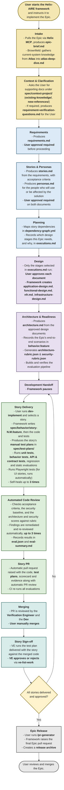

# Helix-AIRE Lifecycle

```mermaid
flowchart TD
    START(["<b>User starts the Helix-AIRE framework</b><br/>and instructs it to implement the Epic."])

    START --> INTAKE["<b>Intake</b><br/>- Pulls the Epic via <b>Helix MCP</b>, produces <b>epic-brief.md</b><br/>- Brownfield: gathers current-system knowledge from <b>Atlas</b> into <b>atlas-deep-dive.md</b>"]
    INTAKE --> CONTEXT["<b>Context &amp; Clarification</b><br/>- Asks the User for supporting docs under <b>spec/context-project/</b> (<b>existing-knowledge/</b>, <b>new-references/</b>)<br/>- If required, produces <b>requirement-verification-questions.md</b> for the User"]
    CONTEXT --> REQUIREMENTS["<b>Requirements</b><br/>- Produces <b>requirements.md</b><br/>- <b>User approval required</b> before proceeding"]
    REQUIREMENTS --> STORIES["<b>Stories &amp; Personas</b><br/>- Produces <b>stories.md</b> from the requirements, with acceptance criteria<br/>- Produces <b>personas.md</b> for the people who will use or be affected by the solution<br/>- <b>User approval required</b> on both documents"]
    STORIES --> PLAN["<b>Planning</b><br/>- Maps story dependencies in <b>dependency-graph.yml</b><br/>- Records which design stages this Epic needs, and why, in <b>executions.md</b>"]
    PLAN --> DESIGN["<b>Design</b><br/>- Only the stages selected in <b>executions.md</b> run; <b>User approves each document</b><br/>- <b>Framework creates application-design.md</b>, <b>functional-design.md</b>, <b>nfr.md</b>, <b>infrastructure-design.md</b>"]
    DESIGN --> ARCHITECTURE["<b>Architecture &amp; Readiness</b><br/>- Produces <b>architecture.md</b> from the approved design documents<br/>- Records the Epic's end-to-end scenarios in <b>behavior.feature</b><br/>- Generates <b>architecture-rubric.json</b> &amp; <b>security-rubric.json</b><br/>- Builds and verifies the evaluation pipeline"]
    ARCHITECTURE --> HANDOFF["<b>Development Handoff</b><br/>- <b>Framework pauses</b>"]

    HANDOFF --> DELIVERY["<b>Story Delivery</b><br/>- User runs <b>dev-implement</b> and selects a story. <br/>- Framework writes <b>spec/behavior/story-N.M.feature</b>, then the code and tests<br/>- Produces the story's <b>manual test plans</b> in <b>spec/test-plans/</b><br/>- Runs <b>unit tests</b>, <b>behavior tests</b>, <b>API &amp; contract tests</b>, regression and static evaluations<br/>- Runs Playwright tests (for UI stories, runs automatically)<br/>- Self-heals up to <b>3 times</b>"]
    DELIVERY --> REVIEW["<b>Automated Code Review</b><br/>- Checks acceptance criteria, the security baseline, and the architecture and security scores against rubric<br/>- Findings are remediated and re-reviewed automatically, <b>up to 3 times</b><br/>- Records results in <b>eval.json</b> and <b>eval-summary.md</b>"]
    REVIEW --> STORY_PR["<b>Story PR</b><br/>- Automatic pull request raised with the code, <b>test plans</b>, scorecard and evidence along with automatic PR review<br/>- CI re-runs all evaluations"]

    STORY_PR --> PR_REVIEW["<b>Merging</b><br/>- PR is reviewed by the <b>Verification Engineer</b> and the <b>Dev</b><br/>- <b>User manually merges</b>"]

    PR_REVIEW --> SIGNOFF["<b>Story Sign-off</b><br/>- VE runs the test plan delivered with the story against the merged code<br/>- <b>VE approves or rejects</b> via <b>ve-list-work</b>"]

    SIGNOFF --> MORE{"All stories delivered<br/>and approved?"}
    MORE -->|No| HANDOFF
    MORE -->|Yes| EPIC_PR["<b>Epic Release</b><br/>- User runs <b>/pr-generator</b><br/>- Framework raises the final Epic pull request<br/>- Creates a <b>release archive</b>"]
    EPIC_PR --> COMPLETE(["User reviews and merges the Epic."])

    classDef source fill:#F4E7B2,stroke:#75620C,stroke-width:2px,color:#1F1F1F
    classDef planning fill:#DCEAF7,stroke:#315D7A,stroke-width:2px,color:#1F1F1F
    classDef design fill:#E8E0F0,stroke:#65527A,stroke-width:2px,color:#1F1F1F
    classDef delivery fill:#DDEEDB,stroke:#3F6B3A,stroke-width:2px,color:#1F1F1F
    classDef assurance fill:#D8ECEA,stroke:#356C68,stroke-width:2px,color:#1F1F1F
    classDef approval fill:#FFF3CD,stroke:#8A6D1D,stroke-width:2px,color:#1F1F1F
    classDef release fill:#E8E8E8,stroke:#4F4F4F,stroke-width:2px,color:#1F1F1F

    class START,INTAKE,CONTEXT source
    class REQUIREMENTS,STORIES,PLAN planning
    class DESIGN,ARCHITECTURE,HANDOFF design
    class DELIVERY,REVIEW,STORY_PR delivery
    class PR_REVIEW,SIGNOFF assurance
    class MORE approval
    class EPIC_PR,COMPLETE release
```
