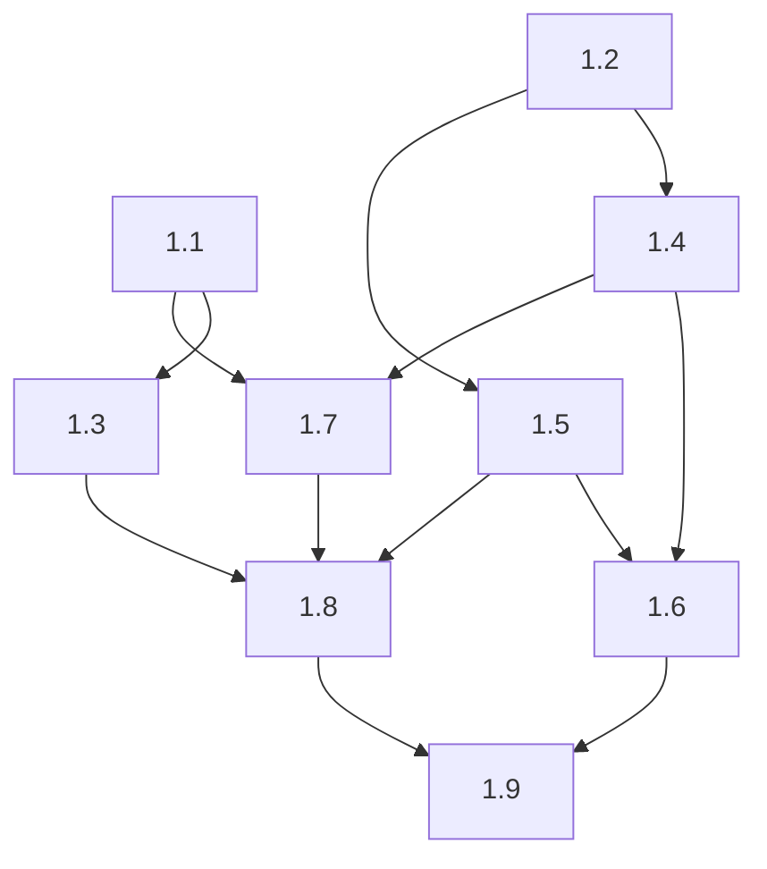

# aire State Tracking

## Project Information
- **Project Type**: Brownfield
- **Start Date**: 2026-09-25T10:44:06Z
- **Current Stage**: Design complete — awaiting dev-implement

## Tracker
- Type: LOCAL
- Parent Epic: 4702 (Atlas document "Epic: Self-Serve Premium Upgrade", solution 951)
- Epic URL: —
- Project Key / Repo / Org: —

## Workspace State
- **Existing Code**: Yes
- **Programming Languages**: Python (src/backend), JavaScript/JSX - React + Vite (src/frontend)
- **Build System**: pip (requirements.txt), npm (package.json)
- **Project Structure**: Monolith repo with backend + frontend
- **Workspace Root**: C:\Users\shailendra.yadav\Desktop\projects\helix-aire-v1-demo2
- **Reverse Engineering Artifacts**: spec/plans/atlas-deep-dive.md (pulled from Atlas)
- **Reverse Engineering Needed**: No - SKIPPED (Atlas deep dive reused)

## Code Location Rules
- **Application Code**: src/ (NEVER in spec/)
- **Documentation**: spec/ only
- **Structure patterns**: See code-generation.md Critical Rules

## Helix MCP Binding
- **Server**: helix
- **Docs tool(s)**: mcp__helix__list_solution_documents_tool, mcp__helix__get_solution_document_tool — list/fetch Atlas solution documents (Epic brief, deep dive)
- **Graph/Search tool(s)**: mcp__helix__codebase_agent_query, mcp__helix__codebase_cypher_query, mcp__helix__document_chatbot_query — targeted inline answers only
- **Estate / workspace id**: solution_id 951 "Billing-Cycle-Helix-Workshop" (repo Billing-Cycle, branch main, last_ingested_commit 69f67f308492a85648aa25a9ff7d8d574031344a)
- **Resolved**: 2026-09-25T11:03:30Z (rebound from 874 to 951)

## Existing-System Context
- **Workspace type**: brownfield
- **Helix MCP**: connected
- **Source**: atlas (deep dive doc 4699 v31; Epic doc 4702 v1 + linked story doc 4703 v1)
- **Components in scope**: src/backend/main.py, src/frontend/src/pages/Billing.jsx, src/frontend/src/App.css, src/frontend/src/context/AuthContext.jsx (whole deep dive pulled — single small repo)
- **Atlas deep dive doc**: spec/plans/atlas-deep-dive.md
- **Epic brief**: spec/plans/epic-brief.md
- **Recorded**: 2026-09-25T11:04:23Z

## Branching
- Base Branch: main
- Epic Branch: epic/4702-self-serve-premium-upgrade
- Epic PR: (not raised — raised manually at cycle end via pr-generator)

## Context Project
- **Existing Knowledge**: No
- **Existing Knowledge Path(s)**: —
- **New References**: Yes
- **New Reference Path(s)**: C:\Users\shailendra.yadav\Desktop\projects\helix-aire-v1-demo2\spec\context-project\new-references\StreamPlex Billing.html

## Design References
| # | Path / Location | Type | Governs | Read? | Read At Stage |
|---|-----------------|------|---------|-------|---------------|
| 1 | C:\Users\shailendra.yadav\Desktop\projects\helix-aire-v1-demo2\spec\context-project\new-references\StreamPlex Billing.html | UI prototype (bundled single-page React/x-dc export; decoded template + component logic read in full) | Billing page presentation: header, Upgrade CTA placement and label, upgrade modal layout/labels/buttons, post-upgrade confirmation panel, visual styling (Manrope, #0d9b74 palette, card layout). NOT plan data values or pricing/proration rules - those are governed by the Atlas Epic/Story (epic-brief.md) | Yes | Requirements Analysis |

### Reconciliations (decisions taken AGAINST a reference — later stages MUST honour these)
| Ref # | Point in the reference | Decision | Decided At Stage | Recorded |
|-------|------------------------|----------|------------------|----------|
| 1 | Hardcoded 38 days remaining and uncapped charge ($25.33) | Proration governed by Epic AC-3 (days from renew_at, 30-day cycle, charge capped at $20.00, floored at $0.00); prototype value is demo data | Requirements Analysis | 2026-09-25T11:16:50Z |
| 1 | Premium downloads shown as 4 devices (same variable as streams), video quality "4K + HDR" | Premium feature data governed by Epic/Story: 4K Ultra HD, 4 streams, 6 downloads | Requirements Analysis | 2026-09-25T11:16:50Z |
| 1 | Plan perks card shows only 2 perks after upgrade | Premium perks per Epic/Story include Dolby Vision (3 perks) | Requirements Analysis | 2026-09-25T11:16:50Z |
| 1 | Configurable `premiumPrice` prop (20-100) | EXCLUDED - Premium price fixed at $40 per Epic; no configurable pricing | Requirements Analysis | 2026-09-25T11:16:50Z |

## Extension Configuration
| Extension | Enabled | Decided At |
|---|---|---|
| Security Baseline | Yes | Workflow start (mandatory) |
| Playwright Test Automation | Yes | Workflow start (mandatory) |
| Resiliency Baseline | No | Requirements Analysis |
| Property-Based Testing | No | Requirements Analysis |

## Story Settings
- team_size: 2 (fixed framework default - not asked)
- story_creation_mode: all-at-once (fixed framework default)
- target_story_count: 9 (recommended, accepted via chat 'ok'; Story 1.1 must be purely frontend and visible)

## Story Tracker
| Story | Title | Requires | Tracker ID | Status | PR | Merged | Start | End | Recorded |
|-------|-------|----------|------------|--------|----|--------|-------|-----|----------|
| 1.1   | Premium upgrade dialog on the Billing page | none | LOCAL | Ready for Development | — | — | | | 2026-09-25 11:55 |
| 1.2   | Prorated charge calculation | none | LOCAL | Ready for Development | — | — | | | 2026-09-25 11:55 |
| 1.3   | Billing page reflects the current plan | 1.1 | LOCAL | Ready for Development | — | — | | | 2026-09-25 11:55 |
| 1.4   | Upgrade preview endpoint | 1.2 | LOCAL | Ready for Development | — | — | | | 2026-09-25 11:55 |
| 1.5   | Upgrade endpoint switches the user to Premium | 1.2 | LOCAL | Ready for Development | — | — | | | 2026-09-25 11:55 |
| 1.6   | Upgrade requests rejected for ineligible users | 1.4, 1.5 | LOCAL | Ready for Development | — | — | | | 2026-09-25 11:55 |
| 1.7   | Dialog shows the server-computed prorated charge | 1.1, 1.4 | LOCAL | Ready for Development | — | — | | | 2026-09-25 11:55 |
| 1.8   | Confirm the upgrade from the dialog | 1.3, 1.5, 1.7 | LOCAL | Ready for Development | — | — | | | 2026-09-25 11:55 |
| 1.9   | Upgrade failures shown in the dialog | 1.6, 1.8 | LOCAL | Ready for Development | — | — | | | 2026-09-25 11:55 |

## Dependency Graph
- **team_size**: 2 · **Stories**: 9 · **Immediately startable**: 1.1, 1.2
- **Source**: spec/plans/dependency-graph.yml (generated 2026-09-25T12:04:55Z, auto-approved)

**Waves** (a story becomes ready when all its prerequisites are Done):
- Wave 1 (ready now): 1.1 (frontend), 1.2 (backend)
- Wave 2: 1.3 (after 1.1), 1.4 and 1.5 (after 1.2)
- Wave 3: 1.6 (after 1.4, 1.5), 1.7 (after 1.1, 1.4)
- Wave 4: 1.8 (after 1.3, 1.5, 1.7)
- Wave 5: 1.9 (after 1.6, 1.8)

**Inferred edges and justification**:
- 1.3 requires 1.1 — R1 seed - 1.1 creates the Vitest/React Testing Library setup (package.json, vitest config) and the reworked Billing.jsx title row that 1.3's tests and edits build on
- 1.4 requires 1.2 — R2 - the preview endpoint calls the 1.2 proration function and uses the pytest/pytest-bdd setup 1.2 seeds
- 1.5 requires 1.2 — R2 - the upgrade endpoint recomputes the charge with the 1.2 proration function
- 1.6 requires 1.4 — R2 - the 400/401 rejections are branches inside the preview endpoint, which must exist
- 1.6 requires 1.5 — R2 - the 400/401 rejections are branches inside the upgrade endpoint, which must exist
- 1.7 requires 1.1 — R2 - adds the charge rows and Confirm button to the dialog 1.1 creates
- 1.7 requires 1.4 — R2 - calls GET /api/billing/upgrade-preview at runtime (no R3 drop: its Playwright check runs against the real backend)
- 1.8 requires 1.3 — R2 - AC-2 relies on the plan-driven badge/heading from 1.3 to show Premium after the upgrade
- 1.8 requires 1.5 — R2 - sends POST /api/billing/upgrade; owns the real end-to-end journey
- 1.8 requires 1.7 — R2 - wires the Confirm & pay button that 1.7 renders
- 1.9 requires 1.6 — R2 - AC-1 shows the backend's real 400 'Already on Premium plan' detail
- 1.9 requires 1.8 — R2 - handles failures of the confirm request that 1.8 sends

## CI/CD Configuration
- Enabled: No
- Source: user opt-out
- Recorded: 2026-09-25T12:07:21Z

## Execution Plan Summary
- **Plan**: spec/plans/executions.md (auto-approved 2026-09-25T12:06:39Z)
- **Stages to Execute**: Behaviour Specs & Test Plans (STOP CHECKPOINT), Code Generation (per story via dev-implement)
- **Stages to Skip**: Application Design, Functional Design, NFR Requirements, NFR Design, Infrastructure Design (all covered by requirements.md / design reference; no infra change)

## Behaviour Specs & Test Plans
- **Work units covered**: 9
- **Behaviour contracts**: spec/behavior/ — 9 file(s), 31 scenarios (+ spec/behavior.feature, 3 cross-story journeys)
- **Manual test plans**: spec/test-plans/ — 9 folder(s), 105 test cases
- **AC coverage**: 31/31 (scenarios) · 31/31 (test cases)
- **Approved**: 2026-09-25T12:24:42Z

## Stage Progress
- [x] Workspace Detection
- [x] Reverse Engineering - SKIPPED (Atlas deep dive found and reused)
- [x] Requirements Analysis (approved 2026-09-25T11:48:32Z)
- [x] User Stories (GATE 1 approved 2026-09-25T12:04:21Z; LOCAL - not pushed)
- [x] Dependency Graph (auto-generated 2026-09-25T12:04:55Z)
- [x] Workflow Planning (auto-approved 2026-09-25T12:06:39Z)
- [x] Application Design - SKIP
- [x] Functional Design - SKIP
- [x] NFR Requirements - SKIP
- [x] NFR Design - SKIP
- [x] Infrastructure Design - SKIP
- [x] STOP CHECKPOINT (2026-09-25T12:24:42Z)
- [x] Behaviour Specs & Test Plans (approved 2026-09-25T12:24:42Z)
- [ ] Code Generation - EXECUTE (per story via dev-implement)
