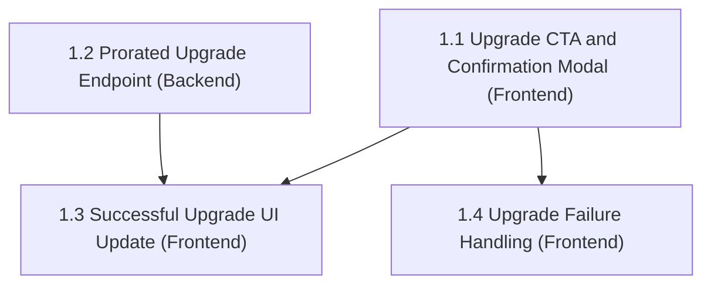

# aire State Tracking

## Project Information
- **Project Type**: Brownfield
- **Start Date**: 2026-09-23T10:08:03Z
- **Current Stage**: PLANNING - Workspace Detection

## Workspace State
- **Existing Code**: Yes
- **Programming Languages**: Python (backend), JavaScript/JSX (frontend, Vite/React)
- **Build System**: pip (requirements.txt, backend) / npm (package.json, frontend)
- **Project Structure**: Monolith-style POC — `src/backend` (FastAPI) + `src/frontend` (React/Vite)
- **Workspace Root**: C:\Users\shailendra.yadav\Desktop\projects\helix-aire-v1-demo2\billing-cycle-copy3
- **Reverse Engineering Needed**: No — sourced from Atlas (see Existing-System Context below)
- **Reverse Engineering Artifacts**: spec/plans/atlas-deep-dive.md (pulled from Atlas, not locally generated)

## Helix MCP Binding
- **Server**: helix
- **Docs tool(s)**: list_solution_documents_tool, get_solution_document_tool — list/fetch Atlas solution documents (Epic, Deep Dive, Story)
- **Graph/Search tool(s)**: codebase_agent_query, codebase_cypher_query, graph_change_impact, document_chatbot_query, platform_docs_query
- **Estate / workspace id**: solution_id 951 ("Billing-Cycle-Helix-Workshop"), repo Billing-Cycle (https://github.com/Shailendrayadav0666/Billing-Cycle, branch main, last ingested commit 69f67f308492a85648aa25a9ff7d8d574031344a)
- **Resolved**: 2026-09-23T10:09:41Z

## Existing-System Context
- **Workspace type**: brownfield
- **Helix MCP**: connected
- **Source**: atlas
- **Components in scope**: entire estate (single deep dive document covering the whole system)
- **Atlas deep dive doc**: spec/plans/atlas-deep-dive.md
- **Epic brief doc**: spec/plans/epic-brief.md (Atlas document_id 4702, artifact_type: epic)
- **Recorded**: 2026-09-23T10:09:41Z

## Tracker
- Type: LOCAL
- Parent Epic: EPIC-LOCAL-1 — Self-Serve Premium Upgrade (sourced from Atlas via Helix MCP, document_id 4702 — Section 5.4 combined gate: both Epic and Deep Dive found, no gate triggered)
- Epic URL: — (LOCAL tracker; content sourced from Atlas, not a tracker fetch)
- Project Key / Repo / Org: —

## Branching
- Base Branch: main
- Epic Branch: epic/EPIC-LOCAL-1-self-serve-premium-upgrade
- Epic PR: (not raised — raised manually at cycle end via pr-generator)

## Context Project
- **Existing Knowledge**: No
- **Existing Knowledge Path(s)**: —
- **New References**: Yes
- **New Reference Path(s)**: spec/context-project/new-references/StreamPlex Billing.html

## Design References
| # | Path / Location | Type | Governs | Read? | Read At Stage |
|---|-----------------|------|---------|-------|---------------|
| 1 | spec/context-project/new-references/StreamPlex Billing.html | UI prototype (single self-extracting HTML bundle, Billing page — rendered live via local static server + Playwright, source is minified/bundled JS so DOM inspection was required, not static file read) | Self-Serve Premium Upgrade epic — Billing page, Upgrade CTA, confirmation modal, post-upgrade state | ✅ | Workspace Detection |

### Extracted from Design Reference #1 (StreamPlex Billing.html) — rendered and interacted with via Playwright
- **Standard-plan state**: Header "StreamPlex" / nav "Billing" + user avatar "TPG" + "Logout". Page heading "Plan & Billing", subheading "Manage your plan and payments". Primary CTA top-right: green button **"Upgrade to Premium"**.
- **Current plan card**: "Current plan:" pill badge "Standard" (light-green pill, dark-green text). Plan description paragraph. Two side-by-side cards: (1) "MONTHLY PLAN" label + "Active" pill + "$20/month" large text; (2) "Renew at" label + "Oct 30, 2026" large text.
- **"What's included with Standard" section**: heading + subheading "Your plan's streaming features", 3 icon-cards in a row (▶ Video quality "Full HD (1080p)", ▢ Watch at the same time "Can watch on 2 devices at once", ↓ Download on devices "Can download on 2 devices").
- **"Plan perks" section**: heading, then usage-bar rows for "Ad-free streaming" and "Spatial audio (select titles)", each showing "100% used" with a full green progress bar (these are flat perks already at 100%, not metered/limited — bar is decorative/always-full for included boolean perks).
- **Upgrade confirmation modal** (opens on "Upgrade to Premium" click, dims background): title "Upgrade to Premium"; body copy "Premium is $40/month. You'll be charged a prorated amount for the rest of this cycle."; a bordered info box with two rows — "Remaining days" → "38 days", "Charge today" → "$25.33" (bold); a bullet list of exactly **3** new capabilities gained ("Stream on 4 devices at once", "Download on 4 devices", "4K + HDR video quality") — **note: this is a 3-item delta list, NOT the Epic's full 6-row comparison table, and it does not mention "Dolby Vision" at all**; two buttons — primary green **"Confirm & pay $25.33"** (amount is dynamically interpolated into the button label itself, not just shown above it) and secondary outline **"Cancel"**.
- **Post-confirmation state** (immediate, no page reload — confirms Epic Goal #3): "Current plan:" pill now reads "Premium"; plan card now shows "$40/month"; a new green success banner appears: heading "Upgraded to Premium", body "Charged $25.33 for the remaining 38 days of this billing cycle. From Oct 30, 2026 you will be billed $40/month." (renew date unchanged, matching the Epic's proration rule); "What's included" section re-labels to "with Premium" and the 3 icon-cards update in place (4K + HDR / 4 devices / 4 devices); the "Upgrade to Premium" CTA disappears entirely once on Premium (no downgrade path exposed, matching Epic's Out-of-Scope).
- **Discrepancy noted (DR-6, non-blocking, reported not asked)**: the Epic's plan-comparison table lists **Dolby Vision** as a Premium-exclusive row, but the rendered prototype never surfaces Dolby Vision anywhere (not in the icon-cards, not in the modal's 3-item delta list, not in "Plan perks"). Treated as **the artifact (Epic) and reference both being silent on how Dolby Vision surfaces in UI** — proceeding with the prototype's exact 3-item modal list and 3-card layout as the UI contract; Dolby Vision remains a backend/plan-data attribute per the Epic but is not required to render as its own UI element unless Requirements Analysis decides otherwise. To be carried into Requirements Analysis for an explicit decision (recorded there as a reconciliation, not re-asked here).
- **Console**: 1 console error observed on load (pre-existing in the static prototype export, unrelated to app code under `src/`) — not investigated further, noted only.

## Story Tracker
| Story | Title | Requires | Tracker ID | Status | PR | Merged | Start | End | Recorded |
|-------|---------|----------|------------|----------------|------------|--------|------------|------------|--------------------|
| 1.1 | Upgrade CTA & Confirmation Modal (Frontend) | none | LOCAL | 🔵 In Development | — | — | 2026-09-23 | | 2026-09-23T12:42:54Z |
| 1.2 | Prorated Upgrade Endpoint (Backend) | none | LOCAL | 🟢 Ready for Development | — | — | | | 2026-09-23T10:37:00Z |
| 1.3 | Successful Upgrade — Immediate Plan Update (Frontend) | 1.1, 1.2 | LOCAL | 🟢 Ready for Development | — | — | | | 2026-09-23T10:37:00Z |
| 1.4 | Upgrade Failure Handling (Frontend) | 1.1 | LOCAL | 🟢 Ready for Development | — | — | | | 2026-09-23T10:37:00Z |

- **team_size**: 2 (fixed default, never asked)
- **story_creation_mode**: all-at-once (fixed default, never asked)
- **target_story_count**: 4 (user-confirmed, with Story 1.1 reordered to frontend-only scope per user steering)

## Dependency Graph

**Ready now (no prerequisites)**: 1.1, 1.2 — 2 independently startable stories, matching `team_size: 2`.
**Blocked**: 1.3 (needs 1.1 + 1.2 done), 1.4 (needs 1.1 done).

**Inferred edges and justification**:
- `1.3 requires 1.1` — needs the real confirmation modal to exist to attach success-state behavior to (R2).
- `1.3 requires 1.2` — AC-2 asserts the exact values shown come from the real backend response, not a guessed shape (R2).
- `1.4 requires 1.1` — needs the real modal to exist to attach failure-state behavior to (R2).
- `1.4` does **not** require 1.2 — a failed request (network error or any non-2xx) can be simulated/mocked without depending on the backend's specific validation logic (R3 Mock rule), so 1.4 stays parallel-startable with 1.2.
- `1.1` and `1.2` have no prerequisites — fully independent architectural layers (frontend UI vs. backend endpoint), satisfying R5 (≥ team_size stories available at once).

## Extension Configuration
| Extension | Enabled | Decided At |
|---|---|---|
| Security Baseline | Yes (always mandatory) | Workflow Start |
| Playwright Test Automation | Yes (always mandatory) | Workflow Start |
| Resiliency Baseline | No | Requirements Analysis |
| Property-Based Testing | No | Requirements Analysis |

## Code Location Rules
- **Application Code**: src/ (already the existing convention — src/backend, src/frontend)
- **Documentation**: spec/ only
- **Structure patterns**: See code-generation.md Critical Rules

## Stage Progress
### 🔵 PLANNING PHASE
- [x] Workspace Detection
- [x] Reverse Engineering (skipped — sourced from Atlas)
- [x] Requirements Analysis — approved, committed (76e57b6), pushed
- [x] User Stories — GATE 1 approved, LOCAL (no push)
- [x] Dependency Graph — 2/4 stories immediately startable
- [x] Workflow Planning — Application Design SKIP (no new component/service)
- [x] Application Design — SKIP (decided in Workflow Planning)

### 🟢 IMPLEMENTATION PHASE
- [x] Functional Design — SKIP (proration rule fully specified already)
- [x] NFR Requirements — SKIP (no new stack/NFR beyond requirements.md)
- [x] NFR Design — SKIP (NFR Requirements skipped)
- [x] Infrastructure Design — SKIP (no infra/deployment change)
- [x] architecture.md + rubric (STOP CHECKPOINT) — v1.0.0, 5 verifiable constraints
- [x] Behaviour Specs & Test Plans (STOP CHECKPOINT) — Approved
- [x] MANDATORY STOP — Design complete — awaiting `dev-implement`

### Story 1.1 — Code Generation
- [x] Story Selection + Doability Gate (no prerequisites)
- [x] Story Branch: `story/1.1-upgrade-cta-confirmation-modal` (from epic branch)
- [x] Baseline regression + static eval (Step 1.5)
- [x] Code Generation Part 1 (plan) + Part 2 (implementation)
- [x] Unit Test & Coverage Gate — 20/20 passing, 100% line / 96.66% branch
- [x] Behavioural Gherkin Gate — B1 5/5 PASS, B2/B3 N/A (first work unit)
- [x] API & Contract Testing Gate — N/A (no API layer in this story)
- [x] Test Placement Verification — 0 violations
- [x] Full Regression Gate — 0 new failures
- [x] Static Eval D1–D7 — 0 new findings
- [x] Playwright UI Automation Gate (SH-LOOP-11) — 6/6 scenarios PASS after Healer (1/3 attempts)
- [ ] Automated Code Review + J1/J2 judge gates
- [ ] Commit, push, PR, PR review

## Behaviour Specs & Test Plans
- **Work units covered**: 4 (Story 1.1, 1.2, 1.3, 1.4)
- **Behaviour contracts**: spec/behavior/ — 4 files, 18 scenarios (one per AC, 2 as Scenario Outlines) — plus spec/behavior.feature (3 cross-story scenarios)
- **Manual test plans**: spec/test-plans/ — 4 folders, 37 test cases
- **AC coverage**: 18/18 (scenarios) · 18/18 (test cases)
- **Approved**: 2026-09-23T10:53:31Z

## Current Status
- **Lifecycle Phase**: IMPLEMENTATION
- **Current Stage**: Design complete — awaiting dev-implement
- **Next Stage**: Code Generation (per story, via `dev-implement`)
- **Status**: Ready to proceed

## CI/CD Configuration
- Enabled: No
- Source: user opt-out
- Decided At: STOP CHECKPOINT (2026-09-23T10:40:13Z)

### 🧪 ve TRACK (parallel, ve-initiated — not scheduled here)
- Test Plan per story — `/ve-implement`
- ve Sign-off — `ve-list-work`
