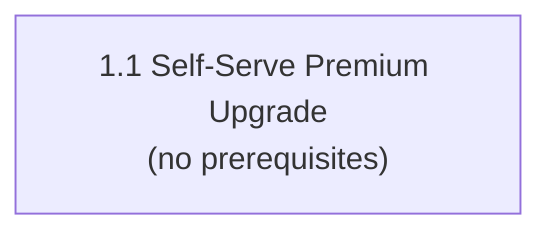

# aire State Tracking

## Project Information
- **Project Type**: Brownfield
- **Start Date**: 2026-09-22T10:35:04Z
- **Current Stage**: PLANNING - Dependency Graph

## Workspace State
- **Existing Code**: Yes
- **Programming Languages**: Python (backend), JavaScript/JSX (frontend, Vite/React)
- **Build System**: pip (requirements.txt) / npm (package.json, Vite)
- **Project Structure**: Monolith (backend + frontend), POC / in-memory store, no database
- **Workspace Root**: C:\Users\shailendra.yadav\Desktop\projects\helix-aire-v1-demo2\billing-cycle-copy3
- **Reverse Engineering Needed**: No — Atlas deep dive pulled via Helix MCP (see Existing-System Context below)
- **Reverse Engineering Artifacts**: spec/plans/atlas-deep-dive.md (sourced from Atlas, not locally generated)

## Code Location Rules
- **Application Code**: src/ (already correctly located at repo root — no Code Root override needed)
- **Documentation**: spec/ only
- **Structure patterns**: See code-generation.md Critical Rules

## Tracker
- Type: LOCAL
- Parent Epic: Self-Serve Premium Upgrade (Atlas/Helix solution document id 4702)
- Epic URL: — (LOCAL tracker; sourced from Helix MCP, not an external tracker link)
- Project Key / Repo / Org: —

## Helix MCP Binding
- **Server**: helix (mcp__helix__*)
- **Docs tool(s)**: mcp__helix__list_solution_documents_tool, mcp__helix__get_solution_document_tool — list/fetch solution documents (Epic, deep dive, stories) from Atlas
- **Graph/Search tool(s)**: mcp__helix__codebase_agent_query, mcp__helix__codebase_cypher_query, mcp__helix__document_chatbot_query — targeted codebase/doc queries
- **Estate / workspace id**: Billing-Cycle-Helix-Workshop (solution_id 951), repository Billing-Cycle (https://github.com/Shailendrayadav0666/Billing-Cycle, branch main, last ingested commit 69f67f308492a85648aa25a9ff7d8d574031344a)
- **Resolved**: 2026-09-22T10:35:04Z

## Existing-System Context
- **Workspace type**: brownfield
- **Helix MCP**: connected
- **Source**: atlas
- **Components in scope**: whole estate — the pulled deep dive is a single exhaustive (13/13 steps) document covering the entire Billing-Cycle repo (backend + frontend)
- **Atlas deep dive doc**: spec/plans/atlas-deep-dive.md
- **Recorded**: 2026-09-22T10:35:04Z

**Section 5.4 combined presence gate**: Epic brief present (doc 4702, artifact_type: epic) AND deep dive present (doc 4699, artifact_type: analysis, titled "Deep Dive Analysis: Billing-Cycle", 31 versions, 13/13 analysis steps complete) → no gate triggered; both pulled verbatim into spec/plans/.

**Note for User Stories stage**: Atlas also holds a pre-existing story document (id 4703, "Story: Mid-Cycle Upgrade Flow (Standard → Premium)", parent_registry_id 4702) linked to this Epic. To be reviewed/reused when the User Stories stage runs rather than regenerated from scratch.

## Branching
- Base Branch: main
- Epic Branch: epic/self-serve-premium-upgrade (pushed to origin, commit d3601a8912bf40391a2ca61383b07ba9d9359644)
- Epic PR: (not raised — raised manually at cycle end via pr-generator)

## Context Project
- **Existing Knowledge**: No
- **Existing Knowledge Path(s)**: —
- **New References**: Yes (updated 2026-09-22T10:58:53Z — user added a file after the initial No answer)
- **New Reference Path(s)**: spec/context-project/new-references/StreamPlex Billing.html

## Design References
| # | Path / Location | Type | Governs | Read? | Read At Stage |
|---|-----------------|------|---------|-------|---------------|
| 1 | spec/context-project/new-references/StreamPlex Billing.html | UI prototype (self-contained bundled HTML export; a `<script type="__bundler/template">` payload JSON-decodes to the real markup — decoded via a scratch python/jq step, not by opening the raw file, since the raw bytes are base64/gzip asset blobs) | Billing page Upgrade CTA, post-upgrade success banner, confirmation modal | ✅ | Requirements Analysis |

### Reconciliations (decisions taken AGAINST a reference — later stages MUST honour these)
| Ref # | Point in the reference | Decision | Decided At Stage | Recorded |
|-------|------------------------|----------|------------------|----------|
| 1 | Mockup's demo logic collapses Premium video quality to generic `"4K + HDR"`, reuses one `devices` value (4) for BOTH "watch at the same time" and "download on devices", and shows no separate Dolby Vision perk row | EXCLUDED — the Epic (`spec/plans/epic-brief.md`, the mockup's own product source) already gives a detailed, deliberate feature table: video quality = "4K Ultra HD", simultaneous streams = 4 devices, downloads = 6 devices (not 4), plus a distinct Dolby Vision perk. `requirements.md` REQ-F-08 already recorded this table before the mockup was supplied. The mockup's collapsed values read as prototype-demo shortcuts (it also hardcodes an arbitrary `days=38`, `current=$20` in its click-handler logic), not a considered product decision to change the numbers. Keeping the Epic's numbers; adopting the mockup's LAYOUT/structure only for this point. | Requirements Analysis | 2026-09-22T10:58:53Z |
| 1 | Mockup's button/badge palette (`#0d9b74` / `#0a7a5b` / `#c8f2df` / `#0a6a4f`) | EXCLUDED — REQ-NF-06 already commits to the existing `src/frontend/src/App.css` design language, which uses a different teal (`#0d9488` / `#0f766e` / `#2dd4bf` family); those hex values do not appear anywhere in the current codebase. Using the app's existing teal tokens instead of introducing the mockup's slightly different green, to avoid a second competing accent color in the same UI. Layout/spacing/border-radius/typography from the mockup are still adopted. | Requirements Analysis | 2026-09-22T10:58:53Z |

## User Stories Configuration
- **team_size**: 2 (fixed default, not asked)
- **story_creation_mode**: all-at-once (fixed default, not asked)
- **target_story_count**: 1 — USER OVERRIDE, confirmed after warning (see runtime-artifacts/audit.md "User Stories — Ambiguous Answer" and "User Stories — Single-Story Override Confirmed"). Deliberately breaks the team_size=2 parallelism rule (only one story exists, so no parallel work is possible) and exceeds the Step 1.5 hard sizing ceilings (>5 ACs, multiple newly-touched architectural layers in one story). This is a knowing, confirmed exception, not an unnoticed violation.

## Extension Configuration
| Extension | Enabled | Decided At |
|---|---|---|
| Security Baseline | Yes (always mandatory) | Workflow Start |
| Playwright Test Automation | Yes (always mandatory) | Workflow Start |
| Resiliency Baseline | No | Requirements Analysis |
| Property-Based Testing | No | Requirements Analysis |

## Story Tracker
| Story ID | Title | Requires | Tracker ID | Status | PR | Merged | Start | End | Recorded |
|---|---|---|---|---|---|---|---|---|---|
| 1.1 | Self-Serve Premium Upgrade — End-to-End Mid-Cycle Upgrade Flow | none | LOCAL | 🟢 Ready for Development | — | — | — | — | 2026-09-22T11:52:29Z |

## Dependency Graph

- **Total stories**: 1 | **Immediately startable (no prerequisites)**: 1
- **team_size**: 2 (target: ≥2 independent stories available at a time) — **NOT met**: only 1 story exists in this cycle (confirmed single-story override at User Stories GATE 1), so no parallel development is possible this cycle. This is a direct, disclosed consequence of that override, not a Dependency Graph inference failure.
- **Inferred edges**: none — Story 1.1 has no prerequisites (it is the only story; R1/R2/R3/R4 have nothing to apply against).
- **Shared files**: none tracked (single story, no cross-story file contention possible).

## Stage Progress
- [x] Workspace Detection — Session identity captured (silent), base branch synced (main, up to date with origin), Tracker Selection (LOCAL), Parent Epic + Deep Dive fetched via Helix MCP
- [x] Epic Branch Creation — epic/self-serve-premium-upgrade cut from main
- [x] Context Project Folder + Context Opt-In — folders created, both answered No
- [x] Reverse Engineering — SKIPPED (Atlas deep dive found and pulled; see common/helix-atlas-integration.md Section 6)
- [x] Requirements Analysis — spec/plans/requirements.md generated, 15 REQ-F + 6 REQ-NF (revised after design reference grounding), awaiting approval
- [ ] User Stories
- [ ] Dependency Graph
- [ ] Workflow Planning
- [ ] Application Design
