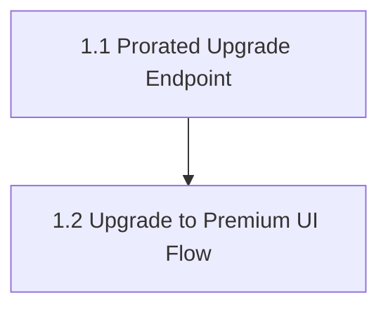

# aire State Tracking

## Project Information
- **Project Type**: Brownfield
- **Start Date**: 2026-09-16T09:59:43Z
- **Current Stage**: PLANNING - Workspace Detection

## Workspace State
- **Existing Code**: Yes
- **Programming Languages**: Python (backend), JavaScript/React (frontend, Vite)
- **Build System**: pip (backend), npm/Vite (frontend)
- **Project Structure**: Monolith (frontend + backend), two packages
- **Workspace Root**: C:\Users\shailendra.yadav\Desktop\projects\helix-aire-v1-demo2\billing-cycle-copy3
- **Reverse Engineering Needed**: Yes (no usable RE artifacts found locally or on Atlas yet)

## Code Location Rules
- **Application Code**: src/ (NEVER in spec/)
- **Documentation**: spec/ only
- **Structure patterns**: See code-generation.md Critical Rules

## Tracker
- Type: LOCAL
- Parent Epic: Self-Serve Premium Upgrade (source: Atlas solution document 4039)
- Epic URL: —
- Project Key / Repo / Org: —

## Branching
- Base Branch: main
- Epic Branch: epic/EPIC-LOCAL-1-self-serve-premium-upgrade
- Epic PR: (not raised — raised manually at cycle end via pr-generator)

## Helix MCP Binding
- **Server**: helix
- **Docs tool(s)**: mcp__helix__get_solution_document_tool, mcp__helix__list_solution_documents_tool — fetch/list solution documents (epics, deep dives, PRDs) stored in the Helix backend for this solution
- **Graph/Search tool(s)**: mcp__helix__codebase_agent_query, mcp__helix__codebase_cypher_query, mcp__helix__graph_change_impact, mcp__helix__document_chatbot_query — targeted codebase/doc queries
- **Estate / workspace id**: solution_id 951 ("Billing-Cycle-Helix-Workshop"), repository "Billing-Cycle" (https://github.com/Shailendrayadav0666/Billing-Cycle), branch main, last_ingested_commit bcec649e08f2dbec435c24066deae6a1d6d71192
- **Resolved**: 2026-09-16T10:01:18Z

## Existing-System Context
- **Workspace type**: brownfield
- **Helix MCP**: connected
- **Source**: atlas
- **Components in scope**: Whole estate — Billing-Cycle backend (FastAPI, main.py) + frontend (React 19 + Vite: App.jsx, AuthContext.jsx, Login.jsx, Billing.jsx, Tasks.jsx). Single small monorepo, 819 LOC — pulled in full, not incrementally scoped.
- **Atlas deep dive doc**: spec/plans/atlas-deep-dive.md (pulled from Atlas document_id 4037, steps_completed 13 of 13, Status: COMPLETE)
- **Recorded**: 2026-09-16T10:29:53Z

## Notes
- Supporting PRD also on Atlas: document_id 3551, "PRD: Upgrade to Premium — Mid-Cycle Subscription Upgrade.md" (not yet pulled — available if Requirements Analysis needs it).
- Reverse Engineering stage is SKIPPED per `common/helix-atlas-integration.md` Section 6 — the Atlas deep dive doc is the reverse-engineering artifact.

## Context Project
- **Existing Knowledge**: No
- **Existing Knowledge Path(s)**: —
- **New References**: No
- **New Reference Path(s)**: —

## Extension Configuration
| Extension | Enabled | Decided At |
|---|---|---|
| Security Baseline | Yes | Workflow Start (always mandatory) |
| Playwright Test Automation | Yes | Workflow Start (always mandatory) |
| Resiliency Baseline | No | Requirements Analysis |
| Property-Based Testing | No | Requirements Analysis |

## Story Tracker

| Story | Title | Requires | Tracker ID | Status | PR | Merged | Start | End | Recorded |
|-------|-------|----------|------------|--------|-----|--------|-------|-----|----------|
| 1.1 | Prorated Upgrade Endpoint | none | LOCAL | 🟢 Ready for Development | — | — | | | 2026-09-16 10:51 |
| 1.2 | Upgrade to Premium UI Flow | 1.1 | LOCAL | 🟢 Ready for Development | — | — | | | 2026-09-16 10:51 |

## User Stories
- **team_size**: 2 (fixed default, never asked)
- **story_creation_mode**: all-at-once (fixed default, never asked)
- **target_story_count**: 2 (recommended 2; user initially overrode to 1, then explicitly confirmed generating 1 first with the understanding Step 18.6 would immediately re-split it to 2 — see runtime-artifacts/audit.md)

## Dependency Graph

- **Total stories**: 2 | **Immediately startable (no prerequisites)**: 1 (Story 1.1)
- **team_size**: 2 (target: >= 2 independent stories available at a time)
- **Inferred edges**:
  - 1.2 requires 1.1 — R2 Contract rule: Story 1.2's own tests call the real `POST /api/billing/upgrade` endpoint at runtime; no separate integration story exists to justify dropping the edge under R3.
- **Shared files**: none — 1.1 touches only `src/backend/main.py`; 1.2 touches only `src/frontend/src/pages/Billing.jsx` and `src/frontend/src/App.css`. No merge-conflict risk between the two stories.
- Only 1 of 2 stories is immediately startable given the genuine runtime dependency (R5 parallelism target not fully met, but R4 forbids adding narrative-only edges to force it) — once Story 1.1's PR merges into the epic branch, Story 1.2 becomes startable.

## Stage Progress
- Workspace Detection: COMPLETE.
- Requirements Analysis: COMPLETE — requirements.md approved 2026-09-16T10:38:26Z, epic branch committed (9e77bd0) and pushed.
- User Stories: COMPLETE — GATE 1 approved 2026-09-16T10:50:59Z, 2-story set final (1.1 Backend, 1.2 Frontend), Tracker=LOCAL (no push).
- Dependency Graph: COMPLETE — 1.2 requires 1.1 (R2 contract rule).
- Workflow Planning: COMPLETE — Application Design, Functional Design, NFR Requirements, NFR Design, Infrastructure Design all SKIP (rationale in spec/plans/executions.md). Code Generation EXECUTE (always). Proceeding to the mandatory STOP CHECKPOINT (architecture.md + rubrics + CI pipeline).
- Application Design: SKIP.
- Functional Design: SKIP.
- NFR Requirements: SKIP.
- NFR Design: SKIP.
- Infrastructure Design: SKIP.
- STOP CHECKPOINT: IN PROGRESS — spec/behavior.feature, spec/plans/architecture.md v1.0.0, architecture-rubric.json + security-rubric.json, tests/.evals/config.json, and the full CI pipeline (.github/workflows/agentic-eval-pipeline.yml + tests/.evals/scripts/** + tests/.evals/behavior/** + sonar-project.properties) all written and committed (83a52a5) + pushed. validate-pipeline.sh: 36/39 pass (3 documented false positives against unmodified canonical template content — see runtime-artifacts/audit.md). SonarQube setup gate (Section 4.1.2): **proceed** (2026-09-16T11:18:59Z) — sonarqube.enabled stays true, active scan+quality-gate steps kept. Remaining before Development Handoff: the Section 4.0.6 epic-level smoke test.

## SonarQube Setup Gate
- **Answer**: proceed
- **Answered**: 2026-09-16T11:18:59Z
