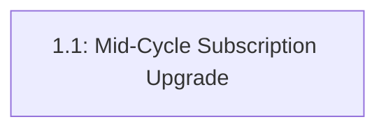

# aire State Tracking

## Project Information
- **Project Type**: Brownfield
- **Start Date**: 2026-09-11T09:01:18Z
- **Current Stage**: PLANNING - Workspace Detection (complete)

## Workspace State
- **Existing Code**: Yes
- **Programming Languages**: Python (FastAPI backend), JavaScript/JSX (React + Vite frontend)
- **Build System**: pip (backend/requirements.txt), npm (frontend/package.json + vite.config.js)
- **Project Structure**: Monolith — single repo, `backend/` (FastAPI, in-memory mock store, no DB) + `frontend/` (React SPA)
- **Workspace Root**: C:\Users\shailendra.yadav\Desktop\projects\helix-aire-v1-demo2\billing-cycle-copy3
- **Reverse Engineering Needed**: No — Atlas deep dive pulled via Helix MCP (see `## Existing-System Context`)

## Code Root
- **Code Root**: `src/` (i.e. `src/backend/main.py`, `src/frontend/`) — brownfield code does not live at the workspace root; this is the code root for the whole cycle per `common/directory-structure.md`.

## Code Location Rules
- **Application Code**: `src/` (code root above)
- **Documentation**: spec/ only
- **Structure patterns**: See code-generation.md Critical Rules

## Tracker
- Type: LOCAL
- Parent Epic: EPIC-LOCAL-1 (Mid-Cycle Subscription Upgrade: Standard → Premium)
- Epic URL: —
- Project Key / Repo / Org: —

## Context Project
- **Existing Knowledge**: No
- **Existing Knowledge Path(s)**: —
- **New References**: No
- **New Reference Path(s)**: —

## Existing-System Context
- **Workspace type**: brownfield
- **Helix MCP**: connected
- **Source**: atlas (Helix solution document, used as the Atlas deep-dive equivalent for this estate)
- **Components in scope**: backend/main.py (billing_data, users, all `/api/billing*` endpoints), frontend/src/pages/Billing.jsx, frontend/src/context/AuthContext.jsx (token=email pattern), frontend/src/App.jsx (routing — read-only, no changes)
- **Atlas deep dive doc**: spec/plans/atlas-deep-dive.md
- **Recorded**: 2026-09-11T09:01:18Z

## Helix MCP Binding
- **Server**: helix (mcp__helix__)
- **Docs tool(s)**: get_solution_document_tool — fetches a solution document (Epic, Deep Dive) by ID; list_solution_documents_tool — lists/discovers documents
- **Graph/Search tool(s)**: codebase_agent_query — natural-language codebase relationship queries; codebase_cypher_query — direct graph queries
- **Estate / workspace id**: solution_id 874 (Billing-Cycle-AIRE-V1-Demo), repo Billing-Cycle @ main, last_ingested_commit bcec649e08f2dbec435c24066deae6a1d6d71192
- **Resolved**: 2026-09-11T09:01:18Z

## Branching
- Base Branch: main
- Epic Branch: epic/EPIC-LOCAL-1-mid-cycle-subscription-upgrade
- Epic PR: (not raised — raised manually at cycle end via pr-generator)

## Design References
(none registered — Context Opt-In declined; the Epic document itself is the authoritative spec)

## SonarQube Setup Gate
- **Answer**: proceed
- **Recorded**: 2026-09-11T10:30:40Z
- **sonarqube.enabled**: true (tests/.evals/config.json)
- **sonar-project.properties**: user-edited before answering — projectKey `shailendrayadav0666_billing-cycle-copy3`, organization `shailendrayadav0666` (kept as-is)
- **Secrets** (not verified from here — first pipeline run proves them): CLAUDE_CODE_OAUTH_TOKEN, SONAR_TOKEN, SONAR_HOST_URL — user confirmed added

## Extension Configuration
| Extension | Enabled | Decided At |
|---|---|---|
| Security Baseline | Yes (always mandatory) | Workflow start |
| Playwright Test Automation | Yes (always mandatory) | Workflow start |
| Resiliency Baseline | No | Requirements Analysis |
| Property-Based Testing | No | Requirements Analysis |

## Stage Progress
- [x] Workspace Detection
- [x] Requirements Analysis
- [x] User Stories (GATE 1 approved — consolidated to a single story by explicit user request)
- [x] Dependency Graph (trivial — single node)
- [x] Workflow Planning (spec/plans/executions.md — Application Design + all 4 system-level design stages SKIP, Code Generation EXECUTE)
- [x] Application Design — SKIPPED (no new components/services; existing component boundaries)
- [x] System-Level Design stages — ALL SKIPPED (Functional/NFR Requirements/NFR Design/Infrastructure Design — see executions.md rationale)
- [ ] STOP CHECKPOINT / Development Handoff
- [ ] Code Generation (per story, via dev-implement)

## team_size
2 (fixed default — recorded, not achievable with a single story by explicit user request)

## story_creation_mode
all-at-once (fixed default)

## Story Tracker

| Story | Title | Requires | Tracker ID | Status | PR | Merged | Start | End | Recorded |
|-------|-------|----------|------------|--------|-----|--------|-------|-----|----------|
| 1.1 | Mid-Cycle Subscription Upgrade (Standard → Premium) | none | LOCAL | 🟢 Ready for Development | — | — | | | 2026-09-11 09:16 |

## Dependency Graph

**Ready stories**: 1.1 (no prerequisites) — immediately startable.
**Blocked stories**: none.
**Note**: Single-story set by explicit user request at GATE 1 — no parallelism possible; `team_size: 2` target not met by design (see `spec/plans/dependency-graph.yml`).
