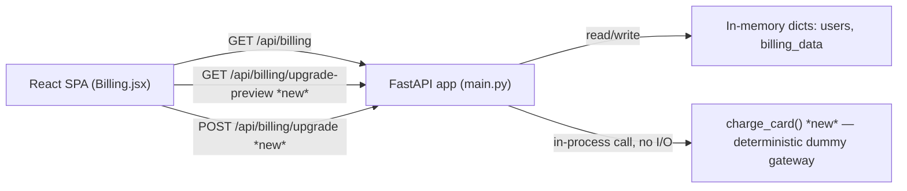

# Architecture — Billing-Cycle (Mid-Cycle Subscription Upgrade)

> **Version**: 1.0.0 · **Generated**: 2026-09-11T09:17:42Z · **AIRE**: v1.0
> **Derived from**: `spec/plans/atlas-deep-dive.md` (Atlas via Helix MCP), `spec/plans/epic-brief.md`, `spec/plans/requirements.md`, `spec/plans/stories.md`
> **Existing-system baseline**: Atlas via Helix MCP · solution_id 874 (Billing-Cycle-AIRE-V1-Demo) · repo Billing-Cycle @ main

All four system-level design stages (Functional Design, NFR Requirements, NFR Design, Infrastructure
Design) were **SKIPPED** per `spec/plans/executions.md` — the Epic brief already specifies the business
logic at implementation precision and no new NFR category or infrastructure changes are introduced.
This document is therefore assembled directly from Atlas existing-system truth + `requirements.md` +
`stories.md`, per `implementation/architecture-doc.md` Section 1's "skipped stage" rule — every section
below says explicitly what the system does by default instead of a dedicated design artifact.

## 1. System Context

A FastAPI backend (`src/backend/main.py`) serves a React SPA (`src/frontend/`) over a small JSON API.
There is no database — `users`, `billing_data`, `tasks_data` are in-memory Python dicts, seeded at
process start and mutated by request handlers (a restart resets all state; acceptable for this POC).
The only "auth" is the registered email used as a bearer-less token (`AuthContext.jsx` stores
`access_token` = email in `localStorage`; every API call passes `?email=<token>` or `{"email": ...}`).

This work adds two new endpoints to the same FastAPI app and two new UI elements (CTA + modal) to the
existing Billing page. No new process, service, or external call is introduced — the "payment gateway"
is a pure in-process function.

## 2. Component Inventory

| Component | Responsibility | Status | Source |
|---|---|---|---|
| FastAPI app (`main.py`) | HTTP API, request validation, in-memory state mutation | existing (modified) | Atlas deep dive |
| `billing_data` / `users` dicts | In-memory plan/quota state per email | existing (mutated by new endpoints) | Atlas deep dive |
| `GET /api/billing/upgrade-preview` | Return the server-computed proration preview | **new** | epic-brief.md Story 2, requirements.md REQ-F-02/04 |
| `POST /api/billing/upgrade` | Execute the upgrade: charge, flip plan, update quotas | **new** | epic-brief.md Story 3, requirements.md REQ-F-05/06 |
| `charge_card()` | Deterministic dummy payment gateway (pure function) | **new** | epic-brief.md "Dummy Payment Gateway Specification" |
| `Billing.jsx` (React) | Renders plan/usage; now also CTA + upgrade modal | existing (modified) | Atlas deep dive |

## 3. Layering and Boundaries

Unchanged from the existing system: a single-layer FastAPI app — route handlers read/write the
module-level dicts directly (no repository/service layer exists anywhere in this codebase, brownfield
or new). The new endpoints follow the exact same pattern as every existing endpoint (`billing`,
`tasks`, `login`) rather than introducing a new layering convention. **Rule**: a route handler may
read/write `users`/`billing_data` directly; it may NOT call `charge_card()` with anything other than
the server-computed `prorated_charge` (never a client-supplied amount — no such field exists on
`UpgradeRequest` by design, precisely to keep the charge server-authoritative).

## 4. Data Architecture

No schema change — no migration, no new store. `billing_data[email]` and `users[email]` gain no new
top-level keys; only existing keys (`plan_name`/`plan`, `price`, `usages`, `on_demand_usage.notice`)
are mutated in place on a successful upgrade. `renew_at` is explicitly preserved unchanged (REQ-F-05).
No transaction boundary is needed beyond Python's single-threaded, single-process request handling
(FastAPI's default dev server) — there is no concurrent-write race to guard against in this POC.

## 5. API and Integration Contracts

| Endpoint | Method | Auth model | Request | Response (success) | Response (error) |
|---|---|---|---|---|---|
| `/api/billing/upgrade-preview` | GET | `email` query param, checked against `users` (same as existing `/api/billing`) | `?email=<str>` | `200 {current_plan, new_plan, days_remaining, prorated_charge, next_renewal_price, renew_at}` | `401 {"detail":"Not authenticated"}` · `409 {"detail":"already_premium"}` |
| `/api/billing/upgrade` | POST | `email` in body, checked against `users` | `{"email": str}` | `200 {"status":"success","plan":"Premium","charge":<float>}` | `401 {"detail":"Not authenticated"}` · `409 {"detail":"already_premium"}` · `402 {"detail":"card_declined","message":"Your card was declined."}` |

Both follow the existing codebase's error-shape convention (`HTTPException(status_code, detail=...)`)
— no new error taxonomy is introduced.

## 6. Cross-Cutting Decisions

- **AuthN/AuthZ**: unchanged (email-as-token, no real session/JWT) — explicitly out of scope per
  REQ-NF-03 and the Epic's "Out of Scope". New endpoints reuse the identical `email not in users → 401`
  check already used by `GET /api/billing`.
- **Error handling**: `HTTPException` with a `detail` field, exactly matching existing endpoints; no
  stack traces or internal state ever returned (REQ-NF-04).
- **Money math**: computed exactly once server-side per request, in one helper reused by both
  endpoints (ARCH-02) — never duplicated, never computed client-side (ARCH-01).
- **Configuration/secrets**: none introduced — `charge_card()` has no config, no external call, no
  credential of any kind (REQ-NF-01, the Epic's explicit "no external dependencies" goal).
- **Concurrency/idempotency**: not addressed — matches the existing codebase's POC-level guarantees;
  out of scope per the Resiliency Baseline extension being explicitly declined for this project.

## 7. Non-Functional Targets

| Concern | Target | Source | How it is verified |
|---|---|---|---|
| No new runtime dependency | 0 new entries in `requirements.txt`/`package.json` | REQ-NF-01 | Code review diff check |
| Server-authoritative money math | 0 arithmetic on price/charge/days fields in `Billing.jsx` | REQ-NF-02 | Code review diff check + unit test asserting frontend renders API values verbatim |
| No regression | Only `src/backend/main.py` and `src/frontend/src/pages/Billing.jsx` change | REQ-NF-03 | Full regression gate (existing auth/tasks/login test suite, if any, plus manual smoke) |
| Safe error responses | Error bodies contain only the documented `detail`/`message` keys | REQ-NF-04 | Unit tests on each error branch |
| Playwright-automatable UI | CTA/modal/banner have stable, static text — no dynamic non-deterministic labels | REQ-NF-05 | `/playwright-implement` Planner/Generator run post-merge |

## 8. Infrastructure and Deployment

No change. Still a single FastAPI process (optionally serving the built frontend as static files, per
the existing `dist_dir` mount at the bottom of `main.py`) with no database, no queue, no external
service. Local dev: `uvicorn`/FastAPI dev server + Vite dev server, per the existing `README.md`.

## 9. Delta from the Existing System

| Area | Before (Atlas) | After | Reason |
|---|---|---|---|
| Billing endpoints | `GET /api/billing` only | + `GET /api/billing/upgrade-preview`, `POST /api/billing/upgrade` | Epic: self-serve upgrade flow |
| `billing_data[email]` | Static per-user dict, never mutated after registration | Mutated in place on successful upgrade (plan, price, usages, notice) | Epic Stories 3-4 |
| `Billing.jsx` | Static plan card, hardcoded "Standard" badge | Dynamic badge + conditional CTA + upgrade modal | Epic Stories 1-3 |
| Payment | None | In-process deterministic dummy gateway (`charge_card`) | Epic: demo both success/decline paths with no external SDK |

## 10. Verifiable Constraints

### ARCH-01 — Frontend never computes money
- **Constraint**: `Billing.jsx` displays `price`, `prorated_charge`, `days_remaining`, and `charge`
  values exactly as returned by the API — it performs no arithmetic on any of them.
- **Verifiable as**: The diff to `Billing.jsx` contains no arithmetic operator (`+ - * /`) applied to
  a variable holding a price/charge/days field pulled from an API response. Score 0 on any occurrence.
- **Weight**: 0.30
- **Source**: `spec/plans/requirements.md` REQ-NF-02; `spec/plans/stories.md` AC-12

### ARCH-02 — Single proration helper, reused
- **Constraint**: The proration formula is implemented in exactly one function/place in `main.py` and
  both `GET /api/billing/upgrade-preview` and `POST /api/billing/upgrade` call it — the formula is
  never re-implemented or copy-pasted a second time.
- **Verifiable as**: `grep` for the formula's characteristic terms (`days_remaining`, `daily_delta`,
  `prorated_charge`) in the diff finds the computation defined once. Score 0 if the arithmetic
  `(40.0 - 20.0) / 30` (or equivalent) appears in more than one function body.
- **Weight**: 0.25
- **Source**: `spec/plans/requirements.md` REQ-F-04

### ARCH-03 — Decline path performs zero mutation
- **Constraint**: When `charge_card()` returns `card_declined`, `POST /api/billing/upgrade` returns
  HTTP 402 without writing to `users[email]` or `billing_data[email]` in any way.
- **Verifiable as**: In the diff's decline branch, no assignment to `users[email][...]` or
  `billing_data[email][...]` appears before the `HTTPException(402, ...)` is raised. Score 0 on any
  such assignment.
- **Weight**: 0.20
- **Source**: `spec/plans/requirements.md` REQ-F-06; `spec/plans/stories.md` AC-19

### ARCH-04 — Error responses match the existing shape
- **Constraint**: Every new error response uses FastAPI's `HTTPException(status_code, detail=...)`
  with only the documented keys (`detail`, and `message` where specified) — no stack trace, no raw
  exception text, no extra internal fields.
- **Verifiable as**: Every `raise HTTPException(...)` added in the diff has a `detail` argument that is
  a literal string or a dict with only `detail`/`message` keys — never `str(e)` or an unfiltered
  exception object. Score 0 on any violation.
- **Weight**: 0.15
- **Source**: `spec/plans/requirements.md` REQ-NF-04

### ARCH-05 — No new dependency
- **Constraint**: No new entry is added to `src/backend/requirements.txt` or `src/frontend/package.json`.
- **Verifiable as**: The diff to either manifest file is empty. Score 0 if either file changes.
- **Weight**: 0.10
- **Source**: `spec/plans/requirements.md` REQ-NF-01

*(Weights: 0.30 + 0.25 + 0.20 + 0.15 + 0.10 = 1.00)*

## 11. Explicitly Out of Scope

- No repository/service layer is introduced — the codebase has none today and this change does not add one.
- No authentication/authorization change (email-as-token stays exactly as-is).
- No database, no persistence beyond process memory.
- No refunds, downgrades, Enterprise tier, or email notifications (per the Epic's "Out of Scope").
- No resiliency patterns (retries, circuit breakers, idempotency keys) — Resiliency Baseline extension was explicitly declined.
- No property-based testing — extension explicitly declined; standard example-based unit tests cover the proration formula and gateway branches instead.
