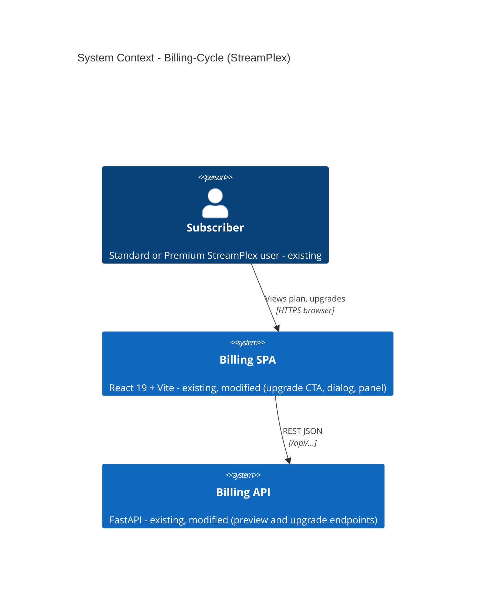
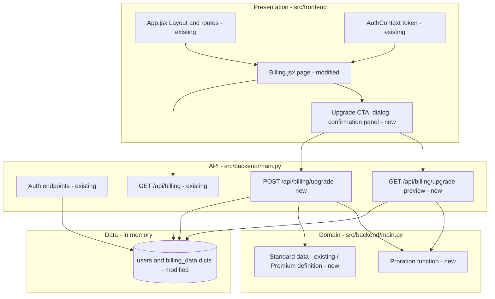
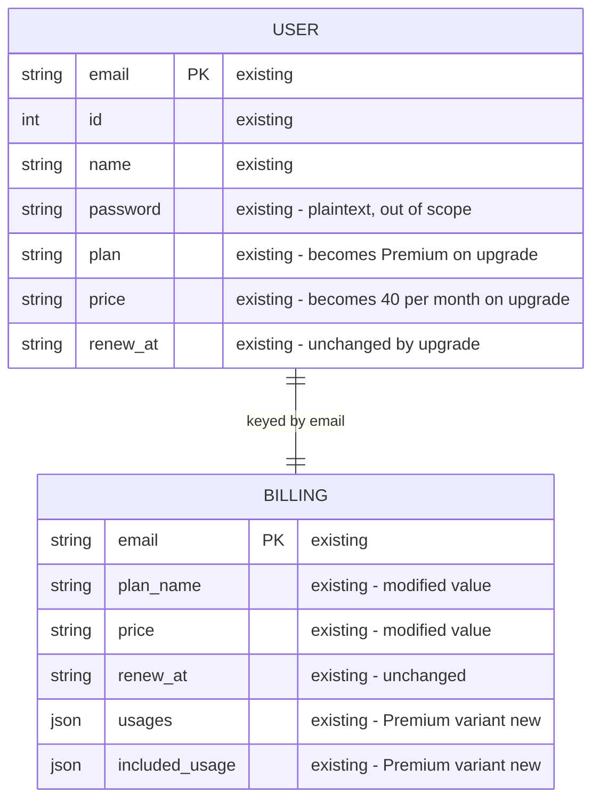
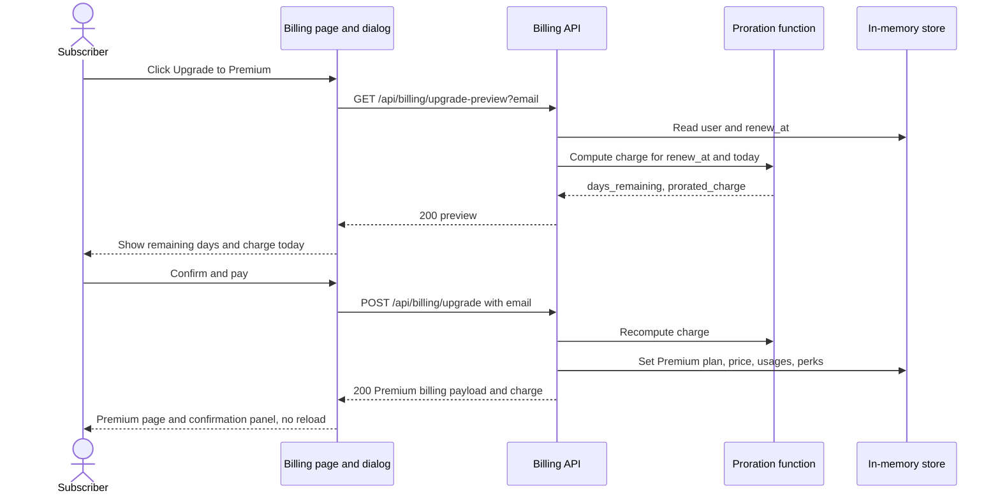

# Architecture — Billing-Cycle (StreamPlex) · Self-Serve Premium Upgrade

> **Version**: 1.0.0 · **Generated**: 2026-09-25 · **AIRE**: v1.0
> **Derived from**: `spec/plans/atlas-deep-dive.md` (Atlas doc 4699 v31), `spec/plans/epic-brief.md` (Atlas docs 4702, 4703), `spec/plans/requirements.md`, `spec/plans/stories.md`, `spec/plans/executions.md`, Design Reference #1 and its Reconciliations (`runtime-artifacts/aire-state.md`)
> **Existing-system baseline**: Atlas via Helix MCP — solution 951 "Billing-Cycle-Helix-Workshop", repo Billing-Cycle @ 69f67f308492a85648aa25a9ff7d8d574031344a
> **Design stages**: Application Design, Functional Design, NFR Requirements, NFR Design and Infrastructure Design were all **skipped** (`spec/plans/executions.md`). Decisions below come from the approved requirements and Atlas truth; no decision is invented to fill a skipped stage.

## 1. System Context

StreamPlex's Billing-Cycle is a two-tier proof-of-concept: a React 19 single-page app served by Vite, calling a Python FastAPI backend over REST, with all data held in in-memory Python dictionaries (Atlas). A subscriber logs in, views the Billing page, and — new in this cycle — upgrades from Standard to Premium mid-cycle. There are no external systems: no payment provider, no database.

Text alternative: the subscriber uses the Billing SPA (existing, modified), which calls the Billing API (existing, modified) over REST. Nothing else is involved.

## 2. Component Inventory

| Component | Responsibility | Status | Source |
|---|---|---|---|
| `main.py` — auth endpoints (`/api/auth/login`, `/api/auth/register`, `/api/users/me`) | Login, registration, current user; email returned as the token | existing (unchanged) | Atlas |
| `main.py` — `GET /api/billing` | Returns the caller's billing payload | existing (unchanged) | Atlas |
| `main.py` — in-memory store (`users`, `billing_data`) | Holds plan, price, renewal date and features per email | existing (modified — mutated on upgrade) | Atlas; REQ-F-04/05 |
| `main.py` — Premium plan definition | Premium price, usages and perks | new | REQ-F-01 |
| `main.py` — proration function | `days_remaining`, capped billable days, prorated charge; injectable "today" | new | REQ-F-02, REQ-NF-07 |
| `main.py` — `GET /api/billing/upgrade-preview` | Read-only charge preview | new | REQ-F-03 |
| `main.py` — `POST /api/billing/upgrade` | Applies Standard → Premium | new | REQ-F-04 |
| `Billing.jsx` — Billing page | Plan badge, cards, features, perks | existing (modified — plan-driven labels) | Atlas; REQ-F-07 |
| `Billing.jsx` — Upgrade CTA, upgrade dialog, confirmation panel | Review, confirm, dismiss, errors | new | REQ-F-08..13; Design Reference #1 |
| `App.jsx` — Layout, routing, `ProtectedRoute` | Header and routes | existing (unchanged) | Atlas |
| `AuthContext.jsx` | Holds `token` (email) and user in `localStorage` | existing (unchanged) | Atlas |
| `App.css` | Global styles | existing (modified — new classes) | REQ-NF-04 |

Text alternative: the Billing page (modified) hosts the new CTA/dialog/panel; the dialog calls the two new endpoints; both use the new proration function; the upgrade endpoint also applies the new Premium definition; every endpoint reads or writes the existing in-memory store.

## 3. Layering and Boundaries

- **Frontend → backend only over HTTP.** The Billing page and dialog call `/api/...` with `fetch`; they never import or duplicate backend logic.
- **Pricing math lives only in the backend proration function.** Both the preview and the upgrade endpoints call it; no other code computes a charge, and the frontend only displays API values (REQ-NF-01).
- **Endpoints own validation and error mapping**; the proration function is pure (no store access, no I/O, "today" passed in or defaulted).
- **Plan data is defined once** (Standard existing, Premium new) and copied into `billing_data` on upgrade — never re-typed inside an endpoint.
- **Out of bounds for this cycle**: changing the auth endpoints, `AuthContext`, routing, or CORS configuration.

## 4. Data Architecture

Store: two in-memory dicts keyed by email (Atlas). No database, no migration; state lives for the lifetime of the backend process (REQ-NF-06). Upgrade mutates both dicts for one user only; `renew_at` is never changed (REQ-F-06). There is no multi-step transaction — the two dict updates happen in one request handler with no external call between them.

Text alternative: USER and BILLING are one-to-one by email. Upgrade changes `plan`/`price` on USER and `plan_name`/`price`/`usages`/`included_usage` on BILLING; `renew_at` stays the same on both.

## 5. API and Integration Contracts

Existing endpoints are unchanged. New endpoints (REQ-F-03, REQ-F-04):

| Endpoint | Request | Success | Errors |
|---|---|---|---|
| `GET /api/billing/upgrade-preview` | query `email` | 200 `{current_plan, current_price, new_plan, new_price, days_remaining, days_in_cycle, prorated_charge}` — no state change | 401 `{"detail":"Not authenticated"}` unknown user · 400 `{"detail":"Already on Premium plan"}` · 4xx validation error for malformed input |
| `POST /api/billing/upgrade` | JSON body `{ "email": "<email>" }` only | 200 billing payload `{plan_name, price, renew_at, usages, included_usage}` + `prorated_charge`, `days_remaining` | 401 unknown user · 400 already Premium · 4xx validation error |

- **Auth model**: the email "token" identifies the caller, as on every existing endpoint (accepted pre-existing risk, Q3 A, REQ-NF-05).
- **Error model**: FastAPI `HTTPException` with a `detail` string only; unexpected errors return a generic 500.
- **Versioning**: none (POC); endpoints are additive.

## 6. Cross-Cutting Decisions

- **AuthN / AuthZ**: unchanged email-token model (Atlas critical findings 1 and 3). Accepted pre-existing risk for this cycle; the new state-changing endpoint is expected to be flagged under Security Baseline SECURITY-08 / OWASP A01 at review (REQ-NF-05).
- **Input handling**: request bodies are explicit Pydantic models with only `email`; client-supplied plan, price or charge fields are never read (REQ-NF-05).
- **Error handling**: known conditions → `HTTPException` with `detail`; unexpected → generic 500 via a global handler, no stack traces in responses (REQ-NF-05).
- **Logging**: Python `logging` records each preview/upgrade attempt and outcome (user identifier, result, charge); never a password (REQ-NF-05).
- **Configuration and secrets**: none introduced.
- **Concurrency and idempotency**: the frontend disables Confirm while a request is in flight; the backend's 400 on an already-Premium user makes a repeated upgrade harmless (REQ-NF-03).
- **Time**: the proration function takes "today" as a parameter (defaulting to the real date) so tests are deterministic (REQ-NF-07).
- **Accessibility**: the dialog is a labelled modal with focus management, Escape and backdrop close (REQ-NF-02).
- **Resilience**: Resiliency Baseline not enabled; no retries or failover beyond REQ-F-12's user-visible error handling.

## 7. Non-Functional Targets

| Concern | Target | Source | How it is verified |
|---|---|---|---|
| Pricing correctness | Charges exact to the cent for 0, past, 15, 29, 30, 35 days | REQ-F-02, REQ-NF-07 | pytest unit tests + Story 1.2 behaviour scenarios |
| Accessibility | Dialog role, label, focus in/out, Escape, backdrop, `role="alert"` errors | REQ-NF-02 | React Testing Library + Playwright |
| Double submit | At most one POST per confirm | REQ-NF-03 | React Testing Library |
| Visual fidelity | Matches Design Reference #1 | REQ-NF-04 | Playwright + manual test plans |
| Performance | O(1) in-memory; no target beyond existing endpoints | REQ-NF-08 | not separately measured |
| Security | Validation, safe errors, logging; no new runtime deps | REQ-NF-05, REQ-NF-06 | Security Baseline review, J2 |

## 8. Infrastructure and Deployment

Infrastructure Design was skipped: no change. The backend runs with uvicorn; the frontend runs with Vite in development (proxying `/api`) or is built and served by FastAPI's static mount (Atlas). Single process, in-memory state, not horizontally scalable (Atlas finding 9, out of scope). Test tooling added this cycle is dev-only: pytest, pytest-bdd and httpx for the backend; Vitest, React Testing Library and Playwright for the frontend.

## 9. Delta from the Existing System

| Area | Before (Atlas) | After | Reason |
|---|---|---|---|
| Plans | Standard only, hardcoded per user | Standard + Premium definition | REQ-F-01 |
| Billing API | 4 endpoints, all read-only except auth | + preview (read-only) + upgrade (mutating) | REQ-F-03, REQ-F-04 |
| Pricing logic | none | proration function | REQ-F-02 |
| Billing page | read-only; "Standard" hardcoded in badge and heading | plan-driven labels; CTA, dialog, confirmation panel | REQ-F-07..13 |
| Tests | none | pytest + pytest-bdd, Vitest + RTL, Playwright | REQ-NF-07 |
| Auth, CORS, persistence | email token, wildcard CORS, in-memory | unchanged | out of scope (Q3 A) |

## 10. Verifiable Constraints

### ARCH-01 — Single source of pricing math
- **Constraint**: Compute every days-remaining and prorated-charge value in the one backend proration function, and call it from both the preview and the upgrade endpoints.
- **Verifiable as**: Score 0 if any changed file other than that function performs the proration arithmetic (price difference × days / 30, or a days-remaining date difference used for charging) — including any frontend file that calculates a charge or days value instead of displaying the API's — or if either endpoint computes the charge without calling the function.
- **Weight**: 0.25
- **Source**: spec/plans/requirements.md REQ-NF-01, REQ-F-02

### ARCH-02 — Server decides plan, price and charge
- **Constraint**: Accept only the user identifier from the upgrade request; take plan, price, features and charge solely from server-side definitions and the proration function.
- **Verifiable as**: Score 0 if the upgrade request model declares any field besides `email`, or if any changed endpoint reads a plan, price, charge, usages or perks value from the request.
- **Weight**: 0.20
- **Source**: spec/plans/requirements.md REQ-NF-05, REQ-F-04

### ARCH-03 — Renewal date is never modified by an upgrade
- **Constraint**: Leave `renew_at` untouched in `users`, `billing_data` and every response when a user upgrades.
- **Verifiable as**: Score 0 if any changed code path in the upgrade flow assigns to `renew_at` or returns a `renew_at` different from the stored value.
- **Weight**: 0.15
- **Source**: spec/plans/requirements.md REQ-F-06

### ARCH-04 — Preview is read-only
- **Constraint**: Keep the upgrade-preview endpoint free of any write to the in-memory store.
- **Verifiable as**: Score 0 if the preview handler, or anything it calls, assigns to `users` or `billing_data`.
- **Weight**: 0.10
- **Source**: spec/plans/requirements.md REQ-F-03

### ARCH-05 — Plan data defined once
- **Constraint**: Define the Premium plan's price, usages and perks in one backend definition and copy from it; do not re-type plan values inside endpoint handlers or frontend components.
- **Verifiable as**: Score 0 if a changed endpoint handler builds Premium usages or perks inline, or if a changed frontend file hardcodes Premium feature values that the API already returns (the dialog's static benefit list and "Premium is $40/month" copy from the design reference are the only permitted frontend constants).
- **Weight**: 0.15
- **Source**: spec/plans/requirements.md REQ-F-01, REQ-F-09; Design Reference #1 reconciliations

### ARCH-06 — No new runtime dependencies
- **Constraint**: Add no packages to `src/backend/requirements.txt` or to `dependencies` in `src/frontend/package.json`; test tooling goes only in dev dependency manifests.
- **Verifiable as**: Score 0 if the diff adds an entry to `requirements.txt` or to the `dependencies` block of `package.json`.
- **Weight**: 0.15
- **Source**: spec/plans/requirements.md REQ-NF-06

Weights: 0.25 + 0.20 + 0.15 + 0.10 + 0.15 + 0.15 = 1.00

## 11. Explicitly Out of Scope

Downgrades, refunds or credits, payment processing or decline handling, a database or any persistence, plans beyond Standard and Premium, a configurable Premium price, changes to authentication (tokens, sessions, password hashing), CORS restriction, horizontal scaling, resiliency patterns, property-based testing, and CI pipeline generation (user opted out).
