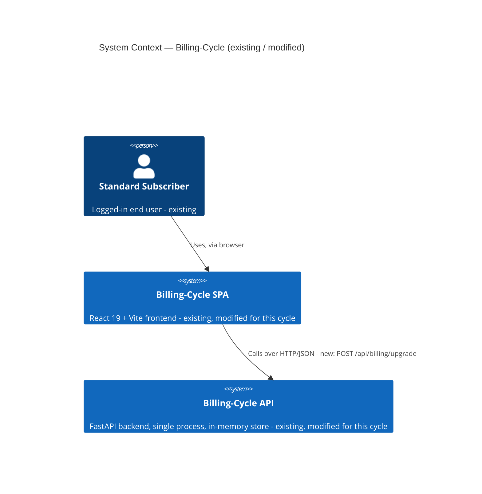
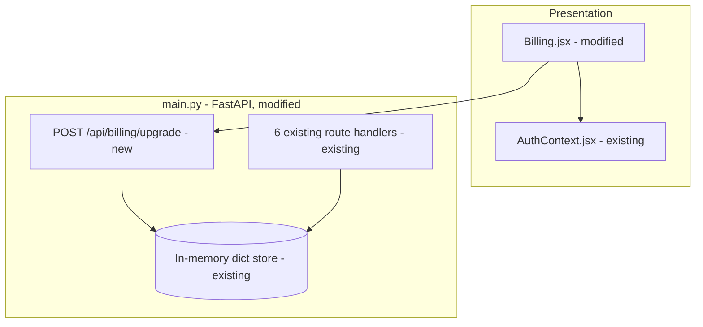

# Architecture — Billing-Cycle (Self-Serve Premium Upgrade delta)

> **Version**: 1.0.0 · **Generated**: 2026-09-16T10:53:19Z · **AIRE**: v1.0
> **Derived from**: spec/plans/atlas-deep-dive.md, spec/plans/requirements.md, spec/plans/stories.md, spec/plans/dependency-graph.yml
> **Existing-system baseline**: Atlas via Helix MCP — solution_id 951 (Billing-Cycle-Helix-Workshop), repo Billing-Cycle @ main
> **Note**: Functional Design, NFR Requirements, NFR Design, Infrastructure Design and Application Design were all SKIPPED for this cycle (`spec/plans/executions.md`) — nothing in this document is invented to fill those gaps; every decision below traces to Atlas existing-system truth or to `requirements.md`/`stories.md`.

## 1. System Context

Billing-Cycle is a small full-stack POC: a React 19 + Vite single-page app calling a FastAPI backend over 6 (soon 7) REST endpoints, with no database — all state lives in in-memory Python dicts inside the single backend process. This cycle adds ONE capability: a Standard-plan user self-serves a mid-cycle upgrade to Premium from the Billing page.

No external third-party systems are called — payment is mocked in-process (Epic scope: "Real payment processing (mocked for this POC)").

## 2. Component Inventory

| Component | Responsibility | Status | Source |
|---|---|---|---|
| `main.py` (FastAPI app) | In-memory data store, Pydantic models, all 6 existing route handlers, CORS, static file serving | existing (modified) | atlas-deep-dive.md |
| `UpgradeRequest` model | Request validation for the new upgrade endpoint | new (inside `main.py`) | requirements.md REQ-F-10 |
| `POST /api/billing/upgrade` handler | Preview (`dry_run`) + apply proration, idempotency guard, object-level authz | new (inside `main.py`) | requirements.md REQ-F-02/03/05/09 |
| `Billing.jsx` | Billing page UI — usage display, and now the upgrade CTA + confirmation panel | existing (modified) | atlas-deep-dive.md, stories.md Story 1.2 |
| `App.css` | Global/page styling — new `.premium-badge` / `.upgrade-btn` / `.upgrade-confirm-panel` classes | existing (modified) | epic-brief.md |
| `AuthContext.jsx` | Frontend auth state — supplies the email-as-token identity for the upgrade call | existing (unmodified) | atlas-deep-dive.md |

## 3. Layering and Boundaries

The existing system has **no formal layering** — `main.py` is a single "God Module" combining data store, models, and route handlers directly (atlas-deep-dive.md, Architecture finding #4). This cycle does **not** introduce layering (that would be a refactor outside this epic's scope, per `spec/plans/executions.md`'s Application-Design-SKIP rationale): the new upgrade handler follows the SAME existing pattern — a route function that reads/writes the in-memory dict directly, with no intermediate service or repository layer.

**What this change deliberately does NOT do**: introduce a service layer, a repository abstraction, or split `main.py` into modules. That refactor is out of scope for this epic.

## 4. Data Architecture

No database exists. The only "schema" is the shape of the in-memory per-user dict (plan, on-demand balance, etc.), already established by the existing system. This cycle adds:
- A **mutation** to the existing per-user dict's `plan` field (Standard → Premium) — no new field, no new entity.
- **No change** to the on-demand balance field (REQ-F-06 — explicitly untouched).
- **No migration** — there is nothing to migrate; state is in-memory and reset on process restart, exactly as today.

No ER diagram is added — no new entity or schema is introduced.

## 5. API and Integration Contracts

**New endpoint**: `POST /api/billing/upgrade`

| Aspect | Contract |
|---|---|
| Auth | Existing email-as-token mechanism (`Authorization` header or equivalent, matching the other 6 endpoints) — reused as-is per the answered Q3 |
| Request body | `UpgradeRequest` (new Pydantic model) — validated before any logic runs (REQ-F-10) |
| Query param | `dry_run: bool` (optional, default `false`) — `true` computes and returns the charge WITHOUT mutating state (REQ-F-02) |
| Success (apply, `dry_run=false`) | `200`, body includes the applied prorated charge; plan is now `PREMIUM` |
| Success (preview, `dry_run=true`) | `200`, body includes the calculated charge; no mutation |
| Already Premium | `400`, error body — idempotency guard (REQ-F-05); applies whether or not `dry_run` is set |
| Invalid/missing request fields | `422` (FastAPI's standard Pydantic validation response) |
| Caller ≠ account being upgraded | `403` (or `401` if unauthenticated) — object-level authorization (REQ-F-09) |

No versioning scheme exists in the current API (none of the 6 existing endpoints are versioned) — the new endpoint follows the same unversioned convention.

## 6. Cross-Cutting Decisions

- **AuthN/AuthZ**: The endpoint reuses the existing email-as-token mechanism as-is (Q3 answer — introducing JWT/proper auth is explicitly OUT of scope for this epic and remains recorded pre-existing debt, atlas-deep-dive.md Critical Finding #1). NEW for this endpoint: an explicit object-level authorization check — the caller's identity must match the account being upgraded — which is not a pattern the existing 6 endpoints uniformly demonstrate, so it is introduced here as this endpoint's own guard, not retrofitted onto the others.
- **Idempotency**: The apply path checks current plan state before mutating; already-Premium short-circuits to `400` before any write (REQ-F-05).
- **Error handling**: Error responses stay generic (no stack traces / internal details), consistent with SECURITY-09 and the existing endpoints' behavior.
- **Logging**: Per SECURITY-03, the caller's raw auth token (= their email, given the existing mechanism) is never written to log output by this new code, even though it is trivially available in the request context.
- **Concurrency**: Single-process, no explicit locking exists anywhere in the current system; the upgrade write follows the same unsynchronized dict-write pattern as the other 6 endpoints (a known, accepted limitation of this POC — not newly introduced or newly worsened by this change).
- **Configuration/secrets**: No new configuration or secret is introduced — no external payment provider is actually called (mocked).

## 7. Non-Functional Targets

| Concern | Target | Source | How it is verified |
|---|---|---|---|
| End-to-end upgrade flow duration | < 60 s under normal conditions | requirements.md REQ-NF-01 | Manual/E2E test timing (Playwright) |
| API error rate | < 1% in normal operation | requirements.md REQ-NF-02 | Operational target, not load-tested in this POC |
| Unit test coverage on changed files | ≥ `unitTestCoverageMin` (tests/.evals/config.json) | requirements.md REQ-NF-05 | D-coverage gate |
| Regression on existing Billing page / endpoints | Zero | requirements.md REQ-NF-03 | Full regression gate |
| Security (Security Baseline, diff-scoped) | All applicable SECURITY-NN rules pass on the diff | requirements.md REQ-NF-04 | Code Review Phase 2.5 (Security Baseline) + J2 |

## 8. Infrastructure and Deployment

No change. Single-process deployment: FastAPI/uvicorn serves both the API and (in production mode) the built React static files, exactly as the existing system already does (atlas-deep-dive.md). No new cloud resources, no new deployment unit, no scaling-model change.

## 9. Delta from the Existing System

| Area | Before (Atlas) | After | Reason |
|---|---|---|---|
| API surface | 6 endpoints, no upgrade path | 7 endpoints — adds `POST /api/billing/upgrade` | Epic goal: self-serve mid-cycle upgrade |
| Object-level authorization | No existing endpoint demonstrates an explicit ownership check (atlas-deep-dive.md notes zero authorization pattern beyond "is a token present") | New endpoint introduces its own explicit ownership check | REQ-F-09 — this endpoint mutates plan/billing state, so it needs it even though no precedent exists to follow |
| `Billing.jsx` | Displays plan/usage only, no upgrade path | Adds CTA, confirmation panel, preview/apply calls, success/error states | Epic scope |
| Test coverage | 0% (deep dive Testing finding #3) | New proration/endpoint logic tested to `unitTestCoverageMin`; rest of codebase unchanged | REQ-NF-05 — this epic does not retroactively test existing code |

## 10. Verifiable Constraints

### ARCH-01 — Idempotent upgrade guard
- **Constraint**: The upgrade endpoint must never mutate plan state for a caller already on Premium.
- **Verifiable as**: Any changed code path in the upgrade handler must check the caller's current plan before performing the plan-mutation write. Score 0 if a plan-mutation write is reachable without a preceding already-Premium check that returns 400.
- **Weight**: 0.20
- **Source**: requirements.md REQ-F-05; stories.md Story 1.1 AC-3

### ARCH-02 — Object-level authorization on the upgrade endpoint
- **Constraint**: The upgrade endpoint must verify the authenticated caller's identity matches the account being upgraded before any mutation.
- **Verifiable as**: Score 0 if the changed endpoint code mutates a user's plan using an identifier read directly from the request body/params without cross-checking it against the caller's authenticated identity.
- **Weight**: 0.20
- **Source**: requirements.md REQ-F-09, REQ-NF-04

### ARCH-03 — Preview never mutates state
- **Constraint**: A `dry_run=true` call to the upgrade endpoint must never write to plan or balance state.
- **Verifiable as**: Score 0 if any changed code path reachable when `dry_run` is true performs a state-mutating write (plan change, balance change).
- **Weight**: 0.15
- **Source**: requirements.md REQ-F-02; stories.md Story 1.1 AC-1

### ARCH-04 — On-demand balance untouched by upgrade
- **Constraint**: The upgrade operation must never modify the user's existing on-demand credit balance field.
- **Verifiable as**: Score 0 if the changed upgrade-apply code path writes to the balance field.
- **Weight**: 0.10
- **Source**: requirements.md REQ-F-06

### ARCH-05 — No new auth mechanism introduced
- **Constraint**: The new endpoint authenticates the caller using the existing email-based mechanism only — no new token/session scheme may be introduced by this change.
- **Verifiable as**: Score 0 if the diff adds a new auth/token-verification mechanism (a JWT library call, a new session store, etc.) anywhere in the changed files.
- **Weight**: 0.10
- **Source**: requirements.md (Q3 answer / REQ-NF-04 note); atlas-deep-dive.md Critical Finding #1

### ARCH-06 — Single-cycle-length assumption stays isolated
- **Constraint**: The 30-day cycle length used in proration is a single named constant, not inlined as a literal in more than one place.
- **Verifiable as**: Score 0 if the numeric literal `30` (or an equivalent days-in-cycle magic number) appears more than once across the changed proration code.
- **Weight**: 0.10
- **Source**: requirements.md REQ-NF-06

### ARCH-07 — Input validation before mutation
- **Constraint**: The upgrade endpoint validates its request body via a typed model before any business logic executes.
- **Verifiable as**: Score 0 if any field used in proration or plan-mutation logic is read from an untyped/raw dict rather than a validated Pydantic model field.
- **Weight**: 0.10
- **Source**: requirements.md REQ-F-10

### ARCH-08 — No regression to existing endpoints
- **Constraint**: None of the 6 pre-existing endpoint handler functions are modified by this change, except where strictly required for shared data-store access already common to all handlers.
- **Verifiable as**: Score 0 if the diff modifies the body of any pre-existing route handler function for a reason other than a shared data-store definition all handlers already depend on.
- **Weight**: 0.05
- **Source**: requirements.md REQ-NF-03

**Weights**: 0.20 + 0.20 + 0.15 + 0.10 + 0.10 + 0.10 + 0.10 + 0.05 = **1.00**

## 11. Explicitly Out of Scope

- Any refactor of `main.py` into layered modules (service/repository split) — the existing God-Module pattern is preserved.
- Any new authentication scheme (JWT, hashed passwords) — explicitly deferred per the answered Q3; remains recorded technical debt.
- A real payment provider integration — payment stays mocked (Epic scope).
- Annual billing — REQ-NF-06, fully out of scope this cycle.
- A downgrade flow, email notifications, admin reporting — all explicitly out of scope per epic-brief.md.
