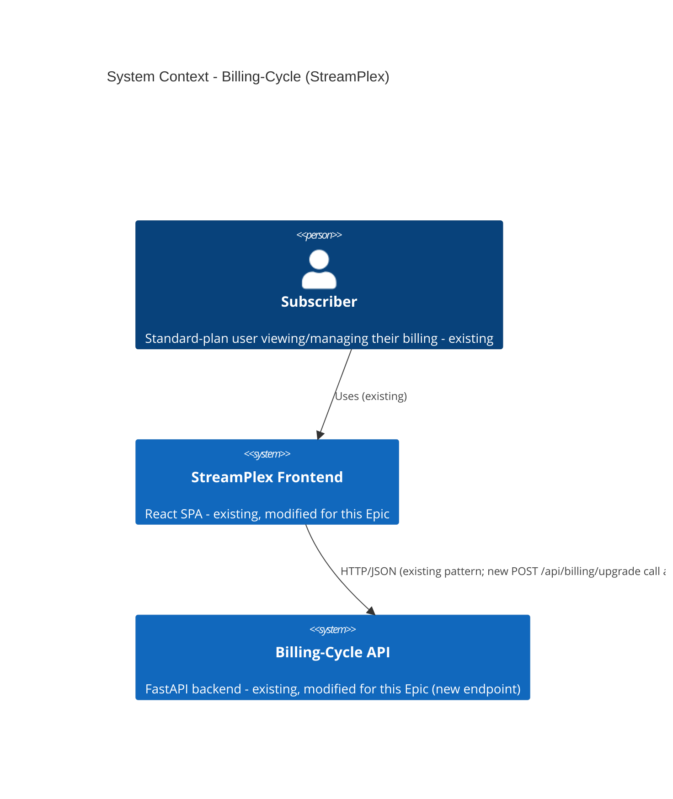
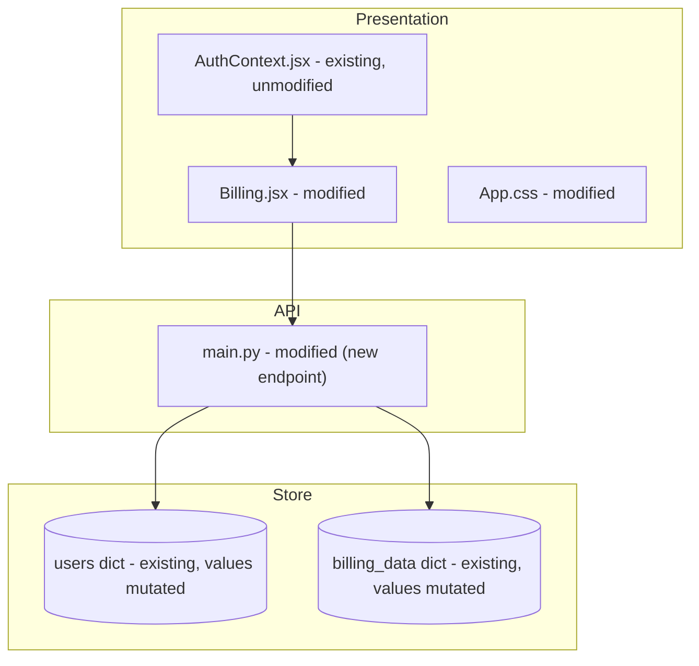

# Architecture — Billing-Cycle (StreamPlex) — Self-Serve Premium Upgrade

> **Version**: 1.0.0 · **Generated**: 2026-09-23T10:41:14Z · **AIRE**: v1.0
> **Derived from**: spec/plans/atlas-deep-dive.md (Atlas via Helix MCP), spec/plans/requirements.md, spec/plans/stories.md, spec/plans/executions.md, `## Design References` (runtime-artifacts/aire-state.md)
> **Existing-system baseline**: Atlas via Helix MCP — solution 951 "Billing-Cycle-Helix-Workshop", repo Billing-Cycle @ main

**Note on design-stage inputs**: Application Design, Functional Design, NFR Requirements/Design, and Infrastructure Design were all SKIPPED for this cycle (`spec/plans/executions.md`) — the feature fits entirely within existing component boundaries and its one business rule (proration) and NFRs are already fully specified in `requirements.md`/`stories.md`. This document is therefore assembled directly from the Atlas Deep Dive (existing-system truth) plus the approved requirements and stories, with no invented decisions filling the skipped stages' sections.

## 1. System Context

The system is a simple two-tier web application (unchanged by this Epic): a React SPA (`src/frontend`) calling a single-file FastAPI backend (`src/backend/main.py`) over HTTP, with no database — two in-memory Python dicts (`users`, `billing_data`) hold all state. This Epic adds one new capability — a self-serve plan upgrade — entirely within this existing shape.

## 2. Component Inventory

| Component | Responsibility | Status | Source |
|---|---|---|---|
| `src/backend/main.py` | All backend: auth, billing, user routes, in-memory store, static serving | existing (modified — new `POST /api/billing/upgrade` endpoint + Premium plan data) | Atlas atlas-deep-dive.md |
| `src/frontend/src/pages/Billing.jsx` | Billing dashboard — plan display and usage | existing (modified — Upgrade CTA, confirmation modal, success/error states) | Atlas atlas-deep-dive.md |
| `src/frontend/src/App.css` | Global/page styles | existing (modified — new styles for CTA/modal/banner) | Atlas atlas-deep-dive.md |
| `src/frontend/src/context/AuthContext.jsx` | Auth state (`token` = email) | existing (unmodified — reused as-is to identify the caller) | Atlas atlas-deep-dive.md |

## 3. Layering and Boundaries

Unchanged from the existing system: there is no service layer — `main.py` is a single-file "god file" containing routing, validation, and data access together (documented pre-existing debt in the Atlas Deep Dive; not introduced or fixed by this Epic). The new endpoint follows the same convention as the existing three endpoints for consistency, rather than introducing a new layering pattern for one endpoint alone. The frontend's existing `AuthContext` → page-component pattern is unchanged; no new global state mechanism is introduced.

## 4. Data Architecture

No new store and no schema change — both `users` and `billing_data` keep their existing field sets. An upgrade mutates existing field *values* (`plan_name`, `price`, feature-quota fields) on the existing per-user record; no field is added or removed. **No ER diagram is included** because no store/schema is introduced or structurally changed (per Section 2.1's trigger condition — diagram omitted, not skipped by oversight).

## 5. API and Integration Contracts

**New**: `POST /api/billing/upgrade`
- **Request**: `{ "email": string }` (same identifying parameter as the existing `GET /api/billing?email=` — Question 1 decision)
- **Success response (2xx)**: the user's updated plan state — `plan_name: "Premium"`, `price: "$40/month"`, `renew_at` (unchanged), updated feature quotas, and the prorated `charge_applied` amount
- **Error responses**: 404-class when `email` matches no known user (no mutation); 4xx-class when the user's current plan is already `"Premium"` (idempotent no-op, no mutation)
- **Auth model**: identical to existing endpoints — the `email` parameter itself is the identifier (documented pre-existing weakness, not changed by this Epic per Question 1)

**Unchanged**: `POST /api/auth/login`, `POST /api/auth/register`, `GET /api/users/me`, `GET /api/billing` — no contract change.

## 6. Cross-Cutting Decisions

- **AuthN/AuthZ**: unchanged email-as-token pattern; the new endpoint adds an existence check (404 on unknown email) and a state-guard (reject if already Premium) as its only authorization logic — a deliberate, recorded decision (Requirements Analysis Question 1/2), not a security regression introduced by this Epic.
- **Error handling**: fail-closed — on any failure (unknown user, already-Premium, network/server error), no plan/state mutation occurs and the frontend leaves the pre-upgrade state displayed (REQ-F-10).
- **Idempotency**: the upgrade endpoint is idempotent with respect to plan state — calling it again for an already-Premium user is a safe no-op, not a duplicate charge (REQ-F-08).
- **Concurrency**: unchanged from the existing system — in-memory dict mutation is synchronous and non-atomic under multiple workers (documented pre-existing limitation in the Atlas Deep Dive); this Epic does not introduce new concurrency risk beyond what every existing mutating path already has (there is currently exactly one other mutating path: registration).
- **Logging**: no new sensitive data is logged; the endpoint logs at the same level/pattern as existing endpoints (email only, already logged elsewhere).

## 7. Non-Functional Targets

| Concern | Target | Source | How it is verified |
|---|---|---|---|
| No external payment SDK/provider | Zero new external dependencies | requirements.md REQ-NF-01 | Dependency diff review (D4/D5 gates) |
| No persistent store introduced | `users`/`billing_data` remain in-memory dicts | requirements.md REQ-NF-02 | Code review — no DB client/driver added |
| No regression to existing endpoints | `GET /api/billing`, `GET /api/users/me`, auth endpoints unchanged behavior | requirements.md REQ-NF-03 | Full Regression Gate |
| Proration function testability | Pure function, unit-testable in isolation | requirements.md REQ-NF-06 | Unit test coverage gate (`unitTestCoverageMin`) |

No performance/latency target is specified by the Epic beyond the existing system's own (undocumented) baseline — NFR Requirements was skipped as this feature has no new performance-sensitive path (single in-memory dict lookup/write, no external call).

## 8. Infrastructure and Deployment

Unchanged: a single Uvicorn process serves both the FastAPI backend and the built frontend static assets (per the Atlas Deep Dive's "Getting Started" section). No new environment, container, or deployment step is introduced by this Epic.

## 9. Delta from the Existing System

| Area | Before (Atlas) | After | Reason |
|---|---|---|---|
| Backend endpoints | 4 endpoints (`login`, `register`, `users/me`, `billing`) | 5 endpoints — adds `POST /api/billing/upgrade` | Self-Serve Premium Upgrade Epic |
| Billing page | Read-only plan display | Adds Upgrade CTA, confirmation modal, success banner, error state | Self-Serve Premium Upgrade Epic |
| Plan data | Single "Standard" plan definition | Adds a "Premium" plan definition alongside it | Self-Serve Premium Upgrade Epic |

## 10. Verifiable Constraints

### ARCH-01 — Server-side proration authority
- **Constraint**: The prorated charge actually applied MUST be computed by the backend, never accepted as a client-supplied value.
- **Verifiable as**: Score 0 if the changed `POST /api/billing/upgrade` handler reads a charge/amount value from the request body/params and uses it directly instead of recomputing it server-side from plan prices and dates.
- **Weight**: 0.25
- **Source**: requirements.md REQ-F-03; stories.md Story 1.2 AC-1/AC-4

### ARCH-02 — Idempotent upgrade guard
- **Constraint**: The upgrade endpoint MUST NOT mutate state when the target user's current plan is already "Premium".
- **Verifiable as**: Score 0 if the changed endpoint code path applies a plan/price mutation without first checking the user's current plan value.
- **Weight**: 0.25
- **Source**: requirements.md REQ-F-08; stories.md Story 1.2 AC-3

### ARCH-03 — Unknown-user guard
- **Constraint**: The upgrade endpoint MUST NOT mutate state when the given email does not match an existing user record.
- **Verifiable as**: Score 0 if the changed endpoint code path applies a mutation before verifying the email exists in the `users` store.
- **Weight**: 0.20
- **Source**: requirements.md REQ-F-07; stories.md Story 1.2 AC-2

### ARCH-04 — No new persistence mechanism
- **Constraint**: This Epic MUST NOT introduce a database, file-based store, or external persistence mechanism.
- **Verifiable as**: Score 0 if any changed file imports a database driver/ORM or writes to a file/external store instead of mutating the existing in-memory dicts.
- **Weight**: 0.15
- **Source**: requirements.md REQ-NF-02

### ARCH-05 — Fail-closed frontend state
- **Constraint**: The frontend MUST NOT update the displayed plan/price before a successful backend response is received.
- **Verifiable as**: Score 0 if any changed frontend code path sets the displayed plan/price to "Premium" (optimistic update) before the `POST /api/billing/upgrade` response resolves successfully.
- **Weight**: 0.15
- **Source**: requirements.md REQ-F-10; stories.md Story 1.4 AC-4

*(Weights: 0.25 + 0.25 + 0.20 + 0.15 + 0.15 = 1.00)*

## 11. Explicitly Out of Scope

- Premium → Standard downgrades
- Refunds or credits
- Payment verification / decline handling
- Enterprise or multi-tier billing beyond Standard/Premium
- Any external payment processor or SDK
- Database/persistent-storage migration
- Any new authentication mechanism (JWT, sessions, etc.) — the existing email-as-token pattern is deliberately retained (Question 1)

(Per requirements.md REQ-F-12 and the Epic's own "Out of Scope" section.)
