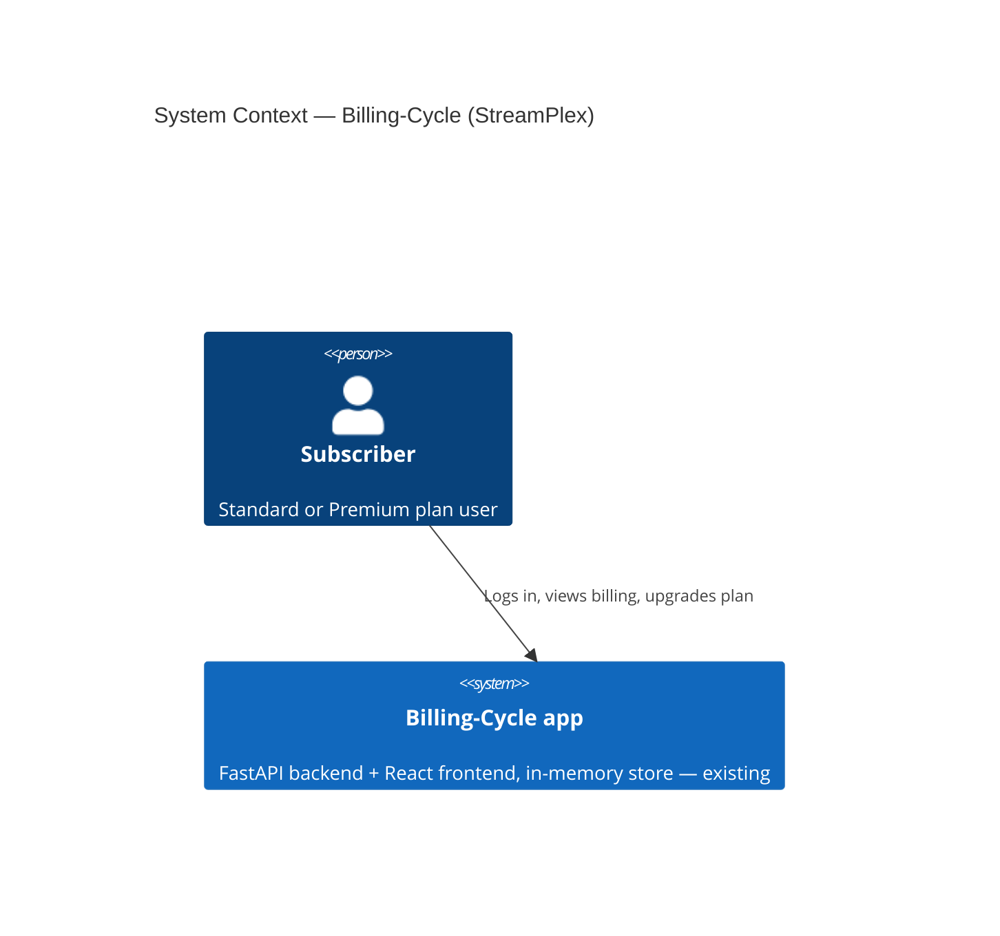
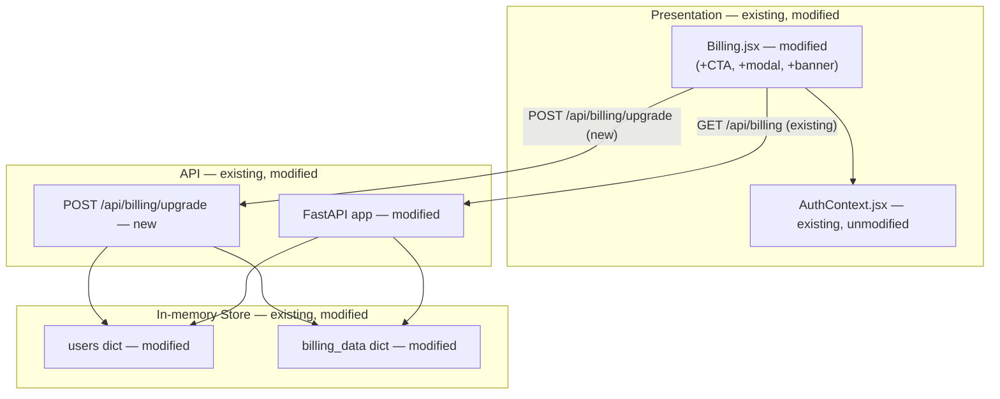
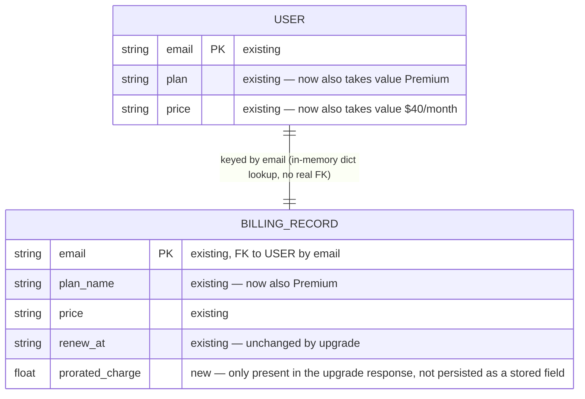

# Architecture — Billing-Cycle (StreamPlex)

> **Version**: 1.0.0 · **Generated**: 2026-09-22T11:59:45Z · **AIRE**: v1.0
> **Derived from**: spec/plans/atlas-deep-dive.md (Atlas via Helix MCP), spec/plans/requirements.md, spec/plans/stories.md, runtime-artifacts/aire-state.md `## Design References` (StreamPlex Billing.html mockup + Reconciliations)
> **Existing-system baseline**: Atlas via Helix MCP — solution_id 951 (Billing-Cycle-Helix-Workshop), repository Billing-Cycle @ main, commit 69f67f308492a85648aa25a9ff7d8d574031344a

**No system-level design stages ran this cycle** (Application Design, Functional Design, NFR Requirements, NFR Design, Infrastructure Design were all SKIPPED — see `spec/plans/executions.md` for rationale). This document is therefore assembled from Atlas existing-system truth, `requirements.md`, `stories.md`, and the registered design reference only. Sections normally populated from a skipped design stage say so explicitly below rather than inventing a decision.

## 1. System Context

The system is a single-repo POC: a FastAPI backend (`src/backend/main.py`) serving a React/Vite frontend (`src/frontend/`), with an in-memory data store (no database). Users authenticate with email+password; the "token" used everywhere downstream is simply the user's email string. This cycle adds one new capability: a Standard-plan subscriber can self-serve upgrade to Premium mid-cycle for a prorated charge, computed and applied entirely within this same monolith — no external payment provider is introduced.

No external systems are called or added — REQ-NF-01 (zero external payment dependency) keeps this diagram unchanged from the existing system.

## 2. Component Inventory

| Component | Responsibility | Status | Source |
|---|---|---|---|
| FastAPI app (`main.py`) | HTTP API: auth, users, billing | existing (modified — new endpoint) | spec/plans/atlas-deep-dive.md |
| `POST /api/billing/upgrade` handler | Validates plan state, computes proration, mutates in-memory store | new | spec/plans/stories.md (Story 1.1, AC-5/6/7) |
| `users` / `billing_data` in-memory dicts | Store per-email user + billing records | existing (modified — Premium entries added) | spec/plans/atlas-deep-dive.md |
| `Billing.jsx` | Renders plan/usage; now also the Upgrade CTA, confirmation modal, and success banner | existing (modified) | spec/plans/atlas-deep-dive.md, StreamPlex Billing.html (design reference) |
| `AuthContext.jsx` | Provides the email "token" | existing (unmodified) | spec/plans/atlas-deep-dive.md |
| `App.css` | Shared styling (existing teal accent tokens) | existing (modified — new classes) | spec/plans/atlas-deep-dive.md |

## 3. Layering and Boundaries

Unchanged from the existing system (no Application Design or Infrastructure Design ran; this is Atlas's documented existing pattern, preserved as-is): the frontend calls the FastAPI app directly over HTTP; the FastAPI app reads/writes the module-level in-memory dicts directly (no repository/service layer exists in this POC, and this cycle does not introduce one). The new `POST /api/billing/upgrade` handler follows this same pattern — it is a route function that mutates `users`/`billing_data` directly, exactly like the existing `login`, `register`, and `billing` handlers.

## 4. Data Architecture

No schema or database is introduced (REQ-NF-02) — `users` and `billing_data` remain plain in-memory Python dicts keyed by email, exactly as documented in `spec/plans/atlas-deep-dive.md`. This cycle only adds new **values** for a Premium plan within the existing shape; no new entity or field is introduced.

`prorated_charge` is computed and returned on the upgrade response; it is not stored as a persistent field on either dict (there is nothing to persist it into — no billing-history record exists in this POC, matching the Epic's declared Out of Scope: no refunds/credits, no persistent storage).

## 5. API and Integration Contracts

| Endpoint | Status | Auth | Request | Response |
|---|---|---|---|---|
| `GET /api/billing` | existing, unchanged | email query param, no validation (existing pattern) | — | `{plan_name, price, renew_at, usages[], included_usage}` |
| `POST /api/billing/upgrade` | **new** | email in JSON body, no new auth mechanism (REQ-F-04, REQ-NF-03 — deliberately matches the existing pattern) | `{"email": "<user_email>"}` | Success: `{plan_name, price, renew_at, usages[], included_usage, prorated_charge}` (200). Already Premium: `{"detail": "Already on Premium plan"}` (400). Unknown email: `{"detail": "Not authenticated"}` (401). |

No versioning scheme exists in this POC and none is introduced. No external integration is added.

## 6. Cross-Cutting Decisions

- **AuthN/AuthZ**: unchanged and explicitly NOT remediated by this cycle (REQ-NF-03) — email-as-identifier, no ownership verification, matching every other endpoint in the app. This is a known, already-documented risk (`atlas-deep-dive.md` Security Considerations); the Security Baseline review scopes to the new diff surface, not to fixing this pre-existing, untouched pattern.
- **Error handling**: the two new guard branches (`400` already-Premium, `401` unknown-user) reuse the exact status codes and `{"detail": "..."}` shape the existing endpoints already use. The new confirmation modal gets its own inline error/retry UI for network/4xx/5xx failures (REQ-F-10) — scoped to that modal only; the existing `GET /api/billing` fetch's lack of `.catch()` is explicitly left unchanged.
- **Concurrency/idempotency**: no idempotency key is introduced (per the answered clarifying question, Requirements Analysis Q4) — a second call after a successful upgrade is rejected by the already-Premium guard, which is sufficient at this POC's scale (single-process, in-memory, no concurrent-request race documented as a concern in `atlas-deep-dive.md`).
- **Logging/observability**: none exists in the current system and none is introduced — no NFR Requirements stage ran to establish one.
- **Configuration/secrets**: none — no new secret or config value is introduced by this endpoint.

## 7. Non-Functional Targets

No NFR Requirements stage ran (skipped — see `executions.md`), so no numeric performance/availability target exists for this cycle, and none is invented here. The applicable non-functional constraints are the ones Requirements Analysis already resolved directly:

| Concern | Target | Source | How it is verified |
|---|---|---|---|
| No external payment dependency | Zero new external SDK/package for payments | REQ-NF-01 | Diff review of `requirements.txt` / `package.json` |
| Persistence model | In-memory only, no DB | REQ-NF-02 | Diff review — no new DB client/ORM import |
| Auth posture | No new authentication mechanism | REQ-NF-03 | Diff review of the new endpoint's signature |
| Extensions | Resiliency Baseline and Property-Based Testing both disabled | REQ-NF-04, REQ-NF-05 | `## Extension Configuration` in `runtime-artifacts/aire-state.md` |
| Styling | Reuses existing `App.css` teal accent tokens | REQ-NF-06 | Diff review of new CSS — no `#0d9b74`-family hex introduced |

## 8. Infrastructure and Deployment

No infrastructure exists in this POC (no IaC, no deployment config beyond the existing `dist_dir` static-file mount already in `main.py`) and none is introduced — Infrastructure Design was skipped for exactly this reason (see `executions.md`).

## 9. Delta from the Existing System

| Area | Before (Atlas) | After | Reason |
|---|---|---|---|
| API surface | `GET /api/billing`, `GET /api/users/me`, `POST /api/auth/login`, `POST /api/auth/register` | + `POST /api/billing/upgrade` | Epic: self-serve mid-cycle upgrade |
| `billing_data` values | Standard-plan entries only | + Premium-plan entries (4K Ultra HD, 4 streams, 6 downloads, Dolby Vision) | Story 1.1 AC-5 |
| `Billing.jsx` | Read-only display, hardcoded `"Standard"` text | Dynamic plan-name rendering, Upgrade CTA, confirmation modal, success banner | Story 1.1 AC-1/2/3/9 |
| Auth model | Email-as-identifier, no validation | Unchanged | Deliberately out of scope (REQ-NF-03) |

## 10. Verifiable Constraints

### ARCH-01 — No new external payment dependency
- **Constraint**: The upgrade feature introduces no external payment provider or SDK.
- **Verifiable as**: `src/backend/requirements.txt` and `src/frontend/package.json` show no new payment-related dependency (e.g. `stripe`, `braintree`, `paypal-*`) in the diff. Score 0 if any such dependency is added.
- **Weight**: 0.15
- **Source**: spec/plans/requirements.md (REQ-NF-01)

### ARCH-02 — In-memory persistence only
- **Constraint**: The upgrade endpoint reads and writes only the existing in-memory `users`/`billing_data` dicts.
- **Verifiable as**: No new database client, ORM import, or persistent-storage call appears in the diff for `POST /api/billing/upgrade`. Score 0 if any such import/call is introduced.
- **Weight**: 0.20
- **Source**: spec/plans/requirements.md (REQ-NF-02)

### ARCH-03 — Existing auth pattern preserved, not extended
- **Constraint**: `POST /api/billing/upgrade` accepts `email` in the request body and introduces no new authentication/authorization mechanism.
- **Verifiable as**: The endpoint's signature/body model matches the email-as-identifier pattern of `GET /api/billing`/`GET /api/users/me` — no new auth decorator, middleware, header check, or token validation is added. Score 0 if a new auth mechanism appears only on this endpoint (inconsistent with the rest of the app) or if an existing endpoint's auth model is silently changed.
- **Weight**: 0.15
- **Source**: spec/plans/requirements.md (REQ-NF-03), spec/plans/stories.md (AC-5/6/7)

### ARCH-04 — Proration computed server-side, single source of truth
- **Constraint**: The prorated charge that is actually applied is computed once, in the backend endpoint.
- **Verifiable as**: `prorated_charge` in the success response is computed inside the `POST /api/billing/upgrade` handler using `round((40 - 20) * (days_remaining / 30), 2)`. The frontend may compute its own preview for display in the confirmation modal (AC-3), but never sends a client-computed charge value that the backend trusts. Score 0 if the backend accepts and applies a charge value supplied by the client.
- **Weight**: 0.20
- **Source**: spec/plans/stories.md (AC-3, AC-5)

### ARCH-05 — Upgrade response shape matches the existing billing contract
- **Constraint**: The success response of `POST /api/billing/upgrade` carries the same field set as `GET /api/billing`, plus `prorated_charge`.
- **Verifiable as**: The response includes `plan_name`, `price`, `renew_at`, `usages`, `included_usage`, and `prorated_charge`. Score 0 if any of the five `GET /api/billing` fields is missing from the success response.
- **Weight**: 0.15
- **Source**: spec/plans/requirements.md (REQ-F-05), spec/plans/stories.md (AC-5)

### ARCH-06 — No new architectural layer or module
- **Constraint**: This feature is implemented entirely within the existing `main.py` and `Billing.jsx` files (plus `App.css` styling) — no new service module, router file, or component library is introduced.
- **Verifiable as**: The diff's new/modified application files are limited to `src/backend/main.py`, `src/frontend/src/pages/Billing.jsx`, and `src/frontend/src/App.css` (test files under `tests/` are exempt from this check). Score 0 if a new source file under `src/` outside these three is added for this feature.
- **Weight**: 0.15
- **Source**: spec/plans/executions.md (Application Design SKIP rationale)

**Weights**: 0.15 + 0.20 + 0.15 + 0.20 + 0.15 + 0.15 = **1.00**

## 11. Explicitly Out of Scope

- Any authentication/authorization overhaul (JWT, password hashing, ownership checks) — pre-existing, deliberately untouched (REQ-NF-03).
- A database or ORM layer — deliberately not introduced (REQ-NF-02).
- A repository/service layer abstraction — the existing direct-dict-access pattern is preserved as-is; no layering refactor is in scope.
- Billing history / persisted transaction records — no such entity exists or is introduced.
- Any resiliency pattern (retries, circuit breakers, timeouts) — Resiliency Baseline extension was explicitly declined (REQ-NF-04).
- CI/CD pipeline generation — explicitly declined at the STOP CHECKPOINT (`## CI/CD Configuration`: Enabled: No).
