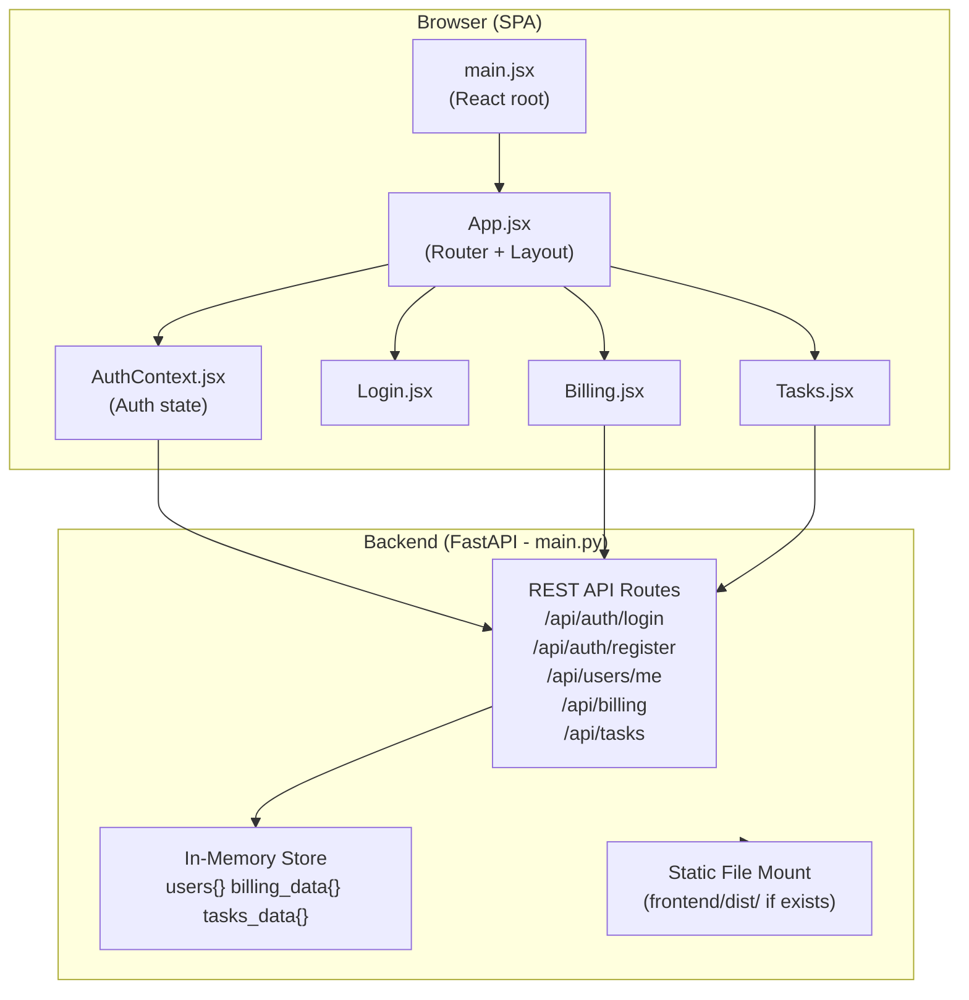
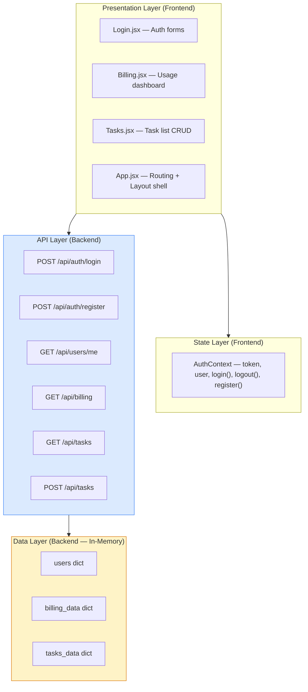
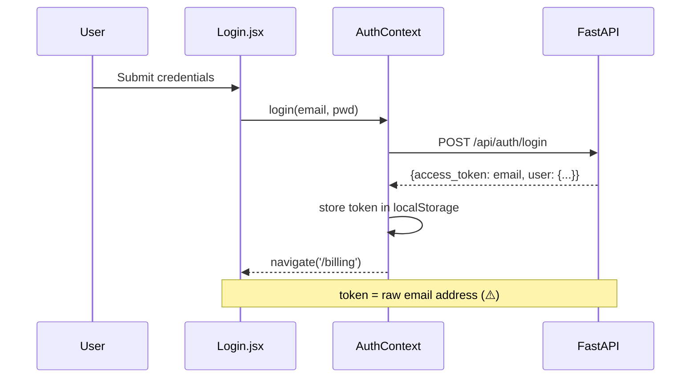
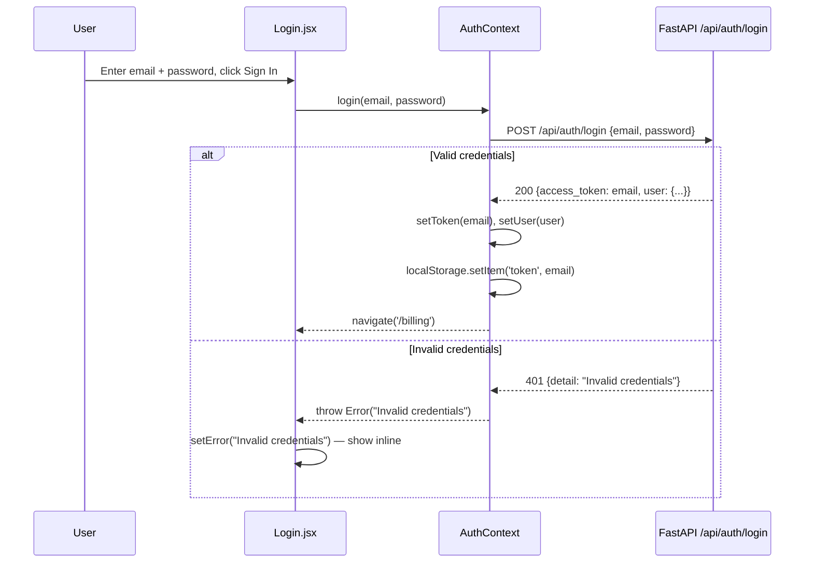
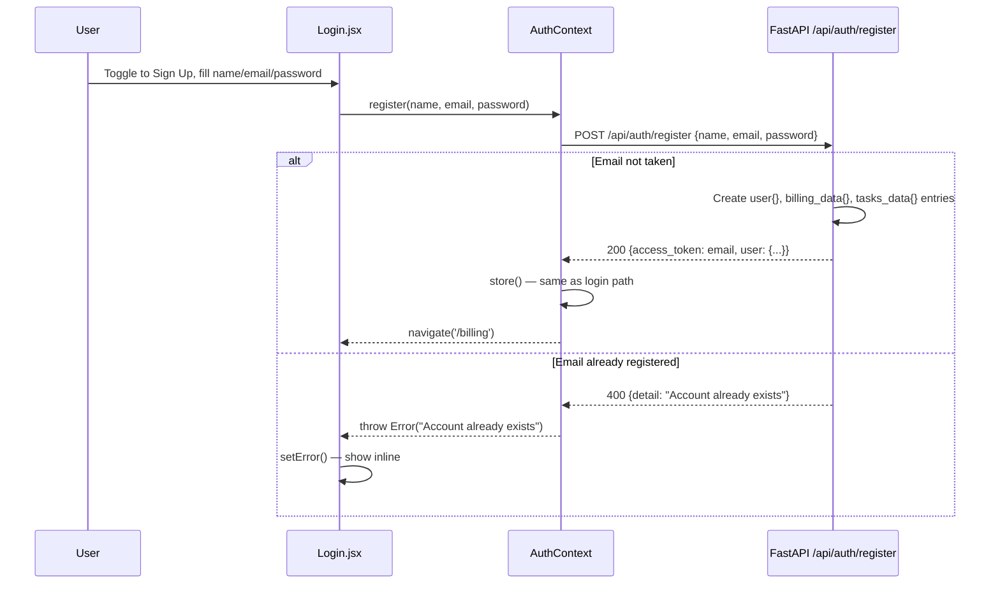
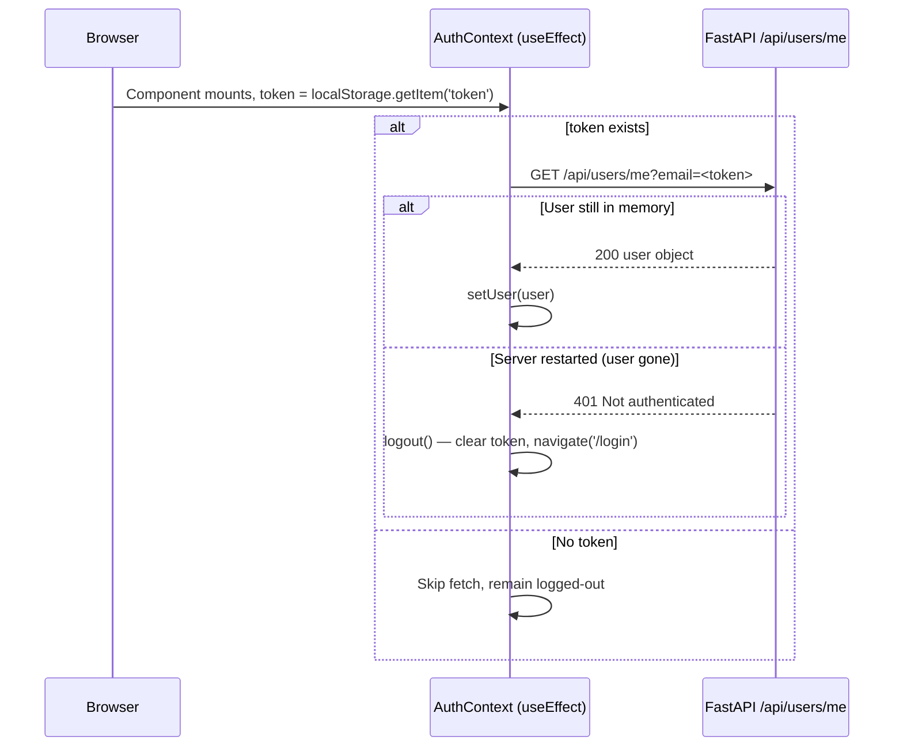
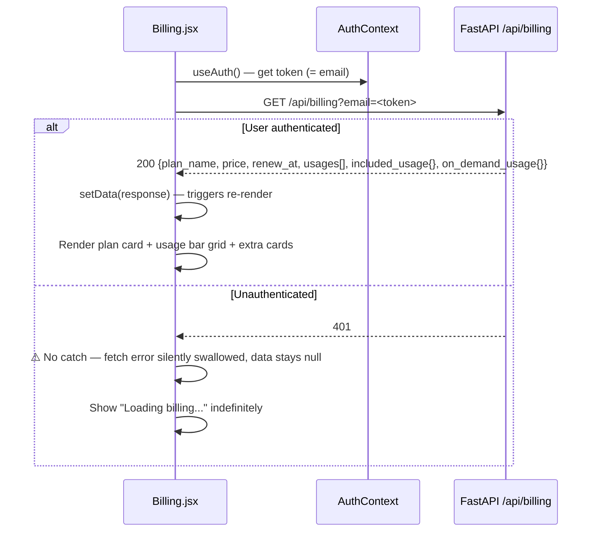
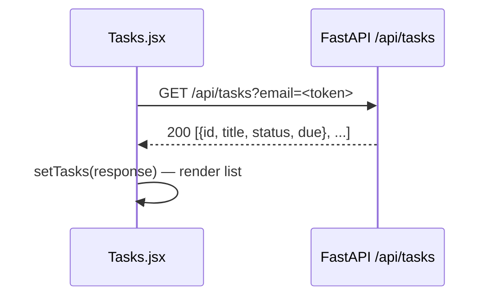
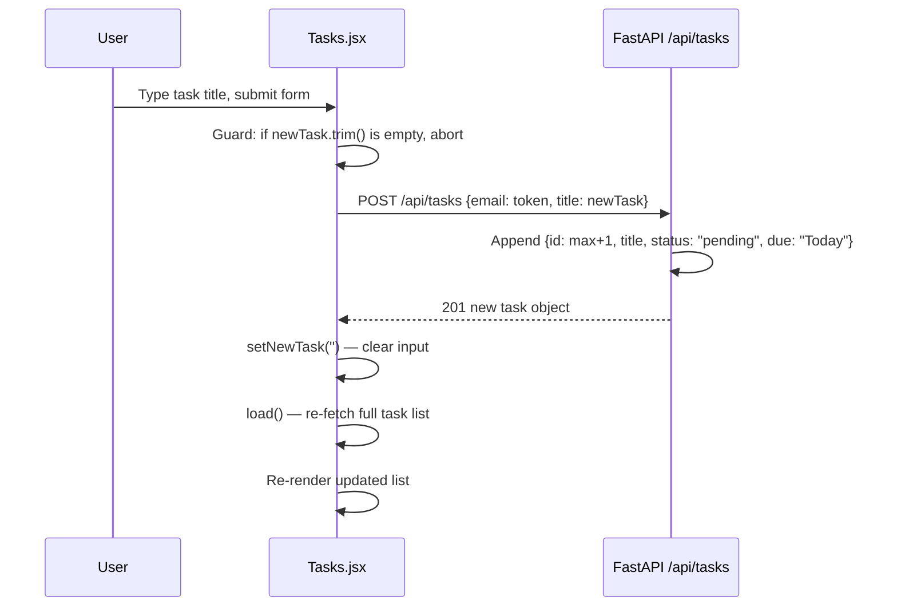
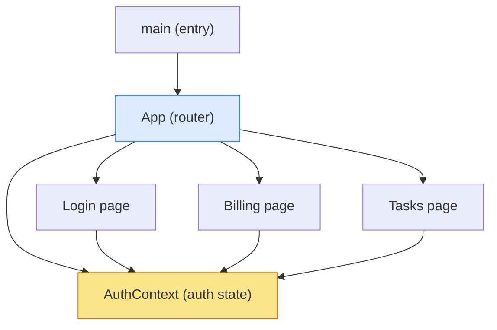

> **Source**: Atlas via Helix MCP (Helix solution document, serving as the Atlas deep-dive equivalent for this estate)
> **Server / tool**: helix (mcp__helix__) . get_solution_document_tool
> **Estate**: Billing-Cycle-AIRE-V1-Demo (solution_id 874) . repo Billing-Cycle (https://github.com/Shailendrayadav0666/Billing-Cycle, branch main, last_ingested_commit bcec649e08f2dbec435c24066deae6a1d6d71192)
> **Scope pulled**: Whole-repo deep dive (document_id 3155, version 28), pulled in full — the Epic touches the shared billing surface (backend/main.py, frontend Billing.jsx) so full-repo context applies
> **Fetched**: 2026-09-11T09:01:18Z
> **Freshness**: Deep dive document updated_at 2026-08-25T11:22:52Z (Helix-reported)

# Deep Dive Analysis: Billing-Cycle

**Created:** 2026-08-25
**For:** Shailendra
**Analysis Depth:** Exhaustive
**Status:** COMPLETE
**Steps Completed:** 13 of 13

> **Purpose:** Exhaustive system analysis covering architecture, flows, dependencies, code quality, testing, security, performance, and documentation with prioritized strategic recommendations.

---

## Scope Configuration

- **Analysis Focus:** All areas (comprehensive)
- **Code Quality Analysis:** Yes
- **Security Scan:** Yes

---

## Executive Summary

### System Overview

**Billing-Cycle** is a full-stack proof-of-concept (POC) application demonstrating a billing and task management portal. It is composed of a React 19 + Vite 8 single-page application on the frontend, backed by a FastAPI (Python) REST API server. The system supports user registration, login, billing plan display, and a task list — all served from a single Python process using in-memory Python dictionaries as its data layer.

At ~808 lines of code across 11 files, this is a deliberately compact POC. The React frontend communicates with the backend through 6 REST endpoints via a Vite dev proxy (development) or FastAPI's static file serving (production build). Authentication is implemented using the user's email address as a bearer token — a recognised POC shortcut that carries critical security implications before any production use.

The codebase is clean and readable for its scale. Its primary risks are not bugs but structural: the absence of a real database means all data is lost on server restart; the email-as-token authentication is trivially forgeable; and the absence of any test suite means changes carry unchecked regression risk. The technology choices themselves — React 19, FastAPI, Vite — are all modern and well-suited for production. The gap between POC and production-ready is primarily about adding infrastructure (database, authentication, tests, CI/CD) rather than replacing the application's core logic.

### Complexity Assessment

- **Overall Complexity:** Low (POC scale — single-process, no database, no external integrations)
- **Lines of Code:** ~808 LOC total (Python 213, JSX/JS 563, JSON 32)
- **Components:** 7 frontend modules + 1 backend module = 8 total
- **External Dependencies:** 8 frontend (npm) + 3 backend (pip) = 11 total
- **Technical Debt Level:** High — not in volume, but in severity: 4 critical security items block any production use

### Top 10 Critical Findings

1. **Security 🔴 Critical — Email-as-auth-token:** The user's raw email address is used as the authentication token, stored in `localStorage`, and passed as a `?email=` query parameter. It is trivially forgeable — any user can impersonate any other without a password.
2. **Security 🔴 Critical — Plain-text passwords:** Passwords are stored and compared in plain text in the in-memory `users` dict. No hashing, no salting.
3. **Architecture 🔴 Critical — No persistence:** All user, billing, and task data lives in Python dicts that reset on every server restart. There is no database. This is the foundational blocker for production use.
4. **Security 🔴 Critical — Broken CORS configuration:** `allow_origins=["*"]` combined with `allow_credentials=True` violates the CORS specification. Browsers will silently block credentialed cross-origin requests in production.
5. **Testing 🔴 Critical — Zero test coverage:** No test framework, no test files, no CI. Zero coverage across all 8 modules, including the authentication and route-guard logic.
6. **Security 🟡 High — Auth token in query parameters:** Even with JWT, the token transport via `?email=` causes credentials to appear in server access logs, browser history, and HTTP proxy caches.
7. **Dependency 🟡 High — No version pinning on backend:** All three backend dependencies (`fastapi`, `uvicorn`, `python-multipart`) are unpinned. Any `pip install` may break silently on a major version release.
8. **Quality 🟡 Medium — God module:** `backend/main.py` contains all Pydantic models, data stores, route handlers, and static file serving in a single 213-LOC file — untestable and unmaintainable at scale.
9. **Documentation 🟡 Medium — No dev setup guide:** There are no instructions for running the application. A new developer must reverse-engineer the run commands from reading the source files.
10. **Quality 🟡 Medium — Silent error swallowing:** All `fetch()` calls in `Billing.jsx` and `Tasks.jsx` use `.then().then()` chains with no `.catch()` — network errors and server failures are silently discarded with no user feedback.

### Risk Assessment

| Risk Category | Level | Impact | Mitigation Priority |
|---------------|-------|--------|---------------------|
| Security | 🔴 High | 4 critical vulnerabilities block any production or shared use | P0 — address before any deployment |
| Technical Debt | 🟡 Medium | Debt is severe in a few key areas (no DB, God module, no types) but the codebase is small and manageable | P1 — address in medium-term sprint |
| Scalability | 🔴 High | In-memory store makes horizontal scaling impossible; single process is a SPOF | P1 — requires database introduction |
| Maintainability | 🟡 Medium | Small codebase, clean naming, but God module and no types create future friction | P2 — improve via refactoring sprint |
| Documentation | 🟡 Medium | No setup guide, no API docs, no ADRs — high tribal knowledge dependency | P1 — setup guide is P0 for onboarding |

---

## Comprehensive Reconnaissance

### Directory Structure

```
Billing-Cycle/
├── backend/
│   ├── main.py                  # FastAPI app — all routes + in-memory data store (213 LOC)
│   ├── requirements.txt         # Python dependencies
│   └── .gitignore
└── frontend/
    ├── package.json             # npm manifest (React 19, Vite 8, React Router 7)
    ├── vite.config.js           # Vite build config + dev proxy
    ├── index.html               # HTML shell
    ├── .oxlintrc.json           # Oxlint linter config
    ├── .gitignore
    ├── public/
    │   ├── favicon.svg
    │   └── icons.svg
    └── src/
        ├── main.jsx             # React app bootstrap (10 LOC)
        ├── App.jsx              # Router, Layout, ProtectedRoute (79 LOC)
        ├── App.css              # Global styles
        ├── index.css            # Base reset/vars
        ├── assets/
        │   ├── hero.png
        │   ├── react.svg
        │   └── vite.svg
        ├── context/
        │   └── AuthContext.jsx  # Auth state + API calls (66 LOC)
        └── pages/
            ├── Login.jsx        # Login/Register split-screen form (157 LOC)
            ├── Billing.jsx      # Billing dashboard with usage cards (181 LOC)
            └── Tasks.jsx        # Task list + add task form (60 LOC)
```

### Technology Stack

**Programming Languages:**

| Language | Files | Lines of Code | Percentage |
|----------|-------|---------------|------------|
| JavaScript/JSX (React) | 7 | ~563 | 62% |
| Python | 1 | 213 | 23% |
| JSON | 2 | 32 | 4% |
| CSS | 2 | ~70 (est.) | 8% |
| HTML | 1 | ~12 (est.) | 1% |

**Frameworks & Libraries:**

| Framework/Library | Version | Purpose | Notes |
|-------------------|---------|---------|-------|
| React | ^19.2.8 | UI framework | Very latest (19.x) |
| React DOM | ^19.2.8 | DOM renderer | - |
| React Router DOM | ^7.18.2 | Client-side routing | Latest v7 |
| Vite | ^8.2.2 | Build tool + dev server | Latest major |
| @vitejs/plugin-react | ^6.1.0 | React HMR via Oxc | Latest |
| FastAPI | unpinned | Python REST API framework | No version pinned |
| Uvicorn [standard] | unpinned | ASGI server | No version pinned |
| python-multipart | unpinned | Form data parsing | No version pinned |
| Pydantic | (FastAPI dep) | Request body validation | Included via FastAPI |
| Oxlint | ^1.79.0 | Fast JS/TS linter (Rust-based) | Dev dependency |

**Build & Tooling:**

- **Build System:** Vite 8.2.x (ESM-native bundler)
- **Package Manager:** npm (package.json present, no lock file visible)
- **Linter:** Oxlint 1.79.x (Rust-based, replaces ESLint)
- **Testing Framework:** None detected — zero test files
- **CI/CD:** None detected — no `.github/`, `.gitlab-ci.yml`, or similar

### Comprehensive Statistics

| Metric | Value |
|--------|-------|
| Total Source Files | 11 code files |
| Total LOC (code only) | ~808 LOC |
| Frontend Files | 10 (7 JS/JSX + 2 JSON + 1 JS config) |
| Backend Files | 1 (main.py) |
| Test Files | **0 — no tests exist** |
| Config Files | 3 (vite.config.js, package.json, .oxlintrc.json) |
| Documentation Files | 2 (README.md, frontend/README.md) |
| Largest File | `Billing.jsx` (181 LOC) |
| Second Largest | `backend/main.py` (213 LOC — entire backend) |
| Average File Size | ~73 LOC |
| Code-to-Comment Ratio | Very low — backend has 1 inline comment, frontend has none |

### Entry Points

**Application Entry Points:**

- `frontend/src/main.jsx` — React DOM mount point, bootstraps `<App>` in StrictMode
- `backend/main.py` — FastAPI `app` object; run via `uvicorn main:app --port 8000`

**API Endpoints:** 6 endpoints in a single-file backend (`backend/main.py`)

| Method | Route | Description |
|--------|-------|-------------|
| POST | `/api/auth/login` | Authenticate with email/password, returns mock token |
| POST | `/api/auth/register` | Create new in-memory user account |
| GET | `/api/users/me?email=` | Fetch current user profile |
| GET | `/api/billing?email=` | Fetch billing plan + usage data |
| GET | `/api/tasks?email=` | Fetch task list |
| POST | `/api/tasks` | Add new task |

**CLI Interfaces:** None

**Background Jobs:** None

**Scheduled Tasks:** None

**Static File Serving (Production mode):**
- If `frontend/dist/` exists, FastAPI mounts it at `/` and serves the built React SPA

---

## Deep Architectural Analysis

### Architectural Style & Patterns

**Primary Style:** **Full-Stack Monolith (POC/Demo tier)** — single Python file backend + single-page React frontend. Both layers are intentionally minimal. The backend is a fat-module monolith (all logic, data, and routes in one file). The frontend is a small SPA with manual fetch calls and a single shared CSS file.

**Secondary Patterns Detected:**

- **Context Provider Pattern (React):** `AuthContext.jsx` wraps the app tree in an `AuthContext.Provider`, centralising auth state (token, user) and exposing `login`, `register`, `logout` actions. Consumed via `useAuth()` hook across all pages.
- **Protected Route Pattern:** `ProtectedRoute` component in `App.jsx` wraps authenticated routes; redirects to `/login` if no token present.
- **Proxy-forwarding dev setup:** Vite dev server proxies `/api/*` to `http://localhost:8000`, enabling seamless SPA ↔ backend communication in dev without CORS friction.
- **Static file serving (production mode):** FastAPI conditionally mounts `frontend/dist/` at `/` when the directory exists — a simple unified production deployment pattern.
- **Pydantic request validation:** All POST request bodies use Pydantic `BaseModel` subclasses (`LoginRequest`, `RegisterRequest`, `TaskCreateRequest`) — clean contract enforcement at the API boundary.
- **In-memory mock store:** Three Python dicts (`users`, `billing_data`, `tasks_data`) serve as ephemeral per-process storage — intentional for POC, data resets on restart.

**Anti-Patterns Detected:**

- **God Module — `backend/main.py`:** All concerns (data store, Pydantic models, route handlers, static serving) live in one 213-line file. As scope grows this becomes unmaintainable. *Impact: High coupling, untestable in isolation. Recommendation: Split into `routers/`, `models/`, `services/`, `store/` modules.*
- **Email-as-token (critical security flaw for any production use):** The "access token" is the user's raw email address, stored in `localStorage` and passed as a plain query parameter. *Impact: Trivially forgeable, no expiry, visible in server logs and browser history.*
- **Wildcard CORS (`allow_origins=["*"]`):** Accepts requests from any origin with `allow_credentials=True`. This combination is rejected by browsers (credentials + wildcard is a CORS spec violation) and dangerous if moved toward production.
- **Passwords stored in plain text in memory:** `users` dict holds `"password": "password"` literally. No hashing.
- **No error handling in frontend fetch calls:** `Billing.jsx` and `Tasks.jsx` call `.then(r => r.json()).then(setData)` with no `.catch()` — silently swallows API errors.
- **Hard-coded demo credentials pre-filled in Login form:** `email` defaulted to `"tpg@example.com"`, `password` to `"password"` in component state — fine for a demo, a security smell for anything beyond.

### Architecture Diagrams

#### High-Level System Architecture



#### Layer Diagram



#### Module Interactions



### Complete Component Catalog

| Component | Path | Responsibility | Complexity | Key Dependencies | Issues |
|-----------|------|----------------|------------|-----------------|--------|
| **FastAPI App** | `backend/main.py` | All backend: routes, data, models, static serving | Medium (but God module) | FastAPI, Pydantic, uvicorn | God module, no tests, plain-text passwords, email-as-token |
| **App** | `frontend/src/App.jsx` | Router setup, Layout shell, ProtectedRoute guard | Simple | react-router-dom, AuthContext | Route `/` goes to Login (no redirect to dashboard for logged-in users) |
| **AuthContext** | `frontend/src/context/AuthContext.jsx` | Auth state management, API calls for login/register/logout, session persistence | Medium | React Context, fetch, localStorage | Token = email, no token refresh, logout on any fetch error |
| **Login** | `frontend/src/pages/Login.jsx` | Login + Sign-up forms, split-screen marketing panel | Medium | AuthContext | Hard-coded demo credentials in state defaults |
| **Billing** | `frontend/src/pages/Billing.jsx` | Billing dashboard: plan card, usage bars, included/on-demand tiles | Medium | AuthContext, fetch | No error handling on fetch, no loading skeleton for sub-components |
| **Tasks** | `frontend/src/pages/Tasks.jsx` | Task list display + add-task form | Simple | AuthContext, fetch | No error handling, no task deletion/completion toggle, no optimistic updates |
| **Vite Config** | `frontend/vite.config.js` | Build config + `/api` dev proxy to `:8000` | Trivial | Vite, @vitejs/plugin-react | None |

### Architectural Assessment

**Strengths:**

- Clean separation of frontend and backend directories — easy to swap either independently
- Context Provider pattern for auth is idiomatic React and well-implemented
- ProtectedRoute pattern correctly guards authenticated pages
- Vite proxy setup eliminates CORS friction during development
- FastAPI + Pydantic give strong request validation with minimal boilerplate
- Conditional static-file serving is an elegant single-binary deployment pattern
- Codebase is very small and easy to understand end-to-end in one sitting

**Weaknesses:**

- `backend/main.py` is a God module — violates Single Responsibility Principle at the file level
- No real authentication — email-as-token is trivially forgeable
- Zero test coverage across the entire stack
- No error boundaries or fetch error handling in UI
- Frontend uses plain CSS with a single shared file — will cause cascading conflicts at scale
- No TypeScript — prop types and API response shapes are entirely implicit
- In-memory data store means all data is lost on every server restart

**Recommendations:**

- **Short-term:** Split `backend/main.py` into separate router modules (e.g. routers/auth, routers/billing, routers/tasks), a models package, and a store module — none of these exist yet and would need to be created
- **Short-term:** Replace email-as-token with JWT (e.g., `python-jose`) with proper expiry
- **Short-term:** Hash passwords with `bcrypt` or `passlib`
- **Medium-term:** Add TypeScript to the frontend for type safety
- **Medium-term:** Introduce a real database (SQLite for simplicity, or PostgreSQL for production)
- **Medium-term:** Add a component library or CSS Modules to eliminate style conflicts at scale

---

## Comprehensive Flow Analysis

**Flows Identified:** 6 total across 4 categories
**No data pipelines, integration flows, background jobs, or scheduled tasks exist** — consistent with the POC scope.

---

### Flow 1: Login Flow (Authentication)

**Purpose:** Authenticate an existing user, establish a client-side session, redirect to dashboard.



**Decision points:** Credentials checked against in-memory `users` dict. No rate limiting, no account lockout.
**Error handling:** Backend throws HTTP 401; frontend catches and displays inline error message.
**Edge cases:** No password complexity enforcement. No "forgot password" flow.

---

### Flow 2: Registration Flow (Authentication)

**Purpose:** Create a new in-memory user account with seeded billing data and a starter task.



**Note:** New user gets zeroed-out billing data (0 chat-credits used, 0 chatbots, etc.) and a single "Explore the dashboard" task pre-seeded.

---

### Flow 3: Session Restore Flow (Authentication)

**Purpose:** Re-hydrate user session from `localStorage` on page refresh/return visit.



**Critical edge case:** If the FastAPI server restarts, all in-memory users are wiped. Any active browser session will immediately get a 401 and be logged out — data loss with no warning to the user.

---

### Flow 4: Billing Dashboard Load

**Purpose:** Fetch and render the user's billing plan, usage metrics, and quota details.



**Error handling gap:** No `.catch()` on the fetch — a 401 or network error leaves the page stuck on "Loading billing..." forever.

---

### Flow 5: Task List Load

**Purpose:** Fetch and display the authenticated user's tasks.



**No error handling.** No empty-state messaging. No task completion toggle — status is display-only.

---

### Flow 6: Add Task Flow

**Purpose:** Create a new task for the authenticated user.



**Note:** Task due date is always hardcoded to `"Today"` — not configurable. No delete, no status toggle from the UI.

---

### Flow Interactions

- **Shared component:** `AuthContext` is the hub of all data flows — every page component depends on it for the `token` value used as the auth credential in every API call.
- **Token coupling:** The `token` is the user's email — it serves simultaneously as session identifier, authentication credential, and API query parameter. This creates a tight coupling: any component that calls the API must know the token format (email).
- **No concurrency concerns:** All flows are synchronous request/response with no shared mutable state between flows. The React state updates via `useState` are non-concurrent.
- **Server-restart data loss:** The biggest cross-cutting concern — all flows that depend on authenticated state will silently fail if the FastAPI process restarts, because all user data is in-memory only. The session restore flow handles this case (logout) but the user experience is abrupt.
- **Re-fetch pattern:** The task add flow does a full re-fetch after mutation (optimistic updates not used) — correct but slightly inefficient.

---

## Exhaustive Dependency Analysis

### Internal Dependencies

#### Dependency Graph



#### Coupling Metrics

| Module | Afferent Coupling (Ca) | Efferent Coupling (Ce) | Instability (Ce/Ca+Ce) | Assessment |
|--------|------------------------|------------------------|------------------------|------------|
| `AuthContext.jsx` | 4 (App, Login, Billing, Tasks) | 1 (fetch/localStorage) | 0.2 | Stable — core hub |
| `App.jsx` | 1 (main.jsx) | 4 (AuthContext, Login, Billing, Tasks) | 0.8 | Unstable — orchestrator |
| `Login.jsx` | 1 (App) | 1 (AuthContext) | 0.5 | Balanced |
| `Billing.jsx` | 1 (App) | 1 (AuthContext) | 0.5 | Balanced |
| `Tasks.jsx` | 1 (App) | 1 (AuthContext) | 0.5 | Balanced |
| `main.jsx` | 0 | 1 (App) | 1.0 | Entry point — expected |
| `backend/main.py` | 0 | 4 (fastapi, pydantic, pathlib, datetime) | 1.0 | God module — all deps concentrated |

#### Circular Dependencies

**None detected.** The dependency graph is a clean tree: `main.jsx → App.jsx → {AuthContext, pages}`. Pages depend on AuthContext but AuthContext does not depend on pages. No circular paths exist.

### External Dependencies

#### Frontend (package.json)

| Dependency | Current Ver | Purpose | License | Vulnerabilities | Update Rec |
|------------|-------------|---------|---------|-----------------|------------|
| react | ^19.2.8 | UI component framework | MIT | None known | ✅ Latest major |
| react-dom | ^19.2.8 | DOM renderer | MIT | None known | ✅ Latest major |
| react-router-dom | ^7.18.2 | Client-side routing | MIT | None known | ✅ Latest major |
| vite | ^8.2.2 | Build tool + dev server | MIT | None known | ✅ Latest major |
| @vitejs/plugin-react | ^6.1.0 | React HMR via Oxc transformer | MIT | None known | ✅ Latest |
| @types/react | ^19.2.18 | TypeScript types for React | MIT | N/A (dev) | ✅ Current |
| @types/react-dom | ^19.2.4 | TypeScript types for React DOM | MIT | N/A (dev) | ✅ Current |
| oxlint | ^1.79.0 | Rust-based JS/TS linter | MIT | N/A (dev) | ✅ Current |

**Frontend dependency health: Excellent** — all dependencies are at current major versions. No version pinning issues. The `^` semver ranges are appropriate.

#### Backend (requirements.txt)

| Dependency | Version Pinned | Purpose | Notes | Update Rec |
|------------|---------------|---------|-------|------------|
| fastapi | ❌ No version | REST API framework | Brings Starlette + Pydantic | ⚠️ Pin version |
| uvicorn[standard] | ❌ No version | ASGI server (websockets, uvloop, httptools) | Production-grade server | ⚠️ Pin version |
| python-multipart | ❌ No version | Multipart form data parsing | Required by FastAPI forms | ⚠️ Pin version |

**Backend dependency health: Concerning** — zero version pinning. Any `pip install -r requirements.txt` will pull the latest version of every package, risking silent breaking changes when FastAPI or Pydantic release major versions. This is a critical gap for any environment beyond local dev.

### External Service Integrations

**None.** The system is entirely self-contained. No external APIs, message queues, third-party services, webhooks, or CDNs are integrated. All data is served from the in-memory store within the FastAPI process.

### Database Analysis

**No database.** The system uses Python dicts as the data layer:

| Store | Type | Key | Contents | Persistence |
|-------|------|-----|----------|-------------|
| `users` | `dict[email → user_obj]` | Email address | id, name, email, password (plain), plan, price, renew_at | ❌ In-memory only |
| `billing_data` | `dict[email → billing_obj]` | Email address | plan_name, price, renew_at, usages[], included_usage, on_demand_usage | ❌ In-memory only |
| `tasks_data` | `dict[email → list[task]]` | Email address | List of {id, title, status, due} | ❌ In-memory only |

**Migration strategy:** None — no migration tooling. Adding a real database would require introducing SQLAlchemy (or similar), creating schema definitions, and writing data migration scripts. The in-memory dict structure maps reasonably to relational tables: `users`, `billing_plans`, `usage_metrics`, `tasks`.

**Query patterns:** Direct dict lookups (`dict.get(email)`) — O(1) performance, but in-memory data is reset on every process restart.

**Recommended path to persistence:** SQLite (zero-config, file-based) is the lowest-friction upgrade; PostgreSQL for production scale.

---

## Code Quality & Technical Debt

**Overall Quality Assessment: Fair** — Clean and readable for a POC, but carrying significant structural and security debt that would block any production use.

### Quality Metrics

| File | LOC | Functions | Complexity | Assessment |
|------|-----|-----------|------------|------------|
| `backend/main.py` | 213 | 6 route handlers | Medium-High (God module) | ⚠️ Entire backend in one file |
| `frontend/src/pages/Billing.jsx` | 181 | 9 (incl. sub-components) | Low-Medium | Inline SVG components inflate LOC |
| `frontend/src/pages/Login.jsx` | 157 | 7 | Low | Large due to inline SVG feature list |
| `frontend/src/context/AuthContext.jsx` | 66 | 8 | Medium | Core hub — right size |
| `frontend/src/App.jsx` | 79 | 5 | Low | Well-structured |
| `frontend/src/pages/Tasks.jsx` | 60 | 7 | Low | Compact and clean |
| `frontend/src/main.jsx` | 10 | 0 | Trivial | Entry point only |

**Average function complexity:** Low overall — the codebase is small enough that no function exceeds ~30 LOC, and none use deep nesting.
**Code-to-comment ratio:** Very low — essentially zero comments across both frontend and backend (backend has 1 line comment: `# In-memory mock store (no database)`).

### Code Duplication

**Estimated duplication: ~25%** — primarily in these patterns:

1. **Billing data initialization block (High):** The entire `billing_data` dict structure is duplicated verbatim between the module-level initialisation (lines 31–75) and the `register()` handler (lines 127–169). If the shape of billing data changes, it must be updated in two places.
2. **In-memory mock structure repeated per user:** Each new registered user gets a copy of the same billing template with slightly different default values. This should be a factory function.
3. **`InfoIcon` SVG component (Low):** Inline SVG used in two places within `Billing.jsx` — already factored into a component (`InfoIcon`), so this is handled well.
4. **`useAuth()` import pattern:** Every page file imports `useAuth` from `../context/AuthContext` — unavoidable boilerplate, not problematic duplication.

### Code Smells Detected

| Smell | Location | Severity | Description |
|-------|----------|----------|-------------|
| **God Module** | `backend/main.py` | 🔴 High | All models, data, routes, and static serving in one file |
| **Data Clump** | `backend/main.py` lines 19–29 & 127–169 | 🔴 High | Billing/user data structure duplicated instead of using a factory function |
| **Magic Strings** | `backend/main.py` — `"tpg@example.com"`, `"password"`, `"Standard"`, `"$20/month"` | 🟡 Medium | Hard-coded values scattered inline — should be constants or config |
| **Magic Strings (frontend)** | `Login.jsx` lines 8–9 | 🟡 Medium | Demo credentials hard-coded as default state values |
| **Missing abstraction — API client** | All 3 page files | 🟡 Medium | `fetch('/api/...')` calls scattered directly in components with no central HTTP client or error wrapper |
| **Dead/unused parameter** | `backend/main.py` `/api/users/me` — `email` is a query param, not a header | 🟡 Medium | Using email as both auth credential and query param — a design smell |
| **No error handling** | `Billing.jsx`, `Tasks.jsx` | 🟡 Medium | `.then().then()` with no `.catch()` — swallows all errors silently |
| **Hard-coded task due date** | `backend/main.py` line 204 | 🟢 Low | `"due": "Today"` always — no date logic |
| **Inline SVG clutter** | `Login.jsx` (3 SVGs), `Billing.jsx` (3 SVGs) | 🟢 Low | SVG markup embedded inline inflates component LOC — should be in an icon component or sprite |
| **Flat CSS** | `App.css` shared across all components | 🟢 Low | Global CSS with no scoping — will cause conflicts as app grows |

### Technical Debt Inventory

#### 🔴 High Priority (blocking production use)

| # | Debt Item | Location | Impact | Effort |
|---|-----------|----------|--------|--------|
| 1 | Email used as auth token — trivially forgeable | `AuthContext.jsx`, all API calls | Critical security risk | Medium — requires JWT library |
| 2 | Passwords stored in plain text | `backend/main.py` `users` dict | Critical security risk | Low — add passlib/bcrypt |
| 3 | Wildcard CORS with credentials | `backend/main.py` lines 10–16 | CORS spec violation in browsers | Low — restrict origins |
| 4 | No backend version pinning | `backend/requirements.txt` | Silent breaking changes on install | Low — add pinned versions |
| 5 | In-memory data store | All backend dicts | Total data loss on server restart | High — requires database introduction |

#### 🟡 Medium Priority (quality improvements)

| # | Debt Item | Location | Impact | Effort |
|---|-----------|----------|--------|--------|
| 6 | Billing data initialisation duplicated | `backend/main.py` | Double maintenance burden | Low — extract factory function |
| 7 | No central API client | Frontend pages | Silent error swallowing, inconsistent fetch | Low — create api.js helper |
| 8 | God module backend | `backend/main.py` | Untestable, unmaintainable at scale | Medium — split into routers |
| 9 | No TypeScript | Frontend | Implicit prop/API types — bugs caught at runtime only | High — full migration effort |

#### 🟢 Low Priority / Acceptable for POC

| # | Debt Item | Location | Notes |
|---|-----------|----------|-------|
| 10 | Inline SVG components | Login, Billing pages | Extract to icon library when scaling |
| 11 | Global flat CSS | App.css | Switch to CSS Modules or styled-components |
| 12 | Hard-coded "Today" due date | backend tasks | Trivial to fix but low value in POC context |

### TODO/FIXME Comments

**Zero TODO/FIXME/HACK comments found** across the entire codebase. Either the debt is implicit (no annotations) or the codebase is intentionally clean of markers. The absence of annotations means technical debt must be inferred from code inspection rather than markers — which this analysis has done.

---

## Test Coverage Analysis

### Test Suite Overview

| Test Type | Count | % of Suite |
|-----------|-------|------------|
| Unit | 0 | — |
| Integration | 0 | — |
| End-to-End | 0 | — |
| **Total** | **0** | **—** |

**Testing Framework:** None — no test runner, no test framework, no test configuration files detected anywhere in the repository (no `pytest.ini`, no `vitest.config.*`, no `jest.config.*`, no `__tests__/` directories).

**Coverage:** 0% — not measurable (no coverage tooling, no tests to measure).

### Coverage by Component

| Component | Coverage | Assessment |
|-----------|----------|------------|
| `backend/main.py` (6 route handlers) | 0% | 🔴 Critical — auth and data logic untested |
| `AuthContext.jsx` (login/register/logout) | 0% | 🔴 Critical — core auth flows untested |
| `Billing.jsx` | 0% | 🔴 No UI tests |
| `Login.jsx` | 0% | 🔴 No UI tests |
| `Tasks.jsx` | 0% | 🔴 No UI tests |
| `App.jsx` (routing + ProtectedRoute) | 0% | 🔴 Route guard untested |

### Testing Gaps

1. **Auth flow (login/register)** — The most critical path has zero coverage. No tests validate correct credential checking, token storage, or error surfacing.
2. **Protected route guard** — `ProtectedRoute` redirect logic is untested. A regression here could allow unauthenticated access to the dashboard.
3. **API endpoint contracts** — All 6 FastAPI endpoints lack tests. Any change to request/response shape is invisible until it breaks in production.
4. **Session restore logic** — The `useEffect` in `AuthContext` that restores sessions from `localStorage` has edge cases (server restart, invalid token) that are completely untested.
5. **Task creation flow** — The `POST /api/tasks` end-to-end path (form → API → list refresh) has no integration test.
6. **Error states** — No tests cover error paths: invalid credentials, network failure, server restart.

### Testing Recommendations

1. **Add pytest to backend** — Introduce `pytest` + `httpx` (FastAPI's recommended test client) to cover all 6 route handlers. Estimated: 1–2 days.
2. **Add Vitest to frontend** — Vite projects have first-class Vitest support; drop-in, near-zero config. Estimated: 0.5 days setup.
3. **Add React Testing Library** — For component tests covering `AuthContext`, `ProtectedRoute`, and form submissions.
4. **Priority order:** Auth flows → Protected route guard → API contracts → Component rendering → Error states.
5. **Coverage target:** Aim for 80%+ statement coverage on `backend/main.py` and `AuthContext.jsx` as the two highest-risk components.

### Testing Recommendations

[Priority areas, refactoring opportunities, strategy improvements]

---

## Security Considerations

> **Disclaimer:** This is NOT a security audit. This is a pattern-based review that flags areas for professional security assessment. Any critical findings should be validated by a qualified security professional before acting on them.

### Authentication Pattern Assessment

| Area | Implementation | Risk Level |
|------|---------------|------------|
| **Auth mechanism** | Email/password + email-as-token | 🔴 Critical |
| **Token type** | Raw email address in `localStorage` | 🔴 Critical — trivially forgeable |
| **Token transport** | Query parameter (`?email=`) | 🔴 Critical — visible in server logs and browser history |
| **Token expiry** | None — no expiry, no refresh | 🔴 Critical |
| **Password hashing** | None — plain text in memory | 🔴 Critical |
| **Session invalidation** | Client-side only (localStorage remove) | 🟡 Medium — server has no concept of "logged out" |

### Authorization Pattern Assessment

| Area | Implementation | Risk Level |
|------|---------------|------------|
| **Frontend route guard** | `ProtectedRoute` checks `token` presence | 🟡 Medium — only checks client-side token, not server-side |
| **Backend authorization** | Email query param lookup against `users` dict | 🔴 Critical — any valid email in the dict grants access to that user's data |
| **Cross-user data access** | Not prevented — any caller can pass any email | 🔴 Critical — there is no true authorization |
| **Role-based access** | None | N/A for POC |

### Input Validation Assessment

| Area | Implementation | Risk Level |
|------|---------------|------------|
| **Backend POST bodies** | Pydantic models validate field types | ✅ Good |
| **Email format validation** | HTML `type="email"` on frontend input | 🟡 Partial — browser-side only |
| **SQL injection** | Not applicable — no SQL database | ✅ N/A |
| **Task title sanitization** | No sanitization — raw string stored | 🟢 Low risk (data stays in memory, not rendered as HTML unsafely) |

### Output Encoding & XSS

React escapes JSX expressions by default — `{t.title}` in `Tasks.jsx` renders as text, not HTML. **No `dangerouslySetInnerHTML` usage detected.** XSS risk from the task title is low given React's default escaping.

### Secret Management

| Area | Status | Risk |
|------|--------|------|
| Hardcoded demo user (`tpg@example.com` / `password`) | Present in `backend/main.py` lines 19–29 | 🟡 Demo context only — remove before any deployment |
| Hardcoded credentials in Login form defaults | `Login.jsx` lines 8–9 | 🟡 Demo UX pattern — remove before production |
| Environment variables | None used anywhere | 🟡 No `.env` file — nothing to leak, but no config isolation either |
| Secrets in code | None (no API keys, no DB credentials) | ✅ Clean — consistent with no external integrations |

### CORS Configuration

```python
# backend/main.py lines 10-16
app.add_middleware(
    CORSMiddleware,
    allow_origins=["*"],      # ← wildcard
    allow_credentials=True,   # ← credentials
    ...
)
```
**Risk: 🔴 Critical for production** — The CORS specification prohibits `allow_origins=["*"]` combined with `allow_credentials=True`. Modern browsers will reject credentialed cross-origin requests when the origin is a wildcard. This configuration silently fails in production. Fix: specify exact allowed origins.

### Top Security Recommendations

1. **🔴 Replace email-as-token with JWT** — Use `python-jose` or `PyJWT` to issue signed tokens with expiry (`exp` claim). This is the single highest-priority security fix.
2. **🔴 Hash passwords** — Add `passlib[bcrypt]` to requirements and hash passwords on registration. Never store or compare plain text.
3. **🔴 Fix CORS** — Replace `allow_origins=["*"]` with `allow_origins=["http://localhost:5173"]` for dev, and explicit production origin(s) for deployment.
4. **🔴 Move auth credential to Authorization header** — Replace `?email=` query param with `Authorization: Bearer <token>` header on all API calls. This prevents credential logging.
5. **🟡 Remove demo credentials** — Remove the hard-coded `tpg@example.com` / `password` defaults before any non-POC use.
6. **🟡 Add rate limiting** — FastAPI has no rate limiting configured. Login endpoints should be rate-limited to prevent brute force.

**Professional security review recommended: Yes** — before any production deployment of this application.

---

## Performance & Scalability Analysis

### Performance Patterns

**Performance issues found: 5**

| # | Issue | Location | Impact |
|---|-------|----------|--------|
| 1 | **Full task list re-fetch after every add** | `Tasks.jsx` — `add()` calls `load()` post-POST | Minor now, grows linearly with task count |
| 2 | **No pagination on task list** | `GET /api/tasks` returns all tasks for a user | Low now, would degrade with large datasets |
| 3 | **No AbortController on useEffect fetches** | `Billing.jsx`, `Tasks.jsx` | Component unmount during in-flight fetch triggers React "state update on unmounted component" warning — minor memory leak |
| 4 | **No HTTP caching headers on API responses** | All 6 endpoints | Browser re-fetches billing/user data on every route navigation even when data is unchanged |
| 5 | **Billing data duplication in register** | `backend/main.py` lines 127–169 | Minor CPU — same large dict constructed twice on every register call |

**N+1 patterns:** None — queries are O(1) dict lookups, not relational joins.
**Async vs sync:** Route handlers are synchronous Python functions, which is correct for CPU-bound dict operations. No blocking I/O to convert.

### Caching Analysis

| Layer | Current State | Opportunity |
|-------|--------------|-------------|
| Browser cache | None — no `Cache-Control` headers | Add `Cache-Control: max-age=60` to `/api/billing` — plan info rarely changes |
| Server-side cache | Not applicable — in-memory dict is effectively a cache already | Introduce Redis if/when a real DB is added |
| React component state | `data` state in `Billing.jsx` cached for component lifetime | ✅ Effective — billing doesn't re-fetch on re-render |
| localStorage | Token persisted across sessions | ✅ Appropriate use of browser storage |

**Cache invalidation strategy:** N/A — the in-memory dict is the single source of truth; no cache to invalidate.

### Scalability Considerations

**Horizontal scaling readiness: ❌ Not horizontally scalable in current form**

| Component | Stateful? | Horizontal Scale? | Reason |
|-----------|-----------|------------------|--------|
| FastAPI process | ✅ Yes — all data in-memory | ❌ No | Data is per-process; two instances diverge immediately |
| React SPA | ❌ Stateless | ✅ Yes | Any CDN can serve the built assets |
| Browser session | ✅ Yes — token in localStorage | ⚠️ Partial | Token must route to the same backend instance |

**Bottlenecks:**
- **FastAPI process is both server and database** — the Python process is a SPOF. Crash = total data loss + immediate session invalidation for all users.
- **No request rate limiting** — unbounded concurrent connections accepted; no backpressure mechanism.
- **No health endpoint** — no `/health` or `/ready` route for load balancer or orchestration health checks.

### Performance Recommendations

**Quick Wins (< 1 day each):**
1. Add `AbortController` to `useEffect` fetch calls in `Billing.jsx` and `Tasks.jsx` to cancel in-flight requests on unmount.
2. Add `Cache-Control: max-age=60` to the `/api/billing` response — it changes only on plan upgrade.
3. Use optimistic UI in `Tasks.jsx` — append the new task to local state immediately instead of re-fetching the full list after POST.
4. Extract a `create_default_billing()` factory function in `backend/main.py` to eliminate the data-init duplication.

**Strategic Improvements (requires architectural change):**
1. Introduce a persistent database — eliminates the SPOF, enables horizontal scaling, and survives server restarts.
2. Add a `GET /health` endpoint returning `{"status": "ok"}` for orchestration / load balancer health checks.
3. Add pagination (`?page=&limit=`) to `GET /api/tasks` before the list grows large.
4. After JWT auth is added, consider SlowAPI (FastAPI rate-limiting) on the login/register endpoints.

**Monitoring Recommendations:**
- Track API response times per endpoint (FastAPI middleware or an APM agent like Datadog / New Relic)
- Alert on 5xx rate > 1% over 5 minutes
- Monitor process memory usage (in-memory store grows with every registered user)

---

## Documentation Audit

### Existing Documentation Assessment

| Document Type | Status | Quality (1–5) | Completeness | Notes |
|---------------|--------|---------------|--------------|-------|
| Root README | ✅ Exists | 2/5 | ~30% | High-level description only; no setup instructions found |
| Frontend README | ✅ Exists | 2/5 | ~25% | Vite boilerplate default — generic, not project-specific |
| API Documentation | ❌ Missing | — | 0% | No Swagger customisation, no written API doc |
| Architecture Docs | ❌ Missing | — | 0% | No ADRs, no design decisions recorded |
| Setup / Deploy Guide | ❌ Missing | — | 0% | No step-by-step dev setup or production deploy guide |
| Troubleshooting Guide | ❌ Missing | — | 0% | No runbook, no known-issues list |
| Runbooks | ❌ Missing | — | 0% | No operational runbooks |
| Inline Code Comments | ⚠️ Minimal | 1/5 | ~5% | One comment in backend (`# In-memory mock store`) — zero in frontend |

**Auto-generated API docs:** FastAPI provides `/docs` (Swagger UI) and `/redoc` out of the box — these exist at runtime but are not customised (no descriptions, no example values, no tags). They serve as a basic reference but are not a substitute for written API documentation.

### Code Comment Quality

- **Backend:** 1 inline comment across 213 LOC — `# In-memory mock store (no database)` on line 18. The rest is uncommented.
- **Frontend:** Zero comments across 553 LOC of JSX. Components, hooks, and business logic are entirely self-documenting in naming only.
- **Self-documenting quality:** Variable and function names are generally clear (`login`, `register`, `logout`, `store`, `load`, `add`). The code is readable, but critical decisions (e.g. why email is the token) are not explained anywhere.

### Critical Knowledge Gaps

1. **Dev environment setup** — There is no documented procedure for running the app locally. A new developer must infer: Python version, venv creation, pip install, uvicorn start command, npm install, npm run dev. This is a Day 1 blocker.
2. **Auth token design decision** — The use of email-as-token is an unconventional choice with no documented rationale. Is it intentional (POC shortcut)? Temporary? This is invisible tribal knowledge.
3. **Production deployment path** — The conditional static file mount (`if dist_dir.is_dir()`) implies a prod deployment model (build frontend → serve from FastAPI), but this is undocumented. No one would discover it without reading `backend/main.py`.
4. **Data model** — The shape of `billing_data`, `users`, and `tasks_data` is implicit in the Python dict literals. No schema, no ER diagram, no field-level documentation.
5. **Seed data** — The demo user `tpg@example.com` / `password` is undocumented. A new developer must find it by reading `backend/main.py` line 19–29.
6. **CORS intent** — The wildcard CORS is a known-broken config (see Security section) with no comment explaining it was intentional for dev convenience.

### Tribal Knowledge Dependencies

- **How to log in during development** — requires knowing the hardcoded demo credentials, discoverable only by reading source code.
- **What happens on server restart** — all data is lost; sessions invalidated. Completely undocumented.
- **Frontend-backend integration in dev vs prod** — Vite proxy (`/api → :8000`) vs FastAPI static mount. Two different integration modes, neither documented.

### Documentation Priorities

**Priority 1 — Critical (Blocking Onboarding):**
1. Development setup guide (Python + Node, run commands, expected URLs)
2. Demo credentials / seed data reference
3. Architecture overview (one-page: what each file does, how frontend+backend connect)

**Priority 2 — High (Complex or Risky Areas):**
4. Auth design rationale (email-as-token = POC shortcut; JWT is the production replacement)
5. API contract documentation (augment FastAPI `/docs` with field descriptions and example values)
6. Production deployment guide (build steps, serve mode, environment requirements)

**Priority 3 — Medium (Quality Improvements):**
7. Inline comments on non-obvious logic (billing data factory, CORS config intent)
8. Architecture Decision Records for key design choices (in-memory store, no TypeScript, Vite proxy)
9. Troubleshooting guide (server restart data loss, CORS errors in production)

---

## Comprehensive Recommendations

### Immediate Actions (Do Now)

> These items pose active risk even in a POC context. Address before any sharing, demo, or deployment beyond the developer's machine.

| # | Action | Severity | Effort | Why It Can't Wait |
|---|--------|----------|--------|-------------------|
| 1 | **Replace email-as-token with JWT** (`python-jose` or `PyJWT`) | 🔴 Critical | 1–2 days | Token is trivially forgeable; any user can impersonate any other by typing their email |
| 2 | **Hash passwords with bcrypt** (`passlib[bcrypt]`) | 🔴 Critical | 0.5 days | Passwords are stored and compared in plain text — a data dump exposes every user |
| 3 | **Fix CORS: replace `allow_origins=["*"]` with explicit origin** | 🔴 Critical | 0.5 hours | Wildcard + credentials is a spec violation; browsers silently block in production |
| 4 | **Move auth token to `Authorization: Bearer` header** | 🔴 Critical | 1 day | Email in `?email=` query param appears in server logs, browser history, and proxy caches |
| 5 | **Pin all backend dependencies in `requirements.txt`** | 🟡 High | 1 hour | Unpinned deps break silently on next `pip install`; reproducibility is zero |
| 6 | **Write a dev setup README** | 🟡 High | 2 hours | A new developer has no documented path to running the app — Day 1 is blocked |

### Short-Term Improvements (Next Sprint)

> High-value, low-effort improvements that significantly raise quality without architectural changes.

| # | Improvement | Value | Effort |
|---|-------------|-------|--------|
| 1 | **Remove hardcoded demo credentials from `Login.jsx` defaults** | Security hygiene | 15 minutes |
| 2 | **Create a central `api.js` fetch helper** wrapping all `fetch('/api/...')` calls with error handling | Eliminates silent error swallowing across all pages | 0.5 days |
| 3 | **Add `.catch()` handlers to all fetch chains** in `Billing.jsx` and `Tasks.jsx` | Surfaces network errors to user instead of silently failing | 1 hour |
| 4 | **Extract billing factory function** in `backend/main.py` (eliminates the ~40-line duplication) | Reduces maintenance burden, improves readability | 1 hour |
| 5 | **Add `AbortController` to `useEffect` fetches** in `Billing.jsx` and `Tasks.jsx` | Eliminates React "state update on unmounted component" warnings | 1 hour |
| 6 | **Add FastAPI startup event to log a clear "DATA IS IN-MEMORY" warning** | Prevents future confusion about data loss on restart | 30 minutes |
| 7 | **Add a `GET /health` endpoint** returning `{"status":"ok"}` | Enables load balancers, container orchestrators, uptime monitors | 15 minutes |

### Medium-Term Strategy (Next Quarter)

> Architectural changes required to make the system production-capable.

| # | Initiative | Current State | Target State | Effort |
|---|-----------|--------------|-------------|--------|
| 1 | **Introduce persistent database (SQLite → PostgreSQL)** | In-memory dicts — data lost on restart | SQLAlchemy + Alembic migrations + persistent store | 1–2 weeks |
| 2 | **Split `backend/main.py` God module into FastAPI routers** | 213-LOC single file: models + data + routes + static serving | Separate router modules for auth, billing, and tasks; separate models and schemas packages (target structure — files do not yet exist) | 2–3 days |
| 3 | **Add test suite** (pytest + Vitest + React Testing Library) | Zero tests | 80% statement coverage on auth flows + all API endpoints | 1–2 weeks |
| 4 | **Migrate frontend to TypeScript** | JSX without types — prop/API shape errors caught at runtime only | `.tsx` files with typed API responses and component props | 3–5 days |
| 5 | **Implement pagination on `GET /api/tasks`** | Returns all tasks unbounded | `?page=&limit=` with total count in response | 0.5 days |
| 6 | **Document the API** (augment FastAPI `/docs` with field descriptions, examples, tags) | Auto-generated, undecorated Swagger UI | Annotated endpoints with examples and descriptions | 1 day |

### Long-Term Evolution (6–12 Months)

> Strategic redesigns that evolve the POC into a production-grade, scalable system.

| # | Evolution | Current Tech | Proposed Path | Benefit | Effort |
|---|-----------|-------------|--------------|---------|--------|
| 1 | **Horizontally scalable backend** | Single-process FastAPI (data in-memory) | FastAPI + PostgreSQL + Redis for sessions | Multi-instance deployment, zero data loss | 2–4 weeks |
| 2 | **Role-based access control (RBAC)** | Email-based identity only, no roles | Introduce user roles (admin, user) with scoped API permissions | Multi-tenant readiness | 1 week (after JWT) |
| 3 | **CI/CD pipeline** | No automation — manual run only | GitHub Actions: lint → test → build → deploy on PR merge | Automated quality gates, consistent deployments | 1–2 days setup |
| 4 | **Frontend state management** | Direct `useContext` + local component state | TanStack Query (React Query) for server state, caching, and background refetching | Eliminates manual fetch/loading/error boilerplate | 3–5 days |
| 5 | **Observability stack** | No monitoring | Add structured logging (structlog), APM (OpenTelemetry), error tracking (Sentry) | Operational visibility for production | 1 week |
| 6 | **Containerisation** | No Docker — manual install only | Dockerfile + `docker-compose.yml` for backend + optional frontend | Reproducible environments, cloud deployment readiness | 1 day |

### Suggested Follow-Up Workflows

- **`generate-readme`** — The dev setup guide identified as Priority 1 blocking gap can be generated as a full README directly from the codebase. Highest immediate ROI.
- **`document-apis`** — Extract and document all 6 API endpoints with request/response schemas, error codes, and examples. Pairs with the medium-term API documentation goal.
- **`assess-tech-debt`** — Deep-dive technical debt analysis with a formal remediation plan and story-point effort estimates. Feeds directly into sprint planning.
- **`migration-strategy`** — Design the full modernization roadmap: in-memory → database, plain auth → JWT, JSX → TypeScript. Structured path from POC to production.
- **`capture-decisions`** — Formalise the implicit architectural decisions (in-memory store, email-as-token, Vite proxy) as Architecture Decision Records before institutional knowledge is lost.

---

## Getting Started

### To Run Locally:

**Prerequisites:** Python 3.9+, Node.js 18+, npm

```bash
# 1. Clone the repository
git clone <repo-url>
cd Billing-Cycle

# 2. Start the backend
cd backend
python -m venv venv
source venv/bin/activate   # Windows: venv\Scripts\activate
pip install -r requirements.txt
uvicorn main:app --reload --port 8000

# 3. In a second terminal, start the frontend
cd frontend
npm install
npm run dev
# → App running at http://localhost:5173
# → Backend API at http://localhost:8000
```

**Demo credentials (hardcoded seed data):**
- Email: `tpg@example.com`
- Password: `password`

> ⚠️ All data is in-memory. Restarting the backend resets all users, billing data, and tasks.

### Configuration:

- **Backend entry point:** `backend/main.py`
- **Frontend build config:** `frontend/vite.config.js` (dev proxy: `/api → http://localhost:8000`)
- **Frontend lint config:** `frontend/.oxlintrc.json`
- **Environment variables:** None — no `.env` file; all config is hardcoded. Introduce `python-dotenv` to add environment-based configuration.

### Testing:

- **Run tests:** No test suite exists yet (see Testing Recommendations in Step 7)
- **Lint (frontend):** `cd frontend && npm run lint` (via Oxlint)
- **Build frontend for production:** `cd frontend && npm run build` → outputs to `frontend/dist/` which FastAPI then serves statically

---

## Quick Reference Card

**Entry Points:**

| Layer | File | Purpose |
|-------|------|---------|
| Frontend bootstrap | `frontend/src/main.jsx` | Mounts React app into `index.html` |
| Frontend router | `frontend/src/App.jsx` | Defines routes + `ProtectedRoute` guard |
| Auth state | `frontend/src/context/AuthContext.jsx` | Login, register, logout, session restore |
| Backend | `backend/main.py` | FastAPI app — all 6 endpoints + in-memory store |

**Key Configuration Files:**

| File | Purpose |
|------|---------|
| `frontend/vite.config.js` | Vite build + `/api` dev proxy to `:8000` |
| `frontend/package.json` | npm dependencies (React 19, Vite 8, React Router 7) |
| `frontend/.oxlintrc.json` | Oxlint rules |
| `backend/requirements.txt` | pip dependencies (FastAPI, uvicorn, python-multipart) |

**API Endpoints Quick Reference:**

| Method | Path | Auth Required | Purpose |
|--------|------|--------------|---------|
| POST | `/api/auth/login` | No | Login with email + password |
| POST | `/api/auth/register` | No | Register new user |
| GET | `/api/users/me?email=` | Yes (email param) | Get current user profile |
| GET | `/api/billing?email=` | Yes (email param) | Get billing plan details |
| GET | `/api/tasks?email=` | Yes (email param) | Get all tasks for user |
| POST | `/api/tasks?email=` | Yes (email param) | Create new task |

---

## Appendices

### Appendix A: Complete File Inventory

| File | Type | LOC | Role |
|------|------|-----|------|
| `backend/main.py` | Python | 213 | FastAPI app — all routes, models, data, static serving |
| `backend/requirements.txt` | Config | 3 | Python dependencies (unpinned) |
| `backend/.gitignore` | Config | — | Git ignore rules |
| `frontend/src/main.jsx` | JSX | 10 | React bootstrap / mount point |
| `frontend/src/App.jsx` | JSX | 79 | Router, Layout, ProtectedRoute |
| `frontend/src/App.css` | CSS | — | Global component styles |
| `frontend/src/index.css` | CSS | — | Base reset and CSS variables |
| `frontend/src/context/AuthContext.jsx` | JSX | 66 | Auth state, login/register/logout, session restore |
| `frontend/src/pages/Login.jsx` | JSX | 157 | Login + registration split-screen form |
| `frontend/src/pages/Billing.jsx` | JSX | 181 | Billing dashboard, usage cards, plan display |
| `frontend/src/pages/Tasks.jsx` | JSX | 60 | Task list + add task form |
| `frontend/vite.config.js` | JS | 13 | Vite build config + dev API proxy |
| `frontend/package.json` | JSON | 28 | npm manifest |
| `frontend/.oxlintrc.json` | JSON | 4 | Oxlint configuration |
| `frontend/index.html` | HTML | 13 | SPA shell |
| `frontend/public/favicon.svg` | SVG | — | Favicon |
| `frontend/public/icons.svg` | SVG | — | Icon sprite |
| `frontend/src/assets/hero.png` | Image | — | Hero image |

### Appendix B: Full Dependency List

**Frontend (npm):**

| Package | Version | Type | Purpose |
|---------|---------|------|---------|
| react | ^19.2.8 | Runtime | UI component framework |
| react-dom | ^19.2.8 | Runtime | DOM rendering |
| react-router-dom | ^7.18.2 | Runtime | Client-side routing |
| vite | ^8.2.2 | Dev | Build tool + dev server |
| @vitejs/plugin-react | ^6.1.0 | Dev | React HMR (Oxc transformer) |
| @types/react | ^19.2.18 | Dev | TypeScript types |
| @types/react-dom | ^19.2.4 | Dev | TypeScript types for DOM |
| oxlint | ^1.79.0 | Dev | Rust-based JS/TS linter |

**Backend (pip):**

| Package | Version Pinned | Purpose |
|---------|---------------|---------|
| fastapi | ❌ No version | REST API framework (brings Starlette + Pydantic) |
| uvicorn[standard] | ❌ No version | ASGI server (websockets, uvloop, httptools) |
| python-multipart | ❌ No version | Multipart form data parsing |

### Appendix C: All Metrics Tables

| Metric | Value |
|--------|-------|
| Total LOC | ~808 |
| Python LOC | 213 |
| JSX/JS LOC | 553 |
| JSON/Config LOC | 32 |
| Total files | 18 |
| Code files | 11 |
| Frontend modules | 7 |
| Backend modules | 1 |
| API endpoints | 6 |
| Pydantic models | 4 |
| In-memory data stores | 3 |
| External runtime dependencies | 11 |
| Test files | 0 |
| Test coverage | 0% |
| TODO/FIXME comments | 0 |
| Circular dependencies | 0 |
| Critical security findings | 4 |

### Appendix D: Diagram Collection

All Mermaid diagrams generated during this analysis are embedded in their respective sections:

1. **High-Level System Architecture** — Section: Deep Architectural Analysis → Architecture Diagrams
2. **Layer Diagram** — Section: Deep Architectural Analysis → Architecture Diagrams
3. **Module Interactions** — Section: Deep Architectural Analysis → Architecture Diagrams
4. **Login Flow** — Section: Comprehensive Flow Analysis → Flow 1
5. **Registration Flow** — Section: Comprehensive Flow Analysis → Flow 2
6. **Session Restore Flow** — Section: Comprehensive Flow Analysis → Flow 3
7. **Billing Dashboard Load** — Section: Comprehensive Flow Analysis → Flow 4
8. **Task List Load + Add Task** — Section: Comprehensive Flow Analysis → Flow 5/6
9. **Internal Dependency Graph** — Section: Exhaustive Dependency Analysis → Internal Dependencies

---

## Referenced Paths

> Drift detection manifest: paths categorized by how much a change would invalidate this document.

### High Relevance

- `Billing-Cycle/backend/main.py` - Core backend entry point
- `Billing-Cycle/frontend/src/App.jsx` - Core frontend entry point
- `Billing-Cycle/frontend/package.json` - Frontend dependencies
- `Billing-Cycle/backend/requirements.txt` - Backend dependencies

### Medium Relevance

- `Billing-Cycle/frontend/src/pages/` - Frontend page components
- `Billing-Cycle/frontend/src/context/` - Frontend context providers
- `Billing-Cycle/README.md` - Project documentation
- `Billing-Cycle/frontend/README.md` - Frontend documentation

### Low Relevance

- `Billing-Cycle/frontend/vite.config.js` - Build configuration
- `Billing-Cycle/frontend/public/` - Static assets

---

*Generated by Helix Intelligent Modernization Platform*
*Analysis Type: Deep Dive (Exhaustive)*