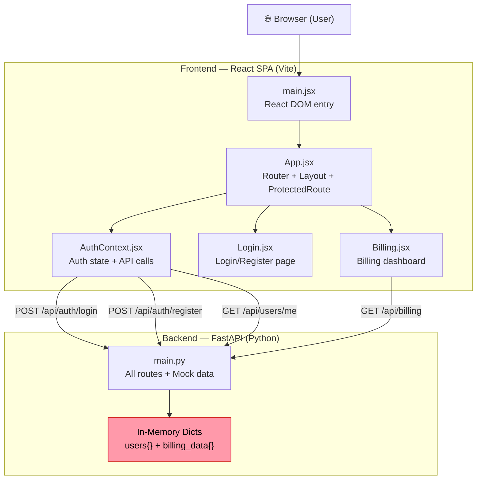
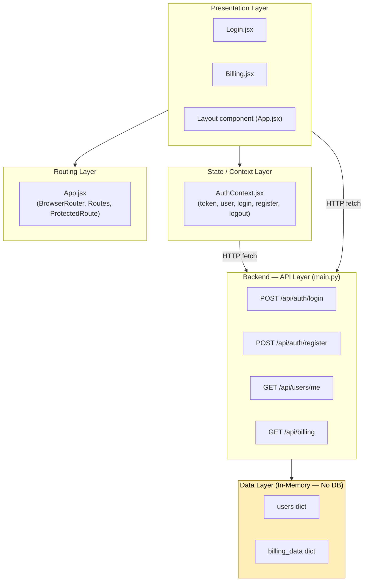
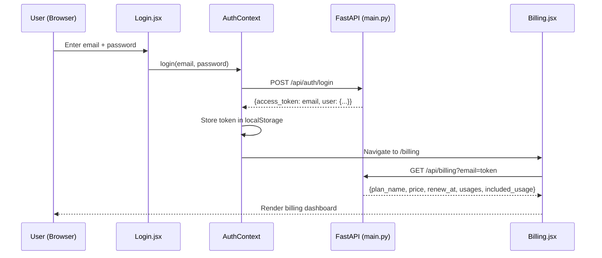
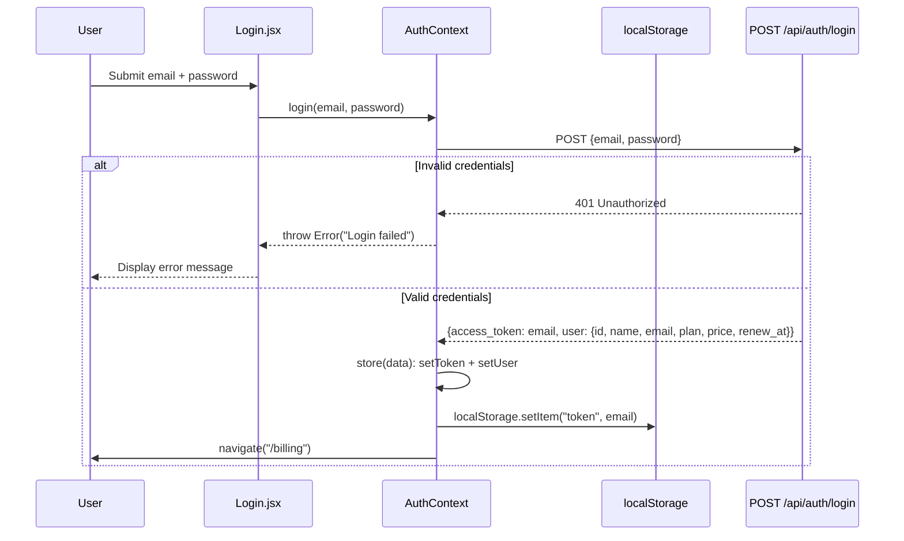
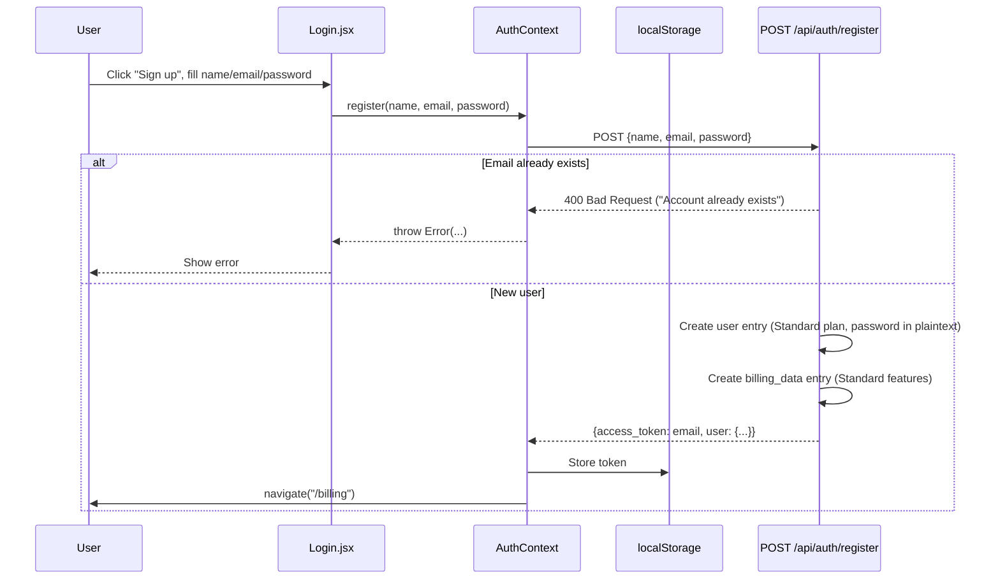
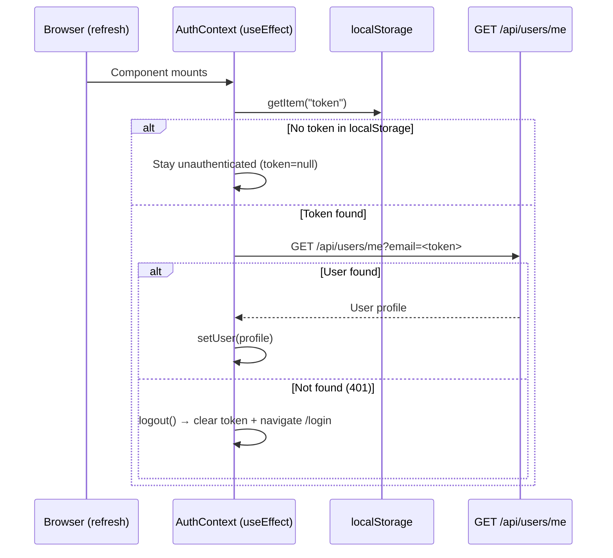
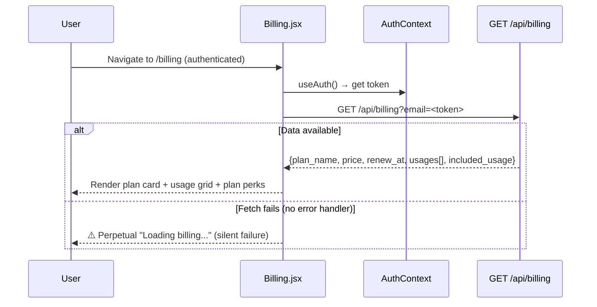
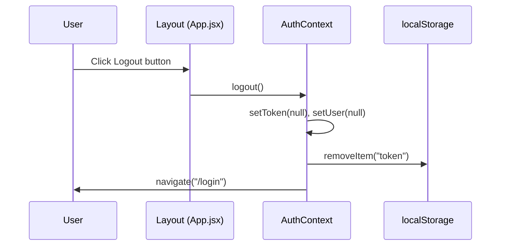
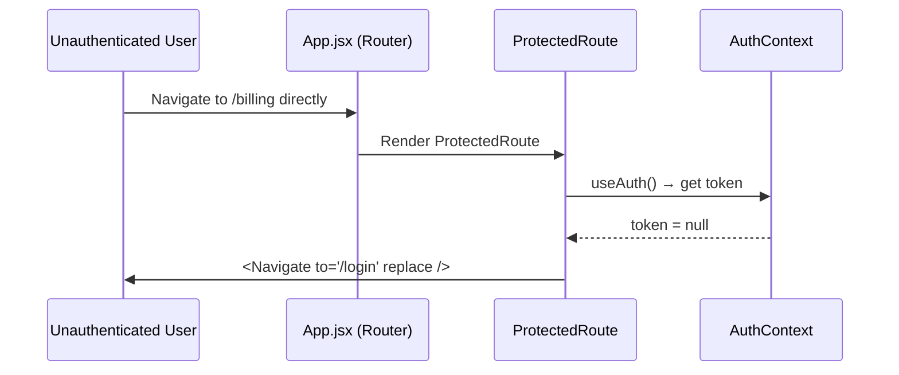
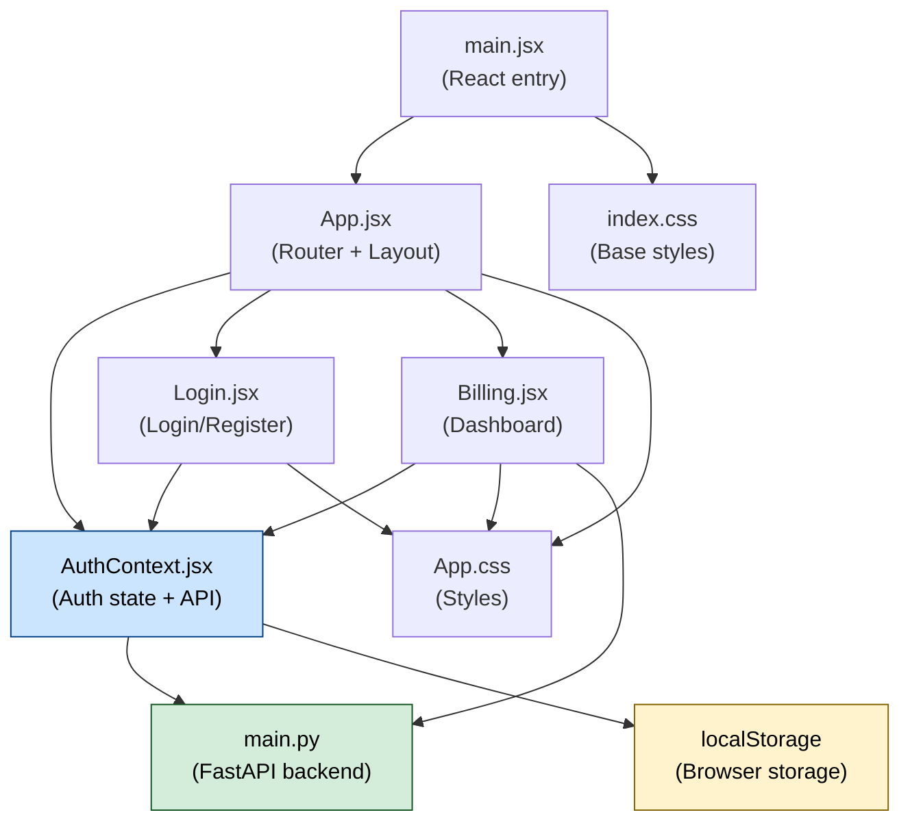

> **Source**: Atlas via Helix MCP
> **Server / tool**: helix · get_solution_document_tool (document_id 4699)
> **Estate**: Billing-Cycle-Helix-Workshop (solution_id 951) / repo Billing-Cycle (https://github.com/Shailendrayadav0666/Billing-Cycle, branch main, last ingested commit 69f67f308492a85648aa25a9ff7d8d574031344a)
> **Scope pulled**: Entire estate — single deep dive document covering the whole system (no per-component scoping; this is the estate-wide analysis Atlas holds)
> **Fetched**: 2026-09-23T10:09:41Z
> **Freshness**: Document last updated 2026-09-22T10:13:02Z (version 31); not otherwise exposed by Atlas

# Deep Dive Analysis: Billing-Cycle

**Created:** 2026-09-22
**For:** Shailendra
**Analysis Depth:** Exhaustive
**Status:** COMPLETE
**Steps Completed:** 13 of 13

> **Purpose:** Exhaustive system analysis covering architecture, flows, dependencies, code quality, testing, security, performance, and documentation with prioritized strategic recommendations.

---

## Analysis Scope

- **System:** Billing-Cycle
- **Repository:** Billing-Cycle
- **Focus Areas:** All (comprehensive)
- **Code Quality Analysis:** Yes
- **Security Considerations:** Yes

---

## Executive Summary

### System Overview

**Billing-Cycle** is a streaming subscription billing management application built as a full-stack proof-of-concept (POC). It is marketed internally as "Billing & Tasks POC" and simulates a Netflix-style billing dashboard for a fictional streaming service called **StreamPlex**. The system is structured as a two-tier architecture: a React 19 single-page application (SPA) frontend communicating with a Python FastAPI backend over a REST API.

The frontend provides two user-facing screens — a combined login/registration page and a billing dashboard showing subscription plan details, feature entitlements, and usage breakdowns. The backend exposes four REST endpoints for authentication and billing data retrieval, backed entirely by in-memory Python dictionaries (no database). The system ships with one pre-seeded user account (`tpg@example.com` / `password`) and assigns all users the "Standard" plan at $20/month.

This is a very small, focused codebase (~604 lines of source code across 7 files) built with modern tooling (React 19, Vite 8, FastAPI, React Router 7). It demonstrates core frontend architecture patterns effectively (Context API, protected routing, layout composition), but carries critical security deficiencies that make it unsuitable for production in its current form. The primary limitations are its intentional POC simplifications: no real authentication, no database persistence, no tests, and almost no documentation.

### Complexity Assessment

- **Overall Complexity:** Low (appropriate for a focused POC)
- **Lines of Code:** ~604 (163 Python + 441 JavaScript/JSX)
- **Components:** 7 significant components (1 backend module, 6 frontend)
- **External Dependencies:** 11 (3 backend, 8 frontend)
- **Technical Debt:** **High** — concentrated in security and testing gaps, not in code complexity

### Top 10 Critical Findings

1. **Security - Critical:** Email used as authentication token — no JWT, no signing, no expiry. Any user who knows another user's email can fully impersonate them via the API.
2. **Security - Critical:** Passwords stored and compared in plaintext — no hashing. A future persistence layer would immediately expose all credentials.
3. **Security - Critical:** No authentication middleware on backend GET endpoints — `/api/users/me` and `/api/billing` trust the `email` query parameter without validation.
4. **Security - Critical:** Hardcoded developer credentials (`tpg@example.com` / `password`) pre-filled in the login form — a dev backdoor that could ship to production.
5. **Testing - Critical:** Zero test coverage — no unit, integration, or E2E tests for any component. No test framework configured.
6. **Persistence - High:** In-memory-only data store — all registered users and billing data lost on backend restart. Incompatible with horizontal scaling.
7. **Security - High:** Wildcard CORS (`allow_origins=["*"]`) — must be restricted to known origins before production deployment.
8. **Documentation - High:** No setup guide, no API documentation, no architecture documentation. The only README is a boilerplate Vite template that says nothing about this application.
9. **Performance - High:** Backend not horizontally scalable — shared mutable in-memory state means multiple workers produce divergent data states.
10. **Quality - Medium:** Python dependencies unpinned in `requirements.txt` — `fastapi`, `uvicorn`, `python-multipart` all install at latest available version, breaking reproducibility.

### Risk Assessment

| Risk Category | Level | Impact | Mitigation Priority |
|---------------|-------|--------|---------------------|
| Security | 🔴 High | Email-as-token + plaintext passwords = complete account compromise if deployed | Immediate — block production deployment |
| Technical Debt | 🟠 Medium | Concentrated in auth model and lack of tests — manageable given small codebase | High — address in next sprint |
| Scalability | 🔴 High | In-memory store is fundamentally incompatible with horizontal scaling | Medium-term — requires database migration |
| Maintainability | 🟡 Low-Medium | Small, readable codebase but no TypeScript, no tests, no comments | Medium-term — TypeScript + tests |
| Documentation | 🟠 Medium | No setup guide blocks new developers; no API docs blocks integration | High — critical docs in current sprint |

---

## Comprehensive Reconnaissance

### Directory Structure

```
Billing-Cycle/
└── src/
    ├── backend/
    │   ├── main.py               # FastAPI application (all routes, models, mock data)
    │   ├── requirements.txt      # Python dependencies
    │   └── .gitignore
    └── frontend/
        ├── index.html            # HTML shell
        ├── package.json          # npm config + dependencies
        ├── vite.config.js        # Vite build config
        ├── .oxlintrc.json        # Oxlint (linter) config
        ├── .gitignore
        ├── README.md             # Generic Vite+React template README
        ├── public/
        │   ├── favicon.svg
        │   └── icons.svg
        └── src/
            ├── App.jsx           # Root component, router setup
            ├── App.css           # Global styles
            ├── main.jsx          # React DOM entry point
            ├── index.css         # Base CSS reset/variables
            ├── context/
            │   └── AuthContext.jsx  # Auth state management (token, user)
            ├── pages/
            │   ├── Login.jsx     # Login + Register page
            │   └── Billing.jsx   # Billing dashboard page
            └── assets/
                ├── hero.png
                ├── react.svg
                └── vite.svg
```

### Technology Stack

**Programming Languages:**

| Language | Files | Lines of Code | Percentage |
|----------|-------|---------------|------------|
| Python | 1 | 163 | ~27% |
| JavaScript/JSX | 6 | 441 | ~73% |
| JSON | 2 | 32 | config only |

**Frameworks & Libraries:**

| Framework/Library | Version | Purpose | Layer |
|-------------------|---------|---------|-------|
| FastAPI | unversioned (req.txt) | REST API framework | Backend |
| Uvicorn | unversioned (req.txt) | ASGI server | Backend |
| python-multipart | unversioned (req.txt) | Form data support | Backend |
| Pydantic | (FastAPI dependency) | Request model validation | Backend |
| React | ^19.2.8 | UI framework | Frontend |
| React DOM | ^19.2.8 | DOM rendering | Frontend |
| React Router DOM | ^7.18.2 | Client-side routing | Frontend |
| Vite | ^8.2.2 | Build tool + dev server | Frontend |
| Oxlint | ^1.79.0 | Fast JS linter (Rust-based) | Dev Tooling |

**Build & Tooling:**

- **Build System:** Vite ^8.2.2 (ES module native, fast HMR)
- **Package Manager:** npm (package.json present)
- **Testing Framework:** ❌ None detected — no test files, no test runner configured
- **CI/CD:** ❌ None detected — no `.github/`, `.gitlab-ci.yml`, or equivalent
- **Linting:** Oxlint ^1.79.0 (Rust-based, faster alternative to ESLint)

### Comprehensive Statistics

| Metric | Value |
|--------|-------|
| Total Source Files | 9 (graph-indexed) |
| Total LOC | ~636 |
| Backend Code Files | 1 (main.py, 163 LOC) |
| Frontend Code Files | 6 JSX/JS files (441 LOC) |
| Config Files | 3 (vite.config.js, package.json, .oxlintrc.json) |
| Documentation Files | 1 (README.md — generic template only) |
| Test Files | 0 |
| CI/CD Files | 0 |
| Largest File | `Billing.jsx` & `main.py` (tied, 163–164 LOC each) |
| Average File Size | ~70 LOC |
| Code-to-Comment Ratio | Very low — minimal inline comments |

### Entry Points

**Application Entry Points:**

- `src/backend/main.py` — FastAPI app instantiation; all routes defined here
- `src/frontend/src/main.jsx` — React DOM render root (`ReactDOM.createRoot`)
- `src/frontend/index.html` — HTML shell loaded by Vite

**API Endpoints:** 4 endpoints, all in `main.py` (single-file backend):

| Method | Path | Description |
|--------|------|-------------|
| POST | `/api/auth/login` | Authenticate user, return token (email as token) |
| POST | `/api/auth/register` | Register new user with default Standard plan |
| GET | `/api/users/me` | Fetch current user profile (email query param) |
| GET | `/api/billing` | Fetch billing data and plan details |

**Frontend Routes (React Router):**

| Path | Component | Access |
|------|-----------|--------|
| `/` | Login (redirect) | Public |
| `/login` | Login | Public |
| `/billing` | Billing (ProtectedRoute) | Authenticated only |

**CLI Interfaces:** None

**Background Jobs:** None

**Scheduled Tasks:** None

**Production Static Serving:** Backend conditionally mounts `frontend/dist/` as static files if the dist directory exists (combined deploy mode)

---

## Deep Architectural Analysis

### Architectural Style & Patterns

**Primary Style:** **SPA + REST API Monolith (Proof-of-Concept / Prototype)**

This is a simple, two-tier web application: a React single-page application (SPA) frontend communicating with a single-file FastAPI REST backend over HTTP. The entire backend lives in one file (`main.py`, 163 LOC) with no database, no services layer, and no infrastructure beyond in-memory Python dicts. The frontend is a classic SPA with client-side routing. The system appears to be a named "Billing & Tasks POC" (from `FastAPI(title="Billing & Tasks POC")`).

**Detected Patterns:**

- **Context Provider Pattern (Frontend):** `AuthContext.jsx` implements React's Context API to propagate auth state (`user`, `token`, `login`, `register`, `logout`) globally across the component tree — a clean, idiomatic React pattern.
- **Protected Route Pattern (Frontend):** `ProtectedRoute` in `App.jsx` guards the `/billing` route by checking for a token, redirecting unauthenticated users to `/login`.
- **Layout Component Pattern (Frontend):** A shared `Layout` component wraps authenticated pages, providing the topbar navigation consistently.
- **Repository-as-Token Auth Pattern (Backend):** The "access token" is simply the user's email string stored in localStorage — a pattern appropriate only for prototyping.
- **In-Memory Mock Store (Backend):** Data is stored in plain Python dicts (`users`, `billing_data`) — no database, no ORM, no persistence layer. Data is lost on server restart.
- **Static File Serving via FastAPI (Production Mode):** `main.py` conditionally mounts the Vite-built `frontend/dist/` folder, enabling a single-process deployment.

**Anti-Patterns Detected:**

- **Plaintext Passwords (Critical):** Passwords stored and compared in plaintext in the `users` dict — no hashing whatsoever. While this is a POC, it is a severe security anti-pattern that must never reach production.
- **Email-as-Token (Critical):** The access token is literally the user's email. There is no JWT, no session ID, no expiry — any knowledge of a user's email grants full API access.
- **No Authentication Middleware (High):** Backend endpoints accept an `email` query parameter and trust it directly — no token validation, no auth middleware. Any caller can impersonate any user.
- **Wildcard CORS (`allow_origins=["*"]`) (Medium):** All origins accepted — acceptable for local dev, dangerous if deployed to production without restriction.
- **Mixed API Concerns in Single File (Low):** All route handlers, Pydantic models, mock data, and static file serving live in one `main.py`. Not an anti-pattern for a POC, but a maintenance concern if the app grows.
- **No Error Boundary on Frontend (Low):** `Billing.jsx` fetches data without error handling — a failed fetch silently results in a perpetual "Loading billing..." state.

### Architecture Diagrams

#### High-Level System Architecture



#### Layer Diagram



#### Module Interactions



### Complete Component Catalog

| Component | Path | Responsibility | Complexity | Key Dependencies | Issues |
|-----------|------|---------------|-----------|-----------------|--------|
| **main.py** | `src/backend/main.py` | All backend: auth, billing, user routes, mock data store, static serving | Medium | FastAPI, Pydantic, Uvicorn | God-file; plaintext passwords; email-as-token |
| **main.jsx** | `src/frontend/src/main.jsx` | React DOM root render entry | Simple | React 19, App.jsx | None |
| **App.jsx** | `src/frontend/src/App.jsx` | Root router, Layout, ProtectedRoute guard | Simple | React Router DOM, AuthContext | None |
| **AuthContext.jsx** | `src/frontend/src/context/AuthContext.jsx` | Global auth state: login, register, logout, session restore | Medium | React, React Router DOM | Token = email (insecure); no token expiry handling |
| **Login.jsx** | `src/frontend/src/pages/Login.jsx` | Combined login + sign-up form with toggle | Medium | React, AuthContext | No client-side validation beyond server error display |
| **Billing.jsx** | `src/frontend/src/pages/Billing.jsx` | Billing dashboard: plan info, usage cards, plan perks | Medium | React, AuthContext | No error handling on fetch; plan name hardcoded as "Standard" |
| **vite.config.js** | `src/frontend/vite.config.js` | Vite build configuration with React plugin | Simple | Vite, @vitejs/plugin-react | None |

### Architectural Assessment

**Strengths:**

- **Clean SPA structure:** React Router + Context Provider + Protected Route is a standard, idiomatic pattern — easy for any React developer to navigate
- **Good separation of auth logic:** `AuthContext.jsx` cleanly centralises all auth state and API calls, avoiding scattered fetch calls across pages
- **Production-ready deployment model:** The conditional static file mounting in `main.py` is an elegant single-process deploy strategy
- **Modern tooling:** React 19, Vite 8, React Router 7, Oxlint — all very current choices

**Weaknesses:**

- **Zero authentication security:** Plaintext passwords + email-as-token = not remotely production-safe
- **No persistence layer:** In-memory data lost on restart; not scalable beyond a single process
- **No test coverage:** Zero test files — no unit, integration, or E2E tests
- **Single-file backend:** All backend logic in `main.py` will become unmaintainable as features grow
- **No error handling on Billing page:** Silent failures are a poor UX and a debugging nightmare
- **Wildcard CORS:** Must be restricted before any production deployment

**Recommendations:**

1. Replace in-memory store with a real database (SQLite for simple, PostgreSQL for production)
2. Implement JWT authentication with expiry (use `python-jose` or `authlib`)
3. Hash passwords with `bcrypt` or `argon2`
4. Split `main.py` into router modules: `auth.py`, `billing.py`, `users.py`
5. Add error handling and loading states to `Billing.jsx`
6. Restrict CORS to known origins before deployment
7. Add a test suite (pytest for backend, Vitest for frontend)

---

## Comprehensive Flow Analysis

**Flows Identified:** 6 total across 4 categories (Authentication, Business Operations, Error Handling, Session Restore)

---

### Flow 1: User Login

**Purpose:** Authenticate an existing user and establish a browser session.



**Decision Points:**
- Invalid credentials → 401 → error shown to user
- Valid credentials → token stored → redirect to `/billing`

**Security Note:** The "token" is literally the user's email string. No expiry, no signing, no cryptographic security.

---

### Flow 2: User Registration

**Purpose:** Create a new account with a default Standard plan.



**Note:** New users always get "Standard" plan at `$20/month`. No plan selection during registration.

---

### Flow 3: Session Restore (Page Refresh)

**Purpose:** Restore user session from `localStorage` on page load or refresh.



---

### Flow 4: Billing Dashboard Load

**Purpose:** Fetch and display plan details and usage for the logged-in user.



**Issue:** No `.catch()` on the billing fetch — any network or auth error leaves the UI stuck on loading indefinitely.

---

### Flow 5: Logout

**Purpose:** Clear session and redirect to login.



---

### Flow 6: Route Guard (Unauthenticated Access Attempt)

**Purpose:** Block unauthenticated users from reaching protected pages.



---

### Flow Interactions

**Shared Components:**
- `AuthContext` is the central hub — every flow except the Route Guard flows data through it
- `localStorage` is shared between login, register, session restore, and logout — the single source of truth for auth state
- The `token` (email string) is passed from `AuthContext` → `Billing.jsx` → `GET /api/billing` query param, making it a cross-cutting identifier

**Transaction Boundaries:**
- No real transactions — in-memory dict mutations in `main.py` are synchronous and non-atomic
- No rollback mechanism on partial registration failure

**Concurrency Considerations:**
- No concurrent request handling concerns at the frontend level (single-user session)
- Backend is stateless per-request, but the shared in-memory `users` dict is not thread-safe under multiple concurrent uvicorn workers

**Edge Cases:**
- If the user manually edits `localStorage` with another user's email → full impersonation (no token validation)
- If the backend restarts → all registered users and billing data lost; existing localStorage tokens result in 401 → auto-logout
- Race condition: if `AuthContext` `useEffect` fires while network is slow, user may be briefly null on refresh

---

## Exhaustive Dependency Analysis

### Internal Dependencies

#### Dependency Graph



#### Coupling Metrics

| Module | Afferent Coupling (Ca) | Efferent Coupling (Ce) | Instability (Ce/Ca+Ce) | Assessment |
|--------|------------------------|------------------------|------------------------|------------|
| `main.jsx` | 0 | 2 (App.jsx, index.css) | 1.0 | Maximally unstable — entry point |
| `App.jsx` | 1 (main.jsx) | 4 (AuthContext, Login, Billing, App.css) | 0.8 | Unstable — orchestrator |
| `AuthContext.jsx` | 3 (App, Login, Billing) | 2 (main.py API, localStorage) | 0.4 | **Most stable frontend module** |
| `Login.jsx` | 1 (App.jsx) | 2 (AuthContext, App.css) | 0.67 | Moderately unstable |
| `Billing.jsx` | 1 (App.jsx) | 2 (AuthContext, main.py API) | 0.67 | Moderately unstable |
| `main.py` | 2 (AuthContext, Billing) | 0 (no outgoing — in-memory) | 0.0 | **Maximally stable** — no external calls |

#### Circular Dependencies

✅ **No circular dependencies detected.** The dependency graph is a clean DAG (directed acyclic graph). Data flows in one direction: `main.jsx` → `App.jsx` → pages → `AuthContext` → `main.py`.

### External Dependencies

#### Frontend (package.json)

| Dependency | Current Ver | Purpose | Type | Update Rec |
|------------|-------------|---------|------|------------|
| `react` | ^19.2.8 | UI framework | Runtime | ✅ Very current |
| `react-dom` | ^19.2.8 | DOM renderer | Runtime | ✅ Very current |
| `react-router-dom` | ^7.18.2 | Client-side routing | Runtime | ✅ Very current |
| `vite` | ^8.2.2 | Build tool + dev server | Dev | ✅ Very current |
| `@vitejs/plugin-react` | ^6.1.0 | React transform for Vite | Dev | ✅ Current |
| `@types/react` | ^19.2.18 | TypeScript types for React | Dev | ✅ Current |
| `@types/react-dom` | ^19.2.4 | TypeScript types for React DOM | Dev | ✅ Current |
| `oxlint` | ^1.79.0 | Fast Rust-based linter | Dev | ✅ Current |

**Notable:** No version pinning — all use `^` (caret) semver ranges. This means minor updates apply automatically, which is generally safe but warrants a lockfile (`package-lock.json`) check.

#### Backend (requirements.txt)

| Dependency | Pinned Ver | Purpose | Notes |
|------------|------------|---------|-------|
| `fastapi` | ❌ unpinned | REST API framework | Should pin to specific version |
| `uvicorn[standard]` | ❌ unpinned | ASGI server | Should pin; `[standard]` includes WebSocket support |
| `python-multipart` | ❌ unpinned | Form data parsing (multipart) | Required by FastAPI for form handling |

⚠️ **No versions pinned in `requirements.txt`** — every `pip install` fetches the latest available version. This breaks reproducibility and can introduce breaking changes. Add pinned versions (e.g., via `pip freeze > requirements.txt`) or use a lockfile tool like `pip-tools` or `poetry`.

### External Service Integrations

**None detected.** The backend is fully self-contained with in-memory data only:
- No external HTTP calls from the backend
- No third-party payment processors (Stripe, PayPal, etc.)
- No email services
- No message queues
- No external auth providers (OAuth, SSO)
- No analytics services

The frontend communicates only with the local backend API (`/api/*` relative paths).

### Database Analysis

**No database present.** Data is stored exclusively in two Python in-memory dictionaries in `main.py`:

| Store | Type | Contents | Persistence |
|-------|------|----------|-------------|
| `users` | Python `dict` | User records (id, name, email, password, plan, price, renew_at) | ❌ Lost on restart |
| `billing_data` | Python `dict` | Per-user billing data (plan_name, price, renew_at, usages[], included_usage) | ❌ Lost on restart |

**Pre-seeded Data:** One hardcoded user exists at startup:
- Email: `tpg@example.com` / Password: `password` / Plan: Standard

**Migration Strategy:** None — no schema, no migrations, no ORM.

**Recommendation:** For production, replace with:
- **SQLite** (simplest, file-based, no server) — suitable for single-instance deployments
- **PostgreSQL** (production-grade, scalable) — recommended for multi-user production systems
- Use **SQLAlchemy** + **Alembic** for ORM + migrations

---

## Code Quality & Technical Debt

### Overall Quality Assessment: **Fair** (for a POC/prototype)

The codebase is clean and readable for its size, but carries several significant quality issues — most of which are security-related technical debt that would be critical to address before any production use.

### Quality Metrics

| Metric | Value | Assessment |
|--------|-------|------------|
| Total LOC (source) | ~604 | Very small |
| Files analyzed | 7 (5 JSX + 1 PY + 1 JS config) | Micro-codebase |
| Average function length | ~18 LOC | ✅ Good |
| Longest function | `register()` in `main.py` (~48 LOC) | ⚠️ Borderline |
| Cyclomatic complexity (highest) | `Billing.jsx` route render (~5) | ✅ Low |
| Code-to-comment ratio | ~0% (zero inline comments) | ⚠️ Poor |
| TODO/FIXME/HACK comments | **0 found** | ✅ None |
| Naming consistency | Consistent camelCase (JS) + snake_case (Python) | ✅ Good |
| Code duplication | Moderate — `login` + `register` endpoints in `main.py` duplicate billing setup logic | ⚠️ Present |

### Code Smells Detected

| Smell | Severity | Location | Description |
|-------|----------|----------|-------------|
| **Code Duplication** | Medium | `main.py` lines 106–140 | `register()` duplicates the entire billing data structure also defined at lines 31–68. Extract to a shared `create_default_billing()` function |
| **Magic Strings** | High | `main.py`, `Billing.jsx`, `Login.jsx` | Plan names (`"Standard"`), prices (`"$20/month"`), email (`"tpg@example.com"`), password (`"password"`) hardcoded as literals throughout |
| **Hardcoded Dev Credentials** | Critical | `Login.jsx` lines 8–9 | `email = 'tpg@example.com'` and `password = 'password'` pre-filled in the login form — a dev convenience that could ship to production |
| **Plaintext Password Comparison** | Critical | `main.py` line 88 | `user["password"] != payload.password` — no hashing whatsoever |
| **Password Stored in Plaintext** | Critical | `main.py` lines 19–29, 97–104 | Both hardcoded user and registered users store raw passwords in the dict |
| **No Error Handling (Billing fetch)** | Medium | `Billing.jsx` line 80–84 | `.then(setData)` with no `.catch()` — silent UI failure |
| **"Keep me signed in" checkbox is non-functional** | Low | `Login.jsx` line 119 | `defaultChecked` with no `onChange` or logic — checkbox has no effect |
| **Copyright year hardcoded** | Low | `Login.jsx` line 80 | `© 2024 StreamPlex` — already stale |
| **Inline SVG repetition** | Low | `Login.jsx`, `Billing.jsx` | Inline SVG icons repeated across files; should be extracted to a shared `<Icon>` component |
| **No TypeScript** | Low | All frontend | Project uses `.jsx` (JavaScript) — no type safety. `@types/react` and `@types/react-dom` are installed in devDependencies but unused |

### Code Duplication Analysis

**Main duplication: billing data initialization**

The full billing data structure (with `plan_name`, `price`, `renew_at`, `usages[]`, `included_usage`) is defined twice in `main.py`:
- Lines 31–68: `billing_data` initial dict for `tpg@example.com`
- Lines 106–140: inside `register()` when creating billing data for new users

These blocks are ~35 lines of near-identical JSON-like structure. A single `create_default_billing_data(email)` factory function would eliminate this entirely.

**Estimated duplication:** ~15% of `main.py` (~24 duplicate lines)

### Technical Debt Inventory

#### 🔴 Critical Priority (Must fix before production)

| # | Issue | Location | Impact | Effort |
|---|-------|----------|--------|--------|
| 1 | Plaintext password storage & comparison | `main.py` | Credential breach if any data layer added | Low — add `bcrypt` |
| 2 | Email used as authentication token | `main.py`, `AuthContext.jsx` | Full account impersonation with email knowledge | Medium — implement JWT |
| 3 | No authentication middleware | `main.py` GET endpoints | Any user can query any account's data | Medium — add auth dependency |
| 4 | Hardcoded credentials pre-filled in login form | `Login.jsx` lines 8–9 | Ships dev backdoor to production | Very Low — remove defaults |
| 5 | Wildcard CORS | `main.py` line 12 | Cross-site request exposure | Very Low — set specific origins |

#### 🟠 High Priority (Fix in next sprint)

| # | Issue | Location | Impact | Effort |
|---|-------|----------|--------|--------|
| 6 | No database — in-memory store | `main.py` | Data lost on restart; not scalable | High — add DB + ORM |
| 7 | Billing fetch silently fails | `Billing.jsx` line 80 | Poor UX, hard to debug | Very Low — add `.catch()` |
| 8 | No input validation (email format, password strength) | `Login.jsx`, `main.py` | Weak data integrity | Low |
| 9 | Unpinned Python dependencies | `requirements.txt` | Reproducibility broken | Very Low — pin versions |

#### 🟡 Medium Priority (Next quarter)

| # | Issue | Location | Impact | Effort |
|---|-------|----------|--------|--------|
| 10 | Duplicate billing data structure | `main.py` lines 31–68, 106–140 | Maintenance drift | Low — extract factory function |
| 11 | No TypeScript | All frontend JSX | Type safety gaps, harder refactoring | Medium — migrate to `.tsx` |
| 12 | Magic strings throughout | `main.py`, `Billing.jsx` | Difficult to update plan details | Low — extract constants |
| 13 | Inline SVGs not componentized | `Login.jsx`, `Billing.jsx` | Code bloat, reuse friction | Low |
| 14 | Non-functional "Keep me signed in" checkbox | `Login.jsx` | UI debt, misleading UX | Very Low |

#### ✅ Quick Wins (< 1 hour each)

1. Remove hardcoded `email` and `password` defaults from `Login.jsx` state
2. Add `.catch()` to `Billing.jsx` billing fetch
3. Pin versions in `requirements.txt`
4. Update copyright year or use `new Date().getFullYear()`
5. Extract billing data factory function in `main.py`
6. Restrict CORS origins in `main.py`

---

## Test Coverage Analysis

### Test Suite Overview

| Test Type | Count | Percentage |
|-----------|-------|------------|
| Unit Tests | **0** | — |
| Integration Tests | **0** | — |
| End-to-End Tests | **0** | — |
| **Total** | **0** | — |

**Test frameworks configured:** None. No test runner configuration found (`jest.config`, `vitest.config`, `pytest.ini`, `pyproject.toml`, `setup.cfg`).

### Coverage Metrics

**Overall Coverage: 0%** — Not measurable. No coverage tooling configured, no test files exist.

### Coverage by Component

| Component | Coverage | Assessment |
|-----------|----------|------------|
| `main.py` (backend) | 0% | 🔴 Critical |
| `AuthContext.jsx` | 0% | 🔴 Critical |
| `Login.jsx` | 0% | 🔴 Critical |
| `Billing.jsx` | 0% | 🔴 Critical |
| `App.jsx` | 0% | 🔴 Critical |

### Testing Gaps

**Every critical flow is completely untested:**

| Gap | Flow | Risk |
|-----|------|------|
| Login authentication | Flow 1 | No validation that login works or rejects bad credentials |
| User registration | Flow 2 | No validation of duplicate email handling, billing data creation |
| Session restore | Flow 3 | No test for localStorage token → user profile restoration |
| Protected route guard | Flow 6 | No test that unauthenticated users are redirected |
| Billing data fetch | Flow 4 | No test for the billing API or its rendering |
| Error handling paths | All flows | All error branches untested (401, 400, network failures) |
| Backend API endpoints | All 4 routes | No tests for `POST /login`, `POST /register`, `GET /me`, `GET /billing` |

**Missing test types:**
- No unit tests (component rendering, utility functions)
- No integration tests (frontend ↔ backend API contract)
- No end-to-end tests (full user journey)
- No smoke tests

### Testing Recommendations

**Priority 1 — Add a backend test suite (pytest)**
```bash
pip install pytest httpx pytest-asyncio
```
Start with: `POST /api/auth/login` (valid + invalid), `POST /api/auth/register` (new + duplicate), `GET /api/billing` (valid + unauthorized).

**Priority 2 — Add a frontend unit/component test suite (Vitest + React Testing Library)**
```bash
npm install -D vitest @testing-library/react @testing-library/user-event jsdom
```
Start with: `AuthContext` login/logout/register flows, `ProtectedRoute` redirect behavior, `Login` form submission.

**Priority 3 — Add E2E tests (Playwright)**
```bash
npm install -D @playwright/test
```
Cover: full login journey, billing page load, logout, registration flow.

**Quick win:** Even a single `pytest` smoke test against the API would catch regressions. A 30-minute investment would yield significant value for a codebase this size.

---

## Security Considerations

> ⚠️ **Disclaimer:** This is NOT a security audit. This is a pattern-based review that flags areas for professional security assessment. Critical security decisions should be reviewed by a qualified security professional before production deployment.

### Authentication

**Assessment: 🔴 Critical — Not production-safe**

| Pattern | Implementation | Risk |
|---------|---------------|------|
| Token type | Email string stored in localStorage | No cryptographic guarantees; trivially forgeable |
| Token expiry | None | Sessions last forever until explicit logout |
| Token validation (backend) | None — email passed as query param, trusted directly | Any caller knowing an email can impersonate that user |
| Password hashing | None — plaintext storage and comparison | Complete credential exposure if data is ever persisted or logged |
| "Keep me signed in" | Checkbox with no effect | Misleading UX; all sessions behave identically |

### Authorization

**Assessment: 🔴 Critical — No real authorization**

- **No middleware-level auth:** Backend GET endpoints (`/api/users/me`, `/api/billing`) accept an `email` query parameter with zero server-side validation that the caller is the real owner of that email
- **No role-based access control:** All users are "Standard" with identical access
- **No ownership verification:** Any authenticated (or even unauthenticated) user who knows another user's email can query their profile and billing data

### Input Validation

**Assessment: 🟠 Poor**

| Area | Validation Present | Risk |
|------|--------------------|------|
| Email format | ✅ HTML `type="email"` on frontend | Frontend-only; backend doesn't validate format |
| Password strength | ❌ None | Accepts empty passwords, single characters |
| Name field | ✅ `required` attribute only | No length or character validation |
| Registration email uniqueness | ✅ Checked server-side | Correct |
| Query parameter sanitization | ⚠️ No injection risk (in-memory dict lookup) | Safe currently because no DB, but a risk if DB added |

### Secret Management

**Assessment: 🔴 Critical**

| Finding | Location | Risk |
|---------|----------|------|
| Hardcoded user credentials | `main.py` lines 19–28 | Dev user with `password: "password"` ships in code |
| Hardcoded credentials pre-filled in login form | `Login.jsx` lines 8–9 | Dev backdoor visible to all users |
| No `.env` file usage | Entire codebase | No pattern established for secrets management |
| No `.env.example` | Repo root | No guidance for contributors on configuration |

### Cryptographic Usage

**Assessment: 🔴 None**

- No hashing (passwords stored raw)
- No JWT or token signing
- No HTTPS enforcement (depends entirely on deployment)
- No encryption of sensitive data

### Common Vulnerability Patterns

| Vulnerability Type | Status | Location | Notes |
|-------------------|--------|----------|-------|
| **SQL Injection** | ✅ N/A | — | No database — no SQL queries possible currently |
| **XSS** | ✅ Low risk | React JSX | React auto-escapes output; no `dangerouslySetInnerHTML` used |
| **CSRF** | ⚠️ No protection | All POST endpoints | No CSRF tokens; mitigated only by wildcard CORS (itself a risk) |
| **Insecure Direct Object Reference** | 🔴 Present | `GET /api/users/me`, `GET /api/billing` | Email-as-identifier with no ownership check |
| **Information Disclosure** | 🔴 Present | `POST /api/auth/login` response | Returns full user object excluding only `password` field |
| **Path Traversal** | ✅ N/A | — | No file system access from user input |
| **Brute Force** | 🔴 No protection | `POST /api/auth/login` | No rate limiting, no account lockout, no CAPTCHA |
| **Mass Assignment** | ⚠️ Partial | `RegisterRequest` Pydantic model | Model explicitly declares fields — safe; but plan/price always forced to hardcoded values (good default) |

### Top Security Recommendations

| Priority | Recommendation | Effort |
|----------|---------------|--------|
| 🔴 Critical | Implement JWT authentication (`python-jose` + `authlib`); remove email-as-token | Medium |
| 🔴 Critical | Hash passwords with `bcrypt` or `argon2-cffi` before storage | Low |
| 🔴 Critical | Remove hardcoded credentials from `Login.jsx` and `main.py` | Very Low |
| 🔴 Critical | Add authentication dependency to all protected FastAPI routes | Medium |
| 🟠 High | Add rate limiting to auth endpoints (`slowapi` for FastAPI) | Low |
| 🟠 High | Restrict CORS to known origins | Very Low |
| 🟡 Medium | Implement CSRF protection when sessions are added | Medium |
| 🟡 Medium | Add request/response logging (without logging passwords or tokens) | Low |

**Professional Security Review Recommended: YES** — Before any production deployment, a qualified security professional should review the authentication and authorization implementation. The current design has multiple critical vulnerabilities that make it unsuitable for any production use without significant remediation.

---

## Performance & Scalability Analysis

### Performance Patterns

**Performance issues identified: 4**

| # | Issue | Location | Impact |
|---|-------|----------|--------|
| 1 | **No pagination on data fetches** | `GET /api/billing` | Currently returns all billing data in one response. Benign at POC scale, but unbounded as data grows. |
| 2 | **In-memory data store is single-threaded unsafe** | `main.py` `users` + `billing_data` dicts | Python dicts are not thread-safe. Multiple uvicorn workers would each have separate in-memory state, causing data divergence. |
| 3 | **No request loading states (Billing page)** | `Billing.jsx` line 80 | Binary "loading / loaded" with no timeout — blocks UI indefinitely on slow networks |
| 4 **No connection pooling** | `main.py` | N/A currently (no DB) but will be critical when a database is added |

**N+1 queries:** ✅ Not applicable — no database. All data access is O(1) dict lookups.

**Algorithmic complexity:** All backend operations are O(1) hash table lookups — optimal for the current data volume.

**Synchronous operations:** FastAPI is async-capable, but the current route handlers are synchronous `def` functions (not `async def`). This is acceptable for in-memory operations but should be made `async` when I/O is added (DB calls, external APIs).

### Caching Analysis

**Current caching: None**

| Layer | Caching | Assessment |
|-------|---------|------------|
| Frontend | None | No React Query, SWR, or manual caching |
| Backend (in-memory) | The entire data store IS effectively a cache (no DB) | Will need real caching layer once DB is added |
| HTTP caching | No `Cache-Control` headers | Browsers won't cache API responses |
| CDN | None configured | Not applicable at POC scale |

**Caching opportunities when scaling:**
- Billing data per user — rarely changes, ideal for server-side caching with TTL
- User profile (`/api/users/me`) — cacheable per token with short TTL
- Static frontend assets — handled automatically by Vite's content-hash builds

### Scalability Considerations

**Horizontal Scaling Readiness: 🔴 Not Ready**

| Component | Stateful? | Scaling Barrier |
|-----------|-----------|----------------|
| FastAPI backend | 🔴 Stateful | In-memory `users` and `billing_data` dicts — data is per-process, lost on restart |
| Frontend (React SPA) | ✅ Stateless | Fully stateless; scales horizontally via CDN |
| Auth ("token") | 🔴 Stateful | Email-in-localStorage token requires no server state — ironically the one thing that scales; but insecure |

**Single Points of Failure:**
- The entire backend (`main.py`) — no redundancy, no failover
- In-memory data store — restart = data loss = all users logged out

**Bottlenecks when scaling:**
1. Shared mutable in-memory state — fundamentally incompatible with horizontal scaling
2. No load balancer support in current form
3. No health check endpoint for orchestrators (Kubernetes, ECS, etc.)

### Performance Recommendations

**Quick Wins (hours):**
1. Add `async def` to FastAPI route handlers to unlock async I/O capacity for future DB integration
2. Add loading timeout to `Billing.jsx` (abort fetch after N seconds, show error message)
3. Add `Cache-Control: no-store` to auth endpoints to prevent browser caching of sensitive tokens
4. Add a `GET /health` endpoint for load balancer / container health checks

**Strategic Improvements (days–weeks):**
1. Replace in-memory store with a proper database (SQLite → PostgreSQL) — this unblocks horizontal scaling
2. Add Redis for session caching and rate limiting when user scale grows
3. Implement HTTP caching headers on non-sensitive GET endpoints (`/api/billing`)
4. Add Vite bundle analysis to track frontend asset sizes as the app grows

**Monitoring Recommendations:**
- API response time per endpoint (p50, p95, p99)
- Auth failure rate (login failures per minute — anomaly = brute force attempt)
- Error rate on `/api/billing` fetch
- Memory usage of the backend process (in-memory store will grow with users)
- Frontend bundle size over time (keep initial load fast)

---

## Documentation Audit

### Existing Documentation Assessment

| Document Type | Status | Quality | Completeness | Notes |
|---------------|--------|---------|--------------|-------|
| README | ⚠️ Exists (generic) | 1/5 | 5% | `src/frontend/README.md` is the default Vite+React boilerplate — says nothing about Billing-Cycle specifically |
| API Docs | ❌ Missing | — | 0% | No Swagger/OpenAPI published, no API reference document |
| Architecture Docs | ❌ Missing | — | 0% | No architecture decision records, no system design document |
| Setup Guide | ❌ Missing | — | 0% | No instructions for installing, running locally, or deploying |
| Troubleshooting | ❌ Missing | — | 0% | No troubleshooting guide |
| Runbooks | ❌ Missing | — | 0% | No operational runbooks |
| Inline Code Comments | ❌ None | 0/5 | 0% | Zero comments in any source file |

**FastAPI auto-generates Swagger UI at `/docs` and `/redoc` when running** — this is the only "live" API documentation, but it's not persisted or versioned.

### Code Comment Quality

**Assessment: 0% comment density — no inline documentation whatsoever**

- `main.py` (163 lines): 1 meaningful comment (`# In-memory mock store (no database)` at line 18) + 1 comment explaining static serving (lines 160)
- All JSX files: Zero inline comments explaining component behavior, state management patterns, or non-obvious logic
- `vite.config.js`: Zero comments

The code is generally readable (short, well-named functions) but the auth model, the email-as-token pattern, and the conditional static file serving are non-obvious and would benefit from explicit documentation.

### Critical Knowledge Gaps

| # | Gap | Components Affected | Why It Matters |
|---|-----|--------------------|--------------------|
| 1 | **How to run the project locally** | Both backend and frontend | No setup guide — new developer has no path to first run |
| 2 | **Email-as-token auth model** | `AuthContext.jsx`, `main.py` | Non-standard; future developers will be confused or break it |
| 3 | **Demo credentials** | `Login.jsx`, `main.py` | Hardcoded `tpg@example.com` / `password` not documented anywhere visible |
| 4 | **Production deployment model** | `main.py` static serving, `vite.config.js` | How to build frontend + run backend together is implicit in code only |
| 5 | **Data persistence model** | `main.py` | It's intentionally in-memory — but nothing says why or what the plan is |
| 6 | **Plan structure & pricing** | `billing_data`, `Billing.jsx` | "Standard" plan features are hardcoded — where is the source of truth? |
| 7 | **Why `python-multipart` is a dependency** | `requirements.txt` | Not obviously used in the current code — undocumented requirement |

### Tribal Knowledge Risks

- **"How does auth work?"** — The email-as-token model is entirely non-standard. Only the original author knows this was intentional vs. a placeholder.
- **"Is the in-memory store intentional?"** — No documentation or comment explains this is a POC choice, not an oversight.
- **"What is `tpg`?"** — The hardcoded user `tpg@example.com` / `TPG` is unexplained. Is "TPG" the company? A person? A test persona?
- **"Why is `@vitejs/plugin-react` used instead of SWC?"** — The README actually explains this isn't enabled for performance reasons, but only for the React Compiler, not for the plugin choice itself.

### Documentation Priorities

**🔴 Critical — Blocking Onboarding (do first):**
1. **Root-level README** — How to install deps, run backend, run frontend, login with demo credentials
2. **Setup/Run guide** — `uvicorn src.backend.main:app --reload`, `npm install && npm run dev`

**🟠 High — Complex Areas:**
3. **Auth model explanation** — Comment in `AuthContext.jsx` and `main.py` explaining email-as-token is intentional POC design
4. **API endpoint documentation** — Document all 4 endpoints with request/response shapes (FastAPI `/docs` covers this at runtime, but a static reference would help)
5. **In-memory store notice** — Comment in `main.py` explaining data persistence limitations

**🟡 Medium — Nice to Have:**
6. **Architecture Decision Records (ADRs)** — Why FastAPI? Why Vite? Why in-memory store?
7. **Component JSDoc/comments** — Especially for `AuthContext.jsx` methods and `Billing.jsx` data shape
8. **`.env.example`** — Establish a pattern for future environment variable needs

---

## Comprehensive Recommendations

### Immediate Actions (Do Now)

These are security-critical or blocking issues that cannot be deferred to production.

| # | Action | Severity | Effort | Source |
|---|--------|----------|--------|--------|
| 1 | **Remove hardcoded credentials from `Login.jsx`** — delete `email = 'tpg@example.com'` and `password = 'password'` defaults from React state | 🔴 Critical | 5 min | Steps 6, 8 |
| 2 | **Add `.catch()` to `Billing.jsx` billing fetch** — prevents silent infinite loading state | 🟠 High | 15 min | Steps 6, 9 |
| 3 | **Restrict CORS to known origin(s)** — change `allow_origins=["*"]` to specific origin(s) | 🔴 Critical | 10 min | Step 8 |
| 4 | **Pin Python dependencies** — run `pip freeze > requirements.txt` or use `pip-tools` | 🟠 High | 15 min | Step 5 |
| 5 | **Write a root-level README** — how to install, run backend, run frontend, and login with demo credentials | 🟠 High (blocks onboarding) | 45 min | Step 10 |

### Short-Term Improvements (Next Sprint)

| # | Improvement | Value | Effort | Source |
|---|-------------|-------|--------|--------|
| 1 | **Implement password hashing** — add `bcrypt` or `passlib[bcrypt]` to backend; hash on register, verify on login | Very High | 1–2h | Steps 6, 8 |
| 2 | **Implement proper JWT authentication** — replace email-as-token with signed JWT using `python-jose`; add auth dependency to protected routes | Very High | 3–4h | Steps 4, 8 |
| 3 | **Add authentication middleware to backend** — protect `GET /api/users/me` and `GET /api/billing` from unauthenticated callers | Very High | 1h | Step 8 |
| 4 | **Extract billing data factory function in `main.py`** — eliminate the 35-line duplication between initial data and `register()` | Medium | 30 min | Step 6 |
| 5 | **Add FastAPI route rate limiting** — install `slowapi`, limit auth endpoints to 5 requests/minute | High | 1h | Step 8 |
| 6 | **Extract magic strings to constants** — plan name, price, dates to a central `constants.py` | Medium | 30 min | Step 6 |
| 7 | **Add health check endpoint** — `GET /health` returning `{"status": "ok"}` for load balancers/containers | Medium | 10 min | Step 9 |

### Medium-Term Strategy (Next Quarter)

| # | Initiative | Current State → Desired State | Effort | Source |
|---|------------|-------------------------------|--------|--------|
| 1 | **Add a persistence layer** | In-memory dicts → PostgreSQL + SQLAlchemy + Alembic migrations | High (~1 sprint) | Steps 5, 9 |
| 2 | **Build a backend test suite** | 0 tests → ≥80% coverage on all 4 API endpoints with pytest + httpx | Medium (~2 days) | Step 7 |
| 3 | **Build a frontend test suite** | 0 tests → unit + component tests for AuthContext, Login, Billing with Vitest + RTL | Medium (~2–3 days) | Step 7 |
| 4 | **Split `main.py` into router modules** | Monolithic 163-line file → separate router files for auth, billing, and users | Low–Medium (~4h) | Step 3 |
| 5 | **Migrate frontend to TypeScript** | `.jsx` files → `.tsx`; leverage installed `@types/react` and `@types/react-dom` | Medium (~1 sprint) | Step 6 |
| 6 | **Document all API endpoints** | No docs → Swagger published via FastAPI `/docs` + static API reference | Low (~4h) | Step 10 |

### Long-Term Evolution (6-12 Months)

| # | Evolution | Benefit | Approach | Effort | Source |
|---|-----------|---------|----------|--------|--------|
| 1 | **Multi-plan billing system** | Enable Premium/Basic plans beyond hardcoded Standard | Replace hardcoded plan data with database-driven plan catalog; add plan selection UI | High | Step 3 |
| 2 | **Real payment integration** | Enable actual billing (Stripe, etc.) | Add Stripe SDK to backend; implement webhook handlers; add payment method management to frontend | Very High | Step 4 |
| 3 | **End-to-end test suite (Playwright)** | Regression safety for user journeys | Add Playwright; cover login, billing view, logout, registration full flows | Medium | Step 7 |
| 4 | **Container/cloud deployment** | Production-ready deployment | Add `Dockerfile` (multi-stage: build frontend → package with backend); CI/CD pipeline (GitHub Actions) | Medium | Steps 2, 9 |
| 5 | **Monitoring & observability** | Production visibility | Add structured logging, metrics (Prometheus), and tracing (OpenTelemetry) | Medium | Step 9 |

### Suggested Follow-Up Workflows

- **generate-readme** — Highest priority given documentation is nearly absent; auto-generate a comprehensive README from the codebase
- **document-apis** — Extract and document all 4 API endpoints formally; create a static API reference
- **assess-tech-debt** — Produce a detailed remediation plan with story estimates for all 14 debt items identified in Step 6
- **migration-strategy** — Design the path from POC to production: database, auth, testing, deployment

---

## Getting Started

### To Run Locally:

**Backend (FastAPI):**
```bash
cd Billing-Cycle/src/backend
pip install -r requirements.txt
uvicorn main:app --reload --port 8000
# API available at http://localhost:8000
# Swagger UI at http://localhost:8000/docs
```

**Frontend (React + Vite):**
```bash
cd Billing-Cycle/src/frontend
npm install
npm run dev
# UI available at http://localhost:5173
# Vite proxies /api/* requests to backend automatically (see vite.config.js)
```

**Demo Login:**
- Email: `tpg@example.com`
- Password: `password`

**Production Build (combined):**
```bash
# Build frontend
cd Billing-Cycle/src/frontend && npm run build
# Start backend — it serves the built frontend automatically
cd ../backend && uvicorn main:app --host 0.0.0.0 --port 8000
```

### Configuration:

- **Main config:** `src/frontend/vite.config.js` (build config), `src/frontend/package.json` (npm scripts)
- **Environment:** No `.env` file usage — all config is hardcoded. No environment variable pattern established.
- **Linting:** `npm run lint` (uses Oxlint via `src/frontend/.oxlintrc.json`)

### Testing:

- **Run tests:** ❌ No test suite configured
- **Test location:** No test files exist in the repository
- **To add tests:** See "Testing Recommendations" in the Test Coverage Analysis section

---

## Quick Reference Card

**Entry Points:**

- Backend: `src/backend/main.py` (FastAPI app, all routes)
- Frontend: `src/frontend/src/main.jsx` (React DOM root)
- HTML Shell: `src/frontend/index.html`
- Tests: ❌ None

**Key Files:**

- Backend Config: `src/backend/requirements.txt`
- Frontend Config: `src/frontend/package.json`
- Build Config: `src/frontend/vite.config.js`
- Lint Config: `src/frontend/.oxlintrc.json`
- Auth Logic: `src/frontend/src/context/AuthContext.jsx`

**API Endpoints:**

| Method | Path | Auth |
|--------|------|------|
| POST | `/api/auth/login` | None |
| POST | `/api/auth/register` | None |
| GET | `/api/users/me?email=` | None (should be) |
| GET | `/api/billing?email=` | None (should be) |

**Frontend Routes:**

| Path | Component |
|------|-----------|
| `/` or `/login` | Login |
| `/billing` | Billing (protected) |

---

## Appendices

### Appendix A: Complete File Inventory

| File | Type | Language | LOC | Size |
|------|------|----------|-----|------|
| `src/backend/main.py` | Application | Python | 163 | 5.4 KB |
| `src/backend/requirements.txt` | Config | Text | 3 | — |
| `src/backend/.gitignore` | Config | — | — | — |
| `src/frontend/src/pages/Billing.jsx` | Application | JSX | 163 | 4.7 KB |
| `src/frontend/src/pages/Login.jsx` | Application | JSX | 135 | 4.2 KB |
| `src/frontend/src/context/AuthContext.jsx` | Application | JSX | 66 | 1.8 KB |
| `src/frontend/src/App.jsx` | Application | JSX | 62 | 1.6 KB |
| `src/frontend/src/main.jsx` | Application | JSX | 11 | 0.2 KB |
| `src/frontend/vite.config.js` | Config | JS | 15 | 0.3 KB |
| `src/frontend/package.json` | Config | JSON | 24 | 0.5 KB |
| `src/frontend/.oxlintrc.json` | Config | JSON | 8 | 0.2 KB |
| `src/frontend/index.html` | Application | HTML | — | — |
| `src/frontend/src/App.css` | Styles | CSS | — | — |
| `src/frontend/src/index.css` | Styles | CSS | — | — |
| `src/frontend/README.md` | Documentation | Markdown | 16 | Generic template |
| `src/frontend/.gitignore` | Config | — | — | — |
| `src/frontend/public/favicon.svg` | Asset | SVG | — | — |
| `src/frontend/public/icons.svg` | Asset | SVG | — | — |
| `src/frontend/src/assets/hero.png` | Asset | PNG | — | — |

**Total source code files:** 9 (indexed by knowledge graph)
**Total LOC (source):** ~604

### Appendix B: Full Dependency List

**Backend (`requirements.txt`):**

| Package | Pinned Version | Purpose |
|---------|---------------|---------|
| `fastapi` | ❌ unpinned | REST API framework |
| `uvicorn[standard]` | ❌ unpinned | ASGI production server |
| `python-multipart` | ❌ unpinned | Multipart form data support |

**Frontend (`package.json`) — Runtime:**

| Package | Version | Purpose |
|---------|---------|---------|
| `react` | ^19.2.8 | UI framework |
| `react-dom` | ^19.2.8 | DOM renderer |
| `react-router-dom` | ^7.18.2 | Client-side routing |

**Frontend (`package.json`) — Dev:**

| Package | Version | Purpose |
|---------|---------|---------|
| `vite` | ^8.2.2 | Build tool + dev server |
| `@vitejs/plugin-react` | ^6.1.0 | React transforms |
| `@types/react` | ^19.2.18 | TypeScript types (unused) |
| `@types/react-dom` | ^19.2.4 | TypeScript types (unused) |
| `oxlint` | ^1.79.0 | Rust-based linter |

### Appendix C: All Metrics Tables

| Metric | Value |
|--------|-------|
| Total LOC | ~604 |
| Python LOC | 163 (27%) |
| JavaScript/JSX LOC | 441 (73%) |
| Total source files | 9 |
| Config files | 4 |
| Test files | 0 |
| Documentation files | 1 (generic) |
| API endpoints | 4 |
| Frontend routes | 3 (2 public, 1 protected) |
| External dependencies | 11 |
| Circular dependencies | 0 |
| TODO/FIXME comments | 0 |
| Inline code comments | ~2 (minimal) |
| Code duplication | ~15% of main.py |
| Test coverage | 0% |
| Security issues | 5 critical, 3 high |
| Technical debt items | 14 identified |

### Appendix D: Diagram Collection

All architecture and flow diagrams are embedded in their respective sections:

- **High-Level System Architecture** → Deep Architectural Analysis → Architecture Diagrams
- **Layer Diagram** → Deep Architectural Analysis → Architecture Diagrams
- **Module Interactions Sequence** → Deep Architectural Analysis → Architecture Diagrams
- **User Login Flow** → Comprehensive Flow Analysis → Flow 1
- **User Registration Flow** → Comprehensive Flow Analysis → Flow 2
- **Session Restore Flow** → Comprehensive Flow Analysis → Flow 3
- **Billing Dashboard Load Flow** → Comprehensive Flow Analysis → Flow 4
- **Logout Flow** → Comprehensive Flow Analysis → Flow 5
- **Route Guard Flow** → Comprehensive Flow Analysis → Flow 6
- **Internal Dependency Graph** → Exhaustive Dependency Analysis → Internal Dependencies

---

## Referenced Paths

> Drift detection manifest: paths categorized by how much a change would invalidate this document.

### High Relevance

- `Billing-Cycle/src/backend/main.py` - All backend API routes, auth logic, mock data store — changes here invalidate architecture, flow, security, and dependency sections
- `Billing-Cycle/src/frontend/src/context/AuthContext.jsx` - Core auth state management — changes invalidate flow and security analysis
- `Billing-Cycle/src/frontend/src/pages/Billing.jsx` - Billing dashboard — changes invalidate flow and component catalog
- `Billing-Cycle/src/frontend/src/pages/Login.jsx` - Login/register UI — changes invalidate flow, security, and quality findings
- `Billing-Cycle/src/frontend/src/App.jsx` - Router, layout, protected route — changes invalidate architecture and flow analysis
- `Billing-Cycle/src/backend/requirements.txt` - Backend dependencies — changes invalidate dependency catalog
- `Billing-Cycle/src/frontend/package.json` - Frontend dependencies and scripts — changes invalidate tech stack and dependency sections

### Medium Relevance

- `Billing-Cycle/src/frontend/src/main.jsx` - React entry point — changes affect entry point documentation
- `Billing-Cycle/src/frontend/vite.config.js` - Build configuration — changes affect build tooling section
- `Billing-Cycle/src/frontend/.oxlintrc.json` - Linting configuration — changes affect tooling section

### Low Relevance

- `Billing-Cycle/src/frontend/README.md` - Boilerplate template README — only affects documentation audit findings
- `Billing-Cycle/src/frontend/src/App.css` - Application styles — visual changes don't invalidate architectural analysis
- `Billing-Cycle/src/frontend/src/index.css` - Base styles — peripheral to this analysis
- `Billing-Cycle/src/frontend/public/` - Static assets — no impact on system analysis

---

*Generated by Software Archaeology (SAR) Module - Web Platform*
*Analysis Type: Deep Dive (Exhaustive)*
