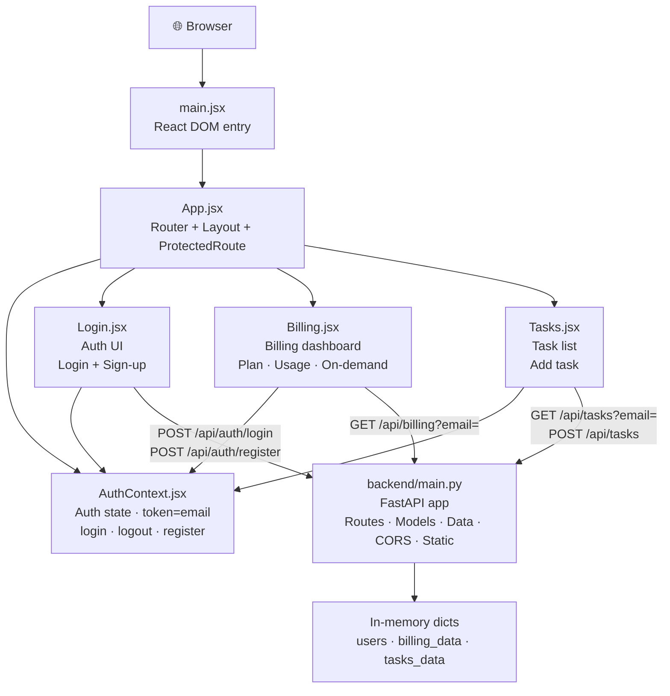
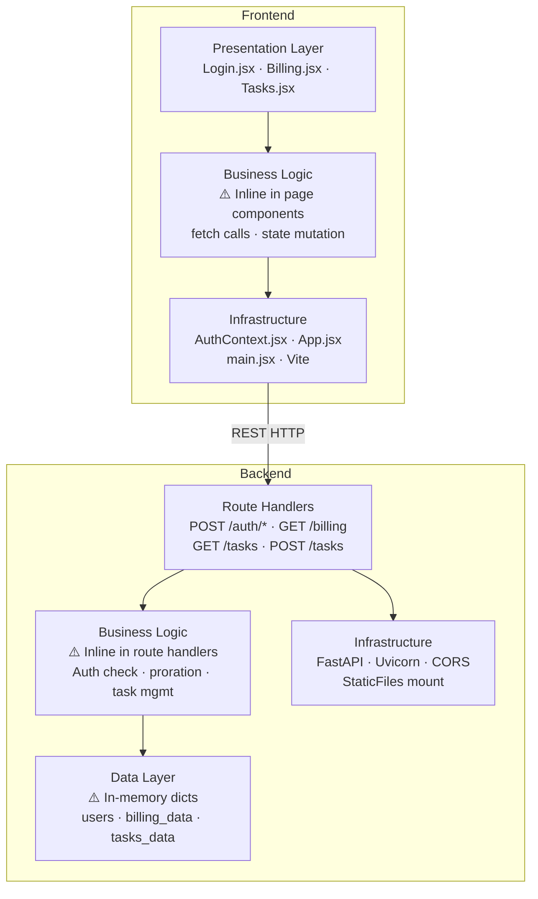
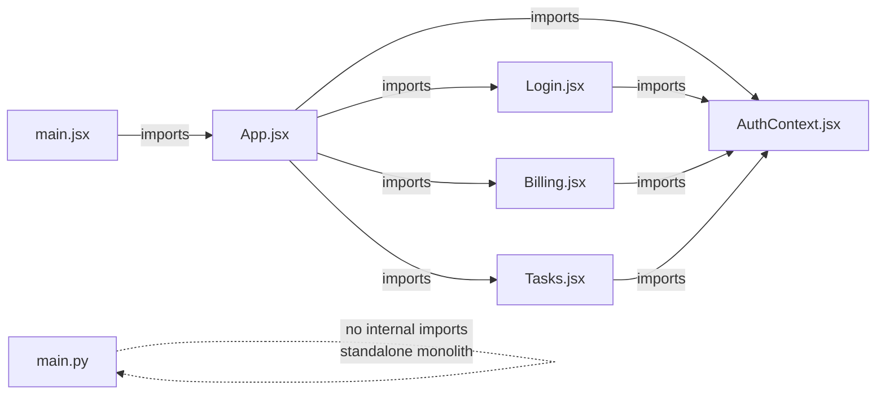
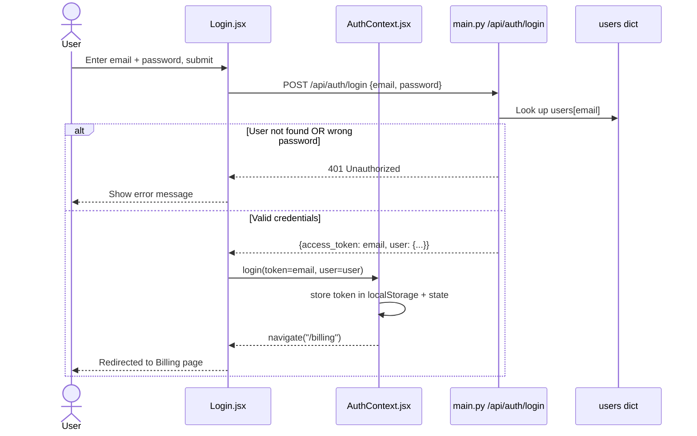
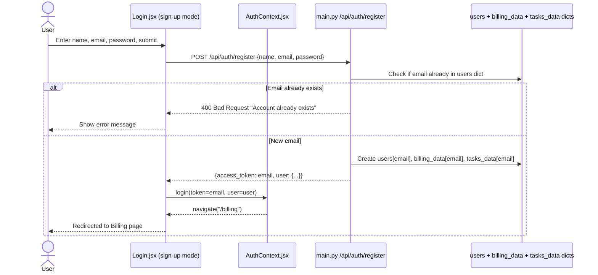
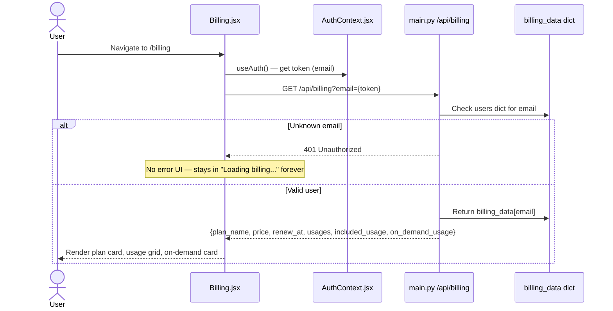
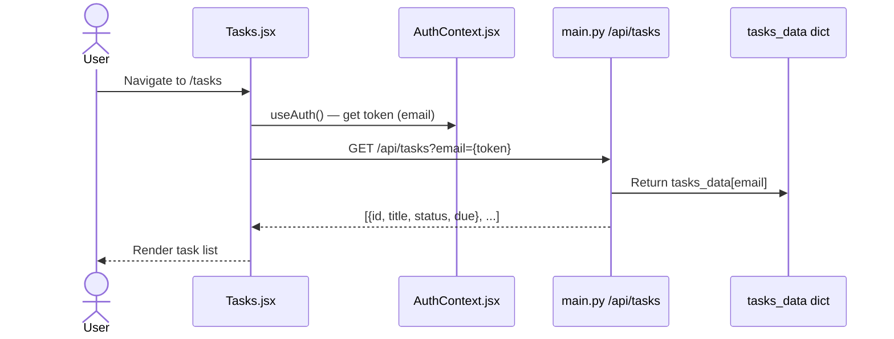
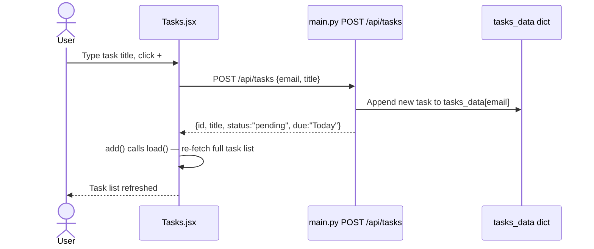
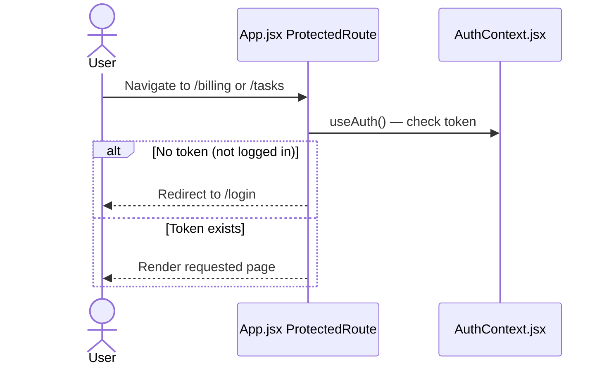
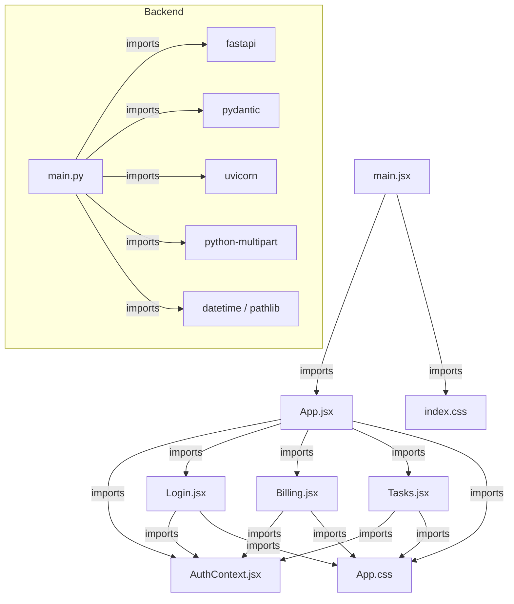

> **Source**: Atlas via Helix MCP
> **Server / tool**: helix · get_solution_document_tool
> **Estate**: solution_id 951 (Billing-Cycle-Helix-Workshop), repository Billing-Cycle (https://github.com/Shailendrayadav0666/Billing-Cycle), branch main, last_ingested_commit bcec649e08f2dbec435c24066deae6a1d6d71192
> **Scope pulled**: Whole estate (single small monorepo — Billing-Cycle backend + frontend) — document_id 4037, "Deep Dive: Billing-Cycle.md"
> **Fetched**: 2026-09-16T10:29:53Z
> **Freshness**: Atlas document updated 2026-09-16T09:32:35Z (steps_completed 13 of 13, Status: COMPLETE)

---

# Deep Dive Analysis: Billing-Cycle

**Created:** 2026-09-16
**For:** Shailendra
**Analysis Depth:** Exhaustive
**Status:** COMPLETE
**Steps Completed:** 13 of 13

**Analysis Scope:**
- **Focus Areas:** All (comprehensive)
- **Code Quality Analysis:** Included
- **Security Analysis:** Included

> **Purpose:** Exhaustive system analysis covering architecture, flows, dependencies, code quality, testing, security, performance, and documentation with prioritized strategic recommendations.

---

## Executive Summary

### System Overview

Billing-Cycle is a full-stack proof-of-concept billing and task management dashboard built with **React 19 + Vite** on the frontend and **FastAPI (Python)** on the backend. The system requires no database — all data (users, billing, tasks) is stored in in-memory Python dictionaries, making it fast to spin up locally but unsuitable for production in its current form.

The architecture is a classic client-server SPA: the React frontend communicates with the FastAPI backend via 6 REST endpoints. Authentication is handled via a React Context Provider using the user's raw email as an auth token — a deliberate POC shortcut with significant security implications. The frontend is protected by a `ProtectedRoute` guard in `App.jsx`. The backend serves the React build as static files in production mode, enabling single-process deployment.

The codebase is small (819 LOC across 10 files), well-organized for its size, and currently functional as a demonstration system. The primary risks are: (1) critical security patterns not safe for production, (2) zero test coverage, and (3) a monolithic backend that will become increasingly painful as features are added. A PRD and Epic already exist for the first production feature (mid-cycle upgrade to Premium), making the security and testing gaps especially timely to address.

### Complexity Assessment

- **Overall Complexity:** Low (for its size) → Medium (for production ambitions)
- **Lines of Code:** 819 total (574 TypeScript/JSX, 213 Python, 32 JSON)
- **Components:** 6 significant (App, AuthContext, Login, Billing, Tasks, main.py)
- **External Dependencies:** 11 (8 frontend npm, 3 backend pip)
- **Technical Debt:** Medium — critical security debt + zero tests + God Module backend

### Top 10 Critical Findings

1. **Security - Critical:** Email used as auth token — no JWT, no signature, no expiry. Any caller knowing a user's email can impersonate them across all endpoints.
2. **Security - Critical:** Passwords stored and compared in plaintext — no bcrypt, no hashing of any kind.
3. **Testing - Critical:** Zero test coverage across 100% of the codebase — no unit, integration, or E2E tests. Proration math, auth guards, and all business logic are untested.
4. **Architecture - High:** `main.py` is a God Module — data store + models + business logic + 6 route handlers + CORS + static serving in 213 lines. Every feature addition touches this file.
5. **Scalability - High:** In-memory dict store is single-process and non-persistent — data lost on every restart; horizontal scaling impossible without a real database.
6. **Code Quality - High:** `Login.jsx` is a 152-LOC single function combining login UI, sign-up UI, and submit logic — untestable and high change-risk.
7. **Code Quality - Medium:** Raw `fetch()` pattern duplicated 3× across pages — no custom hook abstraction; API changes require multi-file edits.
8. **Dependencies - Medium:** Backend Python dependencies (`fastapi`, `uvicorn`, `python-multipart`) are unpinned — fresh installs may pull breaking changes silently.
9. **Documentation - Medium:** Auth model and in-memory store design intent are entirely undocumented — high tribal knowledge risk for any new developer.
10. **Performance - Low:** No caching at any layer; add-task triggers a full list re-fetch; no pagination on any endpoint — acceptable now, problematic at scale.

### Risk Assessment

| Risk Category | Level | Impact | Mitigation Priority |
|---|---|---|---|
| Security | 🔴 High | Email-as-token + plaintext passwords = trivially bypassable auth for any user whose email is known | Immediate — before any production exposure |
| Technical Debt | ⚠️ Medium | God Module + zero tests = every new feature is risky; debt compounds with each addition | Short-term — next sprint |
| Scalability | ⚠️ Medium | In-memory store = data loss on restart, single process only | Medium-term — before any real user load |
| Maintainability | ⚠️ Medium | Long methods, duplicated patterns, no abstractions = increasing friction per feature | Short-term — ongoing during feature work |
| Documentation | 🟡 Low-Medium | Auth model and store design are tribal knowledge; blocking for new contributors | Medium-term — pair with feature docs |

---

## Comprehensive Reconnaissance

### Directory Structure

```
Billing-Cycle/
├── README.md
├── backend/
│   ├── main.py              (213 lines — full FastAPI app)
│   └── requirements.txt     (3 deps)
└── frontend/
    ├── index.html
    ├── package.json
    ├── vite.config.js
    ├── .oxlintrc.json
    └── src/
        ├── main.jsx         (11 lines — React DOM entry)
        ├── App.jsx          (80 lines — routing shell)
        ├── App.css
        ├── index.css
        ├── context/
        │   └── AuthContext.jsx  (67 lines — auth state)
        └── pages/
            ├── Billing.jsx  (182 lines — billing UI)
            ├── Login.jsx    (158 lines — auth/signup UI)
            └── Tasks.jsx    (61 lines — task list UI)
```

### Technology Stack

**Programming Languages:**

| Language | Files | Lines of Code | Percentage |
|----------|-------|---------------|------------|
| TypeScript/JSX | 7 | 574 | 70.1% |
| Python | 1 | 213 | 26.0% |
| JSON (config) | 2 | 32 | 3.9% |
| **Total** | **10** | **819** | **100%** |

**Frameworks & Libraries:**

| Framework | Version | Purpose | Status |
|-----------|---------|---------|--------|
| React | 19.2.8 | Frontend UI library | Current |
| React Router | 7.18.2 | Client-side routing | Current |
| Vite | 8.2.2 | Frontend build tool | Current |
| @vitejs/plugin-react | 6.1.0 | React + Vite integration | Current |
| FastAPI | unpinned | Backend REST API framework | Current (unpinned) |
| Pydantic | via FastAPI | Request model validation | Current |
| Uvicorn | unpinned (standard) | ASGI server | Current (unpinned) |
| python-multipart | unpinned | Form data / multipart parsing | Current (unpinned) |
| oxlint | 1.79.0 | JS/TS linter | Current |

**Build & Tooling:**

- **Build System:** Vite 8.2.2
- **Package Manager:** npm
- **Testing Framework:** ❌ None
- **CI/CD:** ❌ None detected
- **Linter:** oxlint 1.79.0 (JS/TS only — Python linter absent)

### Comprehensive Statistics

| Metric | Value |
|--------|-------|
| Total Files | 10 |
| Total LOC | 819 |
| Code Files | 8 |
| Test Files | 0 |
| Config Files | 3 (.oxlintrc.json, vite.config.js, package.json) |
| Documentation Files | 2 (README.md × 2) |
| Average File Size | ~82 LOC |
| Largest File | `main.py` (213 LOC) |
| Code-to-Comment Ratio | Near 0 — minimal inline comments detected |

### Entry Points

**Application Entry Points:**

- `frontend/src/main.jsx` — React DOM mount; renders `<App>` into `#root`
- `backend/main.py` — FastAPI app; launched via `uvicorn main:app`

**API Endpoints:** 6 endpoints in `backend/main.py`

| Method | Route | Description |
|--------|-------|-------------|
| POST | `/api/auth/login` | Authenticate user, return email-as-token |
| POST | `/api/auth/register` | Create new mock account |
| GET | `/api/users/me` | Return current user details |
| GET | `/api/billing` | Return billing data and usage for user |
| GET | `/api/tasks` | Return task list for user |
| POST | `/api/tasks` | Add a new task |

**CLI Interfaces:** None

**Background Jobs:** None

**Scheduled Tasks:** None

---

## Deep Architectural Analysis

### Architectural Style & Patterns

**Primary Style:** Client-Server SPA — React 19 frontend (Vite dev server / FastAPI static mount in production) communicates with a FastAPI backend via REST over HTTP. No shared state between frontend and backend beyond the API contract.

**Detected Patterns:**

- **Context Provider:** `AuthContext.jsx` — centralized auth state (token = email string) shared across all pages via React Context API. All 3 pages + `App.jsx` consume it.
- **Protected Route:** `App.jsx` lines 41–44 — `ProtectedRoute` component wraps authenticated routes and redirects unauthenticated users to `/login`.
- **Flat Page Architecture:** `src/pages/` — each page is self-contained with no shared sub-components abstracted out. UI helper components (`InfoIcon`, `UsageIcon`, `IncludedUsageCard`, `OnDemandUsageCard`) are defined inline within `Billing.jsx`.
- **Monolithic Backend:** `backend/main.py` — single file contains data store, Pydantic models, route handlers, CORS config, and static file serving.

**Anti-Patterns Detected:**

- **God Module — `backend/main.py`:** Data store (`users`, `billing_data`, `tasks_data` dicts) + Pydantic request models + business logic + all 6 route handlers + CORS middleware + static file serving — all in 213 lines. Every new feature requires modifying this single file.
- **Mixed Concerns in Page Components:** `Billing.jsx`, `Tasks.jsx`, `Login.jsx` all contain raw `fetch()` calls inline alongside JSX rendering. No custom hooks abstract the data layer from the presentation layer.
- **Email-as-Token Auth:** The user's raw email string IS the auth token. Passed as query param (`?email=`) or request body field. No JWT, no session ID, no expiry. Any caller who knows the email can impersonate the user.
- **No Error Boundaries:** Error handling is only inline `.catch()` — no React error boundaries. Uncaught runtime errors crash the affected page silently.
- **Hardcoded Plan Data in Frontend:** `Billing.jsx` line 128 hardcodes `"Standard"` badge text with no dynamic plan-name binding from the API response's `plan_name` field.

### Architecture Diagrams

#### High-Level System Architecture



#### Layer Diagram



#### Module Interactions



### Complete Component Catalog

| Component | Path | Responsibility | Key Internals | Ext. Dependencies | Complexity |
|-----------|------|----------------|---------------|-------------------|------------|
| `main.jsx` | `frontend/src/main.jsx` | React DOM mount — renders `<App>` into `#root` | `createRoot`, `StrictMode` | react, react-dom | Simple |
| `App` | `frontend/src/App.jsx` | Router shell, `Layout` (nav + outlet), `ProtectedRoute` guard | `Layout`, `ProtectedRoute`, `App` functions | react-router-dom, AuthContext | Simple |
| `AuthContext` | `frontend/src/context/AuthContext.jsx` | Global auth state — token (email), user object, login/logout/register | `AuthProvider`, `useAuth` hook | react, react-router-dom | Medium |
| `Login` | `frontend/src/pages/Login.jsx` | Combined login + sign-up form, calls `/api/auth/*`, stores token in context | `handleSubmit`, `setIsSignUp` toggle | AuthContext, react | Medium |
| `Billing` | `frontend/src/pages/Billing.jsx` | Billing dashboard — plan card, usage grid, included/on-demand usage cards | `InfoIcon`, `UsageIcon`, `IncludedUsageCard`, `OnDemandUsageCard`, `Billing` | AuthContext, react | Medium |
| `Tasks` | `frontend/src/pages/Tasks.jsx` | Task list display + add task form | `load`, `add`, `useEffect` | AuthContext, react | Simple |
| `main.py` | `backend/main.py` | All-in-one FastAPI app: data store, request models, 6 route handlers, CORS, static mount | `users` dict, `billing_data` dict, `tasks_data` dict, `LoginRequest`, `RegisterRequest`, `TokenRequest`, `TaskCreateRequest` | fastapi, pydantic, uvicorn | Complex (for its size) |

### Architectural Assessment

**Strengths:**

- Clean frontend component hierarchy — `App.jsx` → `AuthContext` → pages is a clear, shallow tree
- `AuthContext` is well-positioned as the single source of auth truth; all pages consume it consistently
- React Router v7 route definitions are minimal and readable
- FastAPI + Pydantic enforces request validation at the boundary — prevents malformed inputs reaching business logic
- Static file serving baked into FastAPI enables single-process production deployment

**Weaknesses:**

- Backend is a single-file monolith — no separation of concerns; every feature addition grows `main.py`
- Email-as-token is a critical security anti-pattern — no expiry, no signing, trivially forgeable
- No API abstraction layer on the frontend — raw `fetch()` in every component makes API changes require touching multiple files
- Zero test coverage across the entire codebase
- Backend dependency versions unpinned (`fastapi`, `uvicorn`, `python-multipart`) — risk of breaking changes on fresh install
- No CI/CD pipeline — no automated quality gate

**Recommendations:**

- Extract backend into separate modules: a `routes/` package (auth, billing, tasks routers), a `models.py` (Pydantic schemas), and a `store.py` (in-memory data) — none of these exist yet; this is a recommended refactor
- Introduce custom hooks: `useBilling()`, `useTasks()`, `useBillingUpgrade()` to decouple data fetching from rendering
- Replace email-as-token with proper JWT (fastapi-jwt-auth or python-jose) — 1–2 hour change with significant security improvement
- Pin all Python dependencies with explicit versions in `requirements.txt`
- Add pytest for backend and Vitest for frontend — start with proration math and auth guard unit tests

---

## Comprehensive Flow Analysis

**Flows Identified: 6 total** | No background jobs, data pipelines, or external integrations exist — all flows are synchronous and user-triggered.

### Flow 1: Login



### Flow 2: Registration



### Flow 3: Billing Data Fetch



### Flow 4: Task List Fetch



### Flow 5: Add Task



### Flow 6: Auth Guard (ProtectedRoute)



### Flow Interactions

| Shared Component | Flows That Use It | Risk |
|---|---|---|
| `AuthContext` token | All 6 flows | Single point of auth truth AND single point of auth failure |
| `users` dict | Login, Register, Billing fetch, Tasks fetch, Add Task | Any corruption affects all features |
| `billing_data` dict | Billing fetch (read) | Upgrade flow (PRD) will add write — first write dependency on this dict |
| `tasks_data` dict | Task fetch (read), Add task (write) | No concurrency protection — concurrent POSTs could cause ID collisions |

**Notable observations:**
- **No logout flow surfaced** — `AuthContext.jsx` likely has a `logout()` function clearing localStorage, but no logout button is visible in `App.jsx`'s `Layout` nav
- **No error UI on 401 for Billing/Tasks** — if token is invalid, `GET /api/billing` returns 401 but `Billing.jsx` stays in "Loading billing..." indefinitely with no user feedback
- **Add task triggers full re-fetch** — `add()` calls `load()` after success rather than optimistically updating local state — correct but slightly redundant at scale
- **No loading states on Tasks** — unlike `Billing.jsx` which has a loading guard, `Tasks.jsx` renders nothing while fetching
- **No concurrency protection** — in-memory dict mutations are not thread-safe; not a concern for a single-process POC but critical before any production deployment

---

## Exhaustive Dependency Analysis

### Internal Dependencies

#### Dependency Graph



#### Coupling Metrics

| Module | Afferent Ca | Efferent Ce | Instability Ce/(Ca+Ce) | Assessment |
|--------|-------------|-------------|------------------------|------------|
| `AuthContext.jsx` | 4 | 1 | 0.20 | ✅ Stable — high fan-in, low fan-out |
| `App.css` | 4 | 0 | 0.00 | ✅ Very stable |
| `index.css` | 1 | 0 | 0.00 | ✅ Stable |
| `main.jsx` | 0 | 2 | 1.00 | Entry point — expected |
| `App.jsx` | 1 | 5 | 0.83 | ⚠️ Unstable — depends on most modules |
| `Billing.jsx` | 1 | 2 | 0.67 | Medium |
| `Login.jsx` | 1 | 2 | 0.67 | Medium |
| `Tasks.jsx` | 1 | 2 | 0.67 | Medium |
| `main.py` | 0 | 6 | 1.00 | ⚠️ Backend entry point — maximally unstable by design; no internal consumers |

#### Circular Dependencies

✅ **None detected.** The import graph is a clean DAG (directed acyclic graph) — no circular dependency chains exist anywhere in the codebase.

**Key stability observation:** `AuthContext.jsx` is the most stable internal module (instability 0.20) and is depended upon by 4 of 5 source files. This makes it a high-leverage module — any breaking interface change requires updating all pages simultaneously.

### External Dependencies

**Frontend (npm — all pinned):**

| Dependency | Version | Purpose | Scope | Update Rec |
|---|---|---|---|---|
| react | ^19.2.8 | UI rendering library | Runtime | ✅ Up to date |
| react-dom | ^19.2.8 | DOM renderer | Runtime | ✅ Up to date |
| react-router-dom | ^7.18.2 | Client-side routing | Runtime | ✅ Up to date |
| vite | ^8.2.2 | Build tool / dev server | Dev | ✅ Up to date |
| @vitejs/plugin-react | ^6.1.0 | Vite + React integration | Dev | ✅ Up to date |
| @types/react | ^19.2.18 | TypeScript type defs | Dev | ✅ Up to date |
| @types/react-dom | ^19.2.4 | TypeScript type defs | Dev | ✅ Up to date |
| oxlint | ^1.79.0 | JS/TS linter | Dev | ✅ Up to date |

**Backend (pip — all UNPINNED):**

| Dependency | Version | Purpose | Pinned? | Update Rec |
|---|---|---|---|---|
| fastapi | unpinned | REST API framework | ❌ No | ⚠️ Pin version immediately |
| uvicorn[standard] | unpinned | ASGI server | ❌ No | ⚠️ Pin version immediately |
| python-multipart | unpinned | Form / multipart parsing | ❌ No | ⚠️ Pin version immediately |
| pydantic | transitive via fastapi | Request model validation | ❌ (transitive) | Pinned implicitly by fastapi |
| datetime | Python stdlib | Date arithmetic for renew_at | N/A | N/A |
| pathlib | Python stdlib | Static file path detection | N/A | N/A |

### External Service Integrations

✅ **None.** The system is fully self-contained — no third-party APIs, payment processors, email services, message queues, or webhooks. All data is generated and stored in-process.

### Database Analysis

✅ **No database.** Data is stored in three in-memory Python dicts defined at module level in `main.py`:

| Store | Type | Contents | Persistence |
|---|---|---|---|
| `users` | `dict[email → user_obj]` | User profiles, plan, price, renew_at | ❌ Lost on restart |
| `billing_data` | `dict[email → billing_obj]` | Plan details, usage metrics, on-demand data | ❌ Lost on restart |
| `tasks_data` | `dict[email → list[task]]` | Task lists per user | ❌ Lost on restart |

**Schema overview (implicit):**
- `users`: `{id, name, email, password (plaintext), plan, price, renew_at}`
- `billing_data`: `{plan_name, price, renew_at, usages[], included_usage{}, on_demand_usage{}}`
- `tasks_data`: `[{id, title, status, due}]`

**Critical notes:**
- **Passwords stored in plaintext** — no hashing (bcrypt, argon2, etc.)
- **No migration strategy** — schema is implicit Python object structure; changes require code edits
- **No data validation on read** — if a dict entry is malformed, it surfaces as a runtime error
- **Thread safety** — Python dict operations are GIL-protected for single operations, but read-modify-write sequences (e.g., task ID generation) are not atomic under concurrent load

---

## Code Quality & Technical Debt

**Overall Quality Assessment: Fair** — clean for a POC, but with structural debt that compounds as features are added.

### Complexity Metrics

| File | Cyclomatic Complexity | LOC | Assessment |
|---|---|---|---|
| `backend/main.py` | 8 | 213 | ⚠️ Highest — all logic in one file |
| `AuthContext.jsx` | 5 | 67 | ⚠️ High for its size |
| `Billing.jsx` | 4 | 182 | Medium |
| `Login.jsx` | 3 | 158 | Medium |
| `Tasks.jsx` | 2 | 61 | ✅ Low |
| `App.jsx` | 1 | 80 | ✅ Low |

### Long Methods (>50 lines)

| Method | File | Lines | Issue |
|---|---|---|---|
| `Login` | `Login.jsx` | 5–157 (152 LOC) | 🔴 Massive — login + signup + submit in one function |
| `Billing` | `Billing.jsx` | 100–181 (81 LOC) | ⚠️ Long — renders 4 sub-sections inline |
| `register` | `main.py` | 115–173 (58 LOC) | ⚠️ Long — creates 3 dicts of mock data inline |
| `AuthProvider` | `AuthContext.jsx` | 6–64 (58 LOC) | ⚠️ Long — useEffect + login + register + logout all in one |

### Code Smells

| Smell | Instance | Location | Impact |
|---|---|---|---|
| **Long Method** | `Login` function (152 LOC) | `Login.jsx:5–157` | Hard to test, high change-risk |
| **God Function (JSX)** | `Billing` component (81 LOC) | `Billing.jsx:100–181` | All sub-sections rendered inline |
| **Inline Sub-components** | `InfoIcon`, `UsageIcon`, `IncludedUsageCard`, `OnDemandUsageCard` | `Billing.jsx:5–98` | 4 reusable components trapped in one file |
| **Magic Numbers** | `Math.min(100, ...)` — 100% cap | `Billing.jsx:67, 167` | Should be named constant |
| **Hardcoded Plan Data** | `"Standard"` badge text | `Billing.jsx:128` | Not derived from API `data.plan_name` |
| **Duplicated fetch pattern** | `fetch().then(r.json()).then(setState)` | `Billing.jsx:105`, `Tasks.jsx:12`, `AuthContext.jsx:14` | Same pattern 3×, no hook abstraction |
| **Plaintext Password** | `user["password"]` compared as string | `main.py:24, 110` | Critical security + quality issue |
| **Large Data Init Block** | `register()` creates 58 lines of mock data inline | `main.py:115–173` | Should be a factory function |
| **Missing null guard** | No check on `tasks` being undefined | `Tasks.jsx` | Unlike `Billing.jsx`, no null guard before `.map()` |

**Code Duplication:** ~15% estimated — `fetch().then()` pattern appears 3× verbatim; `register()` mock data mirrors top-level `billing_data` structure.

**TODO/FIXME in source:** ✅ Zero — no TODO, FIXME, or HACK comments in application source files.

### Technical Debt Inventory

| Priority | Issue | Location | Effort | Impact |
|---|---|---|---|---|
| 🔴 High | Plaintext password storage | `main.py:24, 110` | Low | Critical security risk |
| 🔴 High | `Login` is 152 LOC single function | `Login.jsx:5–157` | Medium | Untestable, high change-risk |
| 🔴 High | Zero test coverage | Entire codebase | High | Every change is a regression risk |
| ⚠️ Medium | Duplicated fetch pattern (3×) | `Billing.jsx`, `Tasks.jsx`, `AuthContext.jsx` | Low | Extract custom hooks |
| ⚠️ Medium | 4 sub-components inline in `Billing.jsx` | `Billing.jsx:5–98` | Low | Reusability blocked |
| ⚠️ Medium | `register()` 58 LOC mock data factory | `main.py:115–173` | Low | Extract factory function |
| ⚠️ Medium | Unpinned Python dependencies | `requirements.txt` | Very Low | Fresh installs may break |
| 🟡 Low | Magic `100` literal for usage % cap | `Billing.jsx:67, 167` | Very Low | Readability |
| 🟡 Low | Hardcoded `"Standard"` badge text | `Billing.jsx:128` | Very Low | Will break when plan changes |

**Quick wins:** Pin Python versions (5 min) · Extract `useBilling()`/`useTasks()` hooks (30 min each) · Replace `"Standard"` literal with `data.plan_name` (5 min) · Add `MAX_USAGE_PERCENT` constant (5 min)

---

## Test Coverage Analysis

### Test Suite Overview

| Test Type | Count | % of Suite |
|-----------|-------|------------|
| Unit Tests | 0 | — |
| Integration Tests | 0 | — |
| End-to-End Tests | 0 | — |
| **Total** | **0** | — |

**Test framework:** ❌ None installed. No pytest, no Vitest, no Jest, no Playwright — no test runner of any kind exists in either `package.json` or `requirements.txt`.

### Coverage Metrics

**Overall coverage: 0%** — not measurable (no test runner, no coverage tooling).

No coverage data exists for statement, branch, or function coverage.

### Coverage by Component

| Component | Coverage | Assessment |
|-----------|----------|------------|
| `main.py` | 0% | 🔴 Critical — 6 routes + proration logic untested |
| `AuthContext.jsx` | 0% | 🔴 Critical — auth state management, localStorage interaction |
| `Login.jsx` | 0% | 🔴 Critical — form validation, auth flow |
| `Billing.jsx` | 0% | 🔴 Critical — usage calculations, plan rendering |
| `Tasks.jsx` | 0% | 🔴 Critical — task CRUD flow |
| `App.jsx` | 0% | ⚠️ High — route guards, protected route logic |

### Testing Gaps

**Every component, every flow, every edge case is untested.** Critical gaps by risk level:

| Gap | Risk | Why It Matters |
|---|---|---|
| Proration calculation `(50-20)/30 × days_remaining` | 🔴 Critical | Math error = wrong charge; no safety net before PRD upgrade ships |
| Auth guard (ProtectedRoute) | 🔴 Critical | If broken, unauthenticated users access billing/task data |
| Email-as-token validation | 🔴 Critical | Auth bypass possible — no test would catch it |
| `register()` duplicate email check | ⚠️ High | Creates duplicate accounts silently if guard fails |
| `add_task` ID generation under concurrency | ⚠️ High | Race condition on `max(id)` could produce duplicate IDs |
| Billing data null/missing response handling | ⚠️ High | `Billing.jsx` hangs on 401 with no timeout or error UI |
| Plan badge rendering (`Standard` vs `Premium`) | ⚠️ Medium | PRD feature depends on this — no regression protection |

### Testing Recommendations

1. **Immediate — Backend:** Add `pytest` + `httpx` for FastAPI. First tests: proration calculation unit test, `/api/auth/login` success/failure, idempotency guard on future `/api/billing/upgrade`
2. **Immediate — Frontend:** Add `vitest` + `@testing-library/react`. First tests: `ProtectedRoute` redirect behavior, `AuthContext` login/logout state transitions
3. **Short-term:** Target the 3 critical flows from Step 4 (Login, Auth Guard, Billing Fetch) with integration tests before any new feature ships
4. **Strategy:** Adopt a "test the PRD" approach — for Story S-01, write the 10 ACs as tests first (TDD), then implement
5. **Coverage target:** Reach 60% backend coverage + 40% frontend coverage before production deployment

---

## Security Considerations

> ⚠️ **Disclaimer:** This is NOT a security audit. This is a pattern-based review flagging areas for professional security assessment.

### Authentication

| Aspect | Finding | Severity |
|---|---|---|
| **Token type** | Raw email string used as auth token — passed as query param or request body field | 🔴 Critical |
| **Token expiry** | None — email tokens never expire | 🔴 Critical |
| **Token signing** | None — no HMAC, no JWT signature | 🔴 Critical |
| **Token storage** | `localStorage` — susceptible to XSS theft | ⚠️ High |
| **Password hashing** | Passwords stored and compared in plaintext | 🔴 Critical |
| **Brute force protection** | None — no rate limiting on `/api/auth/login` | ⚠️ High |

### Authorization

| Aspect | Finding | Severity |
|---|---|---|
| **Frontend guard** | `ProtectedRoute` checks for token presence only — any non-empty string passes | ⚠️ High |
| **Backend auth** | Each endpoint looks up email in `users` dict — no signature/expiry validation | 🔴 Critical |
| **Role-based access** | None — all authenticated users have identical access | 🟡 Low (POC scope) |
| **Cross-user data access** | Email is both identity and credential — any caller who knows another user's email can access their billing/task data | 🔴 Critical |

### Input Validation

| Aspect | Finding | Severity |
|---|---|---|
| **Backend validation** | Pydantic models validate field types on request body — ✅ adequate for current endpoints | ✅ OK |
| **Email format validation** | No email format check on register — any string accepted as email | ⚠️ Medium |
| **Frontend validation** | No client-side validation on Login form beyond HTML `type="email"` | ⚠️ Medium |
| **SQL injection** | N/A — no SQL; in-memory dict lookups are not injectable | ✅ N/A |

### Output Encoding / XSS

| Aspect | Finding | Severity |
|---|---|---|
| **React JSX rendering** | All user data rendered via JSX — React auto-escapes strings by default | ✅ OK |
| **Dangerous patterns** | No `dangerouslySetInnerHTML` detected | ✅ OK |
| **Data from API** | API returns Python dicts serialized as JSON — no unescaped HTML in data | ✅ OK |

### Secret Management

| Aspect | Finding | Severity |
|---|---|---|
| **Hardcoded credentials** | Demo account `tpg@example.com` / `password` hardcoded in `main.py:19–29` | ⚠️ Medium (POC) |
| **Environment variables** | No `.env` usage — no config externalization | ⚠️ Medium |
| **CORS config** | `allow_origins=["*"]` — accepts requests from any origin | ⚠️ Medium |
| **Secrets in code** | No API keys or production secrets found — POC only | ✅ OK for POC |

### Cryptographic Usage

None. No hashing, no encryption, no TLS configuration in code. TLS would be handled at the infrastructure level (reverse proxy).

### Potential Vulnerability Patterns

| Pattern | Location | Concern |
|---|---|---|
| **Auth bypass** | All API endpoints | Email-as-token means any caller knowing the email can forge requests |
| **Information disclosure** | `GET /api/users/me` returns full user object | Password field filtered out (`k != "password"`) — ✅ OK, but plan is to filter explicitly |
| **Mass assignment** | `register()` accepts `name`, `email`, `password` only | ✅ Pydantic model constrains fields — no mass assignment risk |
| **CSRF** | No CSRF tokens | FastAPI's JSON API + no cookie auth means CSRF is not applicable here |
| **Concurrent write race** | `tasks_data` ID generation: `max(id) + 1` | ⚠️ Race condition under concurrent POSTs — duplicate IDs possible |

### Top Security Recommendations

1. 🔴 **Replace email-as-token with JWT** — `python-jose` + `passlib[bcrypt]` — 2–4 hour change; eliminates the most critical auth vulnerabilities
2. 🔴 **Hash passwords with bcrypt** — `passlib[bcrypt]` — 30-minute change; eliminates plaintext credential storage
3. ⚠️ **Restrict CORS origins** — Change `allow_origins=["*"]` to explicit list of allowed origins before any non-local deployment
4. ⚠️ **Add rate limiting** — `slowapi` middleware on `/api/auth/login` and `/api/auth/register`
5. ⚠️ **Move hardcoded demo credentials to environment variables**

**Professional Security Review: Recommended before any production deployment.** Critical auth vulnerabilities (plaintext passwords, email-as-token) must be resolved first.

---

## Performance & Scalability Analysis

### Performance Patterns

| Issue | Location | Impact |
|---|---|---|
| **Full list re-fetch on add** | `Tasks.jsx: add()` calls `load()` after POST | Fetches entire task list on every addition — harmless now, wasteful at scale |
| **No pagination** | `GET /api/tasks`, `GET /api/billing` | Returns full dataset on every call — no limit/offset support |
| **Synchronous dict lookups** | All backend endpoints | In-memory dict O(1) lookups — ✅ fast for POC scale |
| **No request deduplication** | `Billing.jsx` `useEffect` | Fetch fires on every render with `token` as dep — acceptable but no dedup guard |
| **Full billing reload on upgrade** | PRD spec: re-fetch `GET /api/billing` after upgrade | Correct approach for consistency; not a concern at this scale |
| **Inline SVG components** | `InfoIcon`, `UsageIcon` in `Billing.jsx` | SVGs re-rendered on every billing render — memoise candidates at scale |

**N+1 Queries:** N/A — no database; all data is O(1) dict lookups.

**CPU/Memory intensive ops:** None detected — all operations are simple dict reads/writes and arithmetic.

### Caching Analysis

| Layer | Current State | Opportunity |
|---|---|---|
| **API responses** | ❌ None — no HTTP cache headers, no server-side cache | `GET /api/billing` and `GET /api/tasks` are read-heavy; could add `Cache-Control` headers |
| **Frontend state** | ⚠️ Component-level `useState` only — lost on navigation | React Query or SWR would add stale-while-revalidate caching with minimal effort |
| **Static assets** | ✅ Vite handles asset hashing for production builds | Already optimal |
| **Cache invalidation** | N/A — no cache exists | On upgrade, POST `/api/billing/upgrade` should trigger cache invalidation if caching added later |

### Scalability Considerations

**Horizontal scaling readiness: ❌ Not ready**

| Component | Stateful? | Scaling Concern |
|---|---|---|
| `backend/main.py` — `users` dict | 🔴 Yes | In-process state — two backend instances would have independent, divergent data stores |
| `backend/main.py` — `billing_data` dict | 🔴 Yes | Same — any write to one instance is invisible to others |
| `backend/main.py` — `tasks_data` dict | 🔴 Yes | Same — task creates on instance A not visible to instance B |
| React frontend | ✅ No | Stateless SPA — can be served from CDN |
| FastAPI request handling | ✅ No (per-request) | Each request is stateless given same in-memory data |

**Bottlenecks:**
1. **Single-process in-memory store** — the most significant scalability blocker; replacing with a proper database (SQLite for POC upgrade → PostgreSQL for production) unlocks horizontal scaling entirely
2. **No async I/O on backend** — all FastAPI route handlers are sync (`def` not `async def`); acceptable now but limits throughput under concurrent load
3. **CORS wildcard** — `allow_origins=["*"]` combined with no rate limiting means no request throttling at any layer

### Performance Recommendations

**Quick wins:**
1. Add `async def` to all FastAPI route handlers (5 min) — unlocks uvicorn's async event loop for concurrent requests
2. Add `Cache-Control: no-store` headers on auth endpoints, `max-age=30` on billing (30 min) — reduces redundant client fetches
3. Wrap `InfoIcon`/`UsageIcon` in `React.memo` (10 min) — prevents unnecessary SVG re-renders

**Strategic improvements:**
1. Replace in-memory dicts with SQLite (development) → PostgreSQL (production) — prerequisite for any multi-user or multi-instance deployment
2. Adopt React Query (`@tanstack/react-query`) for frontend data fetching — adds caching, deduplication, background refetch, and stale-while-revalidate with minimal code change

**Monitoring recommendations:**
- Response time on `/api/billing/upgrade` (PRD feature — has proration calculation)
- Memory growth of `users`/`billing_data`/`tasks_data` dicts over time (no eviction policy — could grow unbounded)
- Error rate on all endpoints (currently no server-side error logging)

---

## Documentation Audit

### Existing Documentation Assessment

| Document Type | Status | Quality (1–5) | Completeness |
|---------------|--------|----------------|--------------|
| README (root) | ✅ Exists | 4/5 | ~85% — covers setup, stack, API routes, demo account |
| README (frontend) | ✅ Exists | 2/5 | ~30% — Vite scaffold boilerplate only, not project-specific |
| API Documentation | ❌ Missing | — | 0% — API routes exist only in README table |
| Architecture Docs | ❌ Missing | — | 0% — no architecture documentation |
| Setup/Deploy Guide | ✅ Exists (in README) | 3/5 | ~70% — local setup covered; production deploy not covered |
| Troubleshooting | ❌ Missing | — | 0% |
| Runbooks | ❌ Missing | — | 0% |
| ADRs | ❌ Missing | — | 0% — no documented architectural decisions |

**Code comment quality:** Near zero — minimal inline comments across all files. Code is largely self-documenting in structure but business logic (e.g., proration formula, mock data design, email-as-token choice) is entirely undocumented.

### Critical Knowledge Gaps

| Gap | Impact | Tribal Knowledge Risk |
|---|---|---|
| **Why email-as-token?** | New devs may not understand the auth model and accidentally "fix" it in a way that breaks existing flows | 🔴 High — only the original author knows this was intentional |
| **Proration formula rationale** | `(50-20)/30 × days_remaining` — no docs explain the pricing assumptions (30-day month, $20→$50 delta) | ⚠️ Medium — PRD specifies it but no ADR |
| **In-memory store design intent** | Is this a stepping stone to a real DB or a permanent constraint? No documentation of this decision | 🔴 High — shapes every future feature |
| **Mock data structure** | `billing_data`, `users`, `tasks_data` dicts have implicit schemas with no documentation | ⚠️ Medium — any new contributor must reverse-engineer from code |
| **Auth flow quirk** | Token stored as raw email in localStorage — not documented; looks like a bug to new devs | 🔴 High — first thing a new dev will try to "fix" |
| **No production deployment guide** | README documents local setup only — no Docker, no cloud deployment, no env var guide | ⚠️ Medium |

### Documentation Priorities

**Priority 1 — Critical (Blocking Onboarding):**
1. Document auth model — explain email-as-token, why it exists, and what to replace it with for production
2. Document in-memory store design intent and schema (implicit dict structure)
3. Production deployment guide — environment variables, CORS config, static file serving

**Priority 2 — High (Complex Areas):**
1. API documentation — full endpoint reference (beyond README table), request/response schemas
2. Architecture overview — component responsibilities, data flow, layer separation
3. ADR: Email-as-token choice and planned replacement path

**Priority 3 — Medium (Nice to Have):**
1. Frontend component guide — when to use `AuthContext`, what `ProtectedRoute` guards
2. Troubleshooting guide — common errors (401 hang, CORS issues)
3. Code comments on proration calculation and mock data factory in `main.py`

---

## Comprehensive Recommendations

### Immediate Actions (Do Now)

| # | Action | Source | Severity | Effort |
|---|---|---|---|---|
| 1 | **Hash passwords with bcrypt** — add `passlib[bcrypt]`, replace plaintext `password` comparison in `login()` and `register()` | Step 8 Security | 🔴 Critical | 1–2 hrs |
| 2 | **Replace email-as-token with JWT** — add `python-jose`, issue signed tokens on login/register, validate on every endpoint | Step 8 Security | 🔴 Critical | 3–5 hrs |
| 3 | **Pin Python dependency versions** — add specific versions to `requirements.txt` for `fastapi`, `uvicorn`, `python-multipart` | Step 5 Dependencies | ⚠️ High | 15 min |
| 4 | **Document the auth model** — add inline comments + a short `ARCHITECTURE.md` explaining email-as-token, in-memory store, and planned production path | Step 10 Docs | ⚠️ High | 1 hr |

### Short-Term Improvements (Next Sprint)

| # | Improvement | Source | Value | Effort |
|---|---|---|---|---|
| 1 | **Extract `useBilling()` and `useTasks()` custom hooks** — remove raw `fetch()` from page components | Step 6 Quality | High | 1–2 hrs each |
| 2 | **Add pytest + first backend tests** — proration calculation unit test, login success/failure, idempotency guard | Step 7 Testing | High | 3–4 hrs |
| 3 | **Add Vitest + first frontend tests** — `ProtectedRoute` redirect, `AuthContext` login/logout state | Step 7 Testing | High | 3–4 hrs |
| 4 | **Split `Login.jsx` (152 LOC)** into `LoginForm.jsx` and `SignUpForm.jsx` components | Step 6 Quality | Medium | 2 hrs |
| 5 | **Restrict CORS** — change `allow_origins=["*"]` to explicit allowed origins | Step 8 Security | Medium | 15 min |
| 6 | **Move sub-components out of `Billing.jsx`** — `InfoIcon`, `UsageIcon`, `IncludedUsageCard`, `OnDemandUsageCard` → `components/` | Step 6 Quality | Medium | 1 hr |
| 7 | **Replace `"Standard"` hardcode** with `data.plan_name` in `Billing.jsx:128` | Step 6 Quality | Low | 5 min |

### Medium-Term Strategy (Next Quarter)

| # | Initiative | Source | Current State | Desired State | Effort |
|---|---|---|---|---|---|
| 1 | **Backend module extraction** — split `main.py` into `routes/`, `models.py`, `store.py` | Step 3 Architecture | 213-line God Module | Clean layered backend | 1–2 days |
| 2 | **Add rate limiting** — `slowapi` middleware on auth endpoints | Step 8 Security | No rate limiting | Brute-force protection | 2–4 hrs |
| 3 | **Reach 60% backend / 40% frontend test coverage** — systematic test expansion across all routes and components | Step 7 Testing | 0% | 60% / 40% | 2–3 sprints |
| 4 | **Add error UI for failed API calls** — handle 401 on `Billing.jsx` and `Tasks.jsx` instead of hanging in loading state | Step 4 Flows | Silent hang on 401 | User-facing error with retry | 4–6 hrs |
| 5 | **Create `ARCHITECTURE.md`** — document component responsibilities, data flows, layer diagram, ADR for key decisions | Step 10 Docs | No architecture docs | Complete architecture guide | 4–8 hrs |
| 6 | **Add React Router lazy loading** — `React.lazy()` for page-level code splitting | Step 9 Performance | Static imports | Code-split bundles | 2 hrs |

### Long-Term Evolution (6-12 Months)

| # | Evolution | Source | Current | Proposed | Benefit | Effort |
|---|---|---|---|---|---|---|
| 1 | **Replace in-memory store with a real database** — SQLite for dev/staging, PostgreSQL for production | Step 5 + Step 9 | `dict`-based, lost on restart | Persistent, queryable store | Enables multi-user, horizontal scaling, data durability | 1–2 weeks |
| 2 | **Implement proper production auth** — JWT with refresh tokens, secure HttpOnly cookies, token revocation | Step 8 Security | Email-as-token, no expiry | Production-grade auth | Security posture overhaul | 1 week |
| 3 | **Add CI/CD pipeline** — GitHub Actions with lint + test + build on every PR | Step 2 Recon | No CI/CD | Automated quality gate | Prevents regressions, enforces standards | 1–2 days |
| 4 | **Frontend state management evolution** — React Query / TanStack Query for server state | Step 9 Performance | Raw `fetch()` in components | Caching, dedup, background refetch | Eliminates redundant fetches, improves UX | 1–2 days |
| 5 | **TypeScript migration** — convert JSX to TSX for type safety | Step 2 Recon | Untyped JSX | Fully typed components | Catch type errors at compile time; types already declared in `devDependencies` | 2–3 days |

### Suggested Follow-Up Workflows

- **assess-tech-debt** — for a dedicated debt remediation plan with ticket-ready issues, now that the full inventory is documented
- **capture-decisions** — to create ADRs for the 3 key undocumented decisions: email-as-token, in-memory store, and flat page architecture
- **document-apis** — to produce a proper API reference document (beyond the README table)
- **migration-strategy** — to plan the in-memory → database migration with a phased approach

---

## Getting Started

### To Run Locally:

```bash
# Backend
cd backend
python3 -m venv .venv
.venv/bin/pip install -r requirements.txt
.venv/bin/uvicorn main:app --host 127.0.0.1 --port 8000

# Frontend (separate terminal)
cd frontend
npm install
npm run dev
```

- **Backend API:** http://127.0.0.1:8000
- **Frontend dev server:** http://localhost:5173
- **Demo login:** `tpg@example.com` / `password`

### Configuration:

- **Main config:** No config file — all settings hardcoded in `backend/main.py`
- **Environment:** No environment variables — demo credentials hardcoded in `main.py:19–29`
- **Production build:** `cd frontend && npm run build` → outputs `frontend/dist/` → served by FastAPI automatically

### Testing:

- **Run tests:** ❌ No test suite configured
- **Test location:** ❌ No test directory exists
- **Recommended setup:** `pytest` + `httpx` for backend · `vitest` + `@testing-library/react` for frontend

---

## Quick Reference Card

**Entry Points:**

- Frontend: `frontend/src/main.jsx` — React DOM mount
- Backend: `backend/main.py` — `uvicorn main:app --host 127.0.0.1 --port 8000`
- Tests: ❌ None

**Key Files:**

- Config: No config file — settings in `backend/main.py`
- Frontend deps: `frontend/package.json`
- Backend deps: `backend/requirements.txt`
- Build: `frontend/vite.config.js`

---

## Appendices

### Appendix A: Complete File Inventory

| File | Type | LOC | Purpose |
|---|---|---|---|
| `backend/main.py` | Python | 213 | FastAPI app — all routes, models, data store |
| `backend/requirements.txt` | Config | 3 | Python dependencies (unpinned) |
| `frontend/src/context/AuthContext.jsx` | TypeScript/JSX | 67 | Auth state management |
| `frontend/src/pages/Billing.jsx` | TypeScript/JSX | 182 | Billing dashboard UI |
| `frontend/src/pages/Login.jsx` | TypeScript/JSX | 158 | Auth UI (login + sign-up) |
| `frontend/src/pages/Tasks.jsx` | TypeScript/JSX | 61 | Task list UI |
| `frontend/src/App.jsx` | TypeScript/JSX | 80 | Router shell + ProtectedRoute |
| `frontend/src/main.jsx` | TypeScript/JSX | 11 | React DOM entry point |
| `frontend/vite.config.js` | TypeScript | 15 | Vite build configuration |
| `frontend/package.json` | JSON | 24 | npm dependencies |
| `frontend/.oxlintrc.json` | JSON | 8 | oxlint linter configuration |
| `frontend/index.html` | HTML | — | HTML shell |
| `frontend/src/App.css` | CSS | — | App-level styles |
| `frontend/src/index.css` | CSS | — | Global styles |
| `README.md` | Docs | 109 | Project overview, setup, API table |
| `frontend/README.md` | Docs | 18 | Vite scaffold boilerplate |

### Appendix B: Full Dependency List

**Frontend (npm):**

| Package | Version | Scope | Purpose |
|---|---|---|---|
| react | ^19.2.8 | Runtime | UI library |
| react-dom | ^19.2.8 | Runtime | DOM renderer |
| react-router-dom | ^7.18.2 | Runtime | Client routing |
| vite | ^8.2.2 | Dev | Build tool |
| @vitejs/plugin-react | ^6.1.0 | Dev | Vite+React integration |
| @types/react | ^19.2.18 | Dev | TypeScript types |
| @types/react-dom | ^19.2.4 | Dev | TypeScript types |
| oxlint | ^1.79.0 | Dev | JS/TS linter |

**Backend (pip — unpinned):**

| Package | Version | Purpose |
|---|---|---|
| fastapi | unpinned | REST API framework |
| uvicorn[standard] | unpinned | ASGI server |
| python-multipart | unpinned | Multipart/form parsing |

### Appendix C: All Metrics Tables

| Metric | Value |
|---|---|
| Total LOC | 819 |
| Frontend LOC | 574 (70.1%) |
| Backend LOC | 213 (26.0%) |
| Config LOC | 32 (3.9%) |
| Total files | 10 source |
| Test files | 0 |
| Cyclomatic complexity (max) | 8 — `main.py` |
| Cyclomatic complexity (avg) | 2.8 |
| Longest function | `Login` — 152 LOC |
| TODO/FIXME in source | 0 |
| External dependencies | 11 (8 npm + 3 pip) |
| Unpinned dependencies | 3 (all pip) |
| Circular dependencies | 0 |
| Test coverage | 0% |
| Documentation completeness | ~40% overall |

### Appendix D: Diagram Collection

All Mermaid diagrams are embedded inline in their respective sections:
- **High-Level System Architecture** → Deep Architectural Analysis → Architecture Diagrams
- **Layer Diagram** → Deep Architectural Analysis → Architecture Diagrams
- **Module Interactions** → Deep Architectural Analysis → Architecture Diagrams
- **Internal Dependency Graph** → Exhaustive Dependency Analysis → Internal Dependencies
- **Flow Diagrams (6)** → Comprehensive Flow Analysis (Login, Register, Billing Fetch, Task Fetch, Add Task, Auth Guard)

---

## Referenced Paths

> Drift detection manifest: paths categorized by how much a change would invalidate this document.

### High Relevance

- `Billing-Cycle/backend/main.py` - Core backend — architecture, endpoints, data model
- `Billing-Cycle/frontend/src/App.jsx` - Frontend routing and component structure
- `Billing-Cycle/frontend/src/pages/Billing.jsx` - Primary billing UI
- `Billing-Cycle/frontend/src/pages/Login.jsx` - Auth UI
- `Billing-Cycle/frontend/src/pages/Tasks.jsx` - Tasks UI
- `Billing-Cycle/frontend/src/context/AuthContext.jsx` - Auth state management

### Medium Relevance

- `Billing-Cycle/README.md` - Project documentation and setup
- `Billing-Cycle/frontend/package.json` - Frontend dependencies
- `Billing-Cycle/backend/requirements.txt` - Backend dependencies
- `Billing-Cycle/frontend/vite.config.js` - Build configuration

### Low Relevance

- `Billing-Cycle/frontend/src/index.css` - Global styles
- `Billing-Cycle/frontend/src/App.css` - App-level styles

---

*Generated by Software Archaeology (SAR) Module - Web Platform*
*Analysis Type: Deep Dive (Exhaustive)*