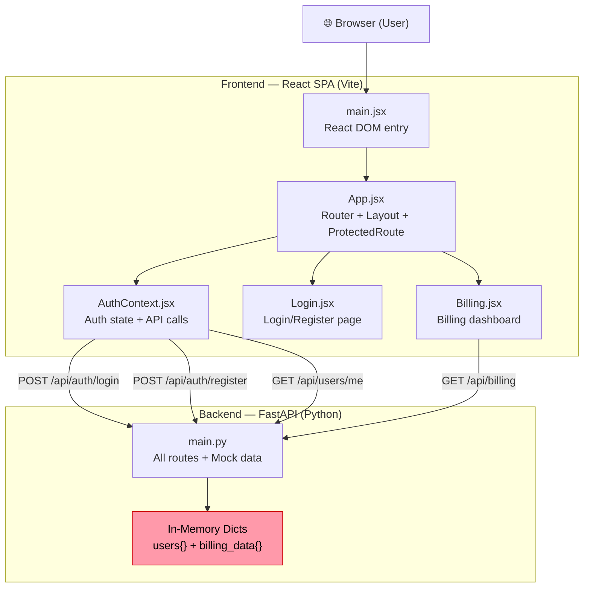
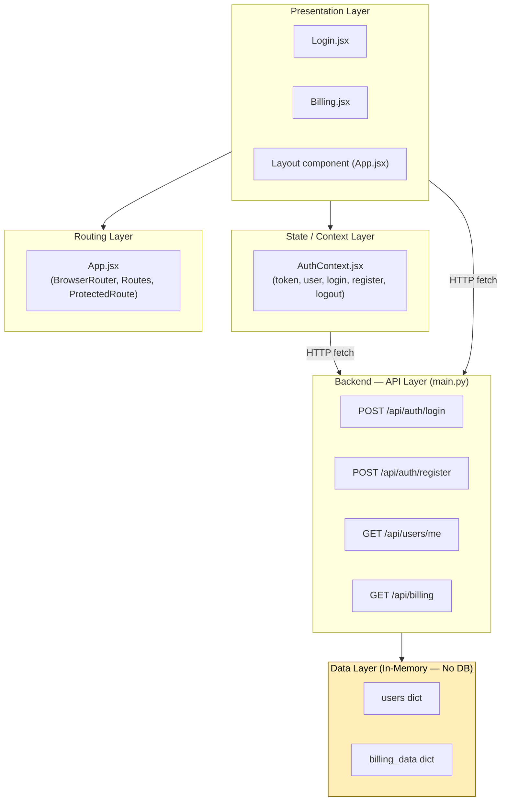
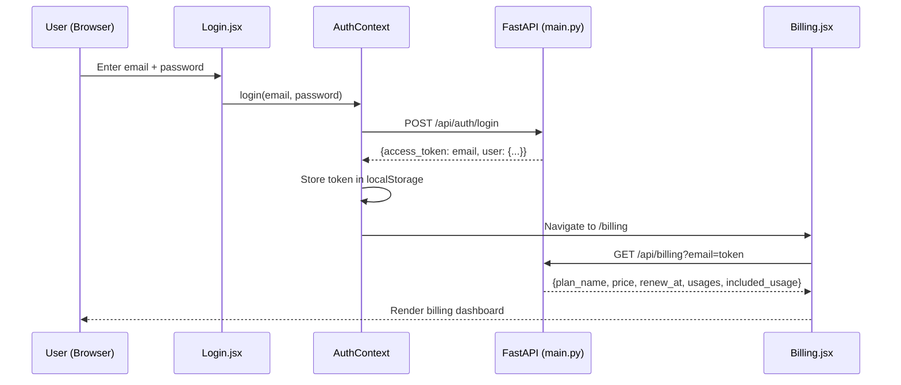

> **Source**: Atlas via Helix MCP
> **Server / tool**: helix · mcp__helix__get_solution_document_tool
> **Estate**: solution_id 951 "Billing-Cycle-Helix-Workshop" (repo Billing-Cycle, branch main, last_ingested_commit 69f67f308492a85648aa25a9ff7d8d574031344a) · document_id 4699 "Deep Dive: Billing-Cycle.md" (v31, lifecycle CURRENT)
> **Scope pulled**: whole document — the estate is a single small repo (src/backend + src/frontend) and the Epic touches main.py, Billing.jsx, App.css, AuthContext.jsx
> **Fetched**: 2026-09-25T10:59:09Z
> **Freshness**: Atlas document updated_at 2026-09-22T10:13:02Z; repo last ingested at commit 69f67f308492a85648aa25a9ff7d8d574031344a

# Deep Dive Analysis: Billing-Cycle

**Created:** 2026-09-22
**For:** Shailendra
**Analysis Depth:** Exhaustive
**Status:** COMPLETE
**Steps Completed:** 13 of 13

> **Purpose:** Exhaustive system analysis covering architecture, flows, dependencies, code quality, testing, security, performance, and documentation with prioritized strategic recommendations.

---

## Analysis Scope

- **System:** Billing-Cycle
- **Repository:** Billing-Cycle
- **Focus Areas:** All (comprehensive)
- **Code Quality Analysis:** Yes
- **Security Considerations:** Yes

---

## Executive Summary

### System Overview

**Billing-Cycle** is a streaming subscription billing management application built as a full-stack proof-of-concept (POC). It is marketed internally as "Billing & Tasks POC" and simulates a Netflix-style billing dashboard for a fictional streaming service called **StreamPlex**. The system is structured as a two-tier architecture: a React 19 single-page application (SPA) frontend communicating with a Python FastAPI backend over a REST API.

The frontend provides two user-facing screens — a combined login/registration page and a billing dashboard showing subscription plan details, feature entitlements, and usage breakdowns. The backend exposes four REST endpoints for authentication and billing data retrieval, backed entirely by in-memory Python dictionaries (no database). The system ships with one pre-seeded user account (`tpg@example.com` / `password`) and assigns all users the "Standard" plan at $20/month.

This is a very small, focused codebase (~604 lines of source code across 7 files) built with modern tooling (React 19, Vite 8, FastAPI, React Router 7). It demonstrates core frontend architecture patterns effectively (Context API, protected routing, layout composition), but carries critical security deficiencies that make it unsuitable for production in its current form. The primary limitations are its intentional POC simplifications: no real authentication, no database persistence, no tests, and almost no documentation.

### Complexity Assessment

- **Overall Complexity:** Low (appropriate for a focused POC)
- **Lines of Code:** ~604 (163 Python + 441 JavaScript/JSX)
- **Components:** 7 significant components (1 backend module, 6 frontend)
- **External Dependencies:** 11 (3 backend, 8 frontend)
- **Technical Debt:** **High** — concentrated in security and testing gaps, not in code complexity

### Top 10 Critical Findings

1. **Security - Critical:** Email used as authentication token — no JWT, no signing, no expiry. Any user who knows another user's email can fully impersonate them via the API.
2. **Security - Critical:** Passwords stored and compared in plaintext — no hashing. A future persistence layer would immediately expose all credentials.
3. **Security - Critical:** No authentication middleware on backend GET endpoints — `/api/users/me` and `/api/billing` trust the `email` query parameter without validation.
4. **Security - Critical:** Hardcoded developer credentials (`tpg@example.com` / `password`) pre-filled in the login form — a dev backdoor that could ship to production.
5. **Testing - Critical:** Zero test coverage — no unit, integration, or E2E tests for any component. No test framework configured.
6. **Persistence - High:** In-memory-only data store — all registered users and billing data lost on backend restart. Incompatible with horizontal scaling.
7. **Security - High:** Wildcard CORS (`allow_origins=["*"]`) — must be restricted to known origins before production deployment.
8. **Documentation - High:** No setup guide, no API documentation, no architecture documentation. The only README is a boilerplate Vite template that says nothing about this application.
9. **Performance - High:** Backend not horizontally scalable — shared mutable in-memory state means multiple workers produce divergent data states.
10. **Quality - Medium:** Python dependencies unpinned in `requirements.txt` — `fastapi`, `uvicorn`, `python-multipart` all install at latest available version, breaking reproducibility.

### Risk Assessment

| Risk Category | Level | Impact | Mitigation Priority |
|---------------|-------|--------|---------------------|
| Security | 🔴 High | Email-as-token + plaintext passwords = complete account compromise if deployed | Immediate — block production deployment |
| Technical Debt | 🟠 Medium | Concentrated in auth model and lack of tests — manageable given small codebase | High — address in next sprint |
| Scalability | 🔴 High | In-memory store is fundamentally incompatible with horizontal scaling | Medium-term — requires database migration |
| Maintainability | 🟡 Low-Medium | Small, readable codebase but no TypeScript, no tests, no comments | Medium-term — TypeScript + tests |
| Documentation | 🟠 Medium | No setup guide blocks new developers; no API docs blocks integration | High — critical docs in current sprint |

---

## Comprehensive Reconnaissance

### Directory Structure

```
Billing-Cycle/
└── src/
    ├── backend/
    │   ├── main.py               # FastAPI application (all routes, models, mock data)
    │   ├── requirements.txt      # Python dependencies
    │   └── .gitignore
    └── frontend/
        ├── index.html            # HTML shell
        ├── package.json          # npm config + dependencies
        ├── vite.config.js        # Vite build config
        ├── .oxlintrc.json        # Oxlint (linter) config
        ├── .gitignore
        ├── README.md             # Generic Vite+React template README
        ├── public/
        │   ├── favicon.svg
        │   └── icons.svg
        └── src/
            ├── App.jsx           # Root component, router setup
            ├── App.css           # Global styles
            ├── main.jsx          # React DOM entry point
            ├── index.css         # Base CSS reset/variables
            ├── context/
            │   └── AuthContext.jsx  # Auth state management (token, user)
            ├── pages/
            │   ├── Login.jsx     # Login + Register page
            │   └── Billing.jsx   # Billing dashboard page
            └── assets/
                ├── hero.png
                ├── react.svg
                └── vite.svg
```

### Technology Stack

**Programming Languages:**

| Language | Files | Lines of Code | Percentage |
|----------|-------|---------------|------------|
| Python | 1 | 163 | ~27% |
| JavaScript/JSX | 6 | 441 | ~73% |
| JSON | 2 | 32 | config only |

**Frameworks & Libraries:**

| Framework/Library | Version | Purpose | Layer |
|-------------------|---------|---------|-------|
| FastAPI | unversioned (req.txt) | REST API framework | Backend |
| Uvicorn | unversioned (req.txt) | ASGI server | Backend |
| python-multipart | unversioned (req.txt) | Form data support | Backend |
| Pydantic | (FastAPI dependency) | Request model validation | Backend |
| React | ^19.2.8 | UI framework | Frontend |
| React DOM | ^19.2.8 | DOM rendering | Frontend |
| React Router DOM | ^7.18.2 | Client-side routing | Frontend |
| Vite | ^8.2.2 | Build tool + dev server | Frontend |
| Oxlint | ^1.79.0 | Fast JS linter (Rust-based) | Dev Tooling |

**Build & Tooling:**

- **Build System:** Vite ^8.2.2 (ES module native, fast HMR)
- **Package Manager:** npm (package.json present)
- **Testing Framework:** ❌ None detected — no test files, no test runner configured
- **CI/CD:** ❌ None detected — no `.github/`, `.gitlab-ci.yml`, or equivalent
- **Linting:** Oxlint ^1.79.0 (Rust-based, faster alternative to ESLint)

### Comprehensive Statistics

| Metric | Value |
|--------|-------|
| Total Source Files | 9 (graph-indexed) |
| Total LOC | ~636 |
| Backend Code Files | 1 (main.py, 163 LOC) |
| Frontend Code Files | 6 JSX/JS files (441 LOC) |
| Config Files | 3 (vite.config.js, package.json, .oxlintrc.json) |
| Documentation Files | 1 (README.md — generic template only) |
| Test Files | 0 |
| CI/CD Files | 0 |
| Largest File | `Billing.jsx` & `main.py` (tied, 163–164 LOC each) |
| Average File Size | ~70 LOC |
| Code-to-Comment Ratio | Very low — minimal inline comments |

### Entry Points

**Application Entry Points:**

- `src/backend/main.py` — FastAPI app instantiation; all routes defined here
- `src/frontend/src/main.jsx` — React DOM render root (`ReactDOM.createRoot`)
- `src/frontend/index.html` — HTML shell loaded by Vite

**API Endpoints:** 4 endpoints, all in `main.py` (single-file backend):

| Method | Path | Description |
|--------|------|-------------|
| POST | `/api/auth/login` | Authenticate user, return token (email as token) |
| POST | `/api/auth/register` | Register new user with default Standard plan |
| GET | `/api/users/me` | Fetch current user profile (email query param) |
| GET | `/api/billing` | Fetch billing data and plan details |

**Frontend Routes (React Router):**

| Path | Component | Access |
|------|-----------|--------|
| `/` | Login (redirect) | Public |
| `/login` | Login | Public |
| `/billing` | Billing (ProtectedRoute) | Authenticated only |

**CLI Interfaces:** None

**Background Jobs:** None

**Scheduled Tasks:** None

**Production Static Serving:** Backend conditionally mounts `frontend/dist/` as static files if the dist directory exists (combined deploy mode)

---

## Deep Architectural Analysis

### Architectural Style & Patterns

**Primary Style:** **SPA + REST API Monolith (Proof-of-Concept / Prototype)**

This is a simple, two-tier web application: a React single-page application (SPA) frontend communicating with a single-file FastAPI REST backend over HTTP. The entire backend lives in one file (`main.py`, 163 LOC) with no database, no services layer, and no infrastructure beyond in-memory Python dicts. The frontend is a classic SPA with client-side routing. The system appears to be a named "Billing & Tasks POC" (from `FastAPI(title="Billing & Tasks POC")`).

**Detected Patterns:**

- **Context Provider Pattern (Frontend):** `AuthContext.jsx` implements React's Context API to propagate auth state (`user`, `token`, `login`, `register`, `logout`) globally across the component tree — a clean, idiomatic React pattern.
- **Protected Route Pattern (Frontend):** `ProtectedRoute` in `App.jsx` guards the `/billing` route by checking for a token, redirecting unauthenticated users to `/login`.
- **Layout Component Pattern (Frontend):** A shared `Layout` component wraps authenticated pages, providing the topbar navigation consistently.
- **Repository-as-Token Auth Pattern (Backend):** The "access token" is simply the user's email string stored in localStorage — a pattern appropriate only for prototyping.
- **In-Memory Mock Store (Backend):** Data is stored in plain Python dicts (`users`, `billing_data`) — no database, no ORM, no persistence layer. Data is lost on server restart.
- **Static File Serving via FastAPI (Production Mode):** `main.py` conditionally mounts the Vite-built `frontend/dist/` folder, enabling a single-process deployment.

**Anti-Patterns Detected:**

- **Plaintext Passwords (Critical):** Passwords stored and compared in plaintext in the `users` dict — no hashing whatsoever. While this is a POC, it is a severe security anti-pattern that must never reach production.
- **Email-as-Token (Critical):** The access token is literally the user's email. There is no JWT, no session ID, no expiry — any knowledge of a user's email grants full API access.
- **No Authentication Middleware (High):** Backend endpoints accept an `email` query parameter and trust it directly — no token validation, no auth middleware. Any caller can impersonate any user.
- **Wildcard CORS (`allow_origins=["*"]`) (Medium):** All origins accepted — acceptable for local dev, dangerous if deployed to production without restriction.
- **Mixed API Concerns in Single File (Low):** All route handlers, Pydantic models, mock data, and static file serving live in one `main.py`. Not an anti-pattern for a POC, but a maintenance concern if the app grows.
- **No Error Boundary on Frontend (Low):** `Billing.jsx` fetches data without error handling — a failed fetch silently results in a perpetual "Loading billing..." state.

### Architecture Diagrams

#### High-Level System Architecture



#### Layer Diagram



#### Module Interactions



### Complete Component Catalog

| Component | Path | Responsibility | Complexity | Key Dependencies | Issues |
|-----------|------|---------------|-----------|-----------------|--------|
| **main.py** | `src/backend/main.py` | All backend: auth, billing, user routes, mock data store, static serving | Medium | FastAPI, Pydantic, Uvicorn | God-file; plaintext passwords; email-as-token |
| **main.jsx** | `src/frontend/src/main.jsx` | React DOM root render entry | Simple | React 19, App.jsx | None |
| **App.jsx** | `src/frontend/src/App.jsx` | Root router, Layout, ProtectedRoute guard | Simple | React Router DOM, AuthContext | None |
| **AuthContext.jsx** | `src/frontend/src/context/AuthContext.jsx` | Global auth state: login, register, logout, session restore | Medium | React, React Router DOM | Token = email (insecure); no token expiry handling |
| **Login.jsx** | `src/frontend/src/pages/Login.jsx` | Combined login + sign-up form with toggle | Medium | React, AuthContext | No client-side validation beyond server error display |
| **Billing.jsx** | `src/frontend/src/pages/Billing.jsx` | Billing dashboard: plan info, usage cards, plan perks | Medium | React, AuthContext | No error handling on fetch; plan name hardcoded as "Standard" |
| **vite.config.js** | `src/frontend/vite.config.js` | Vite build configuration with React plugin | Simple | Vite, @vitejs/plugin-react | None |

### Architectural Assessment

**Strengths:**

- **Clean SPA structure:** React Router + Context Provider + Protected Route is a standard, idiomatic pattern — easy for any React developer to navigate
- **Good separation of auth logic:** `AuthContext.jsx` cleanly centralises all auth state and API calls, avoiding scattered fetch calls across pages
- **Production-ready deployment model:** The conditional static file mounting in `main.py` is an elegant single-process deploy strategy
- **Modern tooling:** React 19, Vite 8, React Router 7, Oxlint — all very current choices

**Weaknesses:**

