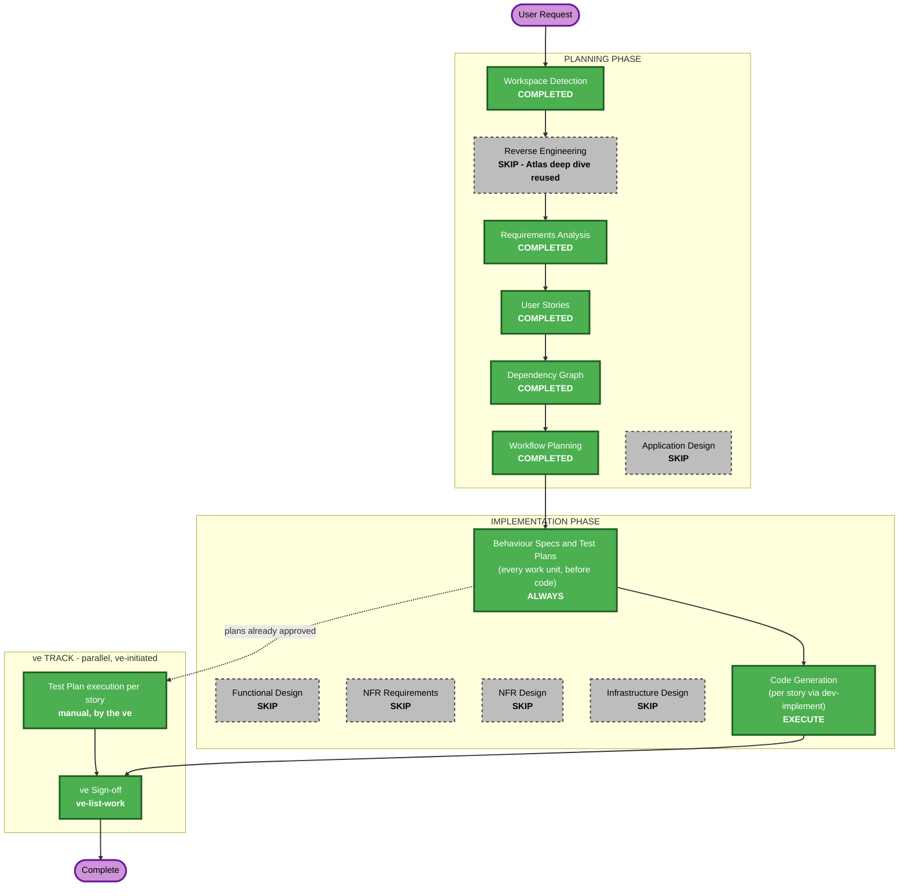

# Execution Plan — Epic 4702 Self-Serve Premium Upgrade

**AIRE Framework**: v1.0 · **Created**: 2026-09-25T12:05:48Z · **Status**: auto-approved (no gate)

## Detailed Analysis Summary

### Transformation Scope (Brownfield)
- **Transformation Type**: Single-component enhancement. No architectural, infrastructure or deployment-model change.
- **Primary Changes**: New Premium plan data, proration function and two endpoints in `src/backend/main.py`; Upgrade CTA, dialog and confirmation panel in `src/frontend/src/pages/Billing.jsx` + `App.css`; first test tooling in the repo.
- **Related Components**: `AuthContext.jsx` (read-only consumer of `token`), `App.jsx` layout (unchanged).

### Change Impact Assessment
- **User-facing changes**: Yes — new CTA, dialog, confirmation panel; plan-driven labels.
- **Structural changes**: No — same two-tier FastAPI + React/Vite app, same in-memory store.
- **Data model changes**: Yes, minor — Premium variant of the existing billing payload; `users` / `billing_data` mutated on upgrade. No schema, no database.
- **API changes**: Yes, additive — `GET /api/billing/upgrade-preview`, `POST /api/billing/upgrade`. Existing endpoints unchanged.
- **NFR impact**: Yes, contained — accessibility of the dialog, input validation, safe errors and logging on the new endpoints; accepted pre-existing email-token risk (REQ-NF-05).

### Component Relationships (Brownfield)
- **Primary Component**: Backend API (`src/backend/main.py`) and Billing page (`src/frontend/src/pages/Billing.jsx`)
- **Infrastructure Components**: none
- **Shared Components**: `App.css` (styles), `AuthContext.jsx` (token)
- **Dependent Components**: Billing page consumes the new endpoints
- **Supporting Components**: new test tooling — pytest / pytest-bdd, Vitest / React Testing Library, Playwright

| Component | Change Type | Reason | Priority |
|---|---|---|---|
| `src/backend/main.py` | Minor (additive) | New plan data, rule, endpoints | Critical |
| `src/frontend/src/pages/Billing.jsx` | Minor | CTA, dialog, panel, plan-driven labels | Critical |
| `src/frontend/src/App.css` | Minor | New styles | Important |
| `src/frontend/package.json`, backend dev requirements | Configuration | Test tooling (dev only) | Important |

### Risk Assessment
- **Risk Level**: Low–Medium — small isolated change, but it mutates billing state and relies on a weak identity model.
- **Rollback Complexity**: Easy — additive endpoints and UI; revert the story PRs.
- **Testing Complexity**: Moderate — date-dependent math needs a pinned "today"; the UI journey needs Playwright against a live backend.

## Workflow Visualization

Text alternative: all planning stages are complete (Reverse Engineering skipped because the Atlas deep dive was reused). Application Design and the four system-level design stages are skipped. Next is the STOP CHECKPOINT, where the behaviour specs and manual test plans for all 9 stories are written and approved; then code is generated per story with `dev-implement`, while ve runs and signs off test plans in parallel.

## Phases to Execute

### PLANNING PHASE
- [x] Workspace Detection (COMPLETED)
- [x] Reverse Engineering (SKIPPED — Atlas deep dive doc 4699 reused)
- [x] Requirements Analysis (COMPLETED)
- [x] User Stories (COMPLETED)
- [x] Dependency Graph (COMPLETED)
- [x] Execution Plan (COMPLETED)
- [ ] Application Design - SKIP
  - **Rationale**: every change stays inside the existing component boundaries (`main.py`, `Billing.jsx`, `App.css`). The two endpoints, their request/response shapes and error codes are already fixed in REQ-F-03/04, and the UI structure comes from the design reference. A component-design document would restate them.

### IMPLEMENTATION PHASE
- [ ] Functional Design - SKIP
  - **Rationale**: the only business rule (proration, with its edge cases) and the Premium data are fully specified in REQ-F-01/02 and the Atlas story. There is no new schema or complex logic; the dialog states are pinned down by story ACs.
- [ ] NFR Requirements - SKIP
  - **Rationale**: NFRs are already captured as REQ-NF-01..08, and the tech stack (including the test stack) is decided. No performance or scalability targets beyond the existing in-memory POC.
- [ ] NFR Design - SKIP
  - **Rationale**: NFR Requirements is skipped. The patterns needed (Pydantic validation, generic error handler, logging, accessible dialog) are standard and covered by REQ-NF-02/03/05.
- [ ] Infrastructure Design - SKIP
  - **Rationale**: no infrastructure, deployment or cloud change.
- [ ] Behaviour Specs & Test Plans - EXECUTE (ALWAYS, at the STOP CHECKPOINT, ONE approval)
  - **Rationale**: every work unit's `.feature` contract and manual test plan are written and approved before any code is generated (`implementation/specs-and-test-plans.md`)
- [ ] Code Generation - EXECUTE (ALWAYS)
  - **Rationale**: per story via `dev-implement`, starting with 1.1 (frontend) and 1.2 (backend) in parallel

### ve TRACK (parallel — ve-initiated, NOT planned or executed by this workflow)
- Test Plan — authored for every work unit at the STOP CHECKPOINT; ve reviews it and executes it once the work unit's PR merges, in parallel with development
- ve Sign-off — run by ve with **`ve-list-work`** on the epic branch once story PRs merge

## Package Change Sequence (Brownfield)
- **Update Approach**: Hybrid — backend and frontend in parallel, following `spec/plans/dependency-graph.yml`
- **Critical Path**: 1.2 → 1.4 → 1.7 → 1.8 → 1.9 (backend proration → preview → dialog charge → confirm → failures)
- **Coordination Points**: the preview/upgrade JSON contracts in REQ-F-03/04; shared `Billing.jsx` and `main.py` (merge order by the graph)
- **Testing Checkpoints**: unit + behaviour tests per story; Playwright end-to-end journey owned by 1.8 against the real backend

## Estimated Timeline
- **Total Phases**: 8 executed or completed (Workspace Detection, Requirements, User Stories, Dependency Graph, Workflow Planning, Specs & Test Plans, Code Generation, ve track), 6 skipped
- **Estimated Duration**: 9 small stories; with 2 developers, roughly 5 dependency waves

## Success Criteria
- **Primary Goal**: a Standard subscriber can upgrade to Premium mid-cycle from the Billing page, paying a server-computed prorated charge, with the page updating immediately
- **Key Deliverables**: Premium plan data, proration function, preview and upgrade endpoints, CTA, dialog, confirmation panel, tests (pytest/pytest-bdd, Vitest/RTL, Playwright)
- **Quality Gates**: Security Baseline (blocking), J1 architecture rubric and J2 judge gates (blocking), behaviour specs per story, coverage of every AC by at least one scenario and one test case
- **Integration Testing**: the 1.8 Playwright journey (log in → open dialog → see charge → confirm → Premium shown)
- **Operational Readiness**: upgrade attempts logged server-side (REQ-NF-05)
