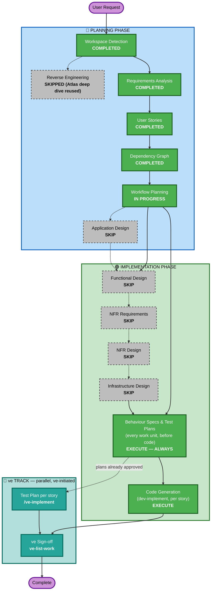

# Execution Plan

## Detailed Analysis Summary

### Transformation Scope (Brownfield)
- **Transformation Type**: Single-component change — one new backend endpoint added to the existing `src/backend/main.py` monolith, one modal/CTA/banner added to the existing `src/frontend/src/pages/Billing.jsx`. No new service, no new package, no deployment-model change.
- **Primary Changes**: Add `POST /api/billing/upgrade` (proration + plan mutation), add Upgrade CTA + confirmation modal + success banner to the Billing page, make the plan-name display dynamic.
- **Related Components**: `App.css` (styling only, existing tokens), `AuthContext.jsx` (read-only consumer, no changes).

### Change Impact Assessment
- **User-facing changes**: Yes — new CTA, confirmation modal, and persistent success banner on the Billing page.
- **Structural changes**: No — no new architectural layer, service, or component boundary; all changes live inside the two existing files already named in the Epic's Affected Files.
- **Data model changes**: Yes, but shape-only — a new `UpgradeRequest` Pydantic model and new Premium entries in the existing `users`/`billing_data` in-memory dicts. No schema/database migration (there is no database).
- **API changes**: Yes — one new endpoint, `POST /api/billing/upgrade`, following the existing app's conventions exactly (email-as-identifier, same response shape family as `GET /api/billing`).
- **NFR impact**: Minimal — no new performance, security, or scalability requirements beyond what Requirements Analysis already resolved (REQ-NF-01 through REQ-NF-06); both optional extensions (Resiliency Baseline, Property-Based Testing) were explicitly declined.

### Component Relationships (Brownfield)
- **Primary Component**: `src/backend/main.py` (new endpoint), `src/frontend/src/pages/Billing.jsx` (new UI)
- **Infrastructure Components**: none — no CDK/Terraform, no deployment config exists or changes
- **Shared Components**: `src/frontend/src/App.css` (styling additions only, existing token reuse), `src/frontend/src/context/AuthContext.jsx` (read-only, unchanged)
- **Dependent Components**: none — no other service calls this endpoint
- **Supporting Components**: none — no monitoring/logging/deployment tooling exists in this POC

### Risk Assessment
- **Risk Level**: Low — isolated change to two existing files, in-memory data only, no external dependencies, no database, no infrastructure. Full regression is limited to the 6 flows already documented in `spec/plans/atlas-deep-dive.md`.
- **Rollback Complexity**: Easy — revert the story's commit(s); no data migration to unwind (in-memory state resets on restart).
- **Testing Complexity**: Simple — one new endpoint with 2 guard branches, one new UI flow with a happy path and one failure path.

## Workflow Visualization

## Phases to Execute

### 🔵 PLANNING PHASE
- [x] Workspace Detection (COMPLETED)
- [x] Reverse Engineering (SKIPPED — Atlas deep dive fetched via Helix MCP, reused as-is)
- [x] Requirements Analysis (COMPLETED)
- [x] User Stories (COMPLETED — 1 story, confirmed single-story override)
- [x] Dependency Graph (COMPLETED)
- [x] Workflow Planning (IN PROGRESS — this document)
- [ ] Application Design — **SKIP**
  - **Rationale**: All changes land inside two existing files already named in the Epic's Affected Files list (`main.py`, `Billing.jsx`). No new component, service, or service-layer boundary is introduced; the business rules (proration formula, guard conditions) are already fully specified at the exact level of detail Application Design would otherwise produce, in `requirements.md` and `stories.md`.

### 🟢 IMPLEMENTATION PHASE
- [ ] Functional Design — **SKIP**
  - **Rationale**: No new data model/schema (in-memory dict shape extension only) and no complex business logic requiring further elaboration — the proration formula, its edge cases (0/29/30+ days), and the Premium feature dataset are already fully specified in Story 1.1's ACs.
- [ ] NFR Requirements — **SKIP**
  - **Rationale**: Tech stack is fixed (existing FastAPI + React app, no change). No new performance/security/scalability requirement exists beyond what Requirements Analysis already resolved (REQ-NF-01–06); both optional extensions (Resiliency Baseline, Property-Based Testing) were explicitly declined by the user.
- [ ] NFR Design — **SKIP**
  - **Rationale**: NFR Requirements skipped; no patterns to incorporate.
- [ ] Infrastructure Design — **SKIP**
  - **Rationale**: No infrastructure/cloud resources exist or change in this POC (no deployment config, no IaC).
- [ ] Behaviour Specs & Test Plans — **EXECUTE** (ALWAYS, at the STOP CHECKPOINT, ONE approval)
  - **Rationale**: Story 1.1's Gherkin contract (`spec/behavior/story-1.1.feature`) and manual test plan (`spec/test-plans/1.1-...`) are written and approved before any code exists, per `implementation/specs-and-test-plans.md`.
- [ ] Code Generation — **EXECUTE** (ALWAYS)
  - **Rationale**: Story 1.1 is implemented via `dev-implement` once the STOP CHECKPOINT design artifacts are approved.

### 🧪 ve TRACK (parallel — ve-initiated, NOT planned or executed by this workflow)
- Test Plan — authored for Story 1.1 at the STOP CHECKPOINT; ve may run `/ve-implement` standalone to refresh/extend it
- ve Sign-off — run by ve with `ve-list-work` on the epic branch once Story 1.1's PR merges
  - **Rationale**: test-plan sign-off is not an Implementation stage at epic or story level; not scheduled here, never auto-run

## Package Change Sequence (Brownfield)
Not applicable — single-package monorepo (`src/backend`, `src/frontend`), no cross-package update sequencing needed; both are touched by the same single story.

## Estimated Timeline
- **Total Phases Executing**: 6 (Workspace Detection, Requirements Analysis, User Stories, Dependency Graph, Workflow Planning, Behaviour Specs & Test Plans, Code Generation) — Application Design and all 3 system-level Implementation design stages skipped
- **Estimated Duration**: Small (single story, L-sized) — comparable to a few hours to one day of focused implementation once `dev-implement` is invoked

## Success Criteria
- **Primary Goal**: A Standard-plan subscriber can self-serve upgrade to Premium mid-cycle for an exact prorated charge, with no regressions.
- **Key Deliverables**: `POST /api/billing/upgrade` endpoint; Upgrade CTA, confirmation modal (with failure handling), and success banner on the Billing page; dynamic plan-name rendering.
- **Quality Gates**: Story 1.1's 11 ACs, the D1–D7 static gates, the blocking J1/J2 judge gates against `architecture.md` Section 10, and full regression against the 6 documented existing flows.
- **Integration Testing**: Manual verification that login/registration/logout/route-guard/session-restore/existing billing display are all unaffected (REQ-F-11 / AC-11).
