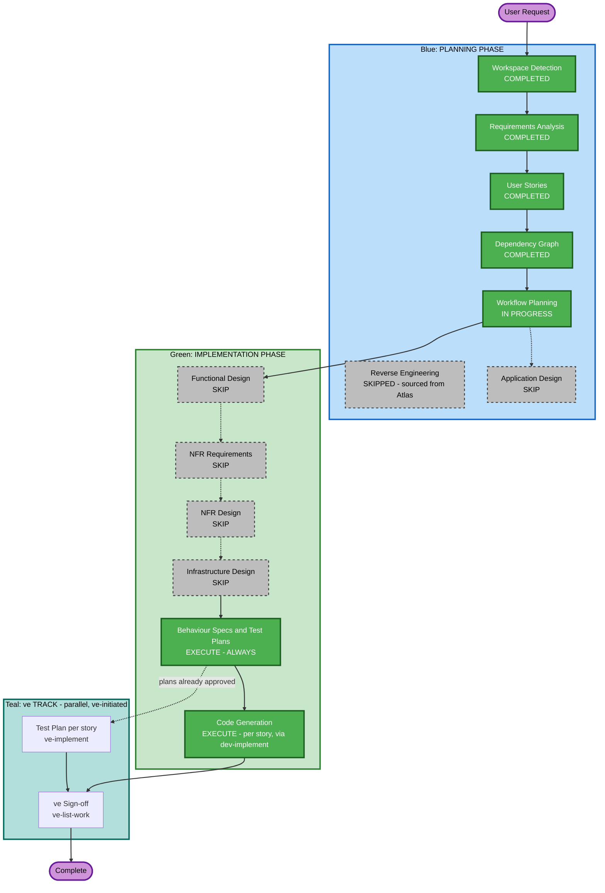

# Execution Plan — Self-Serve Premium Upgrade

## Detailed Analysis Summary

### Transformation Scope (Brownfield)
- **Transformation Type**: Single-component change — extends two existing files (`src/backend/main.py`, `src/frontend/src/pages/Billing.jsx`) plus their existing stylesheet; no new service, no new module, no new package.
- **Primary Changes**: One new REST endpoint on the existing single-file FastAPI backend; a CTA, modal, success banner, and error state added to the existing Billing page component.
- **Related Components**: None beyond the two files named above and `App.css` — the Atlas Deep Dive's component inventory shows no other component reads or writes billing/plan data.

### Change Impact Assessment
- **User-facing changes**: Yes — new CTA, modal, and post-upgrade states on the Billing page.
- **Structural changes**: No — no new architectural layer, no new service, no new module boundary.
- **Data model changes**: No new store; the existing in-memory `billing_data` / `users` dict record for a user gains no new fields beyond what the Epic's Premium plan definition already implies (plan name, price, quotas) — no schema migration.
- **API changes**: Yes — one new endpoint (`POST /api/billing/upgrade`); no existing endpoint's contract changes.
- **NFR impact**: Minor — one new authorization/idempotency check (already fully specified in `requirements.md`); no new performance, scalability, or infrastructure concern.

### Component Relationships (Brownfield)
```markdown
## Component Relationships
- **Primary Component**: src/backend/main.py (new endpoint), src/frontend/src/pages/Billing.jsx (new UI)
- **Infrastructure Components**: none — no deployment/infra change
- **Shared Components**: src/frontend/src/App.css (new styles only, no existing rule changed)
- **Dependent Components**: none — no other component reads/writes plan/billing data (per Atlas Deep Dive component inventory)
- **Supporting Components**: none new
```
- **Change Type**: Minor (additive) for both primary components.
- **Change Reason**: Direct feature addition, no dependency-driven change.
- **Change Priority**: Critical (this IS the Epic).

### Risk Assessment
- **Risk Level**: Low — isolated to two files, additive-only, no schema/infra change, easy rollback (revert the two files).
- **Rollback Complexity**: Easy.
- **Testing Complexity**: Moderate — 4 stories each with a small, well-scoped set of ACs; proration math needs precise unit testing (REQ-NF-06).

## Workflow Visualization



### Text Alternative (always included, per common/content-validation.md)
```
Phase 1: PLANNING
- Workspace Detection (COMPLETED)
- Reverse Engineering (SKIPPED — sourced from Atlas)
- Requirements Analysis (COMPLETED)
- User Stories (COMPLETED)
- Dependency Graph (COMPLETED)
- Workflow Planning (IN PROGRESS)
- Application Design (SKIP)

Phase 2: IMPLEMENTATION
- Functional Design (SKIP)
- NFR Requirements (SKIP)
- NFR Design (SKIP)
- Infrastructure Design (SKIP)
- Behaviour Specs & Test Plans (EXECUTE — always, one approval)
- Code Generation (EXECUTE — per story, via dev-implement)

ve TRACK (parallel, ve-initiated)
- Test Plan per story (/ve-implement)
- ve Sign-off (ve-list-work)
```

## Phases to Execute

### 🔵 PLANNING PHASE
- [x] Workspace Detection (COMPLETED)
- [x] Reverse Engineering (SKIPPED — Atlas Deep Dive pulled verbatim, no local generation needed)
- [x] Requirements Analysis (COMPLETED)
- [x] User Stories (COMPLETED)
- [x] Dependency Graph (COMPLETED)
- [x] Workflow Planning (this document)
- [ ] Application Design — **SKIP**
  - **Rationale**: No new component or service is introduced. The Epic's affected files are exactly the two existing components (`main.py`, `Billing.jsx`) named in the Epic and Atlas Deep Dive's component inventory. Story-level design (ACs, request/response shape, UI states) is already fully specified in `stories.md` and `requirements.md` — a separate component/service design layer would only restate it.

### 🟢 IMPLEMENTATION PHASE
- [ ] Functional Design — **SKIP**
  - **Rationale**: The one business rule (proration formula) is already fully specified, with its exact arithmetic, in `requirements.md` (REQ-F-03) and `stories.md` (Story 1.2 AC-1/AC-4). No additional business-logic design is needed.
- [ ] NFR Requirements — **SKIP**
  - **Rationale**: No new tech stack decision (reuses FastAPI + React as-is) and no NFR beyond what's already captured directly in `requirements.md`'s Non-Functional Requirements table and Security Compliance section.
- [ ] NFR Design — **SKIP** (NFR Requirements skipped)
- [ ] Infrastructure Design — **SKIP**
  - **Rationale**: No infrastructure or deployment model change — the POC's in-memory, single-process architecture is unchanged.
- [ ] Behaviour Specs & Test Plans — **EXECUTE** (ALWAYS, at the STOP CHECKPOINT, ONE approval)
  - **Rationale**: Every work unit's `.feature` contract and manual test plan are written and approved before any code is generated.
- [ ] Code Generation — **EXECUTE** (ALWAYS, per story, via `dev-implement`)
  - **Rationale**: 4 approved stories are ready to build, 2 immediately in parallel.

### 🧪 ve TRACK (parallel — ve-initiated, NOT planned or executed by this workflow)
- Test Plan — authored for every work unit at the STOP CHECKPOINT; ve runs `/ve-implement` standalone to refresh or extend one
- ve Sign-off — run by ve with `ve-list-work` on the epic branch once story PRs merge

## Package Change Sequence
N/A — single-package project (no monorepo/multi-package coordination needed).

## Estimated Timeline
- **Total Phases**: 2 executed in Planning that remain (this one), plus Behaviour Specs/Test Plans + Code Generation in Implementation; 5 phases skipped as not applicable to this scope.
- **Estimated Duration**: Small feature — 4 stories, no infra/design overhead.

## Success Criteria
- **Primary Goal**: A Standard-plan subscriber can self-serve upgrade to Premium mid-cycle with a correct prorated charge, entirely through the existing UI, with no regressions.
- **Key Deliverables**: `POST /api/billing/upgrade` endpoint; Upgrade CTA + confirmation modal; success and failure UI states.
- **Quality Gates**: Unit test coverage ≥ `unitTestCoverageMin`, D1–D7 static gates, Behaviour (Gherkin) scenarios per AC, J1/J2 judge gates, Security Baseline diff-scoped review.
- **Integration Testing**: All 4 stories' behavior verified together at the epic level (B3 tier) once the last story's PR merges.
