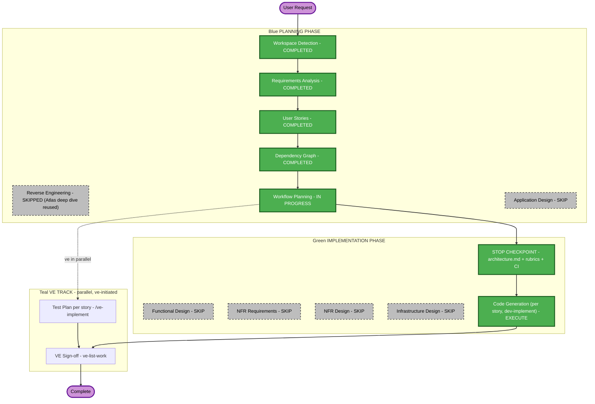

# Execution Plan — Self-Serve Premium Upgrade

## Detailed Analysis Summary

### Transformation Scope (Brownfield)
- **Transformation Type**: Single-component change — one new endpoint added to the existing `main.py` backend module, new UI elements added to the existing `Billing.jsx` page. No new services, no new architectural components, no deployment-model change.
- **Primary Changes**: `POST /api/billing/upgrade` endpoint (preview + apply + idempotency guard); "Upgrade to Premium" CTA + confirmation panel on the Billing page.
- **Related Components**: `src/backend/main.py`, `src/frontend/src/pages/Billing.jsx`, `src/frontend/src/App.css`. `AuthContext.jsx` is read-only context for identifying the caller — not modified.

### Change Impact Assessment
- **User-facing changes**: Yes — new CTA, confirmation panel, updated plan badge/usage limits on the Billing page.
- **Structural changes**: No — no new architectural components or service boundaries.
- **Data model changes**: No new persistent data model — the existing in-memory user/billing dicts gain one field mutation (plan tier) via the new endpoint; no schema/migration involved (there is no database).
- **API changes**: Yes — one new endpoint, `POST /api/billing/upgrade` (with `dry_run` query param), added to the existing 6-endpoint surface.
- **NFR impact**: Yes — performance (<60s flow, <1% API error rate), security (Security Baseline diff-scoped to the new endpoint), test coverage (proration logic must hit `unitTestCoverageMin`) — all already fully specified in `requirements.md` REQ-NF-01..09 with no open design decisions remaining.

### Component Relationships (Brownfield)
- **Primary Component**: `src/backend/main.py` (God Module — data store + models + all route handlers)
- **Shared Components**: `AuthContext.jsx` (existing auth pattern, reused as-is per Q3)
- **Dependent Components**: `Billing.jsx` (frontend consumer of the new endpoint)
- **Supporting Components**: none (no monitoring/logging/deployment infrastructure in this POC)

### Risk Assessment
- **Risk Level**: Low — isolated change to one existing module + one existing page, easy rollback (revert the endpoint/UI additions), well-understood scope with a fully-specified requirements document and zero open questions.
- **Rollback Complexity**: Easy
- **Testing Complexity**: Moderate — this is the first tested business logic in a codebase with 0% prior coverage (per the Atlas deep dive), so REQ-NF-05's unit-test obligation is real work, not boilerplate.

## Workflow Visualization



### Text Alternative
```
PLANNING PHASE
- Workspace Detection: COMPLETED
- Reverse Engineering: SKIPPED (Atlas deep dive reused as-is)
- Requirements Analysis: COMPLETED
- User Stories: COMPLETED
- Dependency Graph: COMPLETED
- Workflow Planning: IN PROGRESS
- Application Design: SKIP

IMPLEMENTATION PHASE
- Functional Design: SKIP
- NFR Requirements: SKIP
- NFR Design: SKIP
- Infrastructure Design: SKIP
- STOP CHECKPOINT (architecture.md + rubrics + CI pipeline): EXECUTE (always)
- Code Generation (per story, via dev-implement): EXECUTE (always)

VE TRACK (parallel, ve-initiated)
- Test Plan per story: /ve-implement
- VE Sign-off: ve-list-work
```

## Phases to Execute

### PLANNING PHASE
- [x] Workspace Detection (COMPLETED)
- [x] Reverse Engineering (SKIPPED — Atlas deep dive document reused as-is, see `spec/plans/atlas-deep-dive.md`)
- [x] Requirements Analysis (COMPLETED)
- [x] User Stories (COMPLETED)
- [x] Dependency Graph (COMPLETED)
- [x] Workflow Planning (IN PROGRESS — this document)
- [ ] Application Design — **SKIP**
  - **Rationale**: The new endpoint is added to the existing `main.py` module and the new UI is added to the existing `Billing.jsx` page — no new components, services, or component boundaries are introduced. This is a pure implementation change within existing boundaries.

### IMPLEMENTATION PHASE
- [ ] Functional Design — **SKIP**
  - **Rationale**: The one business rule (proration) is already fully specified in `requirements.md` REQ-F-07 with a worked numeric example ($20/month delta, 15 days remaining -> $10.00). No new data model or schema is introduced (no database exists). Nothing remains to design.
- [ ] NFR Requirements — **SKIP**
  - **Rationale**: Performance targets (REQ-NF-01/02), security scope (REQ-NF-04, resolved by the answered Q3), and test-coverage obligation (REQ-NF-05) are already fully specified with no open decisions. Security is enforced by the always-mandatory Security Baseline extension's diff-scoped review at code-review time, not by a separate design stage.
- [ ] NFR Design — **SKIP**
  - **Rationale**: NFR Requirements was skipped (nothing to incorporate); no new NFR patterns are needed beyond what the existing codebase already does for its other 6 endpoints.
- [ ] Infrastructure Design — **SKIP**
  - **Rationale**: No infrastructure changes — this POC has no cloud resources, no deployment-model change, no new infrastructure services to map.
- [ ] Code Generation — **EXECUTE (ALWAYS)**
  - **Rationale**: Implementation is the point of this epic. Runs per-story via `dev-implement` after the mandatory STOP CHECKPOINT.

### VE TRACK (parallel — ve-initiated, NOT planned or executed by this workflow)
- Test Plan — run per story by ve with **`/ve-implement`**, in parallel with development
- ve Sign-off — run by ve with **`ve-list-work`** on the epic branch once story PRs merge
  - **Rationale**: Test Plan is not an Implementation stage at epic or story level; it is not scheduled here and is never auto-run.

## Package Change Sequence (Brownfield)
Single-package sequence (no monorepo coordination needed — `src/backend` and `src/frontend` are independent packages with no build-time dependency on each other):
1. Story 1.1 (`src/backend`) — no prerequisites, startable immediately.
2. Story 1.2 (`src/frontend`) — requires Story 1.1's PR merged into the epic branch (R2 Contract rule, per the Dependency Graph).

## Estimated Timeline
- **Total Phases**: 2 executing (Workflow Planning, Code Generation) + 5 skipped (Reverse Engineering, Application Design, Functional Design, NFR Requirements, NFR Design, Infrastructure Design — 6 actually, all skipped)
- **Estimated Duration**: Small POC-scale epic — two single-purpose stories, no infrastructure work; a few implementation sessions via `dev-implement`.

## Success Criteria
- **Primary Goal**: Standard-plan users can self-serve upgrade to Premium mid-cycle from the Billing page with an accurate prorated charge, in under 60 seconds.
- **Key Deliverables**: `POST /api/billing/upgrade` (Story 1.1), Billing page upgrade UI (Story 1.2), unit tests for the proration logic, Playwright UI automation for the upgrade flow.
- **Quality Gates**: D1–D7 static gates, unit coverage >= `unitTestCoverageMin`, behaviour gate (B1/B2/B3), Security Baseline diff-scoped review, J1/J2 judge gates — all per `tests/.evals/config.json` and `common/eval-framework.md`.
- **Integration Testing**: Story 1.2's own tests exercise the real Story 1.1 endpoint (no mocks — per the Dependency Graph's R2/R3 analysis).
- **Regression**: Zero regression on the existing Billing page and the other 5 pre-existing endpoints.
