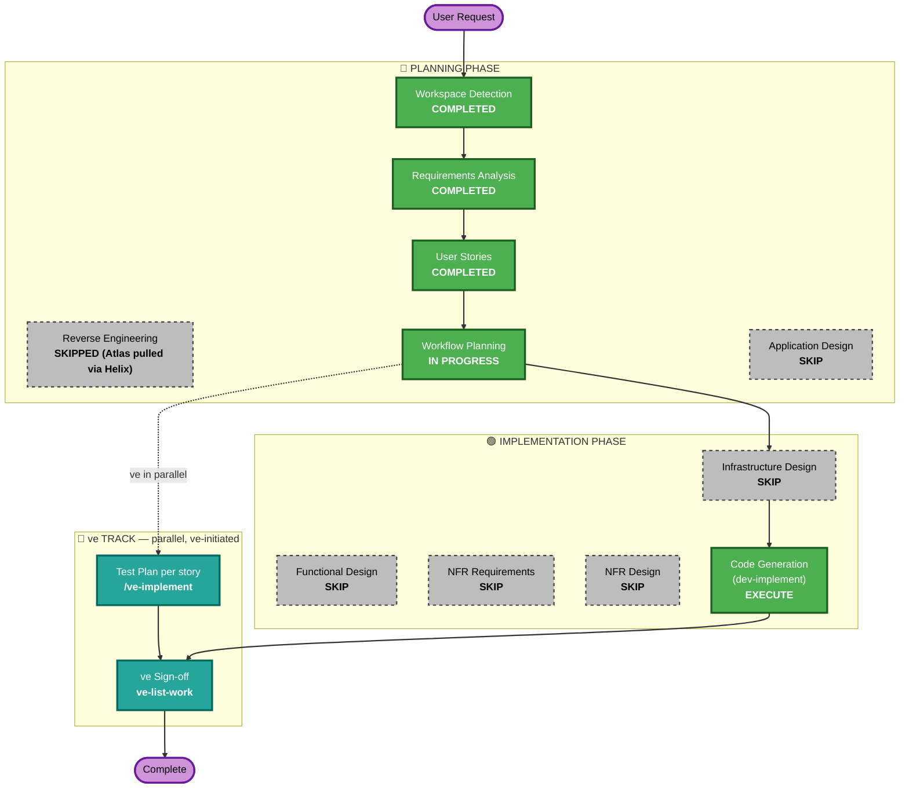

# Execution Plan

## Detailed Analysis Summary

### Transformation Scope (Brownfield)
- **Transformation Type**: Single component change (additive, within existing architectural boundaries)
- **Primary Changes**: 2 new FastAPI endpoints + 1 pure function + 2 constant blocks in `src/backend/main.py`; CTA + modal + 2 fetch calls in `src/frontend/src/pages/Billing.jsx`
- **Related Components**: None beyond the two files above — no new services, no new routes/pages, no new DB (still in-memory), no auth changes

### Change Impact Assessment
- **User-facing changes**: Yes — new CTA, modal, success banner, inline error on the existing Billing page
- **Structural changes**: No — no new architectural layers, no new services
- **Data model changes**: No new persistent schema (still an in-memory `dict`); `billing_data[email]` gains no new top-level keys, only mutated existing ones (`plan_name`, `price`, `usages`, `on_demand_usage.notice`)
- **API changes**: Yes, additive only — 2 new endpoints (`GET /api/billing/upgrade-preview`, `POST /api/billing/upgrade`); no existing endpoint's contract changes
- **NFR impact**: No new NFR category introduced beyond what's already in `requirements.md` (REQ-NF-01..05); no performance/scalability/security tooling changes needed for an in-memory POC

### Component Relationships (Brownfield)
- **Primary Component**: `src/backend/main.py` (FastAPI app) + `src/frontend/src/pages/Billing.jsx` (React page)
- **Infrastructure Components**: none
- **Shared Components**: `AuthContext.jsx` (read-only — token=email pattern reused, not modified)
- **Dependent Components**: none call the new endpoints except `Billing.jsx`
- **Supporting Components**: none

### Risk Assessment
- **Risk Level**: Low — isolated to 2 files, additive-only backend changes, no schema/infra/auth changes, easy `git revert`
- **Rollback Complexity**: Easy — single story, single PR into the epic branch
- **Testing Complexity**: Moderate — proration math + 2 branches of `charge_card` + guard conditions need explicit unit test cases (worked example: 15 days → $10.00), but no integration/infra complexity

## Workflow Visualization

## Phases to Execute

### 🔵 PLANNING PHASE
- [x] Workspace Detection (COMPLETED)
- [x] Reverse Engineering (SKIPPED — Atlas deep dive pulled via Helix MCP, `spec/plans/atlas-deep-dive.md`)
- [x] Requirements Analysis (COMPLETED)
- [x] User Stories (COMPLETED — single consolidated story, GATE 1 approved)
- [x] Dependency Graph (COMPLETED — trivial)
- [x] Execution Plan (this document)
- [ ] Application Design — **SKIP**
  - **Rationale**: No new components or services; the work is entirely within the existing `main.py` (FastAPI) and `Billing.jsx` (React) component boundaries. New endpoints/functions are additive to an already-understood module, not a new service layer.

### 🟢 IMPLEMENTATION PHASE
- [ ] Functional Design — **SKIP**
  - **Rationale**: The Epic brief already fully specifies the business logic (proration formula with worked example, exact quota tables, exact gateway trigger rule) at implementation precision — there is no ambiguous business rule left to design.
- [ ] NFR Requirements — **SKIP**
  - **Rationale**: No new NFR category. `requirements.md` REQ-NF-01..05 already capture the applicable non-functional constraints (no new deps, server-authoritative money math, no regression, safe errors, Playwright-automatable) for this POC; tech stack is unchanged (FastAPI + React, no new infra).
- [ ] NFR Design — **SKIP**
  - **Rationale**: NFR Requirements skipped; nothing to incorporate.
- [ ] Infrastructure Design — **SKIP**
  - **Rationale**: No infrastructure changes — still an in-memory dict store, no DB, no new deployment target, no new environment variables.
- [x] Code Generation — **EXECUTE (ALWAYS)**
  - **Rationale**: Story 1.1 implements the epic; triggered per-story via `dev-implement` after the mandatory STOP CHECKPOINT.

### 🧪 ve TRACK (parallel — ve-initiated, NOT scheduled here)
- Test Plan — run by ve with `/ve-implement 1.1`, in parallel with development
- ve Sign-off — run by ve with `ve-list-work` on the epic branch once the story PR merges

## Estimated Timeline
- **Total Phases**: 6 planning stages (5 executed, 1 skipped) + 1 implementation stage (Code Generation) + 4 skipped design stages
- **Estimated Duration**: ~3.5 days (per the Epic's own story-level estimates, now consolidated into one story)

## Success Criteria
- **Primary Goal**: Standard subscribers can self-serve upgrade to Premium with correct proration, deterministic dummy payment, and no regression to existing flows
- **Key Deliverables**: `GET /api/billing/upgrade-preview`, `POST /api/billing/upgrade`, `charge_card()`, updated `Billing.jsx` (CTA + modal + banners), unit tests to `unitTestCoverageMin`, Playwright-automatable UI
- **Quality Gates**: unit + coverage gate, Gherkin/behavior gate, API & Contract Testing Gate (story adds API endpoints), full regression, static D1-D7, automated Code Review incl. Security Baseline diff review, blocking J1/J2 judge gates
